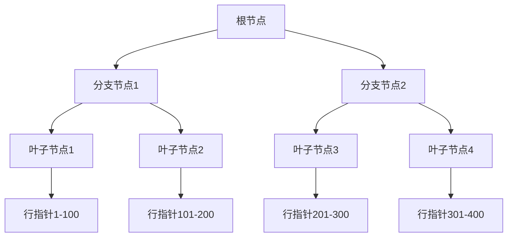

> 深入解析Oracle索引结构、类型、原理及其在SQL优化中的应用，包括B树索引、位图索引、函数索引等实现机制与优化策略

## 一、索引概述

### 1.1 索引的定义与作用

索引是数据库中用于提高数据查询效率的数据结构，它通过创建指向表中数据的指针来加速数据访问。索引的主要作用包括：

- **加速数据检索**：减少需要扫描的数据量
- **优化排序操作**：利用索引的有序特性避免额外排序
- **提高连接效率**：在表连接操作中加速数据匹配
- **维护数据完整性**：唯一索引可以确保数据唯一性

### 1.2 索引的优缺点

| 优点 | 缺点 |
|------|------|
| 提高查询性能 | 占用额外存储空间 |
| 加速排序和分组 | 增加DML操作（INSERT/UPDATE/DELETE）的开销 |
| 确保数据唯一性 | 索引维护需要系统资源 |
| 减少I/O操作 | 过多索引会导致性能下降 |

## 二、Oracle索引结构与类型

### 2.1 B树索引（B-Tree Index）

B树索引是Oracle中最常用的索引类型，适用于高基数列（取值范围大、重复值少的列）。

#### 2.1.1 B树索引结构

B树索引采用平衡树结构，由根节点、分支节点和叶子节点组成：



**结构特点：**
- 所有叶子节点在同一层级
- 每个节点包含多个键值和指针
- 叶子节点包含索引列值和指向表数据的ROWID
- 分支节点包含指向下级节点的指针

#### 2.1.2 B树索引工作原理

1. 从根节点开始查找目标值
2. 根据比较结果选择相应的分支节点
3. 重复上述过程直到到达叶子节点
4. 在叶子节点中找到目标键值和对应的ROWID
5. 利用ROWID直接访问表中的数据行

### 2.2 位图索引（Bitmap Index）

位图索引适用于低基数列（取值范围小、重复值多的列），如性别、状态等。

#### 2.2.1 位图索引结构

位图索引为每个不同的键值创建一个位图，位图中的每一位表示对应行是否包含该键值。

```
键值: '男'  '女'
行号: 1     0     1
      2     1     0
      3     0     1
      4     1     0
```

#### 2.2.2 位图索引优缺点

**优点：**
- 存储空间小（位图压缩存储）
- 适合用于AND/OR查询
- 高效支持COUNT和聚合操作

**缺点：**
- 不适合高并发更新场景
- 在OLTP系统中性能较差
- 更新操作会导致锁争用

### 2.3 其他索引类型

#### 2.3.1 函数索引（Function-Based Index）

函数索引是基于表达式或函数计算结果创建的索引，用于加速包含函数或表达式的查询。

```sql
CREATE INDEX emp_upper_ename_idx ON emp(UPPER(ename));
```

#### 2.3.2 反向键索引（Reverse Key Index）

反向键索引将索引列值的字节顺序反转后存储，用于解决索引热点问题，如序列生成的主键。

```sql
CREATE INDEX emp_empno_rev_idx ON emp(empno) REVERSE;
```

#### 2.3.3 分区索引（Partitioned Index）

分区索引与分区表配合使用，可以提高大型表的查询和维护性能。

```sql
CREATE INDEX emp_deptno_part_idx ON emp(deptno) LOCAL;
```

#### 2.3.4 全局索引与本地索引

- **全局索引**：索引结构跨越所有分区
- **本地索引**：每个分区对应一个索引分区

## 三、索引创建与管理

### 3.1 创建索引

```sql
-- 创建B树索引
CREATE INDEX emp_ename_idx ON emp(ename);

-- 创建唯一索引
CREATE UNIQUE INDEX emp_empno_idx ON emp(empno);

-- 创建位图索引
CREATE BITMAP INDEX emp_gender_idx ON emp(gender);

-- 创建复合索引
CREATE INDEX emp_deptno_job_idx ON emp(deptno, job);

-- 创建函数索引
CREATE INDEX emp_hire_year_idx ON emp(EXTRACT(YEAR FROM hiredate));
```

### 3.2 查看索引信息

```sql
-- 查看用户所有索引
SELECT index_name, table_name, index_type 
FROM user_indexes 
WHERE table_name = 'EMP';

-- 查看索引列信息
SELECT index_name, column_name, column_position 
FROM user_ind_columns 
WHERE table_name = 'EMP';

-- 查看索引使用情况
SELECT * FROM v$object_usage;
```

### 3.3 维护索引

```sql
-- 重建索引
ALTER INDEX emp_ename_idx REBUILD;

-- 收集索引统计信息
ANALYZE INDEX emp_ename_idx COMPUTE STATISTICS;

-- 或使用DBMS_STATS包
EXEC DBMS_STATS.gather_index_stats('SCOTT', 'EMP_ENAME_IDX');

-- 删除索引
DROP INDEX emp_ename_idx;
```

## 四、SQL优化与索引使用

### 4.1 索引使用原则

1. **选择合适的索引类型**：根据列的基数和查询模式选择B树、位图或其他索引类型
2. **创建复合索引**：将最常用的查询条件列放在前面
3. **避免索引失效**：不要在索引列上使用函数、NOT、<>等操作
4. **考虑索引覆盖**：如果索引包含查询所需的所有列，可以避免回表操作
5. **定期维护索引**：重建碎片化索引，收集最新统计信息

### 4.2 常见索引失效场景

```sql
-- 1. 在索引列上使用函数
SELECT * FROM emp WHERE UPPER(ename) = 'SMITH'; -- 除非有函数索引

-- 2. 使用NOT操作符
SELECT * FROM emp WHERE deptno <> 10; -- 可能导致全表扫描

-- 3. 使用LIKE以%开头
SELECT * FROM emp WHERE ename LIKE '%SMITH'; -- 不能使用索引

-- 4. 对索引列进行运算
SELECT * FROM emp WHERE sal * 1.1 > 3000; -- 索引失效

-- 5. 使用OR连接多个条件（除非所有条件都有索引）
SELECT * FROM emp WHERE deptno = 10 OR job = 'MANAGER';
```

### 4.3 SQL优化案例

#### 4.3.1 案例1：单表查询优化

**原始查询（可能全表扫描）：**
```sql
SELECT * FROM emp WHERE hiredate > TO_DATE('2020-01-01', 'YYYY-MM-DD');
```

**优化方案：**
```sql
-- 创建索引
CREATE INDEX emp_hiredate_idx ON emp(hiredate);

-- 执行查询（使用索引）
SELECT * FROM emp WHERE hiredate > TO_DATE('2020-01-01', 'YYYY-MM-DD');
```

#### 4.3.2 案例2：复合索引优化

**查询：**
```sql
SELECT ename, sal FROM emp WHERE deptno = 10 AND job = 'MANAGER';
```

**优化方案：**
```sql
-- 创建复合索引（将选择性高的列放在前面）
CREATE INDEX emp_deptno_job_idx ON emp(deptno, job);

-- 或创建覆盖索引（包含查询所需的所有列）
CREATE INDEX emp_deptno_job_ename_sal_idx ON emp(deptno, job, ename, sal);
```

#### 4.3.3 案例3：函数索引优化

**查询：**
```sql
SELECT * FROM emp WHERE UPPER(ename) = 'SMITH';
```

**优化方案：**
```sql
-- 创建函数索引
CREATE INDEX emp_upper_ename_idx ON emp(UPPER(ename));

-- 执行查询（使用函数索引）
SELECT * FROM emp WHERE UPPER(ename) = 'SMITH';
```

### 4.4 执行计划分析

```sql
-- 使用EXPLAIN PLAN查看执行计划
EXPLAIN PLAN FOR
SELECT * FROM emp WHERE deptno = 10;

-- 查看执行计划
SELECT * FROM TABLE(DBMS_XPLAN.DISPLAY);

-- 或在SQL*Plus中使用
SET AUTOTRACE ON
SELECT * FROM emp WHERE deptno = 10;
```

**执行计划中的索引相关操作：**
- INDEX UNIQUE SCAN：唯一索引扫描
- INDEX RANGE SCAN：范围索引扫描
- INDEX FULL SCAN：全索引扫描
- INDEX FAST FULL SCAN：快速全索引扫描（并行）
- INDEX SKIP SCAN：跳跃索引扫描

## 五、索引设计最佳实践

### 5.1 索引设计原则

1. **分析查询模式**：根据实际查询需求设计索引
2. **考虑选择性**：为高选择性的列创建索引（选择性=唯一值数/总行数）
3. **避免过度索引**：每个索引都会增加维护成本
4. **使用复合索引**：将常用查询条件组合为复合索引
5. **考虑数据分布**：避免在分布不均匀的列上创建位图索引

### 5.2 索引维护最佳实践

1. **定期重建碎片化索引**：
```sql
ALTER INDEX emp_ename_idx REBUILD;
```

2. **收集统计信息**：
```sql
EXEC DBMS_STATS.gather_table_stats('SCOTT', 'EMP', cascade => TRUE);
```

3. **监控索引使用情况**：
```sql
SELECT index_name, table_name, used
FROM v$object_usage;
```

4. **删除未使用的索引**：
```sql
DROP INDEX unused_index_name;
```

## 六、索引与性能调优

### 6.1 索引对性能的影响

**正面影响：**
- 加速查询响应时间
- 减少I/O操作
- 优化排序操作

**负面影响：**
- 增加存储空间
- 降低INSERT/UPDATE/DELETE性能
- 增加数据库维护成本

### 6.2 OLTP与OLAP系统索引策略

**OLTP系统：**
- 优先考虑B树索引
- 避免位图索引
- 控制索引数量
- 关注高选择性列

**OLAP系统：**
- 可以使用位图索引
- 支持函数索引
- 考虑分区索引
- 关注查询性能

## 七、总结

Oracle索引是提高数据库查询性能的重要工具，但索引的设计和使用需要谨慎。正确的索引策略应该基于实际的查询模式、数据分布和系统类型。

**主要结论：**

1. 选择合适的索引类型（B树、位图、函数索引等）
2. 避免索引失效的常见错误
3. 定期维护和优化索引
4. 根据系统类型（OLTP/OLAP）制定不同的索引策略
5. 结合执行计划分析进行SQL优化

通过合理的索引设计和SQL优化，可以显著提高Oracle数据库的性能，为用户提供更好的体验。