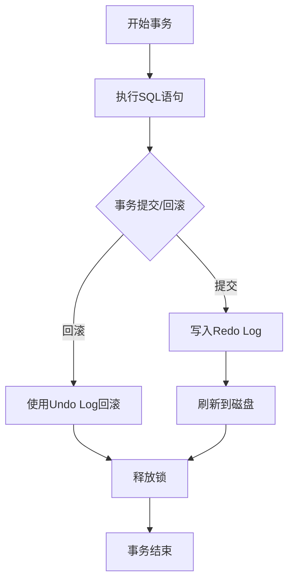
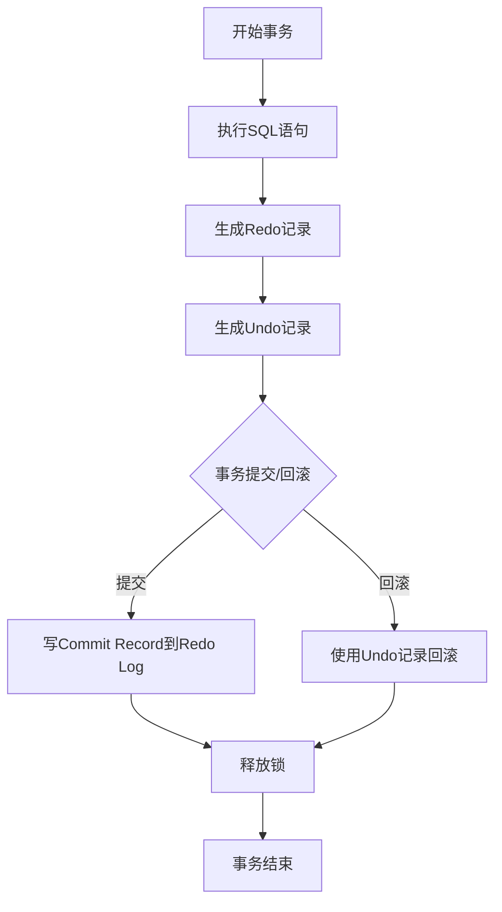

> 深入对比分析MySQL与Oracle数据库在事务实现、隔离级别、锁机制、回滚等方面的差异与优劣势

## 一、事务的基本概念

### 1.1 事务的定义

事务是数据库操作的一个逻辑单位，由一系列的SQL语句组成。事务具有原子性（Atomicity）、一致性（Consistency）、隔离性（Isolation）和持久性（Durability）四个特性，简称ACID特性。

### 1.2 ACID特性详解

| 特性 | 描述 |
|------|------|
| 原子性（Atomicity） | 事务中的所有操作要么全部成功，要么全部失败回滚，没有中间状态 |
| 一致性（Consistency） | 事务执行前后，数据库从一个一致性状态转换到另一个一致性状态 |
| 隔离性（Isolation） | 多个事务并发执行时，一个事务的执行不应影响其他事务的执行 |
| 持久性（Durability） | 事务提交后，其结果应该永久保存，即使系统崩溃也不会丢失 |

## 二、MySQL事务实现

### 2.1 MySQL事务管理机制

MySQL的事务管理主要依赖于存储引擎，其中InnoDB是最常用的支持事务的存储引擎。

**核心组件：**
- **Undo Log**：用于事务回滚和MVCC（多版本并发控制）
- **Redo Log**：用于崩溃恢复，确保事务的持久性
- **Binlog**：用于主从复制和数据恢复
- **锁机制**：包括行锁、表锁、间隙锁等

**事务处理流程：**

### 2.2 MySQL事务隔离级别

MySQL支持以下四个事务隔离级别：

| 隔离级别 | 脏读 | 不可重复读 | 幻读 |
|---------|------|-----------|------|
| READ UNCOMMITTED | 允许 | 允许 | 允许 |
| READ COMMITTED | 禁止 | 允许 | 允许 |
| REPEATABLE READ | 禁止 | 禁止 | 部分禁止（默认级别） |
| SERIALIZABLE | 禁止 | 禁止 | 禁止 |

**实现方式：**
- **READ COMMITTED**：使用当前读和快照读，每次SELECT都会生成新的快照
- **REPEATABLE READ**：使用MVCC，整个事务期间使用同一个快照
- **SERIALIZABLE**：使用共享锁和排它锁，强制串行执行

### 2.3 MySQL锁机制

**锁的分类：**
- **按粒度**：行锁、表锁、间隙锁、临键锁
- **按类型**：共享锁（S锁）、排他锁（X锁）
- **按使用方式**：自动锁、显式锁

**InnoDB锁算法：**
- **Record Lock**：行锁，锁定索引记录
- **Gap Lock**：间隙锁，锁定索引之间的间隙
- **Next-Key Lock**：临键锁，Record Lock + Gap Lock的组合

### 2.4 MySQL事务回滚机制

MySQL使用Undo Log实现事务回滚：
1. 每个修改操作都会生成相应的Undo记录
2. 回滚时，根据Undo记录执行相反的操作
3. Undo Log还用于实现MVCC的快照读

## 三、Oracle事务实现

### 3.1 Oracle事务管理机制

Oracle的事务管理是基于日志的，具有高度的可靠性和并发性能。

**核心组件：**
- **Redo Log**：用于崩溃恢复和实例恢复
- **Undo Tablespace**：用于事务回滚和读一致性
- **Rollback Segment**：Oracle 9i之前使用，现在主要使用Undo Tablespace
- **锁机制**：主要是行级锁，通过位图实现

**事务处理流程：**

### 3.2 Oracle事务隔离级别

Oracle支持以下三个事务隔离级别：

| 隔离级别 | 脏读 | 不可重复读 | 幻读 |
|---------|------|-----------|------|
| READ COMMITTED | 禁止 | 允许 | 允许 |
| SERIALIZABLE | 禁止 | 禁止 | 禁止 |
| READ ONLY | 禁止 | 禁止 | 禁止（只读事务） |

**注意事项：**
- Oracle默认隔离级别是READ COMMITTED
- Oracle不支持READ UNCOMMITTED和REPEATABLE READ隔离级别
- Oracle的SERIALIZABLE实现与MySQL不同，采用乐观并发控制

### 3.3 Oracle锁机制

**锁的分类：**
- **按粒度**：行锁、表锁、页锁
- **按类型**：共享锁（S锁）、排他锁（X锁）、意向锁等
- **按模式**：自动锁（DML锁）、显式锁（DDL锁）

**Oracle锁的特点：**
- 行锁是默认的，且是无索引依赖的
- 使用位图技术实现行锁，开销小
- 支持死锁检测和自动解决

### 3.4 Oracle事务回滚机制

Oracle使用Undo Tablespace实现事务回滚：
1. 每个修改操作都会在Undo表空间中生成Undo记录
2. 回滚时，根据Undo记录执行相反的操作
3. Undo记录还用于实现读一致性

## 四、MySQL与Oracle事务深度对比

### 4.1 事务隔离级别对比

| 隔离级别 | MySQL支持 | Oracle支持 | MySQL实现方式 | Oracle实现方式 |
|---------|----------|-----------|-------------|--------------|
| READ UNCOMMITTED | 是 | 否 | 直接读取未提交数据 | 不支持 |
| READ COMMITTED | 是 | 是 | MVCC，每次SELECT生成新快照 | 读一致性，使用当前数据 |
| REPEATABLE READ | 是 | 否 | MVCC，整个事务使用同一快照 | 不支持 |
| SERIALIZABLE | 是 | 是 | 共享锁+排他锁，强制串行 | 乐观并发控制，基于Undo |
| READ ONLY | 否 | 是 | 不支持 | 只读事务，使用快照 |

### 4.2 MVCC实现对比

| 特性 | MySQL InnoDB | Oracle |
|------|--------------|--------|
| 实现方式 | 基于Undo Log的快照读 | 基于Undo的读一致性 |
| 版本号存储 | 每行记录有两个隐藏字段：trx_id和roll_ptr | 每个事务有自己的SCN（系统变更号） |
| 快照生成 | 事务开始时生成read_view | 语句执行时生成快照 |
| 可见性判断 | 基于read_view和trx_id | 基于SCN和Undo记录 |

### 4.3 锁机制对比

| 特性 | MySQL InnoDB | Oracle |
|------|--------------|--------|
| 默认锁粒度 | 行锁（有索引时） | 行锁 |
| 锁的实现 | 基于索引的锁定 | 基于位图的锁定 |
| 间隙锁支持 | 支持（RR级别） | 不支持 |
| 死锁处理 | 自动检测并回滚超时事务 | 自动检测并回滚其中一个事务 |
| 锁等待超时 | 可配置（innodb_lock_wait_timeout） | 可配置（DML_LOCK_TIMEOUT） |

### 4.4 事务日志对比

| 日志类型 | MySQL | Oracle |
|---------|-------|--------|
| 重做日志 | Redo Log | Redo Log |
| 回滚日志 | Undo Log（存储在共享表空间或独立表空间） | Undo Tablespace |
| 二进制日志 | Binlog（逻辑日志） | Redo Log（物理日志） |
| 提交机制 | 两阶段提交（2PC） | 快速提交（写Commit Record到Redo Log） |

### 4.5 崩溃恢复机制对比

| 特性 | MySQL | Oracle |
|------|-------|--------|
| 恢复方式 | 使用Redo Log和Undo Log进行恢复 | 使用Redo Log和Undo Tablespace进行恢复 |
| 恢复速度 | 相对较慢，尤其是有大量未提交事务时 | 相对较快，使用增量检查点 |
| 一致性保证 | 基于两阶段提交 | 基于Redo Log的完整性 |

### 4.6 并发性能对比

| 场景 | MySQL | Oracle |
|------|-------|--------|
| 高并发读 | 优秀（MVCC） | 优秀（读一致性） |
| 高并发写 | 良好（行锁） | 优秀（高效的锁机制） |
| 混合负载 | 良好 | 优秀 |
| 锁竞争处理 | 一般（可能出现间隙锁导致的性能问题） | 优秀（位图锁开销小） |

## 五、实际应用场景对比

### 5.1 MySQL适用场景

1. **Web应用**：高并发读场景，如电商网站、博客系统
2. **小型到中型应用**：数据量在TB级别以下
3. **开源项目**：成本敏感的项目
4. **需要灵活扩展的场景**：支持主从复制、分库分表

### 5.2 Oracle适用场景

1. **企业级应用**：对数据一致性和可靠性要求高的场景
2. **大型应用**：数据量在TB级别以上
3. **高并发写场景**：如金融交易系统
4. **需要高级功能的场景**：如高级安全特性、分区表、物化视图等

## 六、最佳实践建议

### 6.1 MySQL最佳实践

1. **选择合适的隔离级别**：大多数场景使用REPEATABLE READ即可
2. **合理设计索引**：减少锁冲突和全表扫描
3. **使用批量操作**：减少事务次数
4. **合理设置事务大小**：避免长事务占用资源
5. **监控锁等待**：及时发现和解决锁竞争问题

### 6.2 Oracle最佳实践

1. **选择合适的隔离级别**：大多数场景使用READ COMMITTED
2. **使用绑定变量**：减少硬解析
3. **合理管理Undo表空间**：避免Undo空间不足
4. **使用批量提交**：提高性能
5. **监控事务性能**：使用AWR、ASH等工具分析事务性能

## 七、总结

MySQL和Oracle都是优秀的关系型数据库，但它们在事务实现上有明显的差异：

1. **事务隔离级别**：MySQL支持更细粒度的隔离级别，而Oracle专注于常用的隔离级别
2. **MVCC实现**：MySQL基于行级别的版本控制，Oracle基于SCN的读一致性
3. **锁机制**：MySQL使用基于索引的锁定，Oracle使用基于位图的锁定
4. **性能特点**：MySQL在高并发读场景表现优秀，Oracle在高并发写和企业级应用中更具优势

在选择数据库时，应根据具体的业务需求、数据量、并发量和成本等因素综合考虑。对于大多数Web应用和中小型项目，MySQL是一个经济高效的选择；而对于企业级应用、金融系统和对数据一致性要求极高的场景，Oracle则更具优势。

无论选择哪种数据库，理解其事务机制并遵循最佳实践都是确保系统性能和数据一致性的关键。