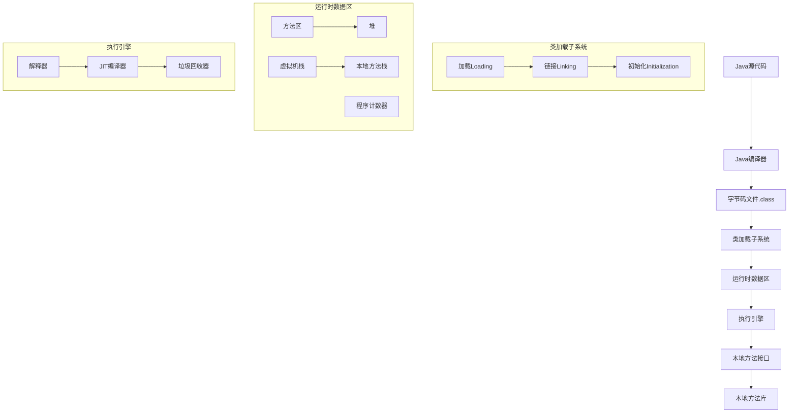
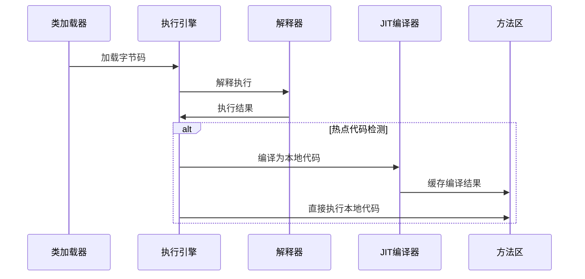

## 简介

Java虚拟机(JVM)是Java平台的核心组件，负责执行Java字节码并提供跨平台运行环境。本文将从整体架构、内存模型、执行引擎等维度深入解析JVM的工作原理，帮助开发者深入理解Java程序的运行机制。

## 架构原理与源码分析

### JVM整体架构

JVM主要由三个子系统组成：类加载子系统、运行时数据区、执行引擎。其整体架构如下图所示：



### 内存模型深度解析

#### 1. 程序计数器(Program Counter Register)

程序计数器是线程私有的内存区域，用于存储当前线程执行的字节码指令地址。每个线程都有独立的程序计数器，确保线程切换后能恢复到正确的执行位置。

```java
// 程序计数器工作原理示例
public class PCRegisterExample {
    public void method() {
        int a = 1;      // PC: 0
        int b = 2;      // PC: 1
        int c = a + b;  // PC: 2
        System.out.println(c); // PC: 3
    }
}
```

#### 2. Java虚拟机栈(Java Virtual Machine Stacks)

虚拟机栈也是线程私有的，用于存储栈帧(Stack Frame)。每个方法调用都会创建一个栈帧，包含局部变量表、操作数栈、动态链接和方法返回地址。

```java
// 栈帧结构示例
public class StackFrameExample {
    public void methodA() {
        int localVar = 10;  // 局部变量表
        methodB(localVar);  // 方法调用，创建新栈帧
    }
    
    public void methodB(int param) {
        int result = param * 2;  // 操作数栈操作
        System.out.println(result);
    }
}
```

#### 3. 本地方法栈(Native Method Stacks)

本地方法栈与虚拟机栈类似，但用于执行本地方法(Native Methods)。本地方法通常用C/C++编写，通过JNI(Java Native Interface)调用。

#### 4. Java堆(Java Heap)

堆是JVM中最大的一块内存区域，被所有线程共享。用于存储对象实例和数组。堆内存的分配和回收由垃圾回收器管理。

```java
// 堆内存分配示例
public class HeapExample {
    public static void main(String[] args) {
        // 对象在堆中分配
        Object obj1 = new Object();  // 新生代Eden区
        Object obj2 = new Object();  // 新生代Eden区
        
        // 大对象直接在老年代分配
        byte[] largeArray = new byte[10 * 1024 * 1024];  // 老年代
    }
}
```

#### 5. 方法区(Method Area)

方法区存储已被加载的类信息、常量、静态变量、即时编译器编译后的代码等数据。在JDK 8之前，方法区被称为永久代(PermGen)，JDK 8及以后改为元空间(Metaspace)。

### 执行引擎工作原理

执行引擎负责执行字节码指令，包含解释器和JIT编译器两种执行方式：



## 使用场景及代码示例

### 内存分配实战

```java
public class MemoryAllocationDemo {
    private static final int _1MB = 1024 * 1024;
    
    /**
     * 演示对象内存分配过程
     * -XX:+PrintGCDetails -Xms20M -Xmx20M -Xmn10M
     */
    public static void testAllocation() {
        byte[] allocation1 = new byte[2 * _1MB];  // Eden区
        byte[] allocation2 = new byte[2 * _1MB];  // Eden区
        byte[] allocation3 = new byte[2 * _1MB];  // Eden区
        byte[] allocation4 = new byte[4 * _1MB];  // 触发Minor GC
    }
    
    /**
     * 大对象直接进入老年代
     * -XX:PretenureSizeThreshold=3145728
     */
    public static void testPretenureSizeThreshold() {
        byte[] allocation = new byte[4 * _1MB];  // 直接进入老年代
    }
}
```

## 使用时的注意事项或建议

1. **堆内存设置**：根据应用需求合理设置-Xms和-Xmx参数，避免频繁Full GC
2. **新生代大小**：合理设置新生代与老年代比例(-XX:NewRatio)
3. **方法区监控**：JDK 8+注意Metaspace大小监控，避免内存泄漏
4. **线程栈大小**：合理设置-Xss参数，避免栈溢出或内存浪费

## 常见问题及方案

### 问题1：内存溢出(OutOfMemoryError)

**症状**：Java堆空间不足、PermGen空间不足、无法创建新线程等

**解决方案**：
- 分析内存泄漏使用MAT或JProfiler
- 调整堆大小：-Xmx、-Xms
- 检查代码中的内存泄漏点

### 问题2：栈溢出(StackOverflowError)

**症状**：递归调用过深或线程栈空间不足

**解决方案**：
- 优化递归算法
- 增加栈大小：-Xss参数
- 使用迭代替代递归

## 总结

JVM作为Java技术的核心，其架构设计体现了优秀的内存管理和执行效率。理解JVM内存模型有助于编写高性能的Java应用程序，合理配置JVM参数可以显著提升系统性能。后续文章将深入探讨类加载机制和垃圾回收算法等核心主题。