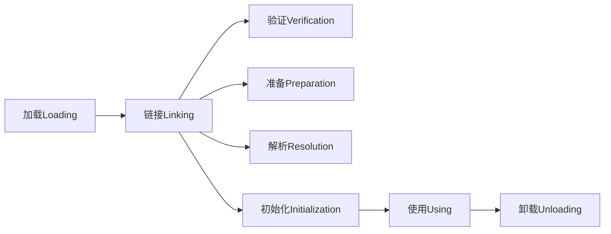
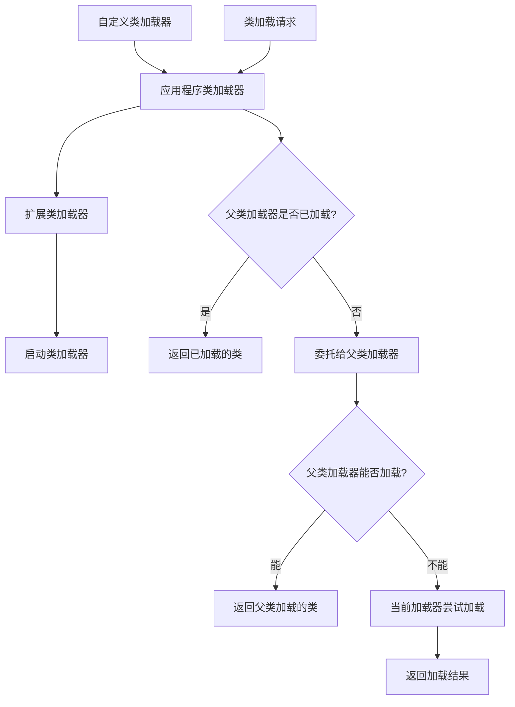

## 简介

类加载是JVM执行Java程序的第一步，负责将.class文件加载到内存中并转换为JVM可用的数据结构。本文将从类加载过程、双亲委派模型、自定义类加载器等维度深入解析Java类加载机制，帮助开发者理解Java程序的启动和执行原理。

## 架构原理与源码分析

### 类加载过程

类加载过程分为三个主要阶段：加载(Loading)、链接(Linking)、初始化(Initialization)。链接阶段又包含验证(Verification)、准备(Preparation)、解析(Resolution)三个子阶段。



#### 1. 加载阶段(Loading)

加载阶段主要完成以下工作：
- 通过类的全限定名获取定义此类的二进制字节流
- 将字节流所代表的静态存储结构转换为方法区的运行时数据结构
- 在内存中生成一个代表该类的java.lang.Class对象

```java
// ClassLoader.loadClass()方法源码分析
public abstract class ClassLoader {
    protected Class<?> loadClass(String name, boolean resolve)
        throws ClassNotFoundException {
        synchronized (getClassLoadingLock(name)) {
            // 首先检查类是否已加载
            Class<?> c = findLoadedClass(name);
            if (c == null) {
                try {
                    // 双亲委派机制：先让父类加载器尝试加载
                    if (parent != null) {
                        c = parent.loadClass(name, false);
                    } else {
                        c = findBootstrapClassOrNull(name);
                    }
                } catch (ClassNotFoundException e) {
                    // 父类加载器无法加载时，由当前类加载器加载
                }
                
                if (c == null) {
                    c = findClass(name);
                }
            }
            if (resolve) {
                resolveClass(c);
            }
            return c;
        }
    }
}
```

#### 2. 链接阶段(Linking)

**验证(Verification)**：确保被加载的类信息符合JVM规范，不会危害虚拟机安全。

**准备(Preparation)**：为类变量分配内存并设置初始值（零值）。

```java
public class LinkingExample {
    // 准备阶段：为staticVar分配内存并设置为0
    public static int staticVar = 123;
    
    // 准备阶段：为finalStaticVar分配内存并设置为456
    public static final int finalStaticVar = 456;
}
```

**解析(Resolution)**：将常量池中的符号引用转换为直接引用。

#### 3. 初始化阶段(Initialization)

初始化阶段是执行类构造器`<clinit>()`方法的过程，该方法由编译器自动收集类中所有类变量的赋值动作和静态语句块合并产生。

```java
public class InitializationExample {
    // 静态变量赋值
    public static int a = 1;
    
    // 静态代码块
    static {
        a = 2;
        System.out.println("静态代码块执行");
    }
    
    // 最终编译生成的<clinit>方法包含：
    // a = 1;
    // a = 2;
    // System.out.println("静态代码块执行");
}
```

### 双亲委派模型

双亲委派模型是Java类加载的核心机制，其工作流程如下：



#### 类加载器层次结构

1. **启动类加载器(Bootstrap ClassLoader)**：加载JAVA_HOME/lib目录下的核心类库
2. **扩展类加载器(Extension ClassLoader)**：加载JAVA_HOME/lib/ext目录下的扩展类库
3. **应用程序类加载器(Application ClassLoader)**：加载用户类路径(ClassPath)上的类库
4. **自定义类加载器(Custom ClassLoader)**：用户自定义的类加载器

### 自定义类加载器实现

自定义类加载器需要继承ClassLoader类并重写findClass方法：

```java
import java.io.ByteArrayOutputStream;
import java.io.File;
import java.io.FileInputStream;
import java.io.IOException;

/**
 * 自定义文件系统类加载器
 */
public class FileSystemClassLoader extends ClassLoader {
    private String rootDir;
    
    public FileSystemClassLoader(String rootDir) {
        this.rootDir = rootDir;
    }
    
    @Override
    protected Class<?> findClass(String name) throws ClassNotFoundException {
        byte[] classData = getClassData(name);
        if (classData == null) {
            throw new ClassNotFoundException();
        } else {
            // defineClass方法将字节数组转换为Class对象
            return defineClass(name, classData, 0, classData.length);
        }
    }
    
    private byte[] getClassData(String className) {
        String path = classNameToPath(className);
        try {
            FileInputStream ins = new FileInputStream(path);
            ByteArrayOutputStream baos = new ByteArrayOutputStream();
            int bufferSize = 4096;
            byte[] buffer = new byte[bufferSize];
            int bytesNumRead;
            while ((bytesNumRead = ins.read(buffer)) != -1) {
                baos.write(buffer, 0, bytesNumRead);
            }
            return baos.toByteArray();
        } catch (IOException e) {
            e.printStackTrace();
        }
        return null;
    }
    
    private String classNameToPath(String className) {
        return rootDir + File.separatorChar + 
               className.replace('.', File.separatorChar) + ".class";
    }
}
```

## 使用场景及代码示例

### 热部署实现

自定义类加载器可以实现热部署功能，允许在不重启JVM的情况下重新加载类：

```java
public class HotDeploymentDemo {
    private static final String CLASS_DIR = "/path/to/classes";
    
    public static void main(String[] args) throws Exception {
        while (true) {
            // 创建新的类加载器实例
            FileSystemClassLoader loader = new FileSystemClassLoader(CLASS_DIR);
            
            // 加载业务类
            Class<?> clazz = loader.loadClass("com.example.BusinessService");
            Object instance = clazz.newInstance();
            
            // 执行业务方法
            Method method = clazz.getMethod("process");
            method.invoke(instance);
            
            // 模拟类文件更新，等待重新加载
            Thread.sleep(5000);
        }
    }
}
```

### 类隔离实现

通过自定义类加载器实现类隔离，解决依赖冲突问题：

```java
public class IsolationClassLoader extends URLClassLoader {
    public IsolationClassLoader(URL[] urls, ClassLoader parent) {
        super(urls, parent);
    }
    
    @Override
    public Class<?> loadClass(String name) throws ClassNotFoundException {
        // 对特定包下的类使用隔离加载
        if (name.startsWith("com.conflict.")) {
            return findClass(name);
        }
        return super.loadClass(name);
    }
}
```

## 使用时的注意事项或建议

1. **避免破坏双亲委派**：除非有特殊需求，否则不要轻易破坏双亲委派模型
2. **类加载器泄漏**：注意类加载器的生命周期管理，避免内存泄漏
3. **资源释放**：自定义类加载器需要正确释放资源，特别是文件句柄
4. **版本兼容性**：注意不同JDK版本中类加载器的行为差异

## 常见问题及方案

### 问题1：ClassNotFoundException vs NoClassDefFoundError

**ClassNotFoundException**：类加载器在类路径中找不到指定的类
**NoClassDefFoundError**：类加载器找到了类，但在链接阶段失败

**解决方案**：
- 检查类路径配置
- 确认依赖包完整
- 检查类文件是否损坏

### 问题2：类加载器内存泄漏

**症状**：PermGen/Metaspace持续增长，Full GC无法回收

**解决方案**：
- 使用弱引用管理类加载器
- 定期重启应用服务器
- 使用OSGi等模块化框架

### 问题3：依赖冲突

**症状**：NoSuchMethodError、ClassCastException等运行时异常

**解决方案**：
- 使用Maven依赖管理
- 自定义类加载器实现类隔离
- 使用Java 9+模块化系统

## 总结

类加载机制是JVM的核心组件，理解其工作原理对于Java开发至关重要。双亲委派模型保证了Java类型系统的安全性和稳定性，而自定义类加载器则为热部署、类隔离等高级特性提供了可能。在实际开发中，应根据具体需求合理使用类加载机制，避免常见的内存泄漏和依赖冲突问题。