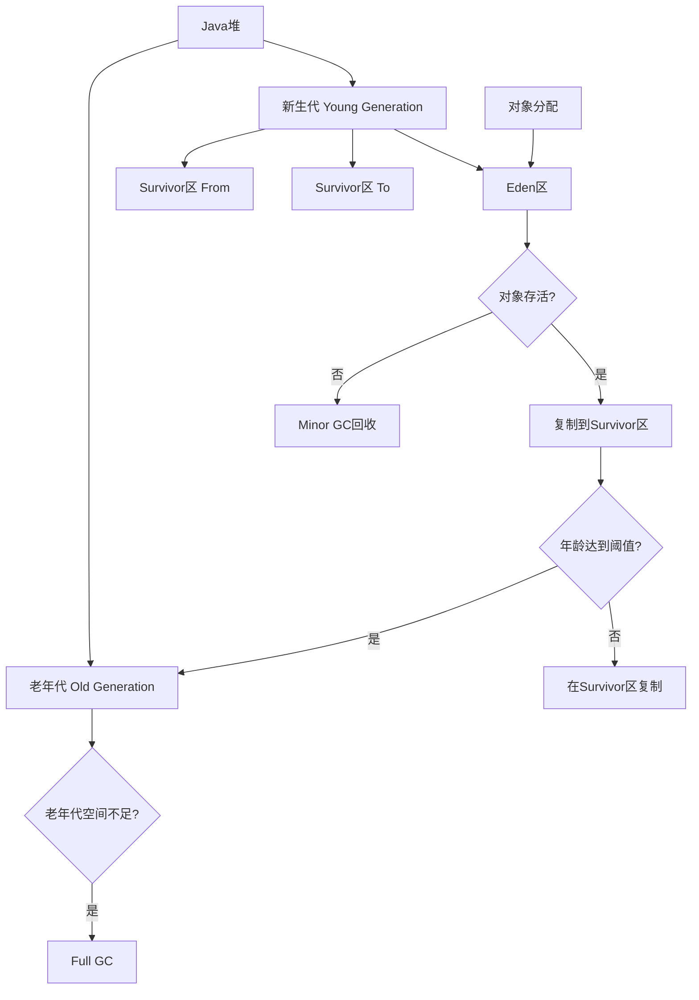

## 简介

垃圾回收(Garbage Collection, GC)是JVM自动内存管理的核心机制，负责自动回收不再使用的对象内存。本文将从GC算法原理、垃圾回收器分类、内存分配策略等维度深入解析JVM垃圾回收机制，帮助开发者理解内存管理原理并优化应用性能。

## 架构原理与源码分析

### 垃圾回收基本概念

#### 对象存活判定

JVM使用两种算法判断对象是否存活：

1. **引用计数法**：记录对象被引用的次数，为0时回收（Java未采用）
2. **可达性分析**：从GC Roots对象出发，遍历引用链，不可达的对象标记为垃圾

```java
// GC Roots对象包括：
// 1. 虚拟机栈中引用的对象
public class StackReference {
    public void method() {
        Object localObj = new Object();  // 栈中引用的对象
    }
}

// 2. 方法区中类静态属性引用的对象
public class StaticReference {
    private static Object staticObj = new Object();  // 静态属性引用的对象
}

// 3. 方法区中常量引用的对象
public class ConstantReference {
    private static final String CONSTANT = "constant";  // 常量引用的对象
}

// 4. 本地方法栈中JNI引用的对象
public class NativeReference {
    public native void nativeMethod();  // JNI引用的对象
}
```

### 垃圾回收算法

#### 1. 标记-清除算法(Mark-Sweep)

**原理**：先标记所有存活对象，然后清除未标记的对象


**优缺点**：
- 优点：实现简单
- 缺点：产生内存碎片，效率较低

#### 2. 复制算法(Copying)

**原理**：将内存分为两块，每次使用一块，存活对象复制到另一块，清空当前块


**优缺点**：
- 优点：无内存碎片，效率高
- 缺点：内存利用率只有50%

#### 3. 标记-整理算法(Mark-Compact)

**原理**：标记存活对象，然后让所有存活对象向一端移动，清理边界外内存


**优缺点**：
- 优点：无内存碎片，内存利用率高
- 缺点：移动对象成本高

#### 4. 分代收集算法(Generational Collection)

现代JVM普遍采用分代收集算法，将堆内存分为新生代和老年代：



### 垃圾回收器分类

#### 1. Serial收集器

单线程收集器，使用复制算法，适合客户端应用：

```java
// 启用Serial收集器参数
// -XX:+UseSerialGC

public class SerialGCDemo {
    public static void main(String[] args) {
        // Serial收集器在GC时会暂停所有用户线程(Stop The World)
        // 适合内存较小的客户端应用
    }
}
```

#### 2. Parallel收集器

多线程并行收集，吞吐量优先：

```java
// 启用Parallel收集器参数
// -XX:+UseParallelGC
// -XX:ParallelGCThreads=4  // 设置GC线程数

public class ParallelGCDemo {
    public static void main(String[] args) {
        // Parallel收集器关注吞吐量(Throughput)
        // 适合后台计算型应用
    }
}
```

#### 3. CMS收集器

并发标记清除，低延迟优先：

```java
// 启用CMS收集器参数
// -XX:+UseConcMarkSweepGC

public class CMSGCDemo {
    public static void main(String[] args) {
        // CMS收集器关注低延迟(Low Latency)
        // 适合响应时间敏感的应用
        
        // CMS工作流程：
        // 1. 初始标记(Initial Mark) - STW
        // 2. 并发标记(Concurrent Mark)
        // 3. 重新标记(Remark) - STW
        // 4. 并发清除(Concurrent Sweep)
    }
}
```

#### 4. G1收集器

区域化分代式收集器，兼顾吞吐量和延迟：

```java
// 启用G1收集器参数
// -XX:+UseG1GC
// -XX:MaxGCPauseMillis=200  // 目标暂停时间

public class G1GCDemo {
    public static void main(String[] args) {
        // G1将堆划分为多个Region
        // 通过Remembered Set记录跨Region引用
        // 可预测的停顿时间模型
    }
}
```

## 使用场景及代码示例

### 内存分配与回收实战

```java
public class GCPractice {
    private static final int _1MB = 1024 * 1024;
    
    /**
     * 对象优先在Eden区分配
     * 参数：-Xms20M -Xmx20M -Xmn10M -XX:+PrintGCDetails
     */
    public static void testAllocation() {
        byte[] allocation1 = new byte[2 * _1MB];
        byte[] allocation2 = new byte[2 * _1MB];
        byte[] allocation3 = new byte[2 * _1MB];
        byte[] allocation4 = new byte[3 * _1MB];  // 出现Minor GC
    }
    
    /**
     * 大对象直接进入老年代
     * 参数：-XX:PretenureSizeThreshold=3145728
     */
    public static void testPretenureSizeThreshold() {
        byte[] allocation = new byte[4 * _1MB];  // 直接分配在老年代
    }
    
    /**
     * 长期存活的对象进入老年代
     * 参数：-XX:MaxTenuringThreshold=1
     */
    public static void testTenuringThreshold() {
        byte[] allocation1 = new byte[_1MB / 4];
        byte[] allocation2 = new byte[4 * _1MB];
        byte[] allocation3 = new byte[4 * _1MB];
        allocation3 = null;
        byte[] allocation4 = new byte[4 * _1MB];
    }
    
    /**
     * 动态对象年龄判定
     */
    public static void testTenuringThreshold2() {
        byte[] allocation1 = new byte[_1MB / 4];
        byte[] allocation2 = new byte[_1MB / 4];
        byte[] allocation3 = new byte[4 * _1MB];
        byte[] allocation4 = new byte[4 * _1MB];
        allocation4 = null;
        allocation4 = new byte[4 * _1MB];
    }
}
```

### GC日志分析实战

```java
// GC日志分析示例
public class GCLogAnalysis {
    /**
     * 生成GC日志进行分析
     * 参数：-Xms20M -Xmx20M -Xmn10M -XX:+PrintGCDetails -XX:+PrintGCTimeStamps
     */
    public static void generateGCLog() {
        List<byte[]> list = new ArrayList<>();
        
        for (int i = 0; i < 1000; i++) {
            // 模拟内存分配，触发GC
            byte[] data = new byte[1024 * 100];  // 100KB
            list.add(data);
            
            if (i % 100 == 0) {
                // 模拟对象释放
                list.subList(0, 50).clear();
            }
        }
    }
}

// GC日志示例分析：
// [GC (Allocation Failure) [PSYoungGen: 6144K->640K(9216K)] 6144K->4744K(19456K), 0.0032879 secs]
// 含义：年轻代GC，回收前6144K，回收后640K，年轻代总大小9216K
//       堆内存回收前6144K，回收后4744K，堆总大小19456K，耗时0.003秒
```

## 使用时的注意事项或建议

### 1. 垃圾回收器选择

- **客户端应用**：Serial收集器(-XX:+UseSerialGC)
- **后台计算应用**：Parallel收集器(-XX:+UseParallelGC)
- **Web应用**：CMS或G1收集器(-XX:+UseConcMarkSweepGC / -XX:+UseG1GC)
- **大内存应用**：G1或ZGC收集器

### 2. 内存参数调优

```bash
# 堆内存设置
-Xms4g -Xmx4g           # 初始堆大小和最大堆大小
-Xmn2g                  # 年轻代大小
-XX:SurvivorRatio=8     # Eden和Survivor比例

# GC参数
-XX:MaxTenuringThreshold=15    # 对象晋升老年代年龄
-XX:PretenureSizeThreshold=1m  # 大对象阈值
-XX:+PrintGCDetails            # 打印GC详情
-XX:+PrintGCTimeStamps         # 打印GC时间戳
```

### 3. 避免内存泄漏

```java
public class MemoryLeakPrevention {
    // 1. 及时清理集合中的无用引用
    private Map<String, Object> cache = new WeakHashMap<>();
    
    // 2. 避免静态集合长期持有对象引用
    private static List<Object> staticList = new ArrayList<>();
    
    // 3. 正确关闭资源
    public void processFile() {
        try (FileInputStream fis = new FileInputStream("file.txt")) {
            // 自动关闭资源
        } catch (IOException e) {
            e.printStackTrace();
        }
    }
    
    // 4. 使用软引用缓存
    private SoftReference<byte[]> softCache = new SoftReference<>(new byte[1024]);
}
```

## 常见问题及方案

### 问题1：频繁Full GC

**症状**：应用响应变慢，GC日志显示频繁Full GC

**解决方案**：
- 增大堆内存：-Xmx参数
- 优化对象创建：避免创建过多临时对象
- 调整新生代大小：-Xmn参数
- 检查内存泄漏：使用MAT分析堆转储

### 问题2：GC停顿时间过长

**症状**：应用出现明显卡顿，STW时间过长

**解决方案**：
- 切换低延迟收集器：G1或ZGC
- 设置目标暂停时间：-XX:MaxGCPauseMillis
- 减少堆内存大小
- 优化对象分配模式

### 问题3：内存溢出(OutOfMemoryError)

**症状**：Java堆空间不足、Metaspace空间不足等

**解决方案**：
- 分析堆转储文件：使用jmap和MAT
- 检查内存泄漏代码
- 调整相关内存参数
- 优化数据结构和使用方式

## 总结

垃圾回收机制是JVM自动内存管理的核心，理解不同GC算法和收集器的工作原理对于优化Java应用性能至关重要。在实际开发中，应根据应用特点选择合适的垃圾回收器，合理配置内存参数，并避免常见的内存泄漏问题。通过监控GC日志和性能指标，可以持续优化应用的内存使用效率。