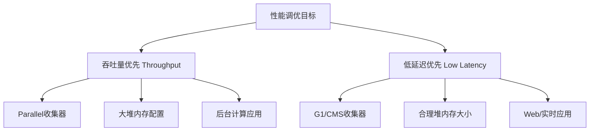
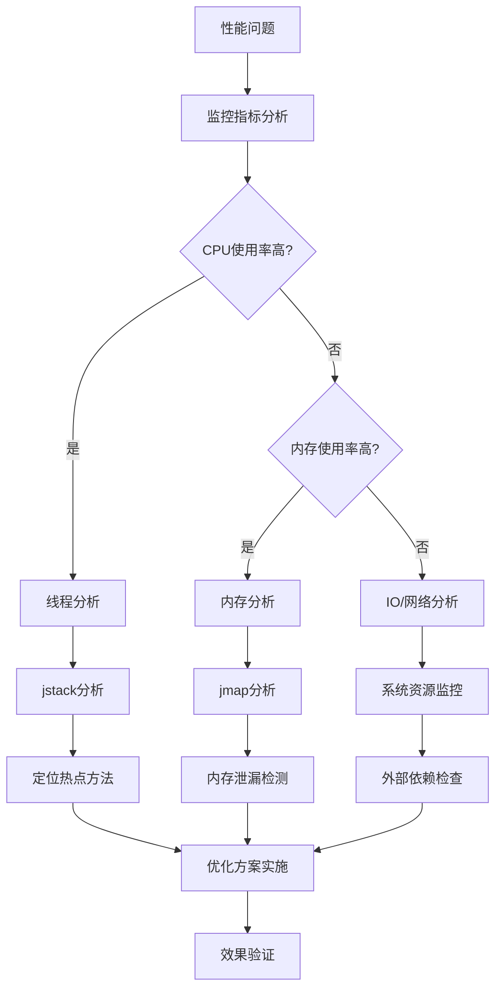

## 简介

JVM性能调优是Java应用优化的核心环节，合理的参数配置和有效的监控手段可以显著提升应用性能。本文将从JVM参数调优、性能监控工具、内存分析技术等维度全面解析JVM性能优化实践，帮助开发者构建高性能的Java应用。

## 架构原理与源码分析

### JVM性能调优核心原则

#### 1. 吞吐量优先 vs 低延迟优先



#### 2. 内存分配与回收平衡

JVM性能调优的核心在于平衡内存分配速度和垃圾回收频率：

```java
public class MemoryAllocationBalance {
    /**
     * 内存分配速率与GC频率的关系
     * 分配过快 -> 频繁GC -> 性能下降
     * 分配过慢 -> 内存浪费 -> 资源利用率低
     */
    
    // 优化目标：找到最佳的内存分配模式
    public void optimalAllocationPattern() {
        // 1. 对象复用：避免频繁创建销毁
        ObjectPool pool = new ObjectPool();
        
        // 2. 批量操作：减少GC压力
        List<Object> batch = new ArrayList<>(1000);
        
        // 3. 合理数据结构：选择合适的数据结构减少内存占用
        Map<String, Object> optimizedMap = new HashMap<>(16, 0.75f);
    }
}
```

### JVM参数调优详解

#### 1. 堆内存参数调优

```java
// 堆内存核心参数配置示例
public class HeapTuning {
    /**
     * 基础堆内存配置
     * -Xms4g -Xmx4g  // 初始堆=最大堆，避免动态调整
     * -Xmn2g         // 年轻代大小，通常为堆的1/2到1/3
     */
    
    /**
     * 新生代参数优化
     * -XX:SurvivorRatio=8     // Eden:Survivor=8:1:1
     * -XX:NewRatio=2          // 老年代:新生代=2:1
     * -XX:MaxTenuringThreshold=15  // 对象晋升年龄
     */
    
    /**
     * 大对象处理
     * -XX:PretenureSizeThreshold=1m  // 1MB以上对象直接进入老年代
     */
}
```

#### 2. GC收集器参数调优

```java
// G1收集器参数优化
public class G1Tuning {
    /**
     * G1基础配置
     * -XX:+UseG1GC
     * -XX:MaxGCPauseMillis=200  // 目标暂停时间
     * -XX:G1HeapRegionSize=4m   // Region大小
     */
    
    /**
     * G1高级调优
     * -XX:InitiatingHeapOccupancyPercent=45  // 并发标记触发阈值
     * -XX:G1NewSizePercent=5                 // 年轻代最小占比
     * -XX:G1MaxNewSizePercent=60             // 年轻代最大占比
     */
}

// CMS收集器参数优化
public class CMSTuning {
    /**
     * CMS基础配置
     * -XX:+UseConcMarkSweepGC
     * -XX:CMSInitiatingOccupancyFraction=75  // CMS触发阈值
     */
    
    /**
     * CMS高级调优
     * -XX:+UseCMSCompactAtFullCollection    // Full GC时压缩
     * -XX:CMSFullGCsBeforeCompaction=0      // 每次Full GC都压缩
     * -XX:+CMSParallelRemarkEnabled         // 并行重新标记
     */
}
```

## 使用场景及代码示例

### 性能监控工具实战

#### 1. JVM内置工具使用

```java
// jstat - 监控JVM统计信息
public class JStatDemo {
    /**
     * 常用jstat命令示例：
     * jstat -gc <pid> 1000 10    // 每1秒监控GC，共10次
     * jstat -class <pid>          // 类加载统计
     * jstat -compiler <pid>       // 编译统计
     */
}

// jmap - 内存分析工具
public class JMapDemo {
    /**
     * 常用jmap命令示例：
     * jmap -heap <pid>            // 堆内存概要
     * jmap -histo <pid>           // 对象直方图
     * jmap -dump:format=b,file=heap.hprof <pid>  // 生成堆转储
     */
}

// jstack - 线程分析工具
public class JStackDemo {
    /**
     * 常用jstack命令示例：
     * jstack <pid>                // 线程堆栈
     * jstack -l <pid>             // 包含锁信息
     */
}
```

#### 2. 可视化监控工具

```java
// JConsole监控示例
public class JConsoleMonitoring {
    /**
     * JConsole监控指标：
     * - 堆内存使用情况
     * - 线程状态和数量
     * - 类加载数量
     * - GC统计信息
     * - MBean操作
     */
}

// VisualVM功能演示
public class VisualVMDemo {
    /**
     * VisualVM核心功能：
     * - 实时监控CPU、内存、线程
     * - 堆转储分析
     * - 线程转储分析
     * - 性能分析器(Profiler)
     * - BTrace动态跟踪
     */
}
```

### 内存泄漏检测实战

```java
import java.lang.ref.WeakReference;
import java.util.ArrayList;
import java.util.List;

/**
 * 内存泄漏检测与预防
 */
public class MemoryLeakDetection {
    
    // 1. 静态集合导致的内存泄漏
    private static List<Object> staticList = new ArrayList<>();
    
    public void addToStaticList(Object obj) {
        staticList.add(obj);  // 危险：对象永远不会被GC
    }
    
    // 2. 监听器未正确移除
    public class EventSource {
        private List<EventListener> listeners = new ArrayList<>();
        
        public void addListener(EventListener listener) {
            listeners.add(listener);
        }
        
        public void removeListener(EventListener listener) {
            listeners.remove(listener);  // 必须正确移除
        }
    }
    
    // 3. 使用WeakReference避免内存泄漏
    public class CacheWithWeakReference {
        private Map<String, WeakReference<Object>> cache = new HashMap<>();
        
        public void put(String key, Object value) {
            cache.put(key, new WeakReference<>(value));
        }
        
        public Object get(String key) {
            WeakReference<Object> ref = cache.get(key);
            return ref != null ? ref.get() : null;
        }
    }
    
    // 4. 内存泄漏检测方法
    public void detectMemoryLeak() {
        // 监控堆内存增长
        Runtime runtime = Runtime.getRuntime();
        long usedMemory = runtime.totalMemory() - runtime.freeMemory();
        
        // 定期检查内存使用情况
        if (usedMemory > runtime.maxMemory() * 0.8) {
            System.out.println("警告：内存使用率超过80%");
        }
    }
}
```

### 性能优化实战案例

```java
/**
 * 字符串操作性能优化
 */
public class StringOptimization {
    
    // 1. 避免在循环中使用字符串拼接
    public String inefficientConcat(List<String> list) {
        String result = "";
        for (String str : list) {
            result += str;  // 每次循环创建新String对象
        }
        return result;
    }
    
    // 2. 使用StringBuilder优化
    public String efficientConcat(List<String> list) {
        StringBuilder sb = new StringBuilder();
        for (String str : list) {
            sb.append(str);  // 避免创建临时对象
        }
        return sb.toString();
    }
    
    // 3. 预分配StringBuilder容量
    public String optimizedConcat(List<String> list) {
        int totalLength = list.stream().mapToInt(String::length).sum();
        StringBuilder sb = new StringBuilder(totalLength);  // 预分配容量
        for (String str : list) {
            sb.append(str);
        }
        return sb.toString();
    }
}

/**
 * 集合使用性能优化
 */
public class CollectionOptimization {
    
    // 1. 合理设置集合初始容量
    public void optimizedHashMap() {
        // 不好：默认容量16，可能频繁扩容
        Map<String, Object> map1 = new HashMap<>();
        
        // 好：预估计元素数量
        Map<String, Object> map2 = new HashMap<>(1000, 0.75f);
    }
    
    // 2. 选择合适的集合类型
    public void chooseRightCollection() {
        // 频繁查询：HashMap
        Map<String, Object> hashMap = new HashMap<>();
        
        // 需要排序：TreeMap
        Map<String, Object> treeMap = new TreeMap<>();
        
        // 线程安全：ConcurrentHashMap
        Map<String, Object> concurrentMap = new ConcurrentHashMap<>();
    }
}
```

## 使用时的注意事项或建议

### 1. 调优原则

- **先测量后优化**：使用监控工具确定性能瓶颈
- **渐进式调优**：每次只调整一个参数，观察效果
- **生产环境验证**：在类生产环境进行充分测试
- **文档记录**：记录调优过程和结果

### 2. 监控策略

```bash
# 持续监控脚本示例
#!/bin/bash
while true; do
    # 监控GC情况
    jstat -gc <pid> 1000 1
    
    # 监控内存使用
    jmap -histo <pid> | head -20
    
    # 检查线程状态
    jstack <pid> | grep -c "RUNNABLE"
    
    sleep 30
done
```

### 3. 故障排查流程



## 常见问题及方案

### 问题1：CPU使用率过高

**症状**：应用响应缓慢，CPU持续高负载

**解决方案**：
- 使用jstack分析线程状态
- 定位热点方法使用JProfiler
- 优化算法和数据结构
- 检查无限循环或死锁

### 问题2：内存使用率持续增长

**症状**：内存使用率不断上升，频繁Full GC

**解决方案**：
- 使用jmap生成堆转储分析
- 检查内存泄漏使用MAT
- 优化对象创建和缓存策略
- 调整堆内存参数

### 问题3：应用响应时间波动

**症状**：应用响应时间不稳定，时快时慢

**解决方案**：
- 分析GC日志确定GC影响
- 优化垃圾回收器配置
- 检查外部依赖性能
- 实施请求限流和降级

## 总结

JVM性能调优是一个系统工程，需要结合监控工具、调优参数和代码优化等多方面手段。通过本文介绍的调优方法和工具使用技巧，开发者可以系统地分析和解决Java应用性能问题。记住调优的核心原则是"先测量后优化"，只有准确识别性能瓶颈，才能实施有效的优化措施。