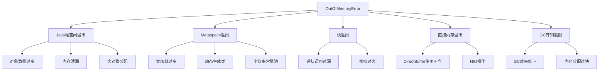

## 简介

内存溢出(OutOfMemoryError)是Java应用中最常见的性能问题之一，严重影响系统稳定性和用户体验。本文将从OOM类型分析、内存泄漏检测、实战调优案例等维度，深入解析JVM内存溢出问题的诊断与解决方案，帮助开发者构建稳定可靠的Java应用。

## 架构原理与源码分析

### 内存溢出类型深度解析

JVM内存溢出主要分为以下几种类型，每种类型都有其特定的产生原因和解决方案：



#### 1. Java堆空间溢出(Java heap space)

**产生原因**：对象数量超过堆内存容量，无法分配新对象

```java
// 堆溢出示例代码
public class HeapOOM {
    static class OOMObject {}
    
    /**
     * 模拟堆内存溢出
     * 参数：-Xms20m -Xmx20m -XX:+HeapDumpOnOutOfMemoryError
     */
    public static void main(String[] args) {
        List<OOMObject> list = new ArrayList<>();
        while (true) {
            list.add(new OOMObject());  // 持续创建对象，最终OOM
        }
    }
}
```

**源码分析**：
```java
// HotSpot VM中内存分配失败时的处理
class CollectedHeap {
    HeapWord* mem_allocate(size_t size) {
        HeapWord* result = allocate(size);
        if (result == NULL) {
            // 触发GC尝试回收内存
            result = allocate_after_gc(size);
            if (result == NULL) {
                // GC后仍然无法分配，抛出OOM
                throw new OutOfMemoryError("Java heap space");
            }
        }
        return result;
    }
}
```

#### 2. Metaspace溢出(Metaspace)

**产生原因**：加载的类信息超过Metaspace容量（JDK 8+）

```java
// Metaspace溢出示例
public class MetaspaceOOM {
    /**
     * 模拟Metaspace溢出
     * 参数：-XX:MetaspaceSize=10m -XX:MaxMetaspaceSize=10m
     */
    public static void main(String[] args) throws Exception {
        for (int i = 0; i < 100000; i++) {
            // 动态生成类，占用Metaspace
            ClassPool pool = ClassPool.getDefault();
            CtClass cc = pool.makeClass("GeneratedClass" + i);
            cc.toClass();
        }
    }
}
```

#### 3. 栈溢出(StackOverflowError)

**产生原因**：线程请求的栈深度超过虚拟机允许的最大深度

```java
// 栈溢出示例
public class StackOOM {
    private int stackLength = 1;
    
    public void stackLeak() {
        stackLength++;
        stackLeak();  // 递归调用导致栈溢出
    }
    
    /**
     * 模拟栈溢出
     * 参数：-Xss128k
     */
    public static void main(String[] args) {
        StackOOM oom = new StackOOM();
        try {
            oom.stackLeak();
        } catch (StackOverflowError e) {
            System.out.println("栈深度: " + oom.stackLength);
            throw e;
        }
    }
}
```

## 使用场景及代码示例

### 内存泄漏检测实战

#### 1. 使用MAT(Memory Analyzer Tool)分析堆转储

```java
// 生成堆转储文件进行分析
public class HeapDumpGenerator {
    /**
     * 程序化生成堆转储
     */
    public static void generateHeapDump() {
        try {
            // 使用HotSpot Diagnostic MBean
            MBeanServer server = ManagementFactory.getPlatformMBeanServer();
            HotSpotDiagnosticMXBean mxBean = ManagementFactory
                .newPlatformMXBeanProxy(server, 
                    "com.sun.management:type=HotSpotDiagnostic", 
                    HotSpotDiagnosticMXBean.class);
            
            // 生成堆转储文件
            mxBean.dumpHeap("heapdump.hprof", true);
            System.out.println("堆转储文件已生成: heapdump.hprof");
            
        } catch (IOException e) {
            e.printStackTrace();
        }
    }
    
    /**
     * 内存泄漏检测示例
     */
    public static class MemoryLeakExample {
        private static List<byte[]> leakList = new ArrayList<>();
        
        public void addData() {
            // 持续添加数据但不清理，导致内存泄漏
            byte[] data = new byte[1024 * 1024]; // 1MB
            leakList.add(data);
        }
        
        public void clearData() {
            // 应该定期调用此方法清理数据
            leakList.clear();
        }
    }
}
```

#### 2. 使用VisualVM进行实时监控

```java
// 内存监控工具类
public class MemoryMonitor {
    private static final Runtime runtime = Runtime.getRuntime();
    
    /**
     * 监控内存使用情况
     */
    public static void monitorMemory() {
        long maxMemory = runtime.maxMemory();
        long totalMemory = runtime.totalMemory();
        long freeMemory = runtime.freeMemory();
        long usedMemory = totalMemory - freeMemory;
        
        System.out.printf("最大内存: %.2f MB\n", maxMemory / 1024.0 / 1024);
        System.out.printf("已分配内存: %.2f MB\n", totalMemory / 1024.0 / 1024);
        System.out.printf("已使用内存: %.2f MB\n", usedMemory / 1024.0 / 1024);
        System.out.printf("内存使用率: %.2f%%\n", 
            (double) usedMemory / totalMemory * 100);
    }
    
    /**
     * 内存预警机制
     */
    public static boolean isMemoryCritical() {
        long usedMemory = runtime.totalMemory() - runtime.freeMemory();
        long maxMemory = runtime.maxMemory();
        return (double) usedMemory / maxMemory > 0.8; // 使用率超过80%
    }
}
```

### 性能优化实战案例

#### 1. 字符串内存优化

```java
/**
 * 字符串内存优化案例
 */
public class StringMemoryOptimization {
    
    // 问题代码：大量字符串拼接导致内存浪费
    public String buildMessageInefficient(List<String> parts) {
        String result = "";
        for (String part : parts) {
            result += part; // 每次循环创建新String对象
        }
        return result;
    }
    
    // 优化方案1：使用StringBuilder
    public String buildMessageEfficient(List<String> parts) {
        StringBuilder sb = new StringBuilder();
        for (String part : parts) {
            sb.append(part);
        }
        return sb.toString();
    }
    
    // 优化方案2：预计算容量
    public String buildMessageOptimized(List<String> parts) {
        int totalLength = parts.stream()
            .mapToInt(String::length)
            .sum();
        StringBuilder sb = new StringBuilder(totalLength);
        for (String part : parts) {
            sb.append(part);
        }
        return sb.toString();
    }
    
    // 优化方案3：避免创建临时字符串
    public void processStringsOptimized(List<String> strings) {
        // 使用字符数组代替字符串操作
        char[] buffer = new char[1024];
        int position = 0;
        
        for (String str : strings) {
            char[] chars = str.toCharArray();
            System.arraycopy(chars, 0, buffer, position, chars.length);
            position += chars.length;
        }
    }
}
```

#### 2. 集合使用优化

```java
/**
 * 集合内存优化案例
 */
public class CollectionMemoryOptimization {
    
    // 问题：HashMap默认负载因子导致内存浪费
    public void inefficientHashMap() {
        Map<String, String> map = new HashMap<>(); // 默认容量16，负载因子0.75
        // 当元素达到12个时就会扩容到32
    }
    
    // 优化：合理设置初始容量和负载因子
    public void optimizedHashMap(int expectedSize) {
        // 计算合适的初始容量
        int initialCapacity = (int) (expectedSize / 0.75f) + 1;
        Map<String, String> map = new HashMap<>(initialCapacity, 0.75f);
    }
    
    // 使用更节省内存的集合
    public void memoryEfficientCollections() {
        // 1. 使用ArrayDeque代替LinkedList
        Deque<String> deque = new ArrayDeque<>(); // 比LinkedList更节省内存
        
        // 2. 使用EnumMap代替HashMap（当键为枚举时）
        Map<DayOfWeek, String> enumMap = new EnumMap<>(DayOfWeek.class);
        
        // 3. 使用Trove库的原始类型集合
        // gnu.trove.map.hash.TIntIntHashMap 比 HashMap<Integer, Integer> 更高效
    }
    
    // 及时清理无用引用
    public void referenceManagement() {
        // 使用WeakReference避免内存泄漏
        Map<String, WeakReference<BigObject>> cache = new HashMap<>();
        
        // 使用SoftReference实现缓存
        Map<String, SoftReference<BigObject>> softCache = new HashMap<>();
        
        // 定期清理过期引用
        public void cleanupExpiredReferences() {
            cache.entrySet().removeIf(entry -> 
                entry.getValue().get() == null);
        }
    }
}
```

#### 3. 对象池技术优化

```java
/**
 * 对象池优化案例 - 减少对象创建开销
 */
public class ObjectPool<T> {
    private final Queue<T> pool;
    private final Supplier<T> creator;
    private final Consumer<T> resetter;
    
    public ObjectPool(int size, Supplier<T> creator, Consumer<T> resetter) {
        this.pool = new ArrayBlockingQueue<>(size);
        this.creator = creator;
        this.resetter = resetter;
        
        // 预创建对象
        for (int i = 0; i < size; i++) {
            pool.offer(creator.get());
        }
    }
    
    public T borrow() {
        T obj = pool.poll();
        return obj != null ? obj : creator.get();
    }
    
    public void returnObject(T obj) {
        if (obj != null) {
            resetter.accept(obj);
            pool.offer(obj);
        }
    }
}

// 使用示例
public class ConnectionPoolExample {
    public static void main(String[] args) {
        ObjectPool<Connection> connectionPool = new ObjectPool<>(
            10, 
            () -> createConnection(), 
            conn -> resetConnection(conn)
        );
        
        // 借用连接
        Connection conn = connectionPool.borrow();
        try {
            // 使用连接
            useConnection(conn);
        } finally {
            // 归还连接
            connectionPool.returnObject(conn);
        }
    }
    
    private static Connection createConnection() {
        // 创建新连接
        return null;
    }
    
    private static void resetConnection(Connection conn) {
        // 重置连接状态
    }
    
    private static void useConnection(Connection conn) {
        // 使用连接
    }
}
```

## 使用时的注意事项或建议

### 1. 内存监控策略

```java
/**
 * 系统化内存监控方案
 */
public class ComprehensiveMemoryMonitor {
    
    // 定期内存检查
    public void scheduleMemoryCheck() {
        ScheduledExecutorService scheduler = 
            Executors.newScheduledThreadPool(1);
        
        scheduler.scheduleAtFixedRate(() -> {
            if (isMemoryCritical()) {
                triggerMemoryAlert();
                performEmergencyGC();
            }
        }, 0, 30, TimeUnit.SECONDS); // 每30秒检查一次
    }
    
    // 内存预警级别
    public enum MemoryLevel {
        NORMAL,      // < 70%
        WARNING,     // 70% - 85%
        CRITICAL,    // 85% - 95%
        EMERGENCY    // > 95%
    }
    
    public MemoryLevel getCurrentMemoryLevel() {
        double usage = getMemoryUsage();
        if (usage < 0.7) return MemoryLevel.NORMAL;
        if (usage < 0.85) return MemoryLevel.WARNING;
        if (usage < 0.95) return MemoryLevel.CRITICAL;
        return MemoryLevel.EMERGENCY;
    }
    
    // 不同级别的处理策略
    public void handleMemoryLevel(MemoryLevel level) {
        switch (level) {
            case WARNING:
                logWarning("内存使用率较高，建议优化");
                break;
            case CRITICAL:
                reduceMemoryUsage(); // 主动释放内存
                break;
            case EMERGENCY:
                emergencyShutdown(); // 紧急关闭非核心功能
                break;
        }
    }
}
```

### 2. 生产环境调优检查清单

```bash
# JVM参数调优检查清单

# 基础内存设置
-Xms4g -Xmx4g                  # 堆内存大小
-Xmn2g                          # 新生代大小
-XX:MetaspaceSize=256m         # Metaspace初始大小
-XX:MaxMetaspaceSize=512m      # Metaspace最大大小

# GC优化参数
-XX:+UseG1GC                   # 使用G1收集器
-XX:MaxGCPauseMillis=200       # 目标暂停时间
-XX:G1HeapRegionSize=4m        # Region大小

# 监控和诊断
-XX:+HeapDumpOnOutOfMemoryError # OOM时生成堆转储
-XX:HeapDumpPath=./heapdump.hprof # 堆转储路径
-XX:+PrintGCDetails            # 打印GC详情
-XX:+PrintGCTimeStamps         # 打印GC时间戳

# 性能优化
-XX:+UseStringDeduplication    # 字符串去重
-XX:+UseCompressedOops         # 压缩普通对象指针
-XX:+UseCompressedClassPointers # 压缩类指针
```

## 常见问题及方案

### 问题1：频繁Full GC导致应用卡顿

**症状**：应用响应时间周期性变慢，GC日志显示频繁Full GC

**解决方案**：
```java
public class FullGCOptimization {
    // 1. 增大堆内存：-Xmx参数
    // 2. 优化新生代比例：-Xmn参数
    // 3. 避免创建大对象：优化数据结构
    // 4. 检查内存泄漏：使用MAT分析
}
```

### 问题2：Metaspace持续增长

**症状**：Metaspace使用率不断上升，最终OOM

**解决方案**：
```java
public class MetaspaceOptimization {
    // 1. 增大Metaspace：-XX:MaxMetaspaceSize
    // 2. 检查动态类生成：减少动态代理类
    // 3. 优化类加载器：避免类加载器泄漏
    // 4. 使用类共享：-Xshare:dump
}
```

### 问题3：直接内存溢出

**症状**：使用NIO时出现DirectBuffer内存不足

**解决方案**：
```java
public class DirectMemoryOptimization {
    // 1. 增大直接内存：-XX:MaxDirectMemorySize
    // 2. 及时释放DirectBuffer：调用cleaner.clean()
    // 3. 使用内存池：复用DirectBuffer
    // 4. 监控直接内存使用：NMT工具
}
```

## 总结

JVM内存溢出问题的解决需要系统化的方法和工具支持。通过本文介绍的内存监控、泄漏检测、性能优化等实战技术，开发者可以有效地预防和解决内存相关问题。关键是要建立完善的内存监控体系，在问题发生前及时发现并处理，确保Java应用的稳定性和高性能。

记住，内存优化是一个持续的过程，需要结合具体业务场景和性能要求，不断调整和优化相关参数和代码实现。