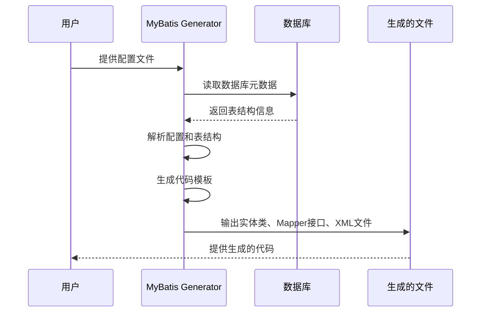

## 简介

MyBatis Generator (MBG) 是 MyBatis 官方提供的代码生成器工具，它能够自动生成基于数据库表结构的实体类、Mapper 接口以及 SQL 映射文件。MBG 可以极大地提高开发效率，减少重复的手动编码工作，同时确保代码的一致性和规范性。

### 主要功能

- 生成符合数据库表结构的 Java 实体类（POJO）
- 生成 Mapper 接口和对应的 XML 映射文件
- 支持基本的 CRUD 操作（Create, Read, Update, Delete）
- 支持复杂的 SQL 语句生成（如动态条件查询）
- 支持多种配置方式（XML、命令行、Maven/Gradle 插件）
- 可定制化生成规则，满足不同项目需求

## 架构知识点

### MyBatis Generator 工作原理

MBG 的工作流程可以分为以下几个核心步骤：



### 核心组件

1. **配置解析器**：解析用户提供的配置文件，提取生成规则和数据库连接信息
2. **数据库元数据读取器**：连接数据库，读取表结构、字段类型、约束等信息
3. **代码生成器**：根据配置和数据库元数据，生成对应的实体类、Mapper 接口和 XML 文件
4. **模板引擎**：使用预定义的模板生成代码，支持自定义模板
5. **输出管理器**：将生成的代码输出到指定位置，支持文件覆盖策略

## 源码分析

### 核心类结构

MBG 的核心类主要位于 `org.mybatis.generator` 包下，主要包括：

```java
// 主类，用于启动代码生成过程
public class MyBatisGenerator {
    public void generate(ProgressCallback callback, Set<String> warnings)
            throws SQLException, IOException, InterruptedException {
        // 核心生成逻辑
    }
}

// 配置类，封装生成器的所有配置信息
public class Configuration {
    // 包含数据库连接配置、表配置、生成规则等
}

// 数据库元数据读取器接口
public interface DatabaseIntrospector {
    List<TableConfiguration> introspectTables(Connection connection, 
            Set<String> warnings) throws SQLException;
}

// 代码生成器接口
public interface Generator {
    void generate(ProgressCallback callback, Set<String> warnings) 
            throws IOException;
}

// 生成上下文，包含生成过程中需要的所有信息
public class IntrospectedTable {
    // 包含表的元数据、生成规则等
}
```

### 生成流程详解

1. **配置加载**：通过 `ConfigurationParser` 解析 XML 配置文件，生成 `Configuration` 对象
2. **数据库连接**：使用配置中的数据库连接信息，创建数据库连接
3. **元数据读取**：通过 `DatabaseIntrospector` 读取数据库表结构信息，生成 `IntrospectedTable` 对象
4. **代码生成**：针对每个 `IntrospectedTable`，调用相应的生成器（ModelGenerator、MapperGenerator、XmlMapperGenerator）生成代码
5. **文件输出**：通过 `DefaultShellCallback` 处理文件的生成、覆盖等操作

## 实际应用

### 配置与依赖

#### Maven 依赖

```xml
<dependency>
    <groupId>org.mybatis.generator</groupId>
    <artifactId>mybatis-generator-core</artifactId>
    <version>1.4.2</version>
</dependency>

<!-- 可选插件，用于在Maven构建时自动生成代码 -->
<plugin>
    <groupId>org.mybatis.generator</groupId>
    <artifactId>mybatis-generator-maven-plugin</artifactId>
    <version>1.4.2</version>
    <configuration>
        <configurationFile>src/main/resources/generatorConfig.xml</configurationFile>
        <overwrite>true</overwrite>
        <verbose>true</verbose>
    </configuration>
</plugin>
```

#### Gradle 依赖

```groovy
dependencies {
    implementation 'org.mybatis.generator:mybatis-generator-core:1.4.2'
}

plugins {
    id 'org.mybatis.generator' version '1.4.2'
}

mybatisGenerator {
    configurationFile = 'src/main/resources/generatorConfig.xml'
    overwrite = true
    verbose = true
}
```

### 基本配置文件

MBG 的核心配置文件 `generatorConfig.xml` 包含以下主要部分：

```xml
<?xml version="1.0" encoding="UTF-8"?>
<!DOCTYPE generatorConfiguration
        PUBLIC "-//MyBatis Generator//DTD MyBatis Generator Configuration 1.0//EN"
        "http://mybatis.org/dtd/mybatis-generator-config_1_0.dtd">

<generatorConfiguration>
    <!-- 数据库驱动配置 -->
    <classPathEntry location="mysql-connector-java-8.0.28.jar" />

    <context id="mysql" targetRuntime="MyBatis3">
        <!-- 抑制生成注释 -->
        <commentGenerator>
            <property name="suppressAllComments" value="true" />
        </commentGenerator>

        <!-- 数据库连接配置 -->
        <jdbcConnection driverClass="com.mysql.cj.jdbc.Driver"
                        connectionURL="jdbc:mysql://localhost:3306/mybatis_db"
                        userId="root"
                        password="password">
        </jdbcConnection>

        <!-- Java类型解析 -->
        <javaTypeResolver>
            <property name="forceBigDecimals" value="false" />
        </javaTypeResolver>

        <!-- 实体类生成配置 -->
        <javaModelGenerator targetPackage="com.example.entity"
                            targetProject="src/main/java">
            <property name="enableSubPackages" value="true" />
            <property name="trimStrings" value="true" />
        </javaModelGenerator>

        <!-- SQL映射文件生成配置 -->
        <sqlMapGenerator targetPackage="mapper"
                         targetProject="src/main/resources">
            <property name="enableSubPackages" value="true" />
        </sqlMapGenerator>

        <!-- Mapper接口生成配置 -->
        <javaClientGenerator type="XMLMAPPER"
                             targetPackage="com.example.mapper"
                             targetProject="src/main/java">
            <property name="enableSubPackages" value="true" />
        </javaClientGenerator>

        <!-- 表配置 -->
        <table tableName="user" domainObjectName="User">
            <generatedKey column="id" sqlStatement="MySQL" />
        </table>

        <table tableName="order" domainObjectName="Order">
            <columnOverride column="order_status" property="status" />
        </table>
    </context>
</generatorConfiguration>
```

### 常用配置参数

| 配置项 | 描述 | 示例值 |
|-------|------|-------|
| `suppressAllComments` | 是否抑制生成注释 | `true` |
| `enableSubPackages` | 是否启用子包 | `true` |
| `trimStrings` | 是否自动去除字符串两端的空格 | `true` |
| `type` | Mapper接口生成类型 | `XMLMAPPER`, `ANNOTATEDMAPPER` |
| `generatedKey` | 生成主键的策略 | `MySQL` |
| `columnOverride` | 字段映射覆盖 | 将 `order_status` 映射为 `status` |

### 运行方式

#### 1. 命令行方式

```bash
java -jar mybatis-generator-core-1.4.2.jar -configfile generatorConfig.xml -overwrite
```

#### 2. Maven 插件方式

```bash
mvn mybatis-generator:generate
```

#### 3. Gradle 插件方式

```bash
gradle mybatisGeneratorGenerate
```

#### 4. 编程方式

```java
import org.mybatis.generator.api.MyBatisGenerator;
import org.mybatis.generator.config.Configuration;
import org.mybatis.generator.config.xml.ConfigurationParser;
import org.mybatis.generator.internal.DefaultShellCallback;

import java.io.File;
import java.util.ArrayList;
import java.util.List;

public class MyBatisGeneratorRunner {
    public static void main(String[] args) throws Exception {
        List<String> warnings = new ArrayList<>();
        boolean overwrite = true;
        File configFile = new File("generatorConfig.xml");
        ConfigurationParser cp = new ConfigurationParser(warnings);
        Configuration config = cp.parseConfiguration(configFile);
        DefaultShellCallback callback = new DefaultShellCallback(overwrite);
        MyBatisGenerator myBatisGenerator = new MyBatisGenerator(config, callback, warnings);
        myBatisGenerator.generate(null);
        
        for (String warning : warnings) {
            System.out.println(warning);
        }
        System.out.println("生成完成");
    }
}
```

## 高级特性

### 定制化生成规则

MBG 提供了丰富的定制化选项，可以根据项目需求调整生成的代码：

#### 1. 自定义注释生成器

```java
import org.mybatis.generator.api.CommentGenerator;
import org.mybatis.generator.api.IntrospectedColumn;
import org.mybatis.generator.api.IntrospectedTable;
import org.mybatis.generator.api.dom.java.*;
import org.mybatis.generator.api.dom.xml.XmlElement;

import java.util.Properties;

public class CustomCommentGenerator implements CommentGenerator {
    @Override
    public void addConfigurationProperties(Properties properties) {
        // 读取配置
    }

    @Override
    public void addFieldComment(Field field, IntrospectedTable introspectedTable, IntrospectedColumn introspectedColumn) {
        field.addJavaDocLine("/**");
        field.addJavaDocLine(" * " + introspectedColumn.getRemarks());
        field.addJavaDocLine(" */");
    }

    // 其他方法实现...
}
```

在配置文件中使用自定义注释生成器：

```xml
<commentGenerator type="com.example.CustomCommentGenerator">
    <property name="suppressAllComments" value="false" />
</commentGenerator>
```

#### 2. 自定义Java类型解析器

```java
import org.mybatis.generator.api.JavaTypeResolver;
import org.mybatis.generator.api.TypeResolver;
import org.mybatis.generator.api.dom.java.FullyQualifiedJavaType;
import org.mybatis.generator.config.Configuration;
import org.mybatis.generator.config.PropertyRegistry;
import org.mybatis.generator.internal.types.JavaTypeResolverDefaultImpl;

import java.sql.Types;
import java.util.Properties;

public class CustomJavaTypeResolver extends JavaTypeResolverDefaultImpl {
    public CustomJavaTypeResolver() {
        super();
        // 将 TINYINT 映射为 Integer 而不是 Boolean
        typeMap.put(Types.TINYINT, new JdbcTypeInformation(Types.TINYINT, "TINYINT", new FullyQualifiedJavaType(Integer.class.getName())));
    }
}
```

在配置文件中使用自定义类型解析器：

```xml
<javaTypeResolver type="com.example.CustomJavaTypeResolver">
    <property name="forceBigDecimals" value="false" />
</javaTypeResolver>
```

### 生成复杂查询

MBG 支持生成包含动态条件的查询方法：

```xml
<table tableName="user" domainObjectName="User">
    <!-- 生成带条件的查询方法 -->
    <generatedKey column="id" sqlStatement="MySQL" />
    <property name="useActualColumnNames" value="false" />
    <!-- 生成Example类 -->
    <generatedKey column="id" sqlStatement="MySQL" identity="true" />
    <!-- 生成selectByExampleWithBLOBs方法 -->
    <columnOverride column="user_photo" javaType="byte[]" />
</table>
```

生成的 Example 类可以用于构建复杂的查询条件：

```java
UserExample example = new UserExample();
UserExample.Criteria criteria = example.createCriteria();
criteria.andUserNameLike("%test%");
criteria.andAgeGreaterThanOrEqualTo(18);
List<User> users = userMapper.selectByExample(example);
```

### 与 Spring Boot 集成

在 Spring Boot 项目中使用 MBG，可以通过 Maven 或 Gradle 插件实现自动生成：

```xml
<plugin>
    <groupId>org.mybatis.generator</groupId>
    <artifactId>mybatis-generator-maven-plugin</artifactId>
    <version>1.4.2</version>
    <dependencies>
        <dependency>
            <groupId>mysql</groupId>
            <artifactId>mysql-connector-java</artifactId>
            <version>8.0.28</version>
        </dependency>
        <dependency>
            <groupId>org.mybatis.generator</groupId>
            <artifactId>mybatis-generator-core</artifactId>
            <version>1.4.2</version>
        </dependency>
    </dependencies>
    <configuration>
        <configurationFile>src/main/resources/generatorConfig.xml</configurationFile>
        <overwrite>true</overwrite>
        <verbose>true</verbose>
    </configuration>
    <executions>
        <execution>
            <id>Generate MyBatis Artifacts</id>
            <goals>
                <goal>generate</goal>
            </goals>
        </execution>
    </executions>
</plugin>
```

## 常见问题及解决方案

### 1. 生成的实体类属性与数据库字段名不一致

**问题**：生成的实体类属性名与数据库字段名不匹配，如数据库字段为 `user_name`，生成的属性为 `userName`

**解决方案**：

```xml
<!-- 禁用驼峰命名转换 -->
<property name="useActualColumnNames" value="true" />

<!-- 或使用字段覆盖 -->
<table tableName="user">
    <columnOverride column="user_name" property="userName" />
</table>
```

### 2. 生成的代码包含不需要的方法

**问题**：生成的 Mapper 接口包含不需要的方法，如 `selectByExampleWithBLOBs`

**解决方案**：

```xml
<table tableName="user">
    <!-- 禁用BLOBs相关方法 -->
    <generatedKey column="id" sqlStatement="MySQL" />
    <property name="enableSelectByExample" value="false" />
    <property name="enableUpdateByExample" value="false" />
    <property name="enableDeleteByExample" value="false" />
    <property name="enableCountByExample" value="false" />
</table>
```

### 3. 无法连接到数据库

**问题**：执行 MBG 时提示无法连接到数据库

**解决方案**：

1. 检查数据库连接配置是否正确
2. 确保数据库驱动 jar 包已正确配置到 `classPathEntry`
3. 检查数据库服务是否正常运行
4. 检查网络连接和防火墙设置

### 4. 生成的代码覆盖了自定义修改

**问题**：重新生成代码时覆盖了之前手动添加的自定义修改

**解决方案**：

1. 使用 MBG 的合并功能：

    ```xml
    <context id="mysql" targetRuntime="MyBatis3">
        <plugin type="org.mybatis.generator.plugins.UnmergeableXmlMappersPlugin" />
    </context>
    ```

2. 将自定义代码放在 MBG 不会覆盖的位置
3. 使用版本控制工具备份自定义修改

## 注意事项

### 最佳实践

1. **保持配置文件的版本控制**：将 MBG 配置文件纳入版本控制，确保团队成员使用相同的生成规则

2. **合理使用覆盖策略**：
   - 初始生成时使用 `overwrite=true`
   - 后续修改时考虑使用合并策略或手动调整

3. **定制化生成规则**：
   - 根据项目规范配置命名规则
   - 统一实体类、Mapper 接口的生成格式

4. **定期更新 MBG 版本**：
   - 新版本通常包含 bug 修复和新特性
   - 注意版本兼容性问题

### 性能考虑

1. **生成范围控制**：
   - 只生成项目需要的表结构
   - 避免一次性生成过多文件

2. **模板优化**：
   - 使用简洁的模板减少生成代码量
   - 避免生成不必要的注释和空格

3. **增量生成**：
   - 只生成新增或修改的表结构
   - 使用 `-tables` 参数指定生成的表

### 安全考虑

1. **数据库连接信息安全**：
   - 不要将数据库密码硬编码在配置文件中
   - 使用环境变量或配置中心管理敏感信息

2. **SQL 注入防护**：
   - 确保生成的代码使用参数绑定（`#{}）而不是字符串拼接（${}`）
   - 对动态 SQL 进行严格的输入验证

## 总结

MyBatis Generator 是一个功能强大的代码生成工具，它能够极大地提高 MyBatis 项目的开发效率。通过合理配置和定制化，MBG 可以生成符合项目需求的高质量代码，减少重复劳动，确保代码一致性。

### 关键要点回顾

- MBG 可以自动生成实体类、Mapper 接口和 SQL 映射文件
- 支持多种配置方式和运行方式
- 提供丰富的定制化选项，满足不同项目需求
- 支持生成基本 CRUD 操作和复杂查询
- 与 Spring Boot 等框架良好集成

### 未来发展趋势

随着 MyBatis 3.x 版本的发展，MBG 也在不断演进：

- 更好地支持注解方式的 Mapper 接口
- 增强对复杂查询的生成能力
- 提供更多的模板和插件扩展
- 支持更多的数据库特性

通过掌握 MyBatis Generator 的使用和定制化，开发者可以更高效地构建 MyBatis 应用，专注于业务逻辑的实现，而不是重复的数据库访问代码编写。
