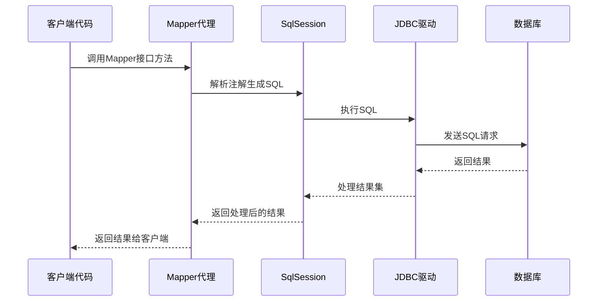

## 简介

MyBatis 从 3.x 版本开始支持注解开发，为开发者提供了一种更简洁、更直观的方式来编写 SQL 映射代码。注解开发可以减少 XML 配置文件的数量，提高开发效率，同时保持 MyBatis 的灵活性和强大功能。

### 主要特点

- **减少 XML 配置**：使用注解直接在 Mapper 接口中定义 SQL 语句
- **简洁直观**：SQL 语句与 Java 代码紧密结合，提高代码可读性
- **类型安全**：利用 Java 的类型系统进行编译时检查
- **灵活配置**：支持从简单到复杂的各种 SQL 操作
- **与 XML 混合使用**：可以根据需要选择最适合的方式
- **支持动态 SQL**：通过注解实现复杂的动态查询逻辑

## 架构知识点

### 注解开发原理

MyBatis 的注解开发基于 Java 的反射机制和动态代理实现：



### 注解解析流程

1. **Mapper 接口扫描**：MyBatis 扫描指定包下的 Mapper 接口
2. **注解解析**：解析接口方法上的 MyBatis 注解，提取 SQL 语句和配置信息
3. **MappedStatement 创建**：将解析后的信息转换为 `MappedStatement` 对象
4. **代理对象生成**：为 Mapper 接口生成动态代理对象
5. **SQL 执行**：调用代理对象方法时，执行相应的 SQL 语句

### 注解与 XML 的关系

MyBatis 支持注解和 XML 两种配置方式，它们可以：

- **独立使用**：完全使用注解或完全使用 XML
- **混合使用**：同一 Mapper 接口可以同时使用注解和 XML
- **相互覆盖**：在混合使用时，XML 配置会覆盖注解配置

## 源码分析

### 核心注解类

MyBatis 的主要注解位于 `org.apache.ibatis.annotations` 包下，核心注解包括：

```java
// 基本 SQL 注解
@Select("SELECT * FROM user WHERE id = #{id}")
@Insert("INSERT INTO user(name, age) VALUES(#{name}, #{age})")
@Update("UPDATE user SET name = #{name} WHERE id = #{id}")
@Delete("DELETE FROM user WHERE id = #{id}")

// 参数相关注解
@Param("id")
@Options(useGeneratedKeys = true, keyProperty = "id")

// 结果映射注解
@Results({
    @Result(id = true, column = "user_id", property = "userId"),
    @Result(column = "user_name", property = "userName"),
    @Result(column = "user_id", property = "orders", 
            many = @Many(select = "com.example.mapper.OrderMapper.selectByUserId"))
})

// 动态 SQL 注解
@SelectProvider(type = UserSqlProvider.class, method = "selectById")
@InsertProvider(type = UserSqlProvider.class, method = "insertUser")

// 缓存注解
@CacheNamespace
@CacheNamespaceRef
```

### 注解解析器

MyBatis 使用 `MapperAnnotationBuilder` 类解析 Mapper 接口上的注解：

```java
public class MapperAnnotationBuilder {
    public void parse() {
        String resource = type.toString();
        if (!configuration.isResourceLoaded(resource)) {
            loadXmlResource();
            configuration.addLoadedResource(resource);
            assistant.setCurrentNamespace(type.getName());
            parseCache();
            parseCacheRef();
            Method[] methods = type.getMethods();
            for (Method method : methods) {
                try {
                    // 解析方法上的注解
                    parseStatement(method);
                } catch (IncompleteElementException e) {
                    // 处理不完整的元素
                    configuration.addIncompleteMethod(new MethodResolver(this, method));
                }
            }
        }
        parsePendingMethods();
    }
}
```

### 动态 SQL 生成器

对于复杂的动态 SQL，MyBatis 使用 SQL 提供者（SQL Provider）机制：

```java
public interface ProviderMethodResolver {
    String resolveMethod(ProviderContext context);
}

public interface SqlProvider {
    // SQL 提供者接口
}

// 动态 SQL 提供者示例
public class UserSqlProvider implements ProviderMethodResolver {
    public String selectById(Long id) {
        return new SQL() {
            {
                SELECT("*");
                FROM("user");
                WHERE("id = #{id}");
            }
        }.toString();
    }

    @Override
    public String resolveMethod(ProviderContext context) {
        return context.getMapperMethod().getName();
    }
}
```

## 实际应用

### 基本配置

#### Maven 依赖

```xml
<dependency>
    <groupId>org.mybatis</groupId>
    <artifactId>mybatis</artifactId>
    <version>3.5.11</version>
</dependency>

<!-- 可选：MyBatis-Spring 集成 -->
<dependency>
    <groupId>org.mybatis</groupId>
    <artifactId>mybatis-spring</artifactId>
    <version>2.1.0</version>
</dependency>
```

#### 配置文件

```xml
<!-- mybatis-config.xml -->
<configuration>
    <environments default="development">
        <environment id="development">
            <transactionManager type="JDBC" />
            <dataSource type="POOLED">
                <property name="driver" value="com.mysql.cj.jdbc.Driver" />
                <property name="url" value="jdbc:mysql://localhost:3306/mybatis_db" />
                <property name="username" value="root" />
                <property name="password" value="password" />
            </dataSource>
        </environment>
    </environments>
    
    <!-- 扫描 Mapper 接口 -->
    <mappers>
        <package name="com.example.mapper" />
    </mappers>
</configuration>
```

### 基本注解使用

#### 1. 简单查询

```java
public interface UserMapper {
    @Select("SELECT * FROM user WHERE id = #{id}")
    User selectById(Long id);

    @Select("SELECT * FROM user WHERE name LIKE CONCAT('%', #{name}, '%')")
    List<User> selectByName(String name);
}
```

#### 2. 插入操作

```java
public interface UserMapper {
    @Insert("INSERT INTO user(name, age, email) VALUES(#{name}, #{age}, #{email})")
    @Options(useGeneratedKeys = true, keyProperty = "id")
    int insert(User user);

    @Insert({
        "INSERT INTO user(name, age, email) VALUES",
        "<foreach collection='list' item='item' separator=','>",
        "(#{item.name}, #{item.age}, #{item.email})",
        "</foreach>"
    })
    @Options(useGeneratedKeys = true, keyProperty = "id")
    int insertBatch(List<User> users);
}
```

#### 3. 更新操作

```java
public interface UserMapper {
    @Update("UPDATE user SET name = #{name}, age = #{age} WHERE id = #{id}")
    int update(User user);

    @Update("UPDATE user SET age = age + #{increment} WHERE id = #{id}")
    int updateAge(@Param("id") Long id, @Param("increment") int increment);
}
```

#### 4. 删除操作

```java
public interface UserMapper {
    @Delete("DELETE FROM user WHERE id = #{id}")
    int deleteById(Long id);

    @Delete({
        "DELETE FROM user WHERE id IN",
        "<foreach collection='ids' item='id' open='(' separator=',' close=')'>",
        "#{id}",
        "</foreach>"
    })
    int deleteByIds(@Param("ids") List<Long> ids);
}
```

### 结果映射注解

#### 1. 基本结果映射

```java
public interface UserMapper {
    @Select("SELECT id, user_name as userName, user_age as age FROM user WHERE id = #{id}")
    @Results({
        @Result(id = true, column = "id", property = "id"),
        @Result(column = "userName", property = "userName"),
        @Result(column = "age", property = "age")
    })
    User selectById(Long id);
}
```

#### 2. 关联查询映射

```java
public interface UserMapper {
    @Select("SELECT * FROM user WHERE id = #{id}")
    @Results({
        @Result(id = true, column = "id", property = "id"),
        @Result(column = "user_name", property = "userName"),
        @Result(column = "id", property = "orders", 
                many = @Many(select = "com.example.mapper.OrderMapper.selectByUserId"))
    })
    User selectUserWithOrders(Long id);
}

public interface OrderMapper {
    @Select("SELECT * FROM order WHERE user_id = #{userId}")
    List<Order> selectByUserId(Long userId);
}
```

#### 3. 嵌套结果映射

```java
public interface OrderMapper {
    @Select("SELECT o.id, o.order_no, o.user_id, u.user_name, u.age " +
            "FROM order o JOIN user u ON o.user_id = u.id WHERE o.id = #{id}")
    @Results({
        @Result(id = true, column = "id", property = "id"),
        @Result(column = "order_no", property = "orderNo"),
        @Result(column = "user_id", property = "userId"),
        @Result(column = "user_id", property = "user", 
                one = @One(select = "com.example.mapper.UserMapper.selectById"))
    })
    Order selectOrderWithUser(Long id);
}
```

### 动态 SQL 注解

#### 1. 使用 @SelectProvider

```java
public interface UserMapper {
    @SelectProvider(type = UserSqlProvider.class, method = "selectByCondition")
    List<User> selectByCondition(UserCondition condition);
}

public class UserSqlProvider {
    public String selectByCondition(UserCondition condition) {
        SQL sql = new SQL() {
            {
                SELECT("*");
                FROM("user");
                if (condition.getName() != null) {
                    WHERE("name LIKE CONCAT('%', #{name}, '%')");
                }
                if (condition.getMinAge() != null) {
                    WHERE("age >= #{minAge}");
                }
                if (condition.getMaxAge() != null) {
                    WHERE("age <= #{maxAge}");
                }
                ORDER_BY("id DESC");
            }
        };
        return sql.toString();
    }
}
```

#### 2. 使用 @InsertProvider

```java
public interface UserMapper {
    @InsertProvider(type = UserSqlProvider.class, method = "insertUser")
    @Options(useGeneratedKeys = true, keyProperty = "id")
    int insertUser(User user);
}

public class UserSqlProvider {
    public String insertUser(User user) {
        return new SQL() {
            {
                INSERT_INTO("user");
                if (user.getName() != null) {
                    VALUES("name", "#{name}");
                }
                if (user.getAge() != null) {
                    VALUES("age", "#{age}");
                }
                if (user.getEmail() != null) {
                    VALUES("email", "#{email}");
                }
            }
        }.toString();
    }
}
```

#### 3. 使用 @UpdateProvider

```java
public interface UserMapper {
    @UpdateProvider(type = UserSqlProvider.class, method = "updateUser")
    int updateUser(User user);
}

public class UserSqlProvider {
    public String updateUser(User user) {
        return new SQL() {
            {
                UPDATE("user");
                if (user.getName() != null) {
                    SET("name = #{name}");
                }
                if (user.getAge() != null) {
                    SET("age = #{age}");
                }
                if (user.getEmail() != null) {
                    SET("email = #{email}");
                }
                WHERE("id = #{id}");
            }
        }.toString();
    }
}
```

### 与 XML 混合使用

在实际项目中，可以根据需要选择最适合的方式：

```java
public interface UserMapper {
    // 使用注解实现简单查询
    @Select("SELECT * FROM user WHERE id = #{id}")
    User selectById(Long id);

    // 使用 XML 实现复杂查询
    List<User> selectByComplexCondition(UserCondition condition);
}
```

```xml
<!-- UserMapper.xml -->
<mapper namespace="com.example.mapper.UserMapper">
    <select id="selectByComplexCondition" parameterType="UserCondition" resultType="User">
        SELECT * FROM user
        <where>
            <if test="name != null">
                AND name LIKE CONCAT('%', #{name}, '%')
            </if>
            <if test="age != null">
                AND age = #{age}
            </if>
            <if test="email != null">
                AND email LIKE CONCAT('%', #{email}, '%')
            </if>
        </where>
        ORDER BY id DESC
    </select>
</mapper>
```

## 常见问题及解决方案

### 1. 注解中的 SQL 语句过长

**问题**：复杂 SQL 语句在注解中难以维护

**解决方案**：

- 使用多行字符串（Java 15+）
- 将复杂 SQL 移至 XML 文件
- 使用 SQL Provider 类拆分 SQL 构建逻辑

```java
// Java 15+ 多行字符串
@Select("""
    SELECT u.*, o.order_no, o.order_date
    FROM user u
    JOIN order o ON u.id = o.user_id
    WHERE u.id = #{id}
""")
User selectUserWithOrders(Long id);
```

### 2. 参数传递问题

**问题**：多参数方法中参数名无法正确映射

**解决方案**：

- 使用 `@Param` 注解明确指定参数名
- 使用 JavaBean 封装多个参数

```java
// 错误示例
@Select("SELECT * FROM user WHERE name = #{name} AND age = #{age}")
User selectByNameAndAge(String name, int age);

// 正确示例 - 使用 @Param
@Select("SELECT * FROM user WHERE name = #{name} AND age = #{age}")
User selectByNameAndAge(@Param("name") String name, @Param("age") int age);

// 正确示例 - 使用 JavaBean
@Select("SELECT * FROM user WHERE name = #{name} AND age = #{age}")
User selectByUserCondition(UserCondition condition);
```

### 3. 动态 SQL 复杂性

**问题**：使用注解实现复杂动态 SQL 变得困难

**解决方案**：

- 使用 SQL Provider 类构建动态 SQL
- 合理使用 SQL 类提供的方法
- 对于超复杂 SQL，考虑使用 XML 配置

```java
public class ComplexSqlProvider {
    public String buildComplexQuery(QueryParams params) {
        SQL sql = new SQL() {
            {
                SELECT("t1.*, t2.name as category_name");
                FROM("product t1");
                LEFT_OUTER_JOIN("category t2 ON t1.category_id = t2.id");
                
                // 动态条件
                if (params.getProductName() != null) {
                    WHERE("t1.name LIKE CONCAT('%', #{productName}, '%')");
                }
                if (params.getMinPrice() != null) {
                    WHERE("t1.price >= #{minPrice}");
                }
                if (params.getCategoryIds() != null && !params.getCategoryIds().isEmpty()) {
                    WHERE("t1.category_id IN " + buildInClause(params.getCategoryIds()));
                }
                
                ORDER_BY("t1.price DESC");
            }
        };
        return sql.toString();
    }
    
    private String buildInClause(List<Long> ids) {
        StringBuilder sb = new StringBuilder("(");
        for (int i = 0; i < ids.size(); i++) {
            sb.append("#{categoryIds[").append(i).append("]}");
            if (i < ids.size() - 1) {
                sb.append(", ");
            }
        }
        sb.append(")");
        return sb.toString();
    }
}
```

### 4. 缓存配置问题

**问题**：如何通过注解配置缓存

**解决方案**：使用 `@CacheNamespace` 和 `@CacheNamespaceRef` 注解

```java
@CacheNamespace(implementation = org.mybatis.caches.ehcache.EhcacheCache.class)
public interface UserMapper {
    // 方法定义...
}

@CacheNamespaceRef(UserMapper.class)
public interface UserExtMapper {
    // 方法定义...
}
```

### 5. 事务管理问题

**问题**：如何在注解开发中管理事务

**解决方案**：

- 在 Spring 环境中使用 `@Transactional` 注解
- 在非 Spring 环境中使用 SqlSession 的事务管理

```java
// Spring 环境
@Service
public class UserService {
    @Autowired
    private UserMapper userMapper;
    
    @Transactional
    public void createUser(User user) {
        userMapper.insert(user);
        // 其他数据库操作
    }
}

// 非 Spring 环境
try (SqlSession sqlSession = sqlSessionFactory.openSession()) {
    try {
        UserMapper userMapper = sqlSession.getMapper(UserMapper.class);
        userMapper.insert(user1);
        userMapper.insert(user2);
        sqlSession.commit();
    } catch (Exception e) {
        sqlSession.rollback();
        throw e;
    }
}
```

## 注意事项

### 最佳实践

1. **选择合适的方式**：
   - 简单 SQL 使用注解
   - 复杂 SQL 使用 XML
   - 动态 SQL 考虑使用 SQL Provider

2. **保持代码整洁**：
   - 避免在注解中编写过长的 SQL 语句
   - 使用有意义的方法名和参数名
   - 合理组织 SQL Provider 类

3. **性能优化**：
   - 避免 N+1 查询问题，合理使用关联映射
   - 利用缓存减少数据库访问
   - 优化 SQL 语句结构

4. **安全考虑**：
   - 使用 `#{}` 进行参数绑定，避免 SQL 注入
   - 对用户输入进行验证和过滤
   - 遵循最小权限原则

5. **测试策略**：
   - 为 Mapper 接口编写单元测试
   - 使用内存数据库进行测试
   - 测试各种边界条件

### 性能考虑

1. **注解解析开销**：首次调用时需要解析注解，会有轻微性能开销
2. **缓存机制**：MyBatis 会缓存解析后的 SQL 语句，后续调用性能良好
3. **动态 SQL 构建**：复杂的动态 SQL 构建可能影响性能，需要合理设计

### 迁移策略

如果从 XML 配置迁移到注解开发：

1. 先从简单的查询开始迁移
2. 逐步迁移复杂查询
3. 保留 XML 用于超复杂的 SQL
4. 使用混合模式过渡
5. 编写测试确保功能一致性

## 总结

MyBatis 的注解开发提供了一种简洁、直观的方式来定义 SQL 映射，与传统的 XML 配置相比，它具有更高的代码可读性和类型安全性。通过合理使用各种注解，开发者可以实现从简单查询到复杂动态 SQL 的各种操作。

### 关键优势

- **开发效率**：减少配置文件，提高开发速度
- **代码可读性**：SQL 与 Java 代码紧密结合
- **灵活性**：支持从简单到复杂的各种场景
- **兼容性**：可以与 XML 配置混合使用
- **类型安全**：利用 Java 的类型系统进行编译时检查

### 应用场景

- **简单 CRUD 操作**：直接在注解中定义 SQL
- **中等复杂度查询**：使用结果映射和关联查询
- **动态 SQL**：通过 SQL Provider 实现
- **快速原型开发**：减少配置，快速实现功能
- **团队协作**：统一代码风格，提高协作效率

MyBatis 的注解开发是对 XML 配置的有力补充，开发者可以根据项目需求和个人偏好选择最适合的方式，或者结合使用两种方式以发挥各自的优势。无论选择哪种方式，MyBatis 都能提供强大、灵活的数据访问能力。
