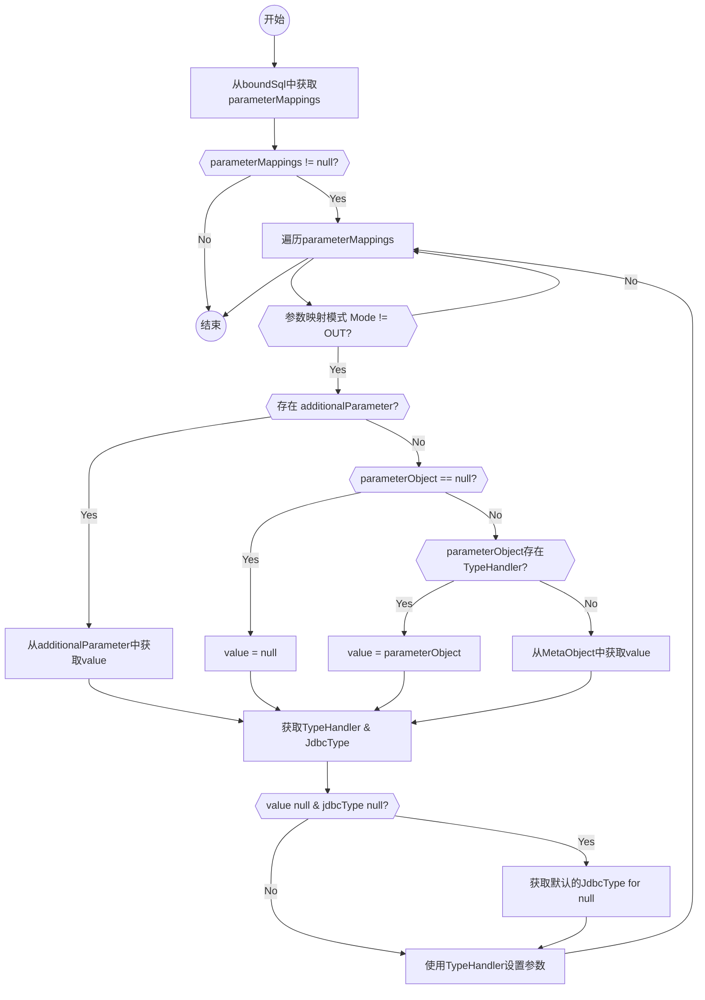

> 在使用 MyBatis 进行数据库操作时，`ParameterHandler` 负责将传入的参数转换为 JDBC 语句可以理解的形式。

<!--- more -->

## ParameterHandler

在mybatis中，`ParameterHandler` 用于将用户提供的参数转换为JDBC语句可以理解的形式。它有一个默认的实现`DefaultParameterHandler`。

`DefaultParameterHandler`存在以下属性：

- `TypeHandlerRegistry typeHandlerRegistry`：用于注册`jdbcType`或者`javaType`对应的处理器
- `Object parameterObject`：执行sql使用的参数对象。
- `BoundSql boundSql`：sql及绑定的参数对象、映射等信息。
- `Configuration`：全局配置信息。
- `MappedStatement mappedStatement`：statement信息。

`ParameterHandler`对外只提供设置参数方法和获取参数方法。

```java

  Object getParameterObject();

  void setParameters(PreparedStatement ps) throws SQLException;

```

下面分析`DefaultParameterHandler`的`setParameters`的处理流程见下：



当参数映射使用附加的参数映射时，会从`additionalParameter`中获取参数值。

附加参数使用的不是用户指定的参数名称，如`<foreach>`生成的参数名、系统指定的参数名称、数据库id。


非附加参数，则首先判断是否指定了该参数类型对应的处理器，如果指定，则直接使用该参数。

如果没有指定则通过`MetaObject`从对象中获取参数及变量值。

```java
public void setParameters(PreparedStatement ps) {
  ErrorContext.instance().activity("setting parameters").object(mappedStatement.getParameterMap().getId());
  List<ParameterMapping> parameterMappings = boundSql.getParameterMappings();
  if (parameterMappings != null) {
    for (int i = 0; i < parameterMappings.size(); i++) {
      ParameterMapping parameterMapping = parameterMappings.get(i);
      if (parameterMapping.getMode() != ParameterMode.OUT) {
        // 如果不是out则设置参数
        Object value;
        String propertyName = parameterMapping.getProperty();
        if (boundSql.hasAdditionalParameter(propertyName)) { // issue #448 ask first for additional params
          // 获取额外参数
          value = boundSql.getAdditionalParameter(propertyName);
        } else if (parameterObject == null) {
          value = null;
        } else if (typeHandlerRegistry.hasTypeHandler(parameterObject.getClass())) {
          // 如果参数类型是注册typehandler类型，则直接使用
          // 后续通过typehandler直接处理parameterObject
          value = parameterObject;
        } else {
          // 如果参数是一个pojo，则使用pojo的属性值
          MetaObject metaObject = configuration.newMetaObject(parameterObject);
          value = metaObject.getValue(propertyName);
        }
        // note zx 获取参数映射中的typeHandler，jdbcType
        TypeHandler typeHandler = parameterMapping.getTypeHandler();
        JdbcType jdbcType = parameterMapping.getJdbcType();
        if (value == null && jdbcType == null) {
          jdbcType = configuration.getJdbcTypeForNull();
        }
        try {
          // note zx 给PreparedStatement设置参数，此处是调用typeHandler的setParameter方法，
          typeHandler.setParameter(ps, i + 1, value, jdbcType);
        } catch (TypeException | SQLException e) {
          throw new TypeException("Could not set parameters for mapping: " + parameterMapping + ". Cause: " + e, e);
        }
      }
    }
  }
}
```

### 参数的获取及封装

在mybatis代理方法过程中，方法的参数会通过`ParamNameResolver`进行一次封装。

::: info
代理过程参考 [mybatis代理过程](./代理过程.md)
:::

1. 只有一个参数，且未指定参数名
     - 如果是集合或者数组，将其封装到map中
     - 如果只有一个对象，则直接返回
2. 多个参数，封装到map中，key为参数名，value为参数值

```java
public Object getNamedParams(Object[] args) {
  final int paramCount = names.size();
  if (args == null || paramCount == 0) {
    return null;
  } else if (!hasParamAnnotation && paramCount == 1) {
    // 只有一个参数，且未指定参数名
    // 如果是集合或者数组，将其封装到map中，如果只有一个对象，则直接返回
    Object value = args[names.firstKey()];
    return wrapToMapIfCollection(value, useActualParamName ? names.get(0) : null);
  } else {
    // 多个参数，封装到map中，key为参数名，value为参数值。参数名包括通用参数名和指定参数名
    final Map<String, Object> param = new ParamMap<>();
    int i = 0;
    for (Map.Entry<Integer, String> entry : names.entrySet()) {
      param.put(entry.getValue(), args[entry.getKey()]);
      // add generic param names (param1, param2, ...)
      final String genericParamName = GENERIC_NAME_PREFIX + (i + 1);
      // ensure not to overwrite parameter named with @Param
      if (!names.containsValue(genericParamName)) {
        param.put(genericParamName, args[entry.getKey()]);
      }
      i++;
    }
    return param;
  }
}

```

### MetaObject的使用

`MetaObject`是mybatis中用于封装对象和属性的类。它提供了一些方法来获取和设置对象的属性，以及执行一些操作，如属性的获取和设置、属性的遍历等。

`MetaObject`的使用方法可以参考`MetaObjectTest`。

下面举几个例子：

```java
RichType rich = new RichType();
MetaObject meta = SystemMetaObject.forObject(rich);
meta.setValue("richField", "foo");
assertEquals("foo", meta.getValue("richField"));
meta.setValue("richType.richField", "foo");
assertEquals("foo", meta.getValue("richType.richField"));
meta.setValue("richMap.key", "foo");
assertEquals("foo", meta.getValue("richMap.key"));
meta.setValue("richMap[key]", "foo");
assertEquals("foo", meta.getValue("richMap[key]"));
meta.setValue("richList[0]", "foo");
assertEquals("foo", meta.getValue("richList[0]"));
```
