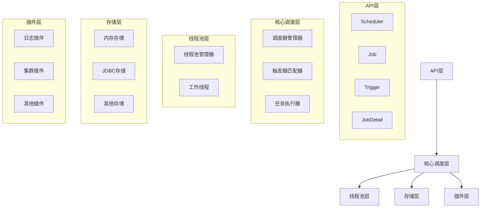
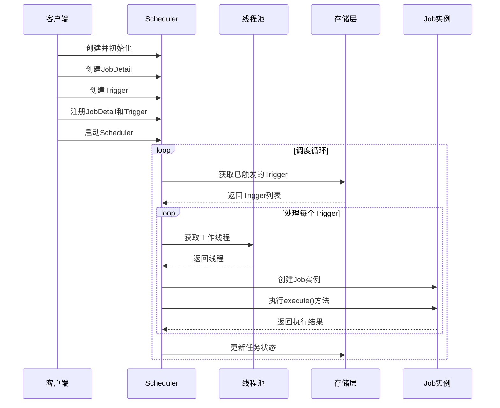

## 简介

Quartz是一个功能强大、开源的Java定时任务调度框架，它提供了丰富的API来创建、调度和管理定时任务。Quartz支持复杂的调度规则、持久化存储、集群部署和分布式任务执行，是企业级应用中实现定时任务的首选框架之一。

本文将深入探讨Quartz的核心概念、架构设计、工作原理，并通过可视化图表展示其内部机制。

## 核心概念

Quartz框架包含以下核心组件：

### 1. Scheduler（调度器）

Scheduler是Quartz框架的核心，负责管理任务的调度和执行。它维护着一个任务注册表和触发器注册表，根据触发器的规则来调度任务执行。

### 2. Job（任务）

Job是一个接口，代表需要执行的任务逻辑。开发者需要实现`Job`接口的`execute()`方法，在该方法中编写具体的任务逻辑。

```java
public interface Job {
    void execute(JobExecutionContext context) throws JobExecutionException;
}
```

### 3. JobDetail（任务详情）

JobDetail用于描述Job的实例，包含Job的名称、组名、描述、JobDataMap等信息。它是Scheduler调度Job的元数据。

### 4. Trigger（触发器）

Trigger定义了任务的调度规则，决定了Job何时执行、执行频率等。Quartz提供了多种触发器类型，如SimpleTrigger、CronTrigger等。

### 5. JobBuilder与TriggerBuilder

JobBuilder和TriggerBuilder是Quartz提供的构建器类，用于创建JobDetail和Trigger实例，采用流畅API设计，使代码更易读。

### 6. JobDataMap

JobDataMap是一个键值对集合，用于在Job执行时传递参数数据。它可以在创建JobDetail或Trigger时设置。

### 7. JobExecutionContext

JobExecutionContext是Job执行时的上下文环境，包含JobDetail、Trigger、Scheduler等信息，以及JobDataMap中的数据。

## 架构设计

Quartz采用分层架构设计，主要包含以下几个层次：

### 1. API层

提供给开发者使用的高级API，包括Scheduler、Job、Trigger等核心接口和类。

### 2. 核心调度层

负责任务调度的核心逻辑，包括调度器的管理、触发器的匹配、任务的执行等。

### 3. 线程池层

管理执行任务的线程池，确保任务能够并发执行。

### 4. 存储层

负责任务和触发器的持久化存储，支持多种存储方式，如内存存储、JDBC存储等。

### 5. 插件层

提供扩展点，允许开发者自定义Quartz的功能，如日志插件、集群插件等。

## 架构图



## 工作流程

Quartz的工作流程可以分为以下几个步骤：

1. **初始化Scheduler**：创建并初始化Scheduler实例
2. **创建JobDetail**：定义需要执行的任务
3. **创建Trigger**：定义任务的调度规则
4. **注册任务**：将JobDetail和Trigger注册到Scheduler
5. **启动Scheduler**：开始调度任务
6. **触发任务**：当Trigger条件满足时，Scheduler触发任务执行
7. **执行任务**：从线程池中获取线程执行Job的execute()方法
8. **重复执行**：根据Trigger的规则重复执行任务

## 执行流程图



## 线程模型

Quartz采用线程池来管理任务执行，主要包含以下线程：

1. **调度线程（Scheduler Thread）**：负责监控触发器，当触发器条件满足时，将任务放入执行队列
2. **工作线程（Worker Thread）**：从线程池中获取，执行具体的Job实例
3. **Misfire线程**：处理错过执行时间的任务
4. **集群线程**：在集群环境下，负责节点间的通信和协调

## 存储模型

Quartz支持多种存储方式：

1. **RAMJobStore**：将任务和触发器存储在内存中，性能高但不支持持久化
2. **JDBCJobStore**：将任务和触发器存储在关系型数据库中，支持持久化和集群部署
   - JobStoreTX：使用JDBC事务
   - JobStoreCMT：使用容器管理事务

## 实际应用

以下是使用Quartz核心API创建和调度任务的简单示例：

```java
// 1. 创建调度器实例
SchedulerFactory schedulerFactory = new StdSchedulerFactory();
Scheduler scheduler = schedulerFactory.getScheduler();

// 2. 创建JobDetail
JobDetail jobDetail = JobBuilder.newJob(MyJob.class)
    .withIdentity("myJob", "myJobGroup")
    .usingJobData("param1", "value1")
    .usingJobData("param2", 123)
    .build();

// 3. 创建Trigger
Trigger trigger = TriggerBuilder.newTrigger()
    .withIdentity("myTrigger", "myTriggerGroup")
    .startNow()
    .withSchedule(SimpleScheduleBuilder.simpleSchedule()
        .withIntervalInSeconds(10)
        .repeatForever())
    .build();

// 4. 注册Job和Trigger
if (!scheduler.checkExists(jobDetail.getKey())) {
    scheduler.scheduleJob(jobDetail, trigger);
}

// 5. 启动调度器
scheduler.start();
```

## 注意事项

1. **Job实例的生命周期**：每次任务执行时，Quartz都会创建一个新的Job实例，执行完成后会被垃圾回收
2. **线程安全性**：Job的execute()方法可能被多个线程同时调用，需要注意线程安全问题
3. **异常处理**：在execute()方法中抛出的异常会被Quartz捕获并处理，不会影响其他任务的执行
4. **资源清理**：Job执行完成后，需要手动清理打开的资源，如数据库连接、文件流等
5. **调度器关闭**：应用程序关闭时，需要调用scheduler.shutdown()方法来优雅地关闭调度器

## 总结

Quartz框架通过清晰的分层架构和核心组件设计，提供了强大的定时任务调度能力。其核心组件包括Scheduler、Job、JobDetail、Trigger等，它们协同工作实现了复杂的任务调度逻辑。

Quartz的架构设计支持高可用性、可扩展性和分布式部署，使其能够满足企业级应用的需求。通过了解Quartz的核心概念和架构原理，开发者可以更好地使用和扩展Quartz框架，实现高效、可靠的定时任务调度。

在后续文章中，我们将深入探讨Quartz的基本使用方法、与Spring Boot的整合、集群部署和源码分析等内容。
