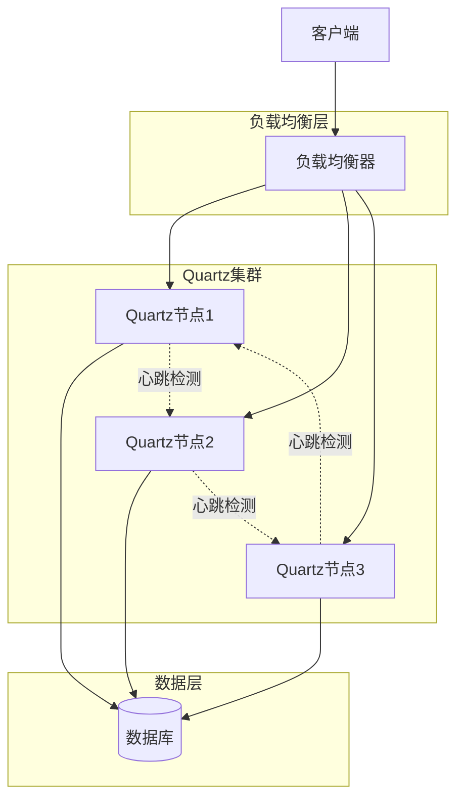

## 简介

随着业务规模的增长，单机环境下的定时任务调度已经无法满足高可用性、高可靠性和高性能的需求。在分布式系统中，定时任务调度需要解决任务重复执行、单点故障、负载均衡等问题。

Quartz作为功能强大的定时任务调度框架，提供了完善的集群支持，可以在分布式环境下实现任务的可靠调度。本文将详细介绍Quartz集群的工作原理、配置方法、任务执行策略、分布式锁机制、监控管理以及常见问题解决方案。

## 分布式定时任务的挑战

在分布式系统中，定时任务调度面临以下挑战：

1. **任务重复执行**：多个节点同时执行同一个任务，导致数据不一致
2. **单点故障**：单个节点故障导致任务无法执行
3. **负载均衡**：任务分配不均匀，导致部分节点负载过高
4. **任务持久化**：任务信息需要持久化存储，确保系统重启后任务不丢失
5. **故障恢复**：节点故障后，任务能够自动迁移到其他节点执行
6. **时钟同步**：分布式节点之间的时钟需要保持同步

## Quartz集群的工作原理

Quartz集群通过共享数据库来实现节点之间的协调和任务分配。集群中的每个节点都运行着相同的Quartz应用程序，但是只有一个节点会被选举为"领导者"，负责任务的调度和分配。

### 核心机制

1. **数据库共享**：所有节点共享同一个数据库，存储任务和触发器信息
2. **领导者选举**：节点启动时，通过数据库锁机制选举出一个领导者
3. **任务分配**：领导者负责任务的调度和分配，其他节点等待执行任务
4. **故障检测**：节点定期向数据库发送心跳，如果超过一定时间没有心跳，其他节点会重新选举领导者
5. **任务迁移**：当节点故障时，未完成的任务会被重新分配到其他节点执行

### 集群架构图



## Quartz集群的配置方法

### 1. 数据库准备

Quartz集群需要使用数据库来存储任务和触发器信息。首先，需要创建Quartz所需的数据库表。Quartz提供了SQL脚本，可以在Quartz的jar包中找到，路径为`org/quartz/impl/jdbcjobstore/tables_<数据库类型>.sql`。

### 2. 依赖配置

在Spring Boot项目中，需要添加以下依赖：

```xml
<dependency>
    <groupId>org.springframework.boot</groupId>
    <artifactId>spring-boot-starter-quartz</artifactId>
</dependency>
<dependency>
    <groupId>mysql</groupId>
    <artifactId>mysql-connector-java</artifactId>
</dependency>
<dependency>
    <groupId>com.zaxxer</groupId>
    <artifactId>HikariCP</artifactId>
</dependency>
```

### 3. 配置文件

在`application.yml`中配置Quartz集群：

```yaml
spring:
  # 数据源配置
  datasource:
    url: jdbc:mysql://localhost:3306/quartz?useUnicode=true&characterEncoding=utf8&serverTimezone=Asia/Shanghai
    username: root
    password: password
    driver-class-name: com.mysql.cj.jdbc.Driver
    hikari:
      maximum-pool-size: 10
      minimum-idle: 5
      connection-timeout: 30000
      idle-timeout: 600000
      max-lifetime: 1800000
  
  # Quartz配置
  quartz:
    # 使用JDBC存储
    job-store-type: jdbc
    
    # JDBC配置
    jdbc:
      # 初始化数据库表
      initialize-schema: never
      # 数据源名称
      data-source-name: dataSource
    
    # 调度器配置
    scheduler:
      # 实例名称
      instance-name: quartz-cluster
      # 实例ID，AUTO表示自动生成
      instance-id: AUTO
    
    # 属性配置
    properties:
      org:
        quartz:
          # 调度器配置
          scheduler:
            # 跳过检查更新
            skipUpdateCheck: true
          
          # 线程池配置
          threadPool:
            # 线程池类
            class: org.quartz.simpl.SimpleThreadPool
            # 线程数量
            threadCount: 10
            # 线程优先级
            threadPriority: 5
            # 线程组名称
            threadGroup: QuartzThreadGroup
          
          # JobStore配置
          jobStore:
            # JobStore类
            class: org.quartz.impl.jdbcjobstore.JobStoreTX
            # 驱动委托类
            driverDelegateClass: org.quartz.impl.jdbcjobstore.StdJDBCDelegate
            # 表前缀
            tablePrefix: QRTZ_
            # 是否集群
            isClustered: true
            # 集群检查间隔（毫秒）
            clusterCheckinInterval: 10000
            # 数据保存时间（毫秒）
            misfireThreshold: 60000
            # 集群节点间通信超时时间
            maxMisfiresToHandleAtATime: 10
            # 是否使用属性
            useProperties: false
          
          # 插件配置
          plugin:
            # 日志插件
            jobHistory:
              class: org.quartz.plugins.history.LoggingJobHistoryPlugin
            triggerHistory:
              class: org.quartz.plugins.history.LoggingTriggerHistoryPlugin
            shutdownHook:
              class: org.quartz.plugins.management.ShutdownHookPlugin
              cleanShutdown: true
```

### 4. 关键配置说明

| 配置项 | 说明 |
|-------|------|
| `spring.quartz.job-store-type` | 任务存储类型，必须设置为`jdbc` |
| `spring.quartz.scheduler.instance-id` | 实例ID，设置为`AUTO`表示自动生成唯一ID |
| `org.quartz.jobStore.isClustered` | 是否启用集群，必须设置为`true` |
| `org.quartz.jobStore.clusterCheckinInterval` | 集群节点间的心跳间隔，默认10秒 |
| `org.quartz.jobStore.driverDelegateClass` | 根据数据库类型选择对应的驱动委托类 |
| `org.quartz.jobStore.tablePrefix` | 数据库表前缀，默认`QRTZ_` |

## 集群环境下的任务执行策略

### 1. 任务并发控制

Quartz提供了两种方式来控制任务的并发执行：

#### 方式一：使用`@DisallowConcurrentExecution`注解

在Job类上添加`@DisallowConcurrentExecution`注解，可以防止同一JobDetail的多个实例同时执行：

```java
@DisallowConcurrentExecution
@Component
public class MyQuartzJob extends QuartzJobBean {
    // 任务逻辑
}
```

#### 方式二：使用`@PersistJobDataAfterExecution`注解

在Job类上添加`@PersistJobDataAfterExecution`注解，可以确保JobDataMap中的数据在任务执行后被持久化：

```java
@PersistJobDataAfterExecution
@Component
public class MyQuartzJob extends QuartzJobBean {
    // 任务逻辑
}
```

### 2. 任务分配策略

Quartz集群使用"抢先执行"策略来分配任务：

1. 每个节点都会定期检查数据库中的触发器
2. 当发现触发器条件满足时，节点会尝试获取数据库锁
3. 只有获取到锁的节点才能执行任务
4. 任务执行完成后，释放数据库锁

### 3. 任务故障转移

当节点故障时，Quartz集群会自动进行任务故障转移：

1. 节点定期向数据库发送心跳
2. 如果超过一定时间没有心跳，其他节点会认为该节点故障
3. 故障节点上的未完成任务会被重新分配到其他节点执行
4. 故障节点恢复后，会重新加入集群并参与任务分配

## 分布式锁机制

Quartz集群使用数据库锁来实现分布式协调，主要包括以下几种锁：

### 1. 调度器锁（Scheduler Lock）

调度器锁用于选举领导者，确保只有一个节点负责任务的调度和分配。

### 2. 触发器锁（Trigger Lock）

触发器锁用于确保同一个触发器在同一时间只有一个节点执行。

### 3. JobStore锁（JobStore Lock）

JobStore锁用于保护对任务和触发器数据的访问，确保数据一致性。

### 锁实现原理

Quartz使用数据库的行级锁来实现分布式锁，主要通过以下SQL语句：

```sql
-- 获取锁
SELECT * FROM QRTZ_LOCKS WHERE LOCK_NAME = ? FOR UPDATE;

-- 释放锁
COMMIT;
```

当节点执行任务时，会尝试获取对应的锁，如果获取成功，则执行任务；否则，等待其他节点释放锁。

## 集群监控与管理

### 1. 内置监控

Quartz提供了内置的监控功能，可以通过以下方式监控集群状态：

#### 日志监控

配置日志插件，可以记录任务的执行情况：

```yaml
org:
  quartz:
    plugin:
      jobHistory:
        class: org.quartz.plugins.history.LoggingJobHistoryPlugin
      triggerHistory:
        class: org.quartz.plugins.history.LoggingTriggerHistoryPlugin
```

#### JMX监控

启用JMX监控，可以通过JConsole或VisualVM查看集群状态：

```yaml
org:
  quartz:
    plugin:
      jmx:
        class: org.quartz.plugins.management.JMXPlugin
```

### 2. 第三方监控工具

除了内置监控外，还可以使用第三方工具来监控Quartz集群：

#### Quartz Manager

Quartz Manager是一个Web界面工具，可以管理和监控Quartz集群。

#### Spring Boot Admin

Spring Boot Admin可以监控Spring Boot应用程序，包括Quartz调度器的状态和任务执行情况。

#### Prometheus + Grafana

使用Prometheus收集Quartz的指标数据，然后使用Grafana进行可视化展示。

### 3. 自定义监控

可以通过Quartz的API自定义监控功能，例如：

```java
@Component
public class QuartzMonitor {
    
    private final Scheduler scheduler;
    
    public QuartzMonitor(Scheduler scheduler) {
        this.scheduler = scheduler;
    }
    
    // 获取集群状态
    public Map<String, Object> getClusterStatus() throws SchedulerException {
        Map<String, Object> status = new HashMap<>();
        
        // 获取调度器信息
        status.put("schedulerName", scheduler.getSchedulerName());
        status.put("schedulerInstanceId", scheduler.getSchedulerInstanceId());
        status.put("schedulerState", scheduler.isStarted() ? "STARTED" : "STOPPED");
        
        // 获取任务数量
        status.put("jobCount", scheduler.getJobGroupNames().size());
        status.put("triggerCount", scheduler.getTriggerGroupNames().size());
        
        // 获取线程池信息
        ThreadPool threadPool = scheduler.getThreadPool();
        status.put("threadPoolSize", threadPool.getPoolSize());
        status.put("activeThreadCount", threadPool.getActiveThreadCount());
        
        return status;
    }
    
    // 获取任务执行统计
    public Map<String, Object> getJobExecutionStats() throws SchedulerException {
        Map<String, Object> stats = new HashMap<>();
        
        // 获取所有任务组
        List<String> jobGroups = scheduler.getJobGroupNames();
        
        int totalJobs = 0;
        int runningJobs = 0;
        int pausedJobs = 0;
        
        for (String group : jobGroups) {
            // 获取任务键
            Set<JobKey> jobKeys = scheduler.getJobKeys(GroupMatcher.jobGroupEquals(group));
            totalJobs += jobKeys.size();
            
            for (JobKey jobKey : jobKeys) {
                // 检查任务状态
                List<? extends Trigger> triggers = scheduler.getTriggersOfJob(jobKey);
                boolean isRunning = false;
                boolean isPaused = false;
                
                for (Trigger trigger : triggers) {
                    Trigger.TriggerState state = scheduler.getTriggerState(trigger.getKey());
                    if (state == Trigger.TriggerState.NORMAL) {
                        isRunning = true;
                    } else if (state == Trigger.TriggerState.PAUSED) {
                        isPaused = true;
                    }
                }
                
                if (isRunning) {
                    runningJobs++;
                } else if (isPaused) {
                    pausedJobs++;
                }
            }
        }
        
        stats.put("totalJobs", totalJobs);
        stats.put("runningJobs", runningJobs);
        stats.put("pausedJobs", pausedJobs);
        stats.put("completedJobs", totalJobs - runningJobs - pausedJobs);
        
        return stats;
    }
}
```

## 常见问题及解决方案

### 1. 任务重复执行

**问题描述**：集群中的多个节点同时执行同一个任务。

**解决方案**：

- 确保所有节点使用同一个数据库
- 确保`instance-id`设置为`AUTO`
- 检查`isClustered`是否设置为`true`
- 在Job类上添加`@DisallowConcurrentExecution`注解

### 2. 任务不执行

**问题描述**：任务配置正确，但没有被执行。

**解决方案**：

- 检查数据库连接是否正常
- 检查Quartz调度器是否正常启动
- 检查cron表达式是否正确
- 检查触发器状态是否为`NORMAL`

### 3. 节点无法加入集群

**问题描述**：新节点无法加入集群，或加入后立即退出。

**解决方案**：

- 检查数据库连接是否正常
- 检查数据库表结构是否正确
- 检查集群配置是否一致
- 检查节点之间的网络是否连通

### 4. 任务执行延迟

**问题描述**：任务执行时间比预期延迟。

**解决方案**：

- 增加线程池大小
- 减少单个任务的执行时间
- 优化任务逻辑，避免耗时操作
- 增加集群节点数量，分担负载

### 5. 数据库锁争用

**问题描述**：多个节点竞争数据库锁，导致性能下降。

**解决方案**：

- 减少集群检查间隔
- 优化任务执行时间
- 增加数据库连接池大小
- 考虑使用性能更好的数据库

## 最佳实践

### 1. 任务设计

- **小粒度任务**：将大任务拆分为小任务，便于管理和监控
- **幂等性设计**：任务要实现幂等性，即使重复执行也不会导致数据不一致
- **超时控制**：设置任务执行超时时间，避免任务长时间占用资源
- **异常处理**：完善的异常处理机制，确保任务执行失败后能够正确处理

### 2. 集群配置

- **节点数量**：根据任务数量和执行频率，合理配置集群节点数量
- **线程池大小**：根据任务的并发需求，合理配置线程池大小
- **数据库优化**：使用高性能数据库，优化数据库连接池配置
- **时钟同步**：确保集群节点之间的时钟同步，避免时间偏差导致的问题

### 3. 监控与告警

- **实时监控**：实现任务执行情况的实时监控
- **告警机制**：对任务执行失败、超时等异常情况设置告警
- **日志记录**：详细记录任务执行日志，便于问题排查
- **性能监控**：监控集群性能指标，及时发现性能瓶颈

### 4. 部署与维护

- **版本一致**：确保所有节点运行相同版本的Quartz
- **配置一致**：确保所有节点的配置一致，避免配置差异导致的问题
- **滚动升级**：采用滚动升级方式，避免集群整体不可用
- **备份恢复**：定期备份数据库，确保任务数据不丢失

### 5. 性能优化

- **批量操作**：对于批量任务，采用分批处理方式，避免一次性处理过多数据
- **异步执行**：将耗时操作异步化，提高任务执行效率
- **缓存机制**：合理使用缓存，减少数据库访问
- **资源隔离**：对不同类型的任务进行资源隔离，避免相互影响

## 总结

Quartz集群通过共享数据库和分布式锁机制，实现了可靠的分布式定时任务调度。它解决了分布式环境下任务重复执行、单点故障、负载均衡等问题，提供了高可用性、高可靠性和高性能的定时任务调度能力。

在实际应用中，需要根据业务需求和系统规模，合理配置Quartz集群，选择合适的任务执行策略，实现完善的监控与告警机制，并遵循最佳实践，确保定时任务的可靠执行。

通过本文的介绍，相信读者已经对Quartz集群的工作原理、配置方法和最佳实践有了深入的了解。在后续的文章中，我们将深入探讨Quartz的源码分析和性能优化等高级话题。
