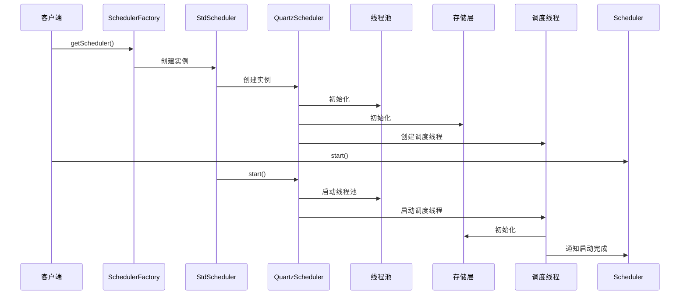
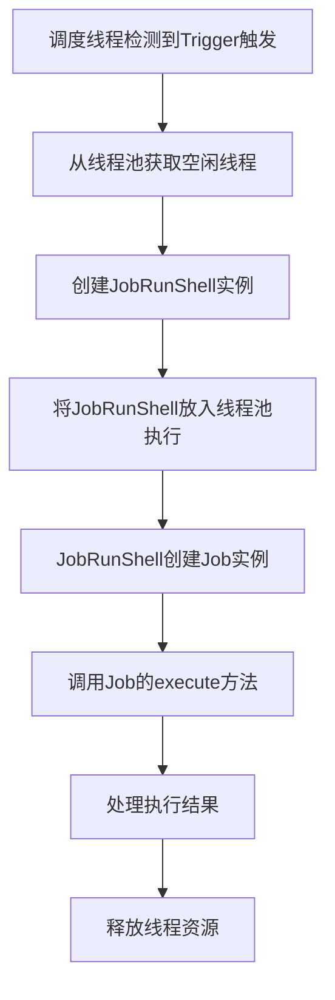
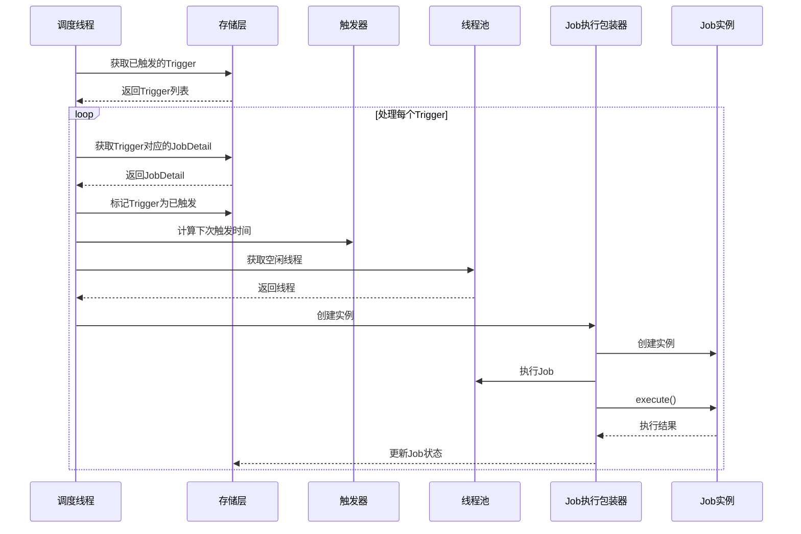

## 简介

Quartz作为一个成熟的开源定时任务调度框架，其内部实现了复杂的调度逻辑和机制。深入分析Quartz的源码，可以帮助我们更好地理解其工作原理，从而在实际应用中更加灵活地使用和扩展Quartz。

本文将对Quartz的核心源码进行深入分析，包括Scheduler的核心实现、Job的执行机制、Trigger的触发逻辑、线程池实现、存储层设计等关键部分，并通过Mermaid图表展示其内部工作流程。

## Quartz核心包结构

Quartz的代码结构清晰，采用模块化设计，主要包含以下几个核心包：

```plaintext
org.quartz
├── impl            # 核心实现类
├── job             # Job相关接口和类
├── trigger         # Trigger相关接口和类
├── scheduler       # Scheduler相关接口和类
├── thread          # 线程池相关实现
├── jobstore        # 存储层相关实现
├── spi             # 服务提供者接口
├── listeners       # 监听器接口和实现
├── plugins         # 插件接口和实现
└── util            # 工具类
```

## Scheduler核心实现

### 1. Scheduler接口

`Scheduler`是Quartz的核心接口，定义了任务调度的所有操作：

```java
public interface Scheduler {
    // 获取调度器名称和实例ID
    String getSchedulerName() throws SchedulerException;
    String getSchedulerInstanceId() throws SchedulerException;
    
    // 启动、暂停和关闭调度器
    void start() throws SchedulerException;
    void standby() throws SchedulerException;
    void shutdown() throws SchedulerException;
    void shutdown(boolean waitForJobsToComplete) throws SchedulerException;
    
    // 任务调度相关方法
    Date scheduleJob(JobDetail jobDetail, Trigger trigger) throws SchedulerException;
    Date scheduleJob(Trigger trigger) throws SchedulerException;
    void scheduleJobs(Map<JobDetail, Set<? extends Trigger>> triggersAndJobs, boolean replace) throws SchedulerException;
    
    // 任务管理相关方法
    void addJob(JobDetail jobDetail, boolean replace) throws SchedulerException;
    void addJob(JobDetail jobDetail, boolean replace, boolean storeNonDurableWhileAwaitingScheduling) throws SchedulerException;
    boolean deleteJob(JobKey jobKey) throws SchedulerException;
    boolean interrupt(JobKey jobKey) throws UnableToInterruptJobException;
    
    // Trigger管理相关方法
    boolean unscheduleJob(TriggerKey triggerKey) throws SchedulerException;
    boolean rescheduleJob(TriggerKey triggerKey, Trigger newTrigger) throws SchedulerException;
    
    // 任务状态管理
    void pauseJob(JobKey jobKey) throws SchedulerException;
    void resumeJob(JobKey jobKey) throws SchedulerException;
    void pauseTrigger(TriggerKey triggerKey) throws SchedulerException;
    void resumeTrigger(TriggerKey triggerKey) throws SchedulerException;
    
    // 获取任务和触发器信息
    JobDetail getJobDetail(JobKey jobKey) throws SchedulerException;
    Trigger getTrigger(TriggerKey triggerKey) throws SchedulerException;
    List<? extends Trigger> getTriggersOfJob(JobKey jobKey) throws SchedulerException;
    
    // 立即执行任务
    void triggerJob(JobKey jobKey) throws SchedulerException;
    void triggerJob(JobKey jobKey, JobDataMap data) throws SchedulerException;
    
    // 其他方法...
}
```

### 2. StdScheduler实现类

`StdScheduler`是`Scheduler`接口的标准实现类，它内部包含一个`QuartzScheduler`实例，真正的调度逻辑由`QuartzScheduler`实现：

```java
public class StdScheduler implements Scheduler {
    private QuartzScheduler sched;
    private SchedulerFactory schedulerFactory;
    
    // 构造函数
    public StdScheduler(QuartzScheduler sched, SchedulerFactory schedulerFactory) {
        this.sched = sched;
        this.schedulerFactory = schedulerFactory;
    }
    
    // 实现Scheduler接口的所有方法，内部调用QuartzScheduler的对应方法
    @Override
    public void start() throws SchedulerException {
        sched.start();
    }
    
    @Override
    public Date scheduleJob(JobDetail jobDetail, Trigger trigger) throws SchedulerException {
        return sched.scheduleJob(jobDetail, trigger);
    }
    
    // 其他方法实现...
}
```

### 3. QuartzScheduler核心实现

`QuartzScheduler`是Quartz调度器的核心实现类，它包含了调度器的所有核心逻辑：

```java
public class QuartzScheduler implements RemotableQuartzScheduler {
    private final SchedulerSignaler signaler;
    private final QuartzSchedulerThread thread;
    private final JobStore jobStore;
    private final ThreadPool threadPool;
    private final List<SchedulerListener> schedulerListeners = new ArrayList<>();
    
    // 构造函数
    public QuartzScheduler(String schedulerName, String schedulerInstanceId,
                           ThreadPool threadPool, JobStore jobStore, Map<String, Object> schedulerContext,
                           String rmiRegistryHost, int rmiRegistryPort, long idleWaitTime,
                           long dbFailureRetryInterval, boolean interruptJobsOnShutdown,
                           boolean interruptJobsOnShutdownWithWait, SchedulerSignalerImpl signaler) {
        this.schedulerName = schedulerName;
        this.schedulerInstanceId = schedulerInstanceId;
        this.threadPool = threadPool;
        this.jobStore = jobStore;
        this.schedulerContext = schedulerContext;
        this.idleWaitTime = idleWaitTime;
        this.dbFailureRetryInterval = dbFailureRetryInterval;
        this.interruptJobsOnShutdown = interruptJobsOnShutdown;
        this.interruptJobsOnShutdownWithWait = interruptJobsOnShutdownWithWait;
        this.signaler = signaler;
        
        // 创建调度器线程
        this.thread = new QuartzSchedulerThread(this, threadPool, jobStore, signaler, idleWaitTime, dbFailureRetryInterval);
        
        // 初始化JobStore
        jobStore.setInstanceId(schedulerInstanceId);
        jobStore.setInstanceName(schedulerName);
        jobStore.setThreadPool(threadPool);
        jobStore.setJobFactory(jobFactory);
        jobStore.setSchedulerName(schedulerName);
    }
    
    // 启动调度器
    public void start() throws SchedulerException {
        synchronized (sigLock) {
            if (started) {
                return;
            }
            
            // 初始化资源
            resources.initialize();
            
            // 启动线程池
            threadPool.start();
            
            // 启动调度器线程
            thread.start();
            
            // 通知监听器
            notifySchedulerListenersStarted();
            
            started = true;
        }
    }
    
    // 调度任务
    public Date scheduleJob(JobDetail jobDetail, Trigger trigger) throws SchedulerException {
        // 验证JobDetail和Trigger
        validateJobDetail(jobDetail);
        validateTrigger(trigger);
        
        // 关联JobDetail和Trigger
        trigger.setJobKey(jobDetail.getKey());
        
        // 存储JobDetail和Trigger
        return resources.getJobStore().storeJobAndTrigger(jobDetail, trigger);
    }
    
    // 其他核心方法...
}
```

## Scheduler启动流程

Scheduler的启动流程是Quartz的核心流程之一，以下是其启动流程的Mermaid图表：



## Job执行机制

### 1. Job接口

`Job`接口是Quartz任务的核心接口，所有的任务都需要实现这个接口：

```java
public interface Job {
    void execute(JobExecutionContext context) throws JobExecutionException;
}
```

### 2. Job创建与执行流程

Job的创建和执行过程由Quartz的核心调度线程和线程池共同完成：



### 3. JobRunShell实现

`JobRunShell`是Job执行的包装类，负责创建Job实例、执行Job、处理异常等：

```java
public class JobRunShell implements Runnable {
    private final QuartzScheduler sched;
    private final JobExecutionContextImpl jec;
    private final TriggerFiredBundle firedBundle;
    
    // 构造函数
    public JobRunShell(QuartzScheduler sched, TriggerFiredBundle bndle) {
        this.sched = sched;
        this.firedBundle = bndle;
        this.jec = new JobExecutionContextImpl(sched, bndle);
    }
    
    // 执行Job
    @Override
    public void run() {
        Job job = null;
        JobDetail jobDetail = firedBundle.getJobDetail();
        
        try {
            // 创建Job实例
            job = sched.getJobFactory().newJob(firedBundle, jec.getScheduler());
            
            // 执行Job
            job.execute(jec);
            
            // 通知监听器Job执行完成
            sched.notifyJobStoreJobComplete(jec, JobExecutionException.successResult());
            
        } catch (JobExecutionException jee) {
            // 处理Job执行异常
            sched.notifyJobStoreJobComplete(jec, jee);
        } catch (Throwable e) {
            // 处理其他异常
            JobExecutionException jee = new JobExecutionException(e);
            sched.notifyJobStoreJobComplete(jec, jee);
        } finally {
            // 清理资源
            jec.setResult(null);
            jec.getTrigger().triggered(jec.getCalendar());
        }
    }
}
```

## Trigger触发机制

### 1. Trigger接口

`Trigger`接口定义了触发器的基本行为：

```java
public interface Trigger extends Serializable, Cloneable, Comparable<Trigger> {
    TriggerKey getKey();
    JobKey getJobKey();
    
    Date getStartTime();
    Date getEndTime();
    Date getNextFireTime();
    Date getPreviousFireTime();
    
    void triggered(Calendar calendar);
    boolean mayFireAgain();
    
    // 其他方法...
}
```

### 2. Trigger触发流程

Trigger的触发流程是Quartz的核心流程之一，以下是其触发流程的Mermaid图表：



### 3. CronTrigger实现

`CronTrigger`是Quartz中最常用的触发器，基于Cron表达式实现复杂的调度规则：

```java
public class CronTriggerImpl extends AbstractTrigger<CronTrigger> implements CronTrigger {
    private CronExpression cronEx = null;
    private TimeZone timeZone = TimeZone.getDefault();
    private String cronExpression = null;
    
    // 计算下次触发时间
    @Override
    public Date getNextFireTime() {
        if (nextFireTime == null) {
            return null;
        }
        
        if (getEndTime() != null && nextFireTime.after(getEndTime())) {
            return null;
        }
        
        return nextFireTime;
    }
    
    // 计算下次触发时间
    protected void computeFirstFireTime(Calendar calendar) {
        nextFireTime = getTimeAfter(new Date(0L));
        if (nextFireTime == null) {
            return;
        }
        
        if (getStartTime() != null && nextFireTime.before(getStartTime())) {
            nextFireTime = getTimeAfter(getStartTime());
        }
        
        if (getEndTime() != null && nextFireTime.after(getEndTime())) {
            nextFireTime = null;
        }
    }
    
    // 获取指定时间之后的下一个触发时间
    @Override
    public Date getTimeAfter(Date afterTime) {
        if (afterTime == null) {
            afterTime = new Date();
        }
        
        if (getStartTime() != null && afterTime.before(getStartTime())) {
            afterTime = getStartTime();
        }
        
        Date pot = cronEx.getNextValidTimeAfter(afterTime);
        
        if (getEndTime() != null && pot != null && pot.after(getEndTime())) {
            return null;
        }
        
        return pot;
    }
    
    // 其他方法...
}
```

## 线程池实现

### 1. ThreadPool接口

`ThreadPool`接口定义了Quartz线程池的基本行为：

```java
public interface ThreadPool {
    void initialize() throws SchedulerConfigException;
    void shutdown(boolean waitForJobsToComplete) throws SchedulerException;
    boolean runInThread(Runnable runnable);
    int blockForAvailableThreads() throws InterruptedException;
    int getPoolSize();
    int getCurrentThreadCount();
    int getCurrentIdleThreadCount();
    long getThreadPoolInUseTimeout();
    void setThreadPoolInUseTimeout(long timeout);
}
```

### 2. SimpleThreadPool实现

`SimpleThreadPool`是Quartz默认的线程池实现，基于简单的线程池模型：

```java
public class SimpleThreadPool implements ThreadPool {
    private int count = 10;
    private int prio = Thread.NORM_PRIORITY;
    private boolean makeThreadsDaemons = false;
    private String threadNamePrefix = "QuartzThread-";
    private List<WorkerThread> workers = new ArrayList<>();
    private LinkedList<WorkerThread> availWorkers = new LinkedList<>();
    private LinkedList<WorkerThread> busyWorkers = new LinkedList<>();
    private boolean handoffPending = false;
    
    // 初始化线程池
    @Override
    public void initialize() throws SchedulerConfigException {
        // 创建工作线程
        for (int i = 0; i < count; i++) {
            WorkerThread wt = new WorkerThread(this, threadNamePrefix + i, prio, makeThreadsDaemons);
            workers.add(wt);
            availWorkers.add(wt);
        }
        
        // 启动工作线程
        for (WorkerThread wt : workers) {
            wt.start();
        }
    }
    
    // 执行任务
    @Override
    public boolean runInThread(Runnable runnable) {
        if (runnable == null) {
            return false;
        }
        
        synchronized (availWorkers) {
            if (availWorkers.isEmpty()) {
                return false;
            }
            
            // 获取空闲线程
            WorkerThread wt = availWorkers.removeFirst();
            busyWorkers.add(wt);
            
            // 分配任务
            wt.run(runnable);
            
            return true;
        }
    }
    
    // 工作线程类
    class WorkerThread extends Thread {
        private final SimpleThreadPool tp;
        private Runnable runnable = null;
        private boolean run = true;
        
        // 构造函数
        public WorkerThread(SimpleThreadPool tp, String name, int prio, boolean daemon) {
            super(tp.group, null, name, 0);
            this.tp = tp;
            setPriority(prio);
            setDaemon(daemon);
        }
        
        // 执行任务
        public void run(Runnable newRunnable) {
            synchronized (this) {
                if (runnable != null) {
                    throw new IllegalStateException("Already running a Runnable!");
                }
                
                runnable = newRunnable;
                notifyAll();
            }
        }
        
        // 线程主方法
        @Override
        public void run() {
            boolean ran = false;
            
            while (run) {
                synchronized (this) {
                    while (runnable == null && run) {
                        try {
                            wait(500);
                        } catch (InterruptedException ignore) {
                        }
                    }
                    
                    if (runnable == null) {
                        continue;
                    }
                }
                
                try {
                    runnable.run();
                    ran = true;
                } catch (Throwable e) {
                    // 处理异常
                } finally {
                    synchronized (tp.availWorkers) {
                        tp.busyWorkers.remove(this);
                        tp.availWorkers.add(this);
                        runnable = null;
                    }
                }
            }
        }
        
        // 其他方法...
    }
    
    // 其他方法...
}
```

## 存储层实现

### 1. JobStore接口

`JobStore`接口定义了Quartz存储层的基本行为：

```java
public interface JobStore extends SchedulerConfigAware {
    void initialize(ClassLoadHelper loadHelper, SchedulerSignaler signaler) throws SchedulerConfigException;
    
    // Job相关方法
    void storeJob(JobDetail newJob, boolean replaceExisting) throws JobPersistenceException;
    JobDetail retrieveJob(JobKey jobKey) throws JobPersistenceException;
    boolean removeJob(JobKey jobKey) throws JobPersistenceException;
    
    // Trigger相关方法
    Date storeTrigger(Trigger newTrigger, boolean replaceExisting) throws JobPersistenceException;
    Trigger retrieveTrigger(TriggerKey triggerKey) throws JobPersistenceException;
    boolean removeTrigger(TriggerKey triggerKey) throws JobPersistenceException;
    
    // 批量操作方法
    Date storeJobAndTrigger(JobDetail newJob, Trigger newTrigger) throws JobPersistenceException;
    List<Trigger> getTriggersForJob(JobKey jobKey) throws JobPersistenceException;
    
    // 调度相关方法
    List<OperableTrigger> acquireNextTriggers(long noLaterThan, int maxCount, long timeWindow) throws JobPersistenceException;
    void releaseAcquiredTrigger(OperableTrigger trigger) throws JobPersistenceException;
    
    // 其他方法...
}
```

### 2. RAMJobStore实现

`RAMJobStore`是Quartz默认的存储实现，将任务和触发器存储在内存中：

```java
public class RAMJobStore implements JobStore {
    private Map<JobKey, JobDetail> jobs = new HashMap<>();
    private Map<TriggerKey, Trigger> triggers = new HashMap<>();
    private Map<JobKey, Set<TriggerKey>> jobTriggers = new HashMap<>();
    private TreeSet<TriggerWrapper> timeTriggers = new TreeSet<>();
    
    // 存储Job
    @Override
    public void storeJob(JobDetail newJob, boolean replaceExisting) throws JobPersistenceException {
        JobKey key = newJob.getKey();
        
        synchronized (lock) {
            if (jobs.containsKey(key)) {
                if (!replaceExisting) {
                    throw new ObjectAlreadyExistsException(newJob);
                }
            }
            
            jobs.put(key, newJob);
        }
    }
    
    // 存储Trigger
    @Override
    public Date storeTrigger(Trigger newTrigger, boolean replaceExisting) throws JobPersistenceException {
        TriggerKey key = newTrigger.getKey();
        JobKey jobKey = newTrigger.getJobKey();
        
        synchronized (lock) {
            if (triggers.containsKey(key)) {
                if (!replaceExisting) {
                    throw new ObjectAlreadyExistsException(newTrigger);
                }
                
                // 移除旧的Trigger
                removeTriggerFromTimeTriggers(triggers.get(key));
            }
            
            // 存储新的Trigger
            triggers.put(key, newTrigger);
            
            // 添加到Job的Trigger列表
            Set<TriggerKey> triggerKeys = jobTriggers.computeIfAbsent(jobKey, k -> new HashSet<>());
            triggerKeys.add(key);
            
            // 添加到时间触发列表
            addTriggerToTimeTriggers(newTrigger);
            
            return newTrigger.getNextFireTime();
        }
    }
    
    // 获取已触发的Trigger
    @Override
    public List<OperableTrigger> acquireNextTriggers(long noLaterThan, int maxCount, long timeWindow) throws JobPersistenceException {
        List<OperableTrigger> result = new ArrayList<>();
        List<TriggerWrapper> acquired = new ArrayList<>();
        
        synchronized (lock) {
            // 获取所有已触发的Trigger
            Date now = new Date();
            Date noLater = new Date(noLaterThan);
            
            Iterator<TriggerWrapper> iter = timeTriggers.iterator();
            while (iter.hasNext() && result.size() < maxCount) {
                TriggerWrapper tw = iter.next();
                OperableTrigger trigger = (OperableTrigger) tw.trigger;
                
                // 检查是否已触发
                if (trigger.getNextFireTime() == null) {
                    iter.remove();
                    continue;
                }
                
                if (trigger.getNextFireTime().after(noLater)) {
                    break;
                }
                
                // 检查Trigger是否有效
                if (!isTriggerValid(trigger)) {
                    iter.remove();
                    continue;
                }
                
                // 标记为已触发
                trigger.triggered(null);
                
                // 更新下次触发时间
                updateTriggerStateInMemory(trigger);
                
                // 添加到结果列表
                result.add(trigger);
                acquired.add(tw);
            }
        }
        
        return result;
    }
    
    // 其他方法...
}
```

## 插件机制

Quartz提供了灵活的插件机制，允许开发者扩展Quartz的功能：

### 1. SchedulerPlugin接口

```java
public interface SchedulerPlugin {
    void initialize(String name, Scheduler scheduler, SchedulerFactory schedulerFactory) throws SchedulerException;
    void start();
    void shutdown();
}
```

### 2. 示例插件实现

```java
public class LoggingPlugin implements SchedulerPlugin {
    private String name;
    private Scheduler scheduler;
    private SchedulerFactory schedulerFactory;
    
    @Override
    public void initialize(String name, Scheduler scheduler, SchedulerFactory schedulerFactory) throws SchedulerException {
        this.name = name;
        this.scheduler = scheduler;
        this.schedulerFactory = schedulerFactory;
        
        // 注册监听器
        scheduler.getListenerManager().addSchedulerListener(new SchedulerListener() {
            @Override
            public void schedulerStarted(Scheduler scheduler) {
                System.out.println("调度器已启动");
            }
            
            @Override
            public void schedulerShutdown(Scheduler scheduler) {
                System.out.println("调度器已关闭");
            }
            
            // 其他监听器方法...
        });
    }
    
    @Override
    public void start() {
        System.out.println("LoggingPlugin已启动");
    }
    
    @Override
    public void shutdown() {
        System.out.println("LoggingPlugin已关闭");
    }
}
```

## 总结

Quartz作为一个成熟的开源定时任务调度框架，其内部实现了复杂而高效的调度机制。通过对Quartz源码的深入分析，我们可以看到：

1. **模块化设计**：Quartz采用清晰的模块化设计，各组件之间职责明确，耦合度低。

2. **线程模型**：Quartz使用调度线程+工作线程池的模型，确保任务能够高效地执行。

3. **存储机制**：Quartz支持多种存储方式，包括内存存储和JDBC存储，满足不同的应用场景。

4. **插件扩展**：Quartz提供了灵活的插件机制，允许开发者扩展其功能。

5. **事件驱动**：Quartz采用事件驱动的设计，通过监听器机制实现组件间的通信。

深入理解Quartz的源码和实现原理，可以帮助我们更好地使用和扩展Quartz，从而在实际应用中构建更加可靠和高效的定时任务系统。
