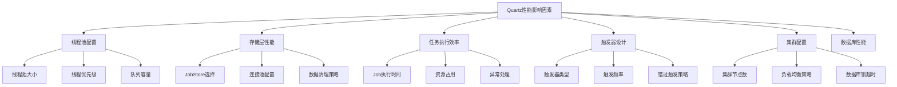
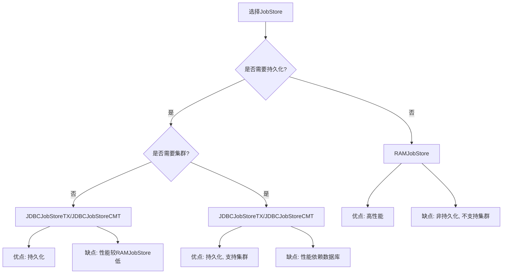
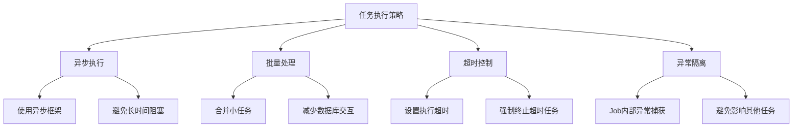
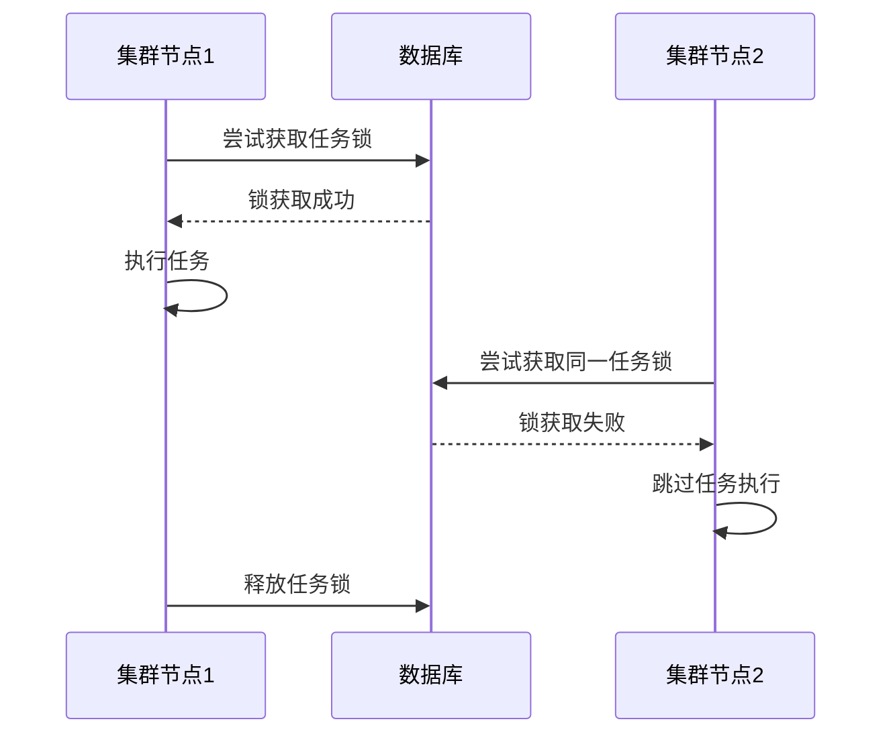
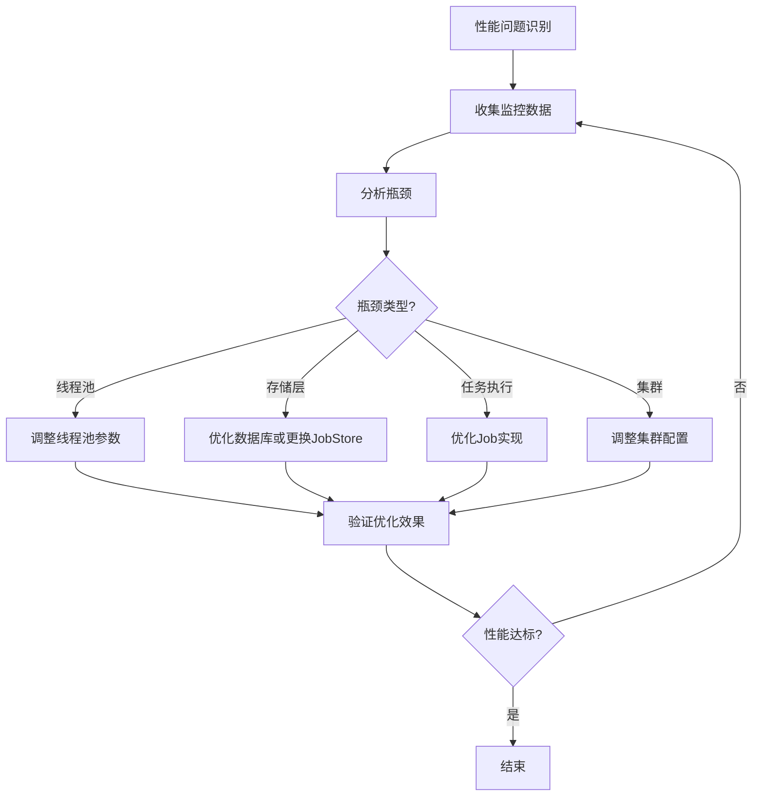

## 简介

Quartz作为一款成熟的任务调度框架，在高并发、大规模任务场景下的性能表现直接影响着系统的稳定性和可靠性。本文将深入探讨Quartz性能优化的核心策略、关键配置参数调优、存储层优化方案以及实际应用中的最佳实践，帮助开发者构建高性能、高可用的任务调度系统。

## Quartz性能影响因素

在进行性能优化之前，我们需要了解影响Quartz性能的关键因素：



## 核心配置参数调优

### 线程池配置优化

线程池是Quartz性能的核心影响因素之一，合理配置线程池参数可以显著提升系统处理能力：

```java
// 线程池配置示例
org.quartz.threadPool.class = org.quartz.simpl.SimpleThreadPool
org.quartz.threadPool.threadCount = 25
org.quartz.threadPool.threadPriority = 5
org.quartz.threadPool.threadsInheritContextClassLoaderOfInitializingThread = true
```

**调优建议：**

| 参数 | 说明 | 调优建议 |
|------|------|----------|
| threadCount | 线程池大小 | 根据任务数量和执行时间调整，建议值：任务数 * (1 + 平均执行时间/间隔时间) |
| threadPriority | 线程优先级 | 一般设置为5（默认值），避免设置过高影响其他系统线程 |
| threadsInheritContextClassLoaderOfInitializingThread | 线程是否继承上下文类加载器 | 设置为true，确保Job能正确加载应用类 |

### Scheduler配置优化

```java
// Scheduler配置示例
org.quartz.scheduler.instanceName = MyScheduler
org.quartz.scheduler.instanceId = AUTO
org.quartz.scheduler.skipUpdateCheck = true
org.quartz.scheduler.batchTriggerAcquisitionMaxCount = 10
org.quartz.scheduler.batchTriggerAcquisitionFireAheadTimeWindow = 5000
```

**关键调优参数：**

| 参数 | 说明 | 调优建议 |
|------|------|----------|
| skipUpdateCheck | 是否跳过版本检查 | 设置为true，避免启动时的网络请求 |
| batchTriggerAcquisitionMaxCount | 批量获取触发器的最大数量 | 根据线程池大小调整，建议为threadCount的2-3倍 |
| batchTriggerAcquisitionFireAheadTimeWindow | 提前触发时间窗口 | 设置为合理值，平衡响应性和系统负载 |

### JobStore配置优化

#### RAMJobStore配置

```java
// RAMJobStore配置示例
org.quartz.jobStore.class = org.quartz.simpl.RAMJobStore
org.quartz.jobStore.misfireThreshold = 60000
```

#### JDBCJobStore配置

```java
// JDBCJobStore配置示例
org.quartz.jobStore.class = org.quartz.impl.jdbcjobstore.JobStoreTX
org.quartz.jobStore.driverDelegateClass = org.quartz.impl.jdbcjobstore.StdJDBCDelegate
org.quartz.jobStore.tablePrefix = QRTZ_
org.quartz.jobStore.isClustered = true
org.quartz.jobStore.clusterCheckinInterval = 20000
org.quartz.jobStore.useProperties = false
org.quartz.jobStore.dataSource = myDS
org.quartz.jobStore.maxMisfiresToHandleAtATime = 10
org.quartz.jobStore.misfireThreshold = 60000
org.quartz.jobStore.txIsolationLevelSerializable = false
```

**JDBCJobStore调优建议：**

| 参数 | 说明 | 调优建议 |
|------|------|----------|
| clusterCheckinInterval | 集群节点检查间隔 | 根据集群规模调整，节点越多间隔应越小 |
| maxMisfiresToHandleAtATime | 每次处理错过触发的最大数量 | 避免一次处理过多影响系统性能 |
| txIsolationLevelSerializable | 事务隔离级别 | 一般设置为false，使用默认隔离级别即可 |

## 存储层优化

### JobStore选择策略



### 数据库优化

#### 连接池配置

```java
// 数据库连接池配置示例
org.quartz.dataSource.myDS.driver = com.mysql.cj.jdbc.Driver
org.quartz.dataSource.myDS.URL = jdbc:mysql://localhost:3306/quartz?useSSL=false&serverTimezone=UTC
org.quartz.dataSource.myDS.user = root
org.quartz.dataSource.myDS.password = password
org.quartz.dataSource.myDS.maxConnections = 50
org.quartz.dataSource.myDS.validationQuery = SELECT 1
```

#### 索引优化

为Quartz表添加合适的索引可以显著提升查询性能：

```sql
-- QRTZ_TRIGGERS表索引优化
CREATE INDEX IDX_QRTZ_T_JOB_GROUP ON QRTZ_TRIGGERS(JOB_GROUP);
CREATE INDEX IDX_QRTZ_T_STATE ON QRTZ_TRIGGERS(TRIGGER_STATE);
CREATE INDEX IDX_QRTZ_T_N_STATE ON QRTZ_TRIGGERS(TRIGGER_NAME, TRIGGER_GROUP, TRIGGER_STATE);
CREATE INDEX IDX_QRTZ_T_N_G_STATE ON QRTZ_TRIGGERS(TRIGGER_GROUP, TRIGGER_STATE);
CREATE INDEX IDX_QRTZ_T_NEXT_FIRE_TIME ON QRTZ_TRIGGERS(NEXT_FIRE_TIME);
CREATE INDEX IDX_QRTZ_T_NFT_ST ON QRTZ_TRIGGERS(NEXT_FIRE_TIME, TRIGGER_STATE);
CREATE INDEX IDX_QRTZ_T_NFT_MISFIRE ON QRTZ_TRIGGERS(NEXT_FIRE_TIME, MISFIRE_INSTR);
CREATE INDEX IDX_QRTZ_T_NFT_ST_MISFIRE ON QRTZ_TRIGGERS(NEXT_FIRE_TIME, TRIGGER_STATE, MISFIRE_INSTR);

-- QRTZ_JOB_DETAILS表索引优化
CREATE INDEX IDX_QRTZ_J_REQ_RECOVERY ON QRTZ_JOB_DETAILS(REQUESTS_RECOVERY);
```

#### 数据清理策略

定期清理历史数据可以保持数据库性能：

```java
// 配置Quartz自动清理
org.quartz.plugin.triggHistory.class = org.quartz.plugins.history.LoggingJobHistoryPlugin
org.quartz.plugin.jobHistory.class = org.quartz.plugins.history.LoggingJobHistoryPlugin
org.quartz.plugin.shutdownHook.class = org.quartz.plugins.management.ShutdownHookPlugin
org.quartz.plugin.shutdownHook.cleanShutdown = true
```

**手动清理示例SQL：**

```sql
-- 清理30天前的任务执行历史
DELETE FROM QRTZ_FIRED_TRIGGERS WHERE FIRED_TIME < UNIX_TIMESTAMP(DATE_SUB(NOW(), INTERVAL 30 DAY)) * 1000;
DELETE FROM QRTZ_JOB_LISTENERS WHERE JOB_NAME NOT IN (SELECT JOB_NAME FROM QRTZ_JOB_DETAILS);
DELETE FROM QRTZ_TRIGGER_LISTENERS WHERE TRIGGER_NAME NOT IN (SELECT TRIGGER_NAME FROM QRTZ_TRIGGERS);
```

## 任务执行优化

### Job实现优化

```java
// 优化前的Job实现
public class InefficientJob implements Job {
    @Override
    public void execute(JobExecutionContext context) throws JobExecutionException {
        // 每次执行都创建新的资源连接
        Connection conn = DriverManager.getConnection("jdbc:mysql://localhost:3306/mydb", "user", "pass");
        // 执行耗时操作
        // ...
        conn.close();
    }
}

// 优化后的Job实现
public class EfficientJob implements Job {
    // 使用连接池
    private static final DataSource dataSource = getDataSource();
    
    @Override
    public void execute(JobExecutionContext context) throws JobExecutionException {
        try (Connection conn = dataSource.getConnection()) {
            // 执行任务逻辑
            // ...
        } catch (SQLException e) {
            throw new JobExecutionException(e);
        }
    }
    
    private static DataSource getDataSource() {
        // 初始化连接池
        // ...
    }
}
```

### 任务执行策略



### 并发控制

```java
// 使用@DisallowConcurrentExecution注解
@DisallowConcurrentExecution
public class NonConcurrentJob implements Job {
    @Override
    public void execute(JobExecutionContext context) throws JobExecutionException {
        // 任务逻辑
    }
}

// 使用@PersistJobDataAfterExecution注解
@PersistJobDataAfterExecution
public class PersistJobDataJob implements Job {
    @Override
    public void execute(JobExecutionContext context) throws JobExecutionException {
        JobDataMap dataMap = context.getJobDetail().getJobDataMap();
        int count = dataMap.getInt("count");
        count++;
        dataMap.put("count", count);
    }
}
```

## 集群环境性能优化

### 集群配置优化

```java
// 集群优化配置
org.quartz.jobStore.isClustered = true
org.quartz.jobStore.clusterCheckinInterval = 20000
org.quartz.jobStore.acquireTriggersWithinLock = true
org.quartz.jobStore.txIsolationLevelSerializable = false
```

### 负载均衡策略

Quartz集群采用数据库锁机制实现任务分配，优化建议：

1. **合理设置集群节点数**：根据任务量和系统资源调整，避免节点过多导致锁竞争加剧
2. **优化数据库性能**：确保数据库能高效处理锁竞争
3. **使用合理的触发器设计**：避免大量任务同时触发

### 避免任务重复执行



## 监控与调优

### Quartz内置监控

Quartz提供了JMX监控支持，可以通过JConsole或VisualVM进行监控：

```java
// 启用JMX监控
org.quartz.scheduler.jmx.export = true
org.quartz.scheduler.jmx.objectName = org.quartz:type=QuartzScheduler,name=MyScheduler
```

### 自定义监控指标

```java
// 自定义JobListener监控任务执行时间
public class PerformanceMonitoringJobListener implements JobListener {
    private static final Logger logger = LoggerFactory.getLogger(PerformanceMonitoringJobListener.class);
    
    @Override
    public String getName() {
        return "PerformanceMonitoringJobListener";
    }
    
    @Override
    public void jobToBeExecuted(JobExecutionContext context) {
        context.put("startTime", System.currentTimeMillis());
    }
    
    @Override
    public void jobWasExecuted(JobExecutionContext context, JobExecutionException jobException) {
        long startTime = (long) context.get("startTime");
        long executionTime = System.currentTimeMillis() - startTime;
        
        logger.info("Job {} executed in {} ms", 
                   context.getJobDetail().getKey(), executionTime);
        
        // 可以将监控数据发送到监控系统
        // metricsRegistry.timer("quartz.job.execution.time").update(executionTime, TimeUnit.MILLISECONDS);
    }
    
    @Override
    public void jobExecutionVetoed(JobExecutionContext context) {
        // 任务执行被否决时的处理
    }
}
```

### 性能调优流程



## 最佳实践

### 任务设计最佳实践

1. **任务粒度适中**：避免任务过大或过小，合理拆分和合并任务
2. **避免长时间运行任务**：将长任务拆分为多个短任务，或使用异步执行
3. **任务幂等性设计**：确保任务重复执行不会产生副作用
4. **合理设置触发频率**：避免过于频繁的任务触发导致系统负载过高

### 配置管理最佳实践

1. **使用外部化配置**：将Quartz配置与应用代码分离，便于不同环境调整
2. **版本控制配置文件**：确保配置变更可追踪
3. **定期备份配置**：避免配置丢失导致系统故障

### 部署最佳实践

1. **避免单点故障**：使用Quartz集群部署
2. **资源隔离**：将Quartz服务与业务服务部署在不同的服务器或容器中
3. **环境一致性**：确保开发、测试、生产环境的Quartz配置保持一致

### 运维最佳实践

1. **定期监控**：建立完善的监控体系，及时发现性能问题
2. **日志管理**：合理配置日志级别，保留关键操作日志
3. **定期维护**：定期清理历史数据，优化数据库性能
4. **应急预案**：制定Quartz故障应急预案，确保快速恢复

## 总结

Quartz性能优化是一个系统性工程，需要从多个维度进行考虑和实践。本文介绍了Quartz性能优化的核心策略，包括线程池配置调优、存储层优化、任务执行优化、集群环境优化等方面，并提供了详细的配置示例和最佳实践。

在实际应用中，开发者应根据系统的具体需求和负载特点，选择合适的优化策略，持续监控和调优Quartz性能，以确保任务调度系统的高效稳定运行。

通过合理的性能优化，Quartz可以轻松应对大规模、高并发的任务调度需求，为企业级应用提供可靠的任务调度支持。
