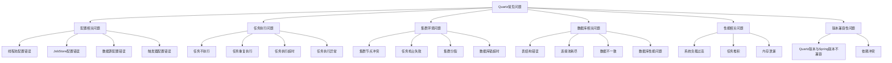

## 简介

在使用Quartz进行任务调度的过程中，开发者可能会遇到各种问题，如任务不执行、执行异常、集群故障等。本文将详细介绍Quartz的常见问题、原因分析和解决方案，并提供问题排查的通用方法，帮助开发者快速定位和解决问题。

## 常见问题分类



## 配置相关问题及解决方案

### 线程池配置错误

**问题现象：**

- 任务执行延迟严重
- 任务堆积不执行
- 系统资源占用过高

**常见原因：**

- 线程池大小设置不合理
- 线程优先级设置过高
- 线程上下文类加载器配置错误

**解决方案：**

```java
// 正确的线程池配置
org.quartz.threadPool.class = org.quartz.simpl.SimpleThreadPool
org.quartz.threadPool.threadCount = 10  // 根据系统资源和任务量调整
org.quartz.threadPool.threadPriority = 5  // 一般设置为5（默认值）
org.quartz.threadPool.threadsInheritContextClassLoaderOfInitializingThread = true
```

**调优建议：**

- 线程数一般设置为：CPU核心数 * 2 + 磁盘数
- 避免将线程优先级设置过高，防止影响系统其他线程
- 确保线程能正确加载应用类

### JobStore配置错误

**问题现象：**

- 任务无法持久化
- 集群节点无法正常通信
- 系统启动失败

**常见原因：**

- JobStore类配置错误
- 数据库连接配置错误
- 集群配置错误

**解决方案：**

```java
// RAMJobStore配置（非持久化、非集群）
org.quartz.jobStore.class = org.quartz.simpl.RAMJobStore

// JDBCJobStore配置（持久化、支持集群）
org.quartz.jobStore.class = org.quartz.impl.jdbcjobstore.JobStoreTX
org.quartz.jobStore.driverDelegateClass = org.quartz.impl.jdbcjobstore.StdJDBCDelegate
org.quartz.jobStore.tablePrefix = QRTZ_
org.quartz.jobStore.isClustered = true
org.quartz.jobStore.dataSource = myDS
```

**注意事项：**

- 根据实际需求选择合适的JobStore
- 确保数据库驱动与JDBCJobStore兼容
- 集群环境下必须使用JDBCJobStore

### 数据源配置错误

**问题现象：**

- Quartz无法连接数据库
- 任务调度失败
- 系统启动异常

**常见原因：**

- 数据库URL错误
- 用户名/密码错误
- 连接池配置不合理
- 数据库驱动缺失

**解决方案：**

```java
// 数据源配置示例
org.quartz.dataSource.myDS.driver = com.mysql.cj.jdbc.Driver
org.quartz.dataSource.myDS.URL = jdbc:mysql://localhost:3306/quartz?useSSL=false&serverTimezone=UTC
org.quartz.dataSource.myDS.user = root
org.quartz.dataSource.myDS.password = password
org.quartz.dataSource.myDS.maxConnections = 30
org.quartz.dataSource.myDS.validationQuery = SELECT 1
```

**检查步骤：**

1. 验证数据库URL格式是否正确
2. 检查用户名和密码是否正确
3. 确保数据库驱动已添加到classpath
4. 测试数据库连接是否正常

## 任务执行相关问题及解决方案

### 任务不执行

**问题现象：**

- 触发器已配置但任务未执行
- 任务执行日志缺失
- Quartz监控显示任务未触发

**常见原因：**

1. 触发器状态错误
2. 任务类配置错误
3. 线程池满
4. 错过触发时间策略问题
5. Scheduler未启动

**排查步骤与解决方案：**

```mermaid
flowchart TD
    A[任务不执行] --> B{检查Scheduler状态}
    B -->|未启动| B1[调用scheduler.start()]
    B -->|已启动| C{检查触发器状态}
    
    C -->|PAUSED| C1[调用trigger.resume()]
    C -->|ERROR| C2[检查触发器配置]
    C -->|正常| D{检查线程池状态}
    
    D -->|已满| D1[增加线程池大小或优化任务执行时间]
    D -->|未满| E{检查任务类}
    
    E -->|配置错误| E1[修正任务类路径]
    E -->|正常| F{检查错过触发策略}
    
    F -->|忽略| F1[调整misfireThreshold或修改策略]
    F -->|正常| G{检查任务逻辑}
    
    G -->|有异常| G1[修复任务中的异常]
    G -->|正常| H[其他原因]
```

**代码示例 - 检查并修复触发器状态：**

```java
// 获取触发器状态
TriggerState triggerState = scheduler.getTriggerState(triggerKey);

// 如果触发器暂停，则恢复
if (TriggerState.PAUSED.equals(triggerState)) {
    scheduler.resumeTrigger(triggerKey);
}

// 如果触发器错误，则重新创建
if (TriggerState.ERROR.equals(triggerState)) {
    scheduler.unscheduleJob(triggerKey);
    scheduler.scheduleJob(jobDetail, trigger);
}
```

### 任务重复执行

**问题现象：**

- 同一任务在同一时间点多次执行
- 集群环境下多个节点同时执行同一任务
- 任务执行次数超过预期

**常见原因：**

1. 集群环境下数据库锁机制问题
2. Job未实现@DisallowConcurrentExecution注解
3. 任务执行时间超过触发间隔
4. 系统时间同步问题

**解决方案：**

**1. 单机环境避免并发执行：**

```java
// 使用@DisallowConcurrentExecution注解防止任务并发执行
@DisallowConcurrentExecution
public class NonConcurrentJob implements Job {
    @Override
    public void execute(JobExecutionContext context) throws JobExecutionException {
        // 任务逻辑
    }
}
```

**2. 集群环境避免重复执行：**

```java
// 确保使用JDBCJobStore
org.quartz.jobStore.class = org.quartz.impl.jdbcjobstore.JobStoreTX
// 启用集群模式
org.quartz.jobStore.isClustered = true
// 合理设置集群检查间隔
org.quartz.jobStore.clusterCheckinInterval = 20000
// 设置数据库锁超时时间
org.quartz.jobStore.lockHandler.class = org.quartz.impl.jdbcjobstore.StdRowLockSemaphore
org.quartz.jobStore.txIsolationLevelSerializable = true
```

**3. 修正系统时间：**

- 确保集群所有节点的系统时间同步
- 使用NTP服务同步时间

### 任务执行超时

**问题现象：**

- 任务执行时间过长
- 占用系统资源
- 影响其他任务执行

**常见原因：**

- 任务逻辑过于复杂
- 外部资源响应缓慢
- 死锁或资源竞争
- 未设置任务执行超时

**解决方案：**

**1. 设置任务执行超时：**

```java
// 使用JobExecutionContext设置任务执行超时
public class TimeoutJob implements Job {
    @Override
    public void execute(JobExecutionContext context) throws JobExecutionException {
        // 设置任务执行超时时间为30秒
        context.getScheduler().getContext().put("JOB_TIMEOUT", 30000L);
        
        // 任务逻辑...
    }
}

// 在SchedulerListener中监控任务执行时间
public class TimeoutMonitoringListener implements SchedulerListener {
    @Override
    public void jobToBeExecuted(JobExecutionContext context) {
        // 记录任务开始时间
        context.put("START_TIME", System.currentTimeMillis());
    }
    
    @Override
    public void jobWasExecuted(JobExecutionContext context, JobExecutionException jobException) {
        long startTime = (long) context.get("START_TIME");
        long executionTime = System.currentTimeMillis() - startTime;
        Long timeout = (Long) context.getScheduler().getContext().get("JOB_TIMEOUT");
        
        if (timeout != null && executionTime > timeout) {
            // 记录超时日志或发送告警
            logger.warn("Job {} executed in {} ms, exceeded timeout of {} ms", 
                       context.getJobDetail().getKey(), executionTime, timeout);
        }
    }
    
    // 其他方法实现...
}
```

**2. 优化任务逻辑：**

- 将长任务拆分为多个短任务
- 使用异步执行耗时操作
- 增加超时重试机制
- 优化外部资源调用

## 集群环境相关问题及解决方案

### 集群节点冲突

**问题现象：**

- 集群节点无法正常加入
- 节点间通信异常
- 任务调度混乱

**常见原因：**

- 集群配置错误
- 数据库连接问题
- 节点ID冲突
- 网络问题

**解决方案：**

**1. 检查集群配置：**

```java
// 正确的集群配置
org.quartz.scheduler.instanceName = MyClusterScheduler
org.quartz.scheduler.instanceId = AUTO  // 自动生成节点ID
org.quartz.jobStore.isClustered = true
org.quartz.jobStore.clusterCheckinInterval = 20000
org.quartz.jobStore.dataSource = myDS
```

**2. 确保所有节点使用相同的配置：**

- instanceName必须相同
- instanceId设置为AUTO或唯一值
- 所有节点指向同一数据库

**3. 检查网络连接：**

- 确保所有节点可以访问共享数据库
- 检查防火墙设置

### 数据库锁超时

**问题现象：**

- 任务执行失败
- 集群节点频繁重试
- 数据库连接数激增

**常见原因：**

- 任务执行时间过长
- 数据库性能问题
- 锁超时时间设置过短
- 并发任务过多

**解决方案：**

**1. 调整锁超时时间：**

```java
// 设置锁超时时间为30秒
org.quartz.jobStore.lockHandler.class = org.quartz.impl.jdbcjobstore.StdRowLockSemaphore
org.quartz.jobStore.lockHandler.lockTimeout = 30000
```

**2. 优化任务执行时间：**

- 将长任务拆分为短任务
- 减少任务执行时间

**3. 优化数据库性能：**

- 增加数据库连接池大小
- 优化SQL查询
- 添加适当索引

### 集群分裂

**问题现象：**

- 集群节点分为多个独立的子集群
- 相同任务在不同子集群中重复执行
- 系统不稳定

**常见原因：**

- 数据库连接中断
- 网络分区
- 节点配置不一致

**解决方案：**

**1. 确保数据库高可用：**

- 使用数据库集群
- 配置数据库连接池的重连机制

**2. 网络稳定性保障：**

- 使用可靠的网络设备
- 配置网络监控

**3. 定期检查集群状态：**

```java
// 检查集群节点状态
SchedulerMetaData metaData = scheduler.getMetaData();
logger.info("Cluster nodes count: {}", metaData.getNumberOfJobsExecuted());
logger.info("Current node id: {}", scheduler.getSchedulerInstanceId());
```

## 数据库相关问题及解决方案

### 表结构错误

**问题现象：**

- 系统启动失败
- 任务调度异常
- 数据库操作错误

**常见原因：**

- 表结构版本不匹配
- 缺少必要的表或字段
- 索引缺失

**解决方案：**

**1. 使用正确的表结构脚本：**

```bash
# 从Quartz发行包中获取对应版本的表结构脚本
# 例如：quartz-2.3.2/docs/dbTables/tables_mysql.sql
```

**2. 检查表结构完整性：**

```sql
-- 检查必要的表是否存在
SELECT COUNT(*) FROM information_schema.TABLES 
WHERE TABLE_SCHEMA = 'quartz' 
AND TABLE_NAME LIKE 'QRTZ_%';

-- 检查表字段是否完整
DESCRIBE QRTZ_JOB_DETAILS;
DESCRIBE QRTZ_TRIGGERS;
```

**3. 添加必要的索引：**

```sql
-- 添加QRTZ_TRIGGERS表索引
CREATE INDEX IDX_QRTZ_T_NEXT_FIRE_TIME ON QRTZ_TRIGGERS(NEXT_FIRE_TIME);
CREATE INDEX IDX_QRTZ_T_STATE ON QRTZ_TRIGGERS(TRIGGER_STATE);
```

### 数据库连接池耗尽

**问题现象：**

- 任务执行失败
- 系统响应缓慢
- 数据库连接超时

**常见原因：**

- 连接池配置过小
- 连接未正确关闭
- 任务执行时间过长

**解决方案：**

**1. 调整连接池配置：**

```java
// 增加连接池大小
org.quartz.dataSource.myDS.maxConnections = 50
// 设置连接超时
org.quartz.dataSource.myDS.connectionTimeout = 30000
// 设置验证查询
org.quartz.dataSource.myDS.validationQuery = SELECT 1
```

**2. 确保连接正确关闭：**

```java
// 使用try-with-resources确保连接关闭
public class DatabaseJob implements Job {
    @Override
    public void execute(JobExecutionContext context) throws JobExecutionException {
        try (Connection conn = dataSource.getConnection();
             Statement stmt = conn.createStatement();
             ResultSet rs = stmt.executeQuery("SELECT * FROM my_table")) {
            // 处理结果集
        } catch (SQLException e) {
            throw new JobExecutionException(e);
        }
    }
}
```

**3. 监控连接池状态：**

```java
// 监控连接池状态
public class ConnectionPoolMonitor implements Job {
    @Override
    public void execute(JobExecutionContext context) throws JobExecutionException {
        DataSource dataSource = (DataSource) context.getScheduler().getContext().get("dataSource");
        
        if (dataSource instanceof HikariDataSource) {
            HikariDataSource hikariDS = (HikariDataSource) dataSource;
            logger.info("Connection pool stats - Active: {}, Idle: {}, Total: {}",
                      hikariDS.getHikariPoolMXBean().getActiveConnections(),
                      hikariDS.getHikariPoolMXBean().getIdleConnections(),
                      hikariDS.getHikariPoolMXBean().getTotalConnections());
        }
    }
}
```

## 性能相关问题及解决方案

### 系统负载过高

**问题现象：**

- CPU使用率高
- 内存占用大
- 系统响应缓慢

**常见原因：**

- 任务过多或触发频率过高
- 任务执行时间过长
- 线程池配置不合理
- 内存泄漏

**解决方案：**

**1. 优化任务调度频率：**

- 减少不必要的任务
- 调整任务触发频率
- 合并相似任务

**2. 优化线程池配置：**

- 合理设置线程池大小
- 避免线程阻塞
- 使用异步执行

**3. 内存泄漏排查：**

```java
// 使用WeakReference避免内存泄漏
public class MemorySafeJob implements Job {
    private static final WeakHashMap<String, Object> cache = new WeakHashMap<>();
    
    @Override
    public void execute(JobExecutionContext context) throws JobExecutionException {
        // 使用WeakHashMap存储临时对象
        cache.put("tempData", new Object());
        
        // 任务逻辑...
    }
}
```

### 任务堆积

**问题现象：**

- 任务执行延迟
- 触发时间与实际执行时间差距大
- 线程池满

**常见原因：**

- 任务执行时间超过触发间隔
- 线程池大小不足
- 任务调度频率过高

**解决方案：**

**1. 增加线程池大小：**

```java
org.quartz.threadPool.threadCount = 20  // 根据实际情况调整
```

**2. 优化任务执行时间：**

- 减少任务执行时间
- 使用异步执行
- 拆分长任务

**3. 调整任务调度策略：**

```java
// 使用WithMisfireHandlingInstructionIgnoreMisfires策略
Trigger trigger = TriggerBuilder.newTrigger()
    .withIdentity("trigger1", "group1")
    .withSchedule(SimpleScheduleBuilder.simpleSchedule()
        .withIntervalInSeconds(5)
        .repeatForever()
        .withMisfireHandlingInstructionIgnoreMisfires())
    .build();
```

## 排查问题的通用方法

### 日志分析

**配置Quartz详细日志：**

```xml
<!-- Logback配置示例 -->
<configuration>
    <appender name="CONSOLE" class="ch.qos.logback.core.ConsoleAppender">
        <encoder>
            <pattern>%d{HH:mm:ss.SSS} [%thread] %-5level %logger{36} - %msg%n</pattern>
        </encoder>
    </appender>
    
    <!-- 设置Quartz日志级别为DEBUG -->
    <logger name="org.quartz" level="DEBUG" additivity="false">
        <appender-ref ref="CONSOLE" />
    </logger>
    
    <root level="INFO">
        <appender-ref ref="CONSOLE" />
    </root>
</configuration>
```

**关键日志分析点：**

- Scheduler启动日志
- 触发器触发日志
- 任务执行日志
- 集群节点通信日志
- 数据库操作日志

### 使用JMX监控

**启用JMX监控：**

```java
// 启用JMX监控
org.quartz.scheduler.jmx.export = true
```

**使用JConsole监控：**

- 连接到应用进程
- 导航到org.quartz包
- 查看Scheduler、ThreadPool、JobStore等MBean的属性和操作

### 调试模式

**使用断点调试：**

- 在Scheduler启动处设置断点
- 在任务execute方法处设置断点
- 观察任务执行流程

**使用远程调试：**

```bash
# 启动应用时开启远程调试
java -agentlib:jdwp=transport=dt_socket,server=y,suspend=n,address=5005 -jar myapp.jar
```

## 总结

Quartz作为一款功能强大的任务调度框架，在使用过程中可能会遇到各种问题。本文详细介绍了Quartz的常见问题、原因分析和解决方案，包括配置问题、任务执行问题、集群环境问题、数据库问题和性能问题等。

在实际应用中，建议开发者：

1. **熟悉Quartz核心概念和配置**：深入理解Quartz的工作原理和配置选项
2. **合理设计任务**：确保任务粒度适中、执行时间合理
3. **配置合适的监控**：启用日志和JMX监控，及时发现问题
4. **定期维护**：清理历史数据、优化配置、更新版本
5. **建立完善的故障处理机制**：制定应急预案，快速响应和解决问题

通过掌握这些常见问题的解决方案和排查方法，开发者可以更加高效地使用Quartz，构建稳定、可靠的任务调度系统。
