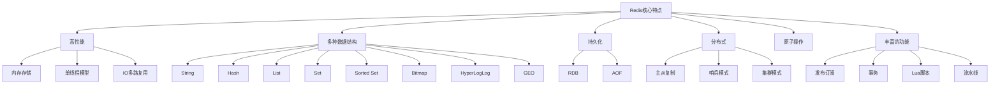
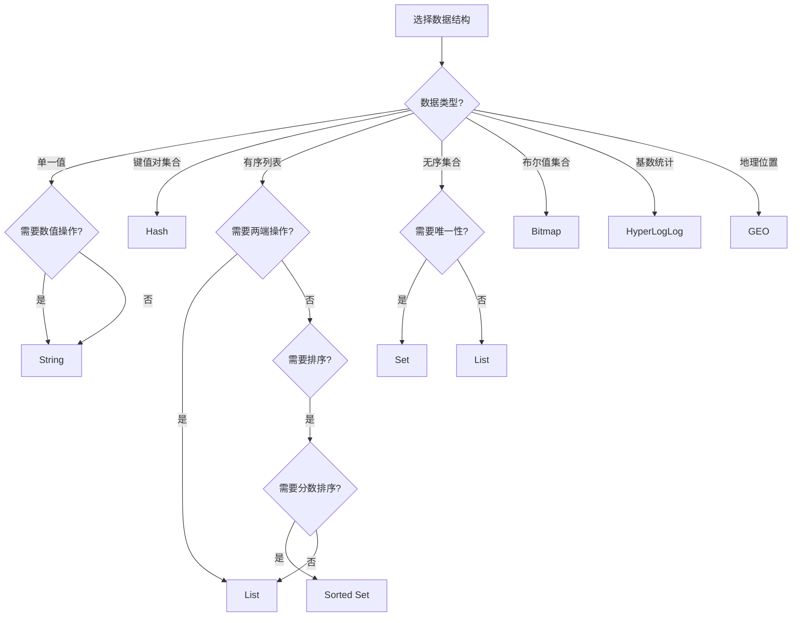

## 简介

Redis（Remote Dictionary Server）是一个开源的内存数据结构存储系统，它可以用作数据库、缓存和消息中间件。Redis支持多种数据结构，具有高性能、持久化、分布式等特性，被广泛应用于Web应用、移动应用、游戏等领域。

本文将详细介绍Redis的核心概念、支持的数据结构以及它们的使用场景，帮助读者快速入门Redis。

## Redis核心概念

### Redis的特点

Redis具有以下主要特点：



### Redis的应用场景

Redis在实际应用中有广泛的使用场景：

| 应用场景 | 说明 |
|---------|------|
| 缓存系统 | 作为缓存层减轻数据库压力，提高系统性能 |
| 会话存储 | 存储用户会话信息，支持分布式系统中的会话共享 |
| 消息队列 | 通过List或Pub/Sub实现简单的消息队列功能 |
| 计数器 | 实现页面访问量、点赞数等计数功能 |
| 排行榜 | 使用Sorted Set实现实时排行榜 |
| 分布式锁 | 实现分布式环境下的资源互斥访问 |
| 地理位置 | 使用GEO数据结构实现附近的人、商家等功能 |
| 实时分析 | 使用HyperLogLog进行基数统计，如独立访客数统计 |

## Redis数据结构详解

### String（字符串）

String是Redis最基本的数据结构，它可以存储字符串、整数或浮点数。

**底层实现：**

- 简单动态字符串（SDS）
- 当存储的是整数时，会使用long类型存储

**常用命令：**

```bash
# 设置值
SET key value [EX seconds] [PX milliseconds] [NX|XX]

# 获取值
GET key

# 自增
INCR key

# 自减
DECR key

# 自增指定步长
INCRBY key increment

# 自减指定步长
DECRBY key decrement

# 追加字符串
APPEND key value

# 获取字符串长度
STRLEN key

# 设置并返回旧值
GETSET key value
```

**使用场景：**

- 存储用户信息JSON字符串
- 计数器（如文章阅读量、点赞数）
- 分布式ID生成

**代码示例：**

```java
// 使用Jedis操作String
Jedis jedis = new Jedis("localhost", 6379);

// 设置用户信息
String userJson = "{\"id\":1,\"name\":\"张三\",\"age\":30}";
jedis.set("user:1", userJson);

// 获取用户信息
String storedUser = jedis.get("user:1");
System.out.println("用户信息: " + storedUser);

// 文章阅读量统计
jedis.incr("article:read:123");
String readCount = jedis.get("article:read:123");
System.out.println("文章阅读量: " + readCount);

jedis.close();
```

### Hash（哈希）

Hash是一个键值对集合，适合存储对象类型的数据。

**底层实现：**

- 压缩列表（ziplist）：当元素数量少且值较小时使用
- 哈希表（hashtable）：当元素数量或值大小超过阈值时使用

**常用命令：**

```bash
# 设置字段值
HSET key field value

# 获取字段值
HGET key field

# 获取所有字段和值
HGETALL key

# 获取所有字段
HKEYS key

# 获取所有值
HVALS key

# 检查字段是否存在
HEXISTS key field

# 删除字段
HDEL key field [field ...]

# 获取字段数量
HLEN key

# 自增指定步长
HINCRBY key field increment
```

**使用场景：**

- 存储用户信息、商品信息等对象数据
- 缓存数据库表中的行数据
- 统计网站不同页面的访问量

**代码示例：**

```java
// 使用Jedis操作Hash
Jedis jedis = new Jedis("localhost", 6379);

// 存储用户信息
jedis.hset("user:2", "id", "2");
jedis.hset("user:2", "name", "李四");
jedis.hset("user:2", "age", "28");
jedis.hset("user:2", "email", "lisi@example.com");

// 获取用户所有信息
Map<String, String> user = jedis.hgetAll("user:2");
System.out.println("用户信息: " + user);

// 获取用户姓名
String userName = jedis.hget("user:2", "name");
System.out.println("用户姓名: " + userName);

// 用户年龄增加1
jedis.hincrBy("user:2", "age", 1);
System.out.println("更新后年龄: " + jedis.hget("user:2", "age"));

jedis.close();
```

### List（列表）

List是一个有序的字符串列表，可以在列表的两端进行插入和删除操作。

**底层实现：**

- 压缩列表（ziplist）：当元素数量少且值较小时使用
- 双向链表（linkedlist）：当元素数量或值大小超过阈值时使用

**常用命令：**

```bash
# 从列表左侧添加元素
LPUSH key value [value ...]

# 从列表右侧添加元素
RPUSH key value [value ...]

# 从列表左侧弹出元素
LPOP key

# 从列表右侧弹出元素
RPOP key

# 获取列表指定范围的元素
LRANGE key start stop

# 获取列表长度
LLEN key

# 移除列表中指定数量的指定值
LREM key count value

# 获取列表指定索引的元素
LINDEX key index

# 设置列表指定索引的元素
LSET key index value

# 阻塞式弹出元素
BLPOP key [key ...] timeout
BRPOP key [key ...] timeout
```

**使用场景：**

- 消息队列（如任务队列）
- 最新消息展示
- 商品评论列表
- 栈和队列数据结构

**代码示例：**

```java
// 使用Jedis操作List
Jedis jedis = new Jedis("localhost", 6379);

// 模拟消息队列
String queueName = "task:queue";

// 生产者：添加任务
jedis.lpush(queueName, "task1", "task2", "task3");
System.out.println("任务队列长度: " + jedis.llen(queueName));

// 消费者：获取并处理任务
while (true) {
    List<String> tasks = jedis.brpop(0, queueName);
    if (tasks != null) {
        String queue = tasks.get(0);
        String task = tasks.get(1);
        System.out.println("处理任务: " + task);
        // 模拟任务处理
        Thread.sleep(1000);
    }
}

jedis.close();
```

### Set（集合）

Set是一个无序的字符串集合，不允许重复元素。

**底层实现：**

- 整数集合（intset）：当元素都是整数且数量较少时使用
- 哈希表（hashtable）：其他情况使用

**常用命令：**

```bash
# 添加元素
SADD key member [member ...]

# 获取所有元素
SMEMBERS key

# 检查元素是否存在
SISMEMBER key member

# 删除元素
SREM key member [member ...]

# 获取集合大小
SCARD key

# 随机获取元素
SRANDMEMBER key [count]

# 随机删除并返回元素
SPOP key [count]

# 集合交集
SINTER key [key ...]

# 集合并集
SUNION key [key ...]

# 集合差集
SDIFF key [key ...]

# 将交集结果存储到新集合
SINTERSTORE destination key [key ...]
```

**使用场景：**

- 存储用户标签
- 好友关系管理（如共同好友）
- 抽奖活动
- 去重功能

**代码示例：**

```java
// 使用Jedis操作Set
Jedis jedis = new Jedis("localhost", 6379);

// 存储用户标签
jedis.sadd("user:tags:1", "java", "redis", "spring");
jedis.sadd("user:tags:2", "python", "redis", "django");

// 获取用户所有标签
Set<String> user1Tags = jedis.smembers("user:tags:1");
System.out.println("用户1的标签: " + user1Tags);

// 检查用户是否有某个标签
boolean hasJavaTag = jedis.sismember("user:tags:1", "java");
System.out.println("用户1有java标签: " + hasJavaTag);

// 获取两个用户的共同标签
Set<String> commonTags = jedis.sinter("user:tags:1", "user:tags:2");
System.out.println("共同标签: " + commonTags);

// 抽奖功能：随机抽取2个用户
jedis.sadd("lottery:users", "user1", "user2", "user3", "user4", "user5");
Set<String> winners = jedis.spop("lottery:users", 2);
System.out.println("抽奖 winners: " + winners);

jedis.close();
```

### Sorted Set（有序集合）

Sorted Set是一个有序的字符串集合，每个元素都关联一个分数（score），用于排序。

**底层实现：**

- 压缩列表（ziplist）：当元素数量少且值较小时使用
- 跳跃表（skiplist）+ 哈希表：其他情况使用

**常用命令：**

```bash
# 添加元素
ZADD key score member [score member ...]

# 获取指定范围的元素（升序）
ZRANGE key start stop [WITHSCORES]

# 获取指定范围的元素（降序）
ZREVRANGE key start stop [WITHSCORES]

# 获取指定分数范围的元素
ZRANGEBYSCORE key min max [WITHSCORES] [LIMIT offset count]

# 获取元素的分数
ZSCORE key member

# 增加元素的分数
ZINCRBY key increment member

# 获取元素的排名（升序，从0开始）
ZRANK key member

# 获取元素的排名（降序，从0开始）
ZREVRANK key member

# 获取集合大小
ZCARD key

# 删除元素
ZREM key member [member ...]

# 计算交集
ZINTERSTORE destination numkeys key [key ...] [WEIGHTS weight [weight ...]] [AGGREGATE SUM|MIN|MAX]

# 计算并集
ZUNIONSTORE destination numkeys key [key ...] [WEIGHTS weight [weight ...]] [AGGREGATE SUM|MIN|MAX]
```

**使用场景：**

- 实时排行榜（如游戏得分排名、商品销量排名）
- 带权重的消息队列
- 范围查询（如成绩在80-90分之间的学生）
- 延迟队列

**代码示例：**

```java
// 使用Jedis操作Sorted Set
Jedis jedis = new Jedis("localhost", 6379);

// 模拟游戏排行榜
String leaderboard = "game:leaderboard";

// 添加玩家分数
jedis.zadd(leaderboard, 1000, "player1");
jedis.zadd(leaderboard, 1500, "player2");
jedis.zadd(leaderboard, 800, "player3");
jedis.zadd(leaderboard, 2000, "player4");

// 获取排行榜前三名（降序）
Set<String> top3 = jedis.zrevrange(leaderboard, 0, 2);
System.out.println("排行榜前三名: " + top3);

// 获取排行榜前三名，包含分数
Set<Tuple> top3WithScores = jedis.zrevrangeWithScores(leaderboard, 0, 2);
for (Tuple tuple : top3WithScores) {
    System.out.println("玩家: " + tuple.getElement() + ", 分数: " + tuple.getScore());
}

// 玩家1分数增加200
jedis.zincrby(leaderboard, 200, "player1");
System.out.println("player1新分数: " + jedis.zscore(leaderboard, "player1"));

// 获取player1的排名
long rank = jedis.zrevrank(leaderboard, "player1") + 1; // 排名从0开始，加1显示
System.out.println("player1排名: " + rank);

jedis.close();
```

### 其他数据结构

除了上述五种基本数据结构，Redis还支持以下特殊数据结构：

#### Bitmap（位图）

Bitmap是一种基于String实现的位操作数据结构，适合存储布尔值。

**常用命令：**

- SETBIT：设置位的值
- GETBIT：获取位的值
- BITCOUNT：统计值为1的位的数量
- BITOP：对多个位图进行位运算

**使用场景：**

- 用户签到统计
- 活跃用户统计
- 权限控制

#### HyperLogLog（基数统计）

HyperLogLog是一种用于基数统计的数据结构，能够以极小的空间占用统计大量数据的基数。

**常用命令：**

- PFADD：添加元素
- PFCOUNT：获取基数估计值
- PFMERGE：合并多个HyperLogLog

**使用场景：**

- 独立访客（UV）统计
- 页面浏览者数量统计
- 在线用户数量统计

#### GEO（地理位置）

GEO是一种用于存储和查询地理位置数据的数据结构。

**常用命令：**

- GEOADD：添加地理位置
- GEODIST：计算两个位置之间的距离
- GEORADIUS：根据给定位置和半径查询地理位置
- GEORADIUSBYMEMBER：根据给定成员和半径查询地理位置

**使用场景：**

- 附近的人/商家查询
- 地理位置推荐
- 轨迹追踪

## Redis数据结构选择指南

选择合适的数据结构对于充分发挥Redis的性能至关重要。以下是数据结构选择的一般原则：



## 总结

本文详细介绍了Redis的核心概念和支持的数据结构，包括String、Hash、List、Set、Sorted Set以及其他特殊数据结构。每种数据结构都有其特定的底层实现和适用场景，选择合适的数据结构对于充分发挥Redis的性能至关重要。

在实际应用中，我们需要根据业务需求和数据特性选择合适的数据结构，并结合Redis的其他特性（如持久化、分布式等）构建高性能、可靠的应用系统。

后续文章将继续深入探讨Redis的架构原理、持久化机制、分布式部署以及与Spring Boot的整合等内容。
