## 1. 简介

Redis（Remote Dictionary Server）是一个开源的内存数据结构存储系统，它支持多种数据结构，提供了丰富的功能和高性能的访问速度。理解Redis的架构原理和实现机制，对于正确使用Redis、优化Redis性能以及解决实际应用中的问题至关重要。

本文将深入分析Redis的整体架构、核心模块、工作原理以及关键技术点，帮助读者全面理解Redis的内部实现。

## 2. Redis整体架构

Redis采用了简洁而高效的架构设计，主要由以下几个核心组件组成：

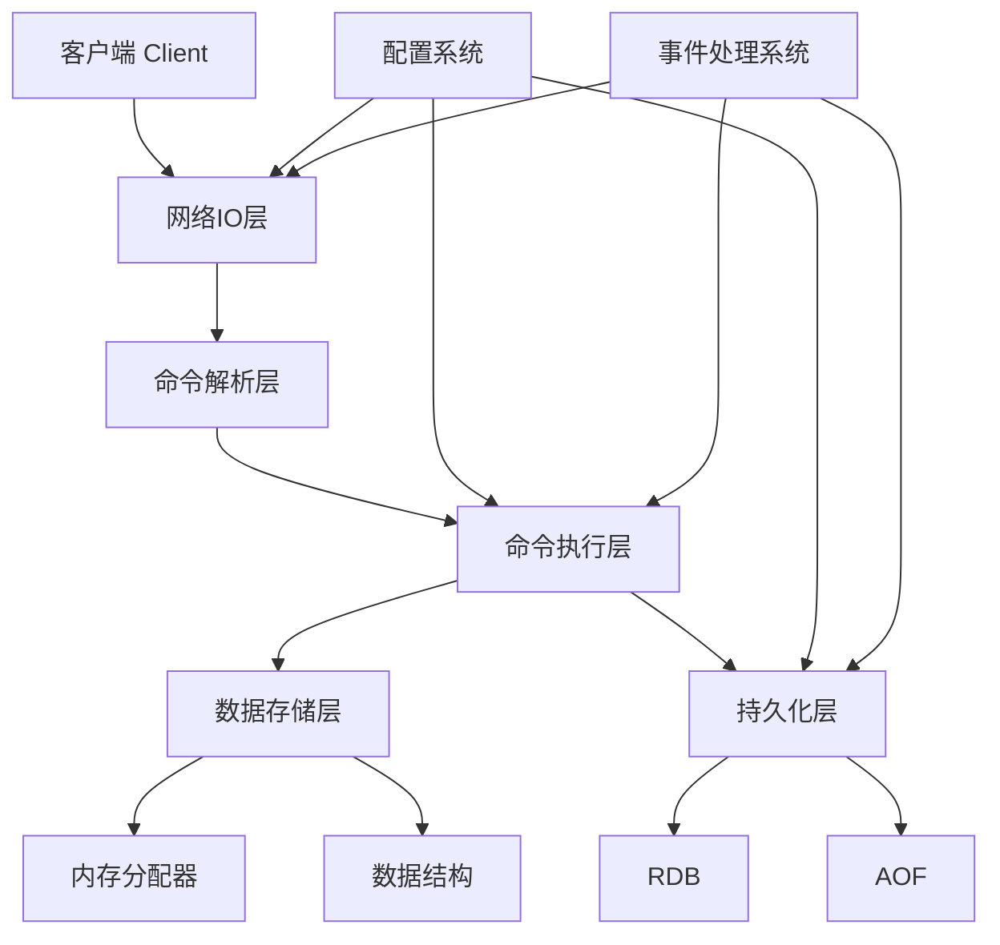

### 2.1 核心组件说明

1. **客户端层**：负责与Redis服务器进行通信，支持多种客户端，如Redis-cli、Jedis、Lettuce等。

2. **网络IO层**：处理客户端的连接请求，负责数据的收发。Redis使用了高效的事件驱动模型，支持单线程和多线程两种模式。

3. **命令解析层**：解析客户端发送的命令，将其转换为Redis内部可执行的指令。

4. **命令执行层**：执行解析后的命令，调用相应的处理函数。

5. **数据存储层**：管理Redis的数据存储，包括内存分配、数据结构维护等。

6. **持久化层**：负责将内存中的数据持久化到磁盘，包括RDB和AOF两种方式。

7. **配置系统**：管理Redis的配置参数，支持动态修改配置。

8. **事件处理系统**：处理各种事件，如网络事件、定时器事件等。

## 3. Redis单线程模型

### 3.1 单线程设计理念

Redis采用单线程模型的主要原因是：

1. **减少线程上下文切换**：单线程避免了多线程之间的上下文切换开销。

2. **简化并发控制**：单线程不需要复杂的并发控制机制，避免了锁竞争问题。

3. **充分利用CPU缓存**：单线程更容易利用CPU缓存，提高数据访问效率。

4. **内存操作瓶颈**：Redis的性能瓶颈主要在于内存访问和网络IO，而不是CPU计算能力。

### 3.2 单线程模型的工作原理

Redis的单线程模型主要包含以下几个部分：

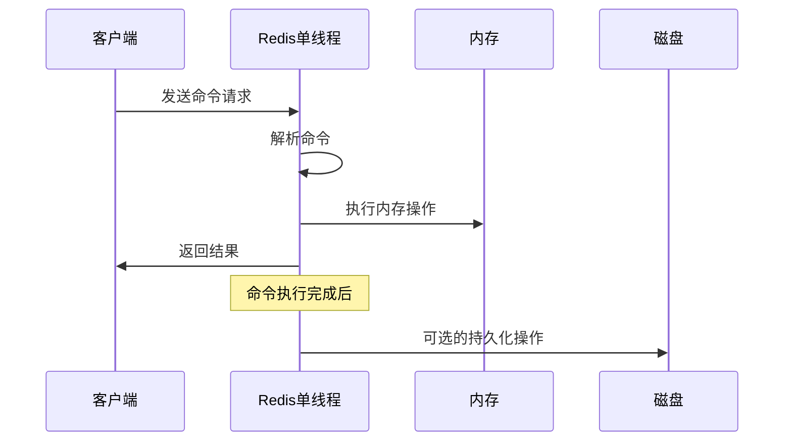

### 3.3 单线程模型的局限性

尽管单线程模型有很多优势，但也存在一些局限性：

1. **CPU密集型命令会阻塞**：如KEYS、FLUSHDB等命令会阻塞整个Redis进程。

2. **单CPU核心利用**：无法充分利用多核CPU的优势。

3. **网络IO阻塞**：在高并发场景下，网络IO可能成为瓶颈。

### 3.4 Redis的多线程演进

为了克服单线程模型的局限性，Redis在不同版本中引入了多线程支持：

- **Redis 4.0**：引入了多线程异步删除（UNLINK命令）。
- **Redis 6.0**：引入了多线程IO，将网络IO操作与命令执行分离。

## 4. Redis网络IO模型

Redis使用了高效的网络IO模型，主要基于事件驱动机制实现。

### 4.1 事件驱动模型

Redis的事件驱动模型主要包含以下几个组件：

1. **文件事件处理器**：处理网络IO事件，使用select、poll、epoll、kqueue等IO多路复用技术。

2. **时间事件处理器**：处理定时事件，如过期键清理、AOF重写等。

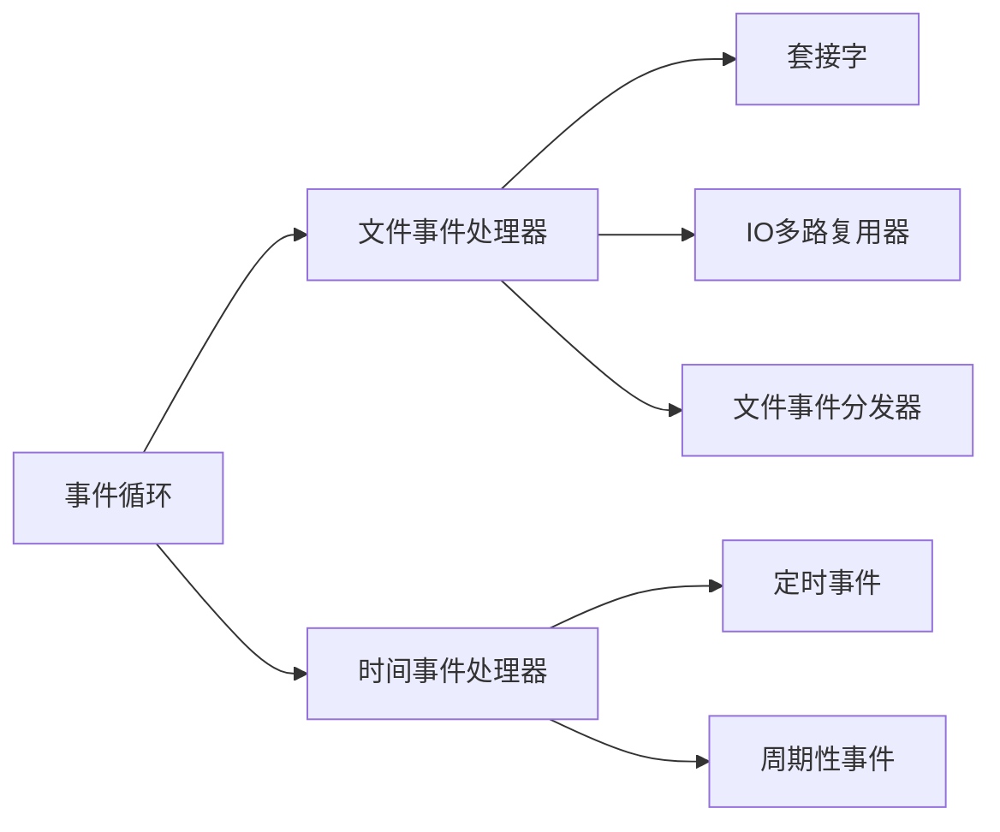

### 4.2 IO多路复用技术

Redis支持多种IO多路复用技术，会根据系统环境自动选择最优的实现：

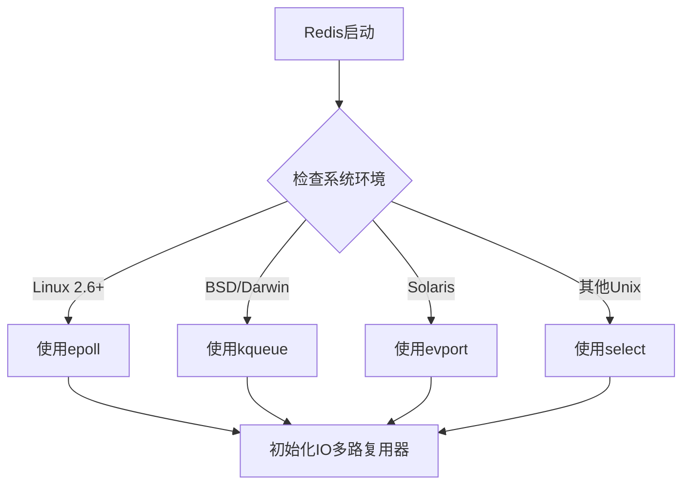

### 4.3 Redis 6.0的多线程IO

Redis 6.0引入了多线程IO，主要改进包括：

1. **网络IO多线程**：将网络数据的读写操作交由专门的IO线程处理。

2. **命令执行单线程**：命令的解析和执行仍然保持单线程，确保数据一致性。

3. **线程池管理**：使用线程池管理IO线程，默认线程数为CPU核心数。

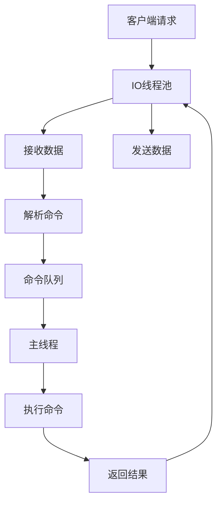

## 5. Redis内存管理

### 5.1 内存分配策略

Redis使用了自己实现的内存分配器（zmalloc），它封装了标准库的malloc和free函数，提供了更高效的内存管理：

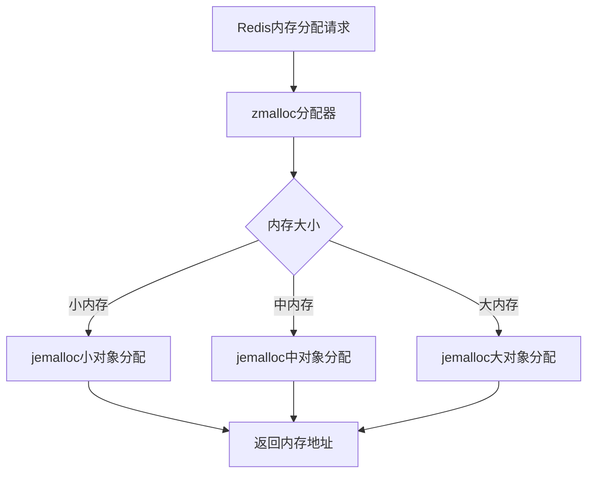

### 5.2 内存碎片

Redis内存碎片是指已分配但未使用的内存空间，主要由以下原因导致：

1. **内存分配器的限制**：不同的内存分配器（如jemalloc、glibc）会产生不同程度的碎片。

2. **数据结构的特点**：某些数据结构（如Hash、List）在扩容或缩容时会产生碎片。

3. **数据的频繁修改**：频繁的键值对插入和删除会导致内存碎片增加。

### 5.3 内存优化策略

Redis提供了多种内存优化策略：

1. **选择合适的内存分配器**：默认使用jemalloc，它在处理小对象时效率更高。

2. **配置maxmemory和maxmemory-policy**：限制Redis使用的最大内存，并设置内存淘汰策略。

3. **使用内存压缩**：对于某些数据结构（如List、Hash），Redis会使用压缩存储。

4. **定期重写RDB或AOF**：通过重写持久化文件，可以减少内存碎片。

## 6. Redis命令执行流程

Redis的命令执行流程主要包括以下几个步骤：

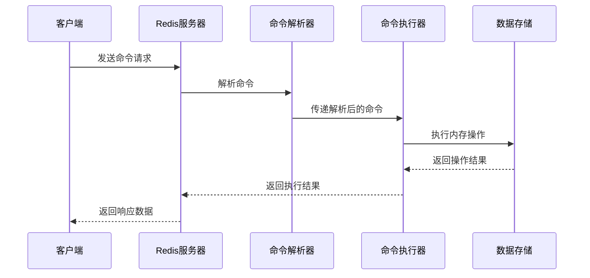

### 6.1 命令解析

命令解析器负责将客户端发送的原始命令解析为Redis内部可执行的指令：

1. **解析请求行**：提取命令名称和参数。
2. **参数处理**：对参数进行验证和转换。
3. **命令查找**：根据命令名称查找对应的处理函数。

### 6.2 命令执行

命令执行器根据解析后的命令执行相应的操作：

1. **权限检查**：检查客户端是否有执行该命令的权限。
2. **参数验证**：验证命令参数是否合法。
3. **执行命令**：调用相应的命令处理函数执行操作。
4. **返回结果**：将执行结果返回给客户端。

### 6.3 命令队列

Redis使用命令队列来处理客户端请求，确保命令的顺序执行：

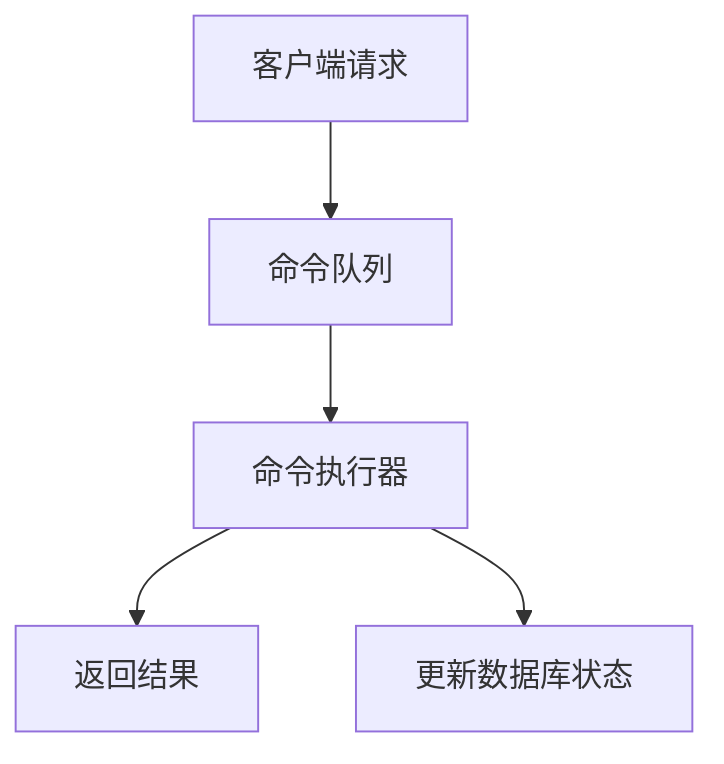

## 7. Redis事件处理系统

Redis的事件处理系统是其高性能的关键之一，它基于libevent库实现，主要处理以下两种事件：

### 7.1 文件事件

文件事件主要用于处理网络IO操作，包括：

1. **连接事件**：客户端的连接请求。
2. **读事件**：客户端发送的数据到达。
3. **写事件**：向客户端发送数据。

### 7.2 时间事件

时间事件主要用于处理定时任务，包括：

1. **定时事件**：在指定时间点执行一次的事件。
2. **周期性事件**：每隔一定时间执行一次的事件。

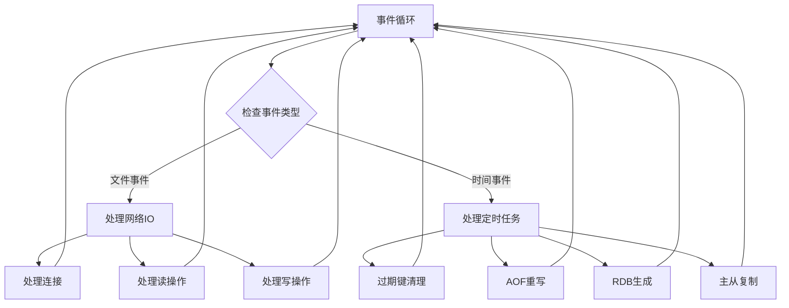

## 8. Redis模块系统

Redis 4.0引入了模块系统，允许开发者通过C语言编写扩展模块，为Redis添加新的功能：

### 8.1 模块系统架构

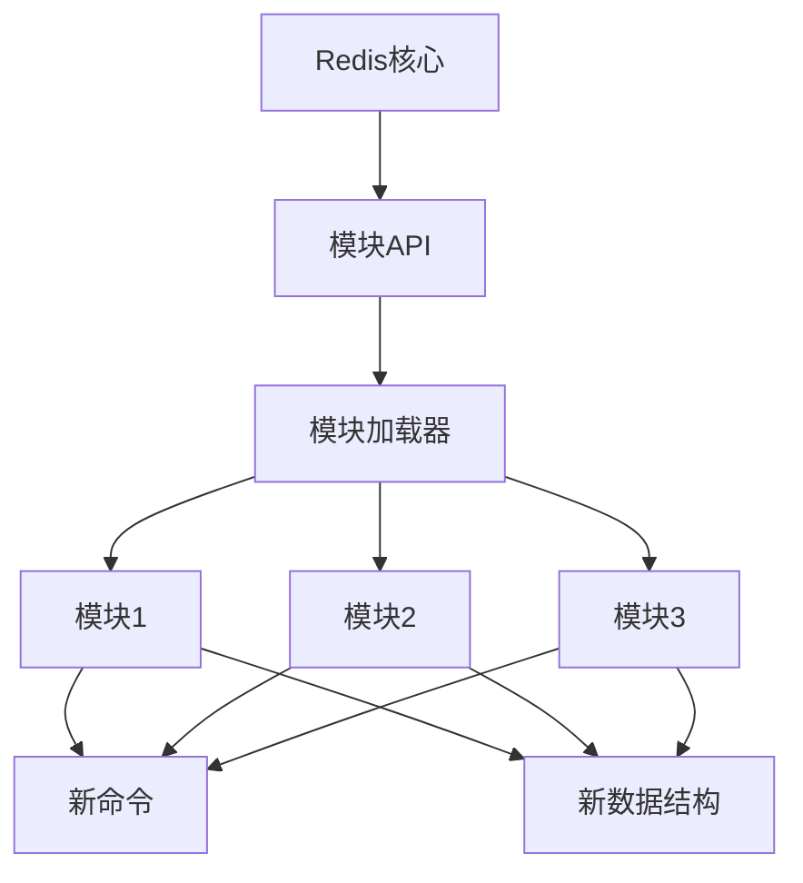

### 8.2 模块开发流程

1. **编写模块代码**：使用C语言编写模块，实现所需的功能。
2. **编译模块**：将模块编译为动态链接库（.so文件）。
3. **加载模块**：通过LOADMODULE命令或配置文件加载模块。
4. **使用模块**：调用模块提供的新命令和功能。

### 8.3 常用Redis模块

1. **RedisSearch**：提供全文搜索功能。
2. **RedisJSON**：支持JSON数据结构。
3. **RedisTimeSeries**：支持时间序列数据。
4. **RedisBloom**：提供布隆过滤器功能。
5. **RedisGears**：支持数据处理和分析。

## 9. Redis多线程模型（6.0+）

### 9.1 多线程IO架构

Redis 6.0引入了多线程IO，将网络IO操作与命令执行分离，提高了Redis的并发处理能力：

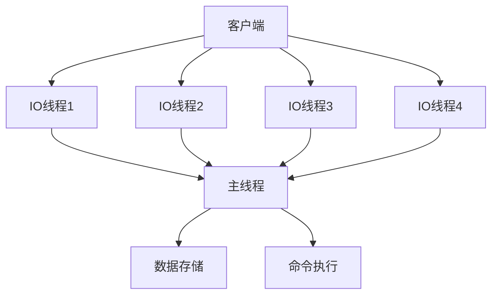

### 9.2 多线程IO工作流程

1. **客户端连接**：由主线程负责接收客户端的连接请求。
2. **连接分配**：主线程将连接分配给IO线程。
3. **数据读写**：IO线程负责数据的读写操作。
4. **命令执行**：主线程负责命令的解析和执行。
5. **结果返回**：IO线程负责将执行结果返回给客户端。

### 9.3 多线程IO的优势

1. **提高并发处理能力**：多线程IO可以同时处理多个客户端的请求。
2. **充分利用多核CPU**：多线程IO可以充分利用多核CPU的优势。
3. **减少网络延迟**：多线程IO可以减少网络数据的等待时间。

## 10. Redis性能优化原理

### 10.1 高性能设计原则

Redis的高性能主要基于以下设计原则：

1. **内存存储**：将数据存储在内存中，提供极高的访问速度。
2. **单线程模型**：避免多线程之间的上下文切换和锁竞争。
3. **高效的数据结构**：使用优化的数据结构（如压缩列表、跳表等）。
4. **事件驱动模型**：使用高效的事件驱动机制，提高IO处理能力。
5. **批处理操作**：支持批量命令（如MSET、MGET），减少网络开销。

### 10.2 性能瓶颈分析

Redis的性能瓶颈主要来自以下几个方面：

1. **网络延迟**：客户端与服务器之间的网络延迟。
2. **内存限制**：内存容量和内存碎片。
3. **CPU限制**：CPU的计算能力和多核利用率。
4. **持久化开销**：持久化操作对性能的影响。
5. **命令复杂度**：某些命令（如KEYS、FLUSHDB）的时间复杂度较高。

### 10.3 性能优化策略

1. **使用连接池**：减少连接建立和关闭的开销。
2. **批量操作**：使用MSET、MGET等批量命令。
3. **避免大键操作**：将大键拆分为多个小键。
4. **选择合适的数据结构**：根据业务需求选择合适的数据结构。
5. **配置合理的持久化策略**：根据业务需求配置RDB和AOF。
6. **使用主从复制和集群**：分散负载，提高可用性。

## 11. 实际应用与注意事项

### 11.1 架构选择建议

1. **单实例部署**：适用于开发环境和小型应用。
2. **主从复制**：适用于需要高可用性的应用。
3. **哨兵模式**：适用于需要自动故障转移的应用。
4. **集群模式**：适用于需要高扩展性和高可用性的大型应用。

### 11.2 性能监控

Redis提供了丰富的监控指标，常用的监控指标包括：

1. **内存使用率**：used_memory、used_memory_rss等。
2. **命中率**：keyspace_hits、keyspace_misses等。
3. **命令执行情况**：total_commands_processed、instantaneous_ops_per_sec等。
4. **客户端连接数**：connected_clients、blocked_clients等。
5. **持久化情况**：rdb_last_save_time、aof_last_rewrite_time_sec等。

### 11.3 常见问题与解决方案

1. **内存溢出**：
   - 配置合理的maxmemory和maxmemory-policy。
   - 定期清理过期键和无用数据。
   - 使用内存压缩技术。

2. **性能下降**：
   - 检查是否有慢查询。
   - 检查内存碎片率。
   - 检查持久化策略是否合理。

3. **数据丢失**：
   - 配置合理的持久化策略。
   - 使用主从复制和哨兵模式。
   - 定期备份数据。

## 12. 总结

Redis采用了简洁而高效的架构设计，主要基于单线程模型和事件驱动机制，提供了高性能的数据访问能力。理解Redis的架构原理和实现机制，对于正确使用Redis、优化Redis性能以及解决实际应用中的问题至关重要。

Redis的核心优势包括：

1. **高性能**：基于内存存储和单线程模型，提供极高的访问速度。
2. **丰富的数据结构**：支持多种数据结构，满足不同的业务需求。
3. **灵活的持久化策略**：支持RDB和AOF两种持久化方式。
4. **高可用性**：支持主从复制、哨兵模式和集群模式。
5. **可扩展性**：支持模块系统，可以方便地扩展Redis的功能。

随着Redis的不断发展，其架构也在不断演进，如引入多线程IO、改进持久化机制等，以适应日益增长的业务需求。

## 13. 参考资料

1. Redis官方文档：<https://redis.io/documentation>
2. Redis源码：<https://github.com/redis/redis>
3. 《Redis设计与实现》
4. 《Redis实战》
5. Redis官方博客：<https://redis.com/blog/>
