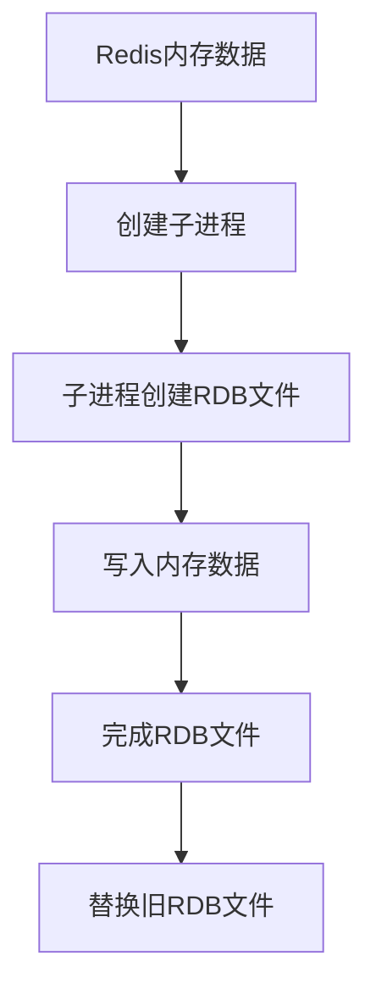
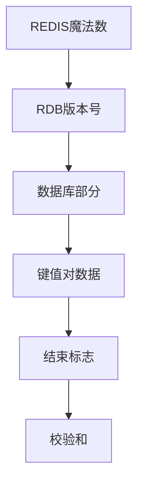
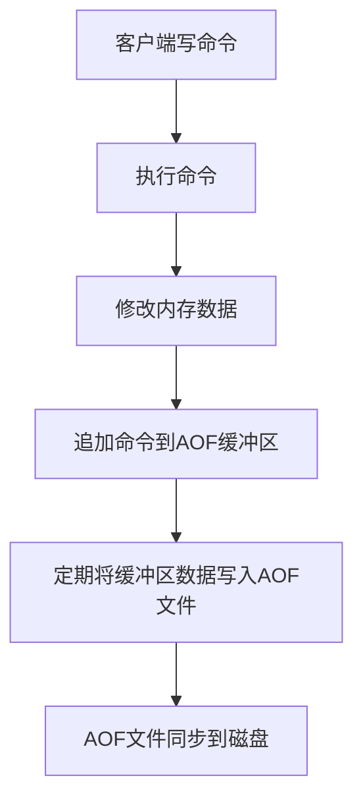
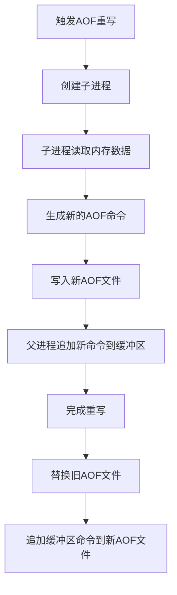
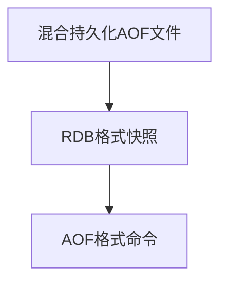
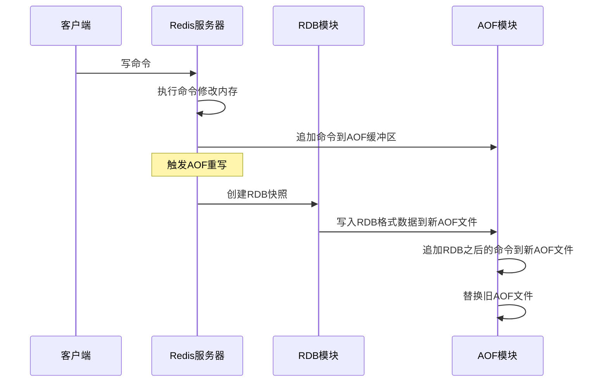
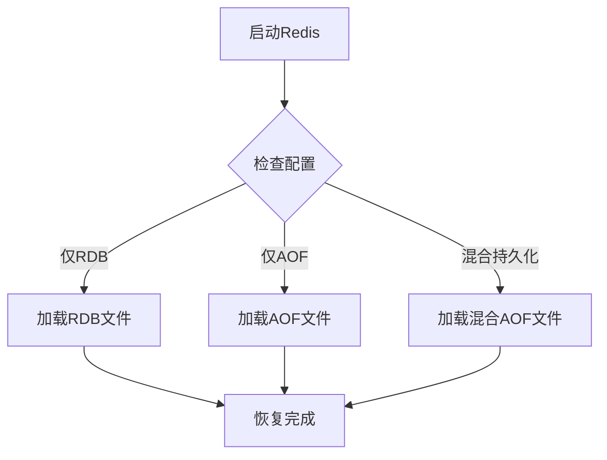

## 1. 简介

Redis是一个基于内存的高性能键值数据库，内存中的数据在服务器重启后会丢失。为了解决这个问题，Redis提供了持久化机制，将内存中的数据保存到磁盘上，以便在服务器重启后能够恢复数据。

Redis支持两种主要的持久化方式：

1. **RDB（Redis DataBase）**：将内存中的数据以快照的形式保存到磁盘上。
2. **AOF（Append Only File）**：将所有的写命令追加到日志文件中，重启时通过重新执行这些命令来恢复数据。

本文将详细介绍这两种持久化方式的原理、配置、优缺点以及适用场景，并介绍Redis 4.0引入的混合持久化机制。

## 2. RDB持久化

### 2.1 RDB基本原理

RDB持久化是将Redis在某个时间点的内存数据快照（Snapshot）保存到磁盘上的过程。RDB文件是一个二进制文件，包含了当时内存中的所有数据。



### 2.2 RDB触发方式

RDB持久化可以通过以下几种方式触发：

#### 2.2.1 手动触发

1. **SAVE命令**：
   - 阻塞Redis服务器，直到RDB文件创建完成
   - 不推荐在生产环境使用，会影响Redis的响应性能

2. **BGSAVE命令**：
   - 异步创建RDB文件，不会阻塞Redis服务器
   - Redis会fork一个子进程来创建RDB文件
   - 生产环境推荐使用

#### 2.2.2 自动触发

可以通过配置文件中的`save`参数来自动触发RDB持久化：

```conf
save 900 1    # 900秒内至少有1个键被修改
save 300 10   # 300秒内至少有10个键被修改
save 60 10000 # 60秒内至少有10000个键被修改
```

当满足上述条件之一时，Redis会自动执行BGSAVE命令。

#### 2.2.3 其他触发方式

1. **主从复制**：从服务器全量复制时，主服务器会执行BGSAVE命令
2. **执行SHUTDOWN命令**：Redis关闭时会执行SAVE命令
3. **执行FLUSHALL命令**：清空所有数据时，如果开启了RDB持久化，会执行SAVE命令

### 2.3 RDB文件结构

RDB文件是一个二进制文件，主要包含以下几个部分：



- **REDIS魔法数**：标识这是一个RDB文件
- **RDB版本号**：RDB文件的版本信息
- **数据库部分**：包含多个数据库的数据
- **键值对数据**：实际的键值对数据，使用特定的编码格式存储
- **结束标志**：标识RDB文件的结束
- **校验和**：用于验证RDB文件的完整性

### 2.4 RDB配置参数

RDB持久化的主要配置参数如下：

| 参数 | 描述 | 默认值 |
|------|------|--------|
| save | 自动触发RDB持久化的条件 | save 900 1 save 300 10 save 60 10000 |
| dbfilename | RDB文件名 | dump.rdb |
| dir | RDB文件保存目录 | ./ |
| stop-writes-on-bgsave-error | BGSAVE失败时是否停止写入 | yes |
| rdbcompression | 是否压缩RDB文件 | yes |
| rdbchecksum | 是否对RDB文件进行校验和检查 | yes |

### 2.5 RDB的优缺点

#### 2.5.1 优点

1. **文件体积小**：RDB文件是二进制文件，体积较小，便于存储和传输
2. **恢复速度快**：加载RDB文件的速度比AOF快
3. **适合备份**：适合用于定期备份和灾难恢复
4. **对性能影响小**：BGSAVE命令是异步执行的，对Redis的正常运行影响较小

#### 2.5.2 缺点

1. **数据安全性低**：如果在两次RDB持久化之间发生故障，会丢失这段时间内的数据
2. **fork子进程开销**：BGSAVE命令会fork子进程，当数据量较大时，fork操作会占用大量内存和CPU资源
3. **不适合实时持久化**：无法保证数据的实时持久化

## 3. AOF持久化

### 3.1 AOF基本原理

AOF持久化是将Redis执行的所有写命令追加到AOF文件末尾，重启时通过重新执行这些命令来恢复数据。



### 3.2 AOF写入策略

AOF持久化的写入策略由`appendfsync`参数控制：

| 选项 | 描述 | 安全性 | 性能 |
|------|------|--------|------|
| always | 每次写命令都立即同步到磁盘 | 最高 | 最低 |
| everysec | 每秒同步一次到磁盘 | 较高 | 较高 |
| no | 由操作系统决定何时同步 | 最低 | 最高 |

### 3.3 AOF重写机制

随着时间的推移，AOF文件会变得越来越大，影响Redis的性能和恢复速度。为了解决这个问题，Redis提供了AOF重写机制，通过创建一个新的AOF文件来替代旧的AOF文件，新文件中只包含恢复当前数据所需的最小命令集。



### 3.4 AOF重写触发方式

AOF重写可以通过以下几种方式触发：

#### 3.4.1 手动触发

使用`BGREWRITEAOF`命令手动触发AOF重写：

```bash
BGREWRITEAOF
```

#### 3.4.2 自动触发

可以通过配置文件中的参数来自动触发AOF重写：

```conf
auto-aof-rewrite-percentage 100  # AOF文件大小增长超过100%
auto-aof-rewrite-min-size 64mb    # AOF文件最小大小为64MB
```

当AOF文件大小超过`auto-aof-rewrite-min-size`，并且比上一次重写后的大小增长了`auto-aof-rewrite-percentage`时，自动触发AOF重写。

### 3.5 AOF文件结构

AOF文件是一个文本文件，包含了Redis执行的所有写命令，格式如下：

```shell
*2
$6
SELECT
$1
0
*3
$3
SET
$5
mykey
$7
myvalue
*2
$4
INCR
$4
counter
```

这是Redis的协议格式（RESP），每条命令由多个部分组成：

- `*n`：表示命令有n个参数
- `$m`：表示下一个参数的长度为m
- 实际的参数值

### 3.6 AOF配置参数

AOF持久化的主要配置参数如下：

| 参数 | 描述 | 默认值 |
|------|------|--------|
| appendonly | 是否开启AOF持久化 | no |
| appendfilename | AOF文件名 | appendonly.aof |
| dir | AOF文件保存目录 | ./ |
| appendfsync | AOF写入策略 | everysec |
| no-appendfsync-on-rewrite | AOF重写时是否停止同步 | no |
| auto-aof-rewrite-percentage | AOF重写触发百分比 | 100 |
| auto-aof-rewrite-min-size | AOF重写触发最小大小 | 64mb |
| aof-load-truncated | 是否加载被截断的AOF文件 | yes |
| aof-use-rdb-preamble | 是否使用混合持久化 | yes（Redis 4.0+） |

### 3.7 AOF的优缺点

#### 3.7.1 优点

1. **数据安全性高**：可以通过配置`appendfsync always`实现实时持久化
2. **文件可读性好**：AOF文件是文本文件，可以直接查看和修改
3. **适合增量备份**：可以通过追加新的命令来实现增量备份
4. **数据恢复准确**：可以精确恢复到故障发生前的状态

#### 3.7.2 缺点

1. **文件体积大**：AOF文件通常比RDB文件大
2. **恢复速度慢**：加载AOF文件的速度比RDB慢
3. **对性能影响大**：写入策略越安全，对Redis性能的影响越大
4. **重写开销大**：AOF重写需要消耗大量的内存和CPU资源

## 4. RDB与AOF的对比

### 4.1 功能对比

| 特性 | RDB | AOF |
|------|-----|-----|
| 持久化方式 | 内存快照 | 命令追加 |
| 文件格式 | 二进制 | 文本（RESP协议） |
| 文件体积 | 小 | 大 |
| 恢复速度 | 快 | 慢 |
| 数据安全性 | 低（可能丢失数据） | 高（可配置） |
| 对性能影响 | 小（异步执行） | 大（取决于写入策略） |
| 适合场景 | 备份、灾难恢复 | 数据安全性要求高的场景 |

### 4.2 适用场景

#### 4.2.1 选择RDB的场景

1. **对数据安全性要求不高**：可以接受一定时间内的数据丢失
2. **需要快速恢复数据**：RDB文件加载速度快
3. **需要定期备份**：RDB文件适合用于定期备份
4. **资源有限**：RDB对Redis性能的影响较小

#### 4.2.2 选择AOF的场景

1. **对数据安全性要求高**：需要确保数据不丢失或丢失最少
2. **需要精确恢复数据**：AOF可以精确恢复到故障发生前的状态
3. **需要可读性好的持久化文件**：AOF文件是文本文件，便于查看和修改

## 5. 混合持久化

### 5.1 混合持久化基本原理

Redis 4.0引入了混合持久化机制，结合了RDB和AOF的优点。混合持久化生成的AOF文件由两部分组成：

1. **RDB部分**：文件开头包含一个RDB格式的快照
2. **AOF部分**：文件结尾包含RDB快照之后的所有写命令



### 5.2 混合持久化的优势

1. **恢复速度快**：开头的RDB部分可以快速加载大部分数据
2. **数据安全性高**：结尾的AOF部分可以精确恢复最新的数据
3. **文件体积小**：比纯AOF文件小

### 5.3 混合持久化配置

混合持久化通过`aof-use-rdb-preamble`参数控制：

```conf
aof-use-rdb-preamble yes  # 开启混合持久化
```

### 5.4 混合持久化的工作流程



## 6. 持久化配置最佳实践

### 6.1 生产环境配置建议

#### 6.1.1 仅使用RDB

```conf
save 900 1
save 300 10
save 60 10000
dbfilename dump.rdb
dir /var/lib/redis
stop-writes-on-bgsave-error yes
rdbcompression yes
rdbchecksum yes
```

#### 6.1.2 仅使用AOF

```conf
appendonly yes
appendfilename appendonly.aof
dir /var/lib/redis
appendfsync everysec
no-appendfsync-on-rewrite yes
auto-aof-rewrite-percentage 100
auto-aof-rewrite-min-size 64mb
aof-load-truncated yes
```

#### 6.1.3 使用混合持久化

```conf
appendonly yes
appendfilename appendonly.aof
dir /var/lib/redis
appendfsync everysec
no-appendfsync-on-rewrite yes
auto-aof-rewrite-percentage 100
auto-aof-rewrite-min-size 64mb
aof-load-truncated yes
aof-use-rdb-preamble yes
```

### 6.2 数据备份策略

1. **定期备份RDB文件**：
   - 每天凌晨执行BGSAVE命令创建RDB文件
   - 将RDB文件备份到远程服务器或云存储

2. **定期备份AOF文件**：
   - 每周备份一次AOF文件
   - 确保备份的AOF文件是完整的

3. **制定灾难恢复计划**：
   - 定期测试数据恢复流程
   - 确保备份文件的可用性和完整性

## 7. 数据恢复与故障处理

### 7.1 数据恢复流程



### 7.2 手动恢复数据

#### 7.2.1 使用RDB文件恢复

1. 停止Redis服务器
2. 将备份的RDB文件复制到Redis的数据目录
3. 启动Redis服务器，Redis会自动加载RDB文件

#### 7.2.2 使用AOF文件恢复

1. 停止Redis服务器
2. 将备份的AOF文件复制到Redis的数据目录
3. 启动Redis服务器，Redis会自动加载AOF文件

### 7.3 AOF文件损坏修复

如果AOF文件损坏，可以使用Redis提供的`redis-check-aof`工具进行修复：

```bash
redis-check-aof --fix appendonly.aof
```

### 7.4 数据恢复优先级

当同时存在RDB和AOF文件时，Redis的恢复优先级为：

1. 如果开启了AOF持久化，优先使用AOF文件恢复
2. 如果未开启AOF持久化，使用RDB文件恢复

## 8. 性能优化

### 8.1 持久化对性能的影响

1. **RDB的性能影响**：
   - BGSAVE命令会fork子进程，消耗内存和CPU资源
   - 当数据量较大时，fork操作可能导致Redis短暂阻塞

2. **AOF的性能影响**：
   - 写入策略越安全，对Redis性能的影响越大
   - AOF重写会消耗大量内存和CPU资源

### 8.2 性能优化策略

#### 8.2.1 RDB性能优化

1. **合理配置save参数**：避免过于频繁的RDB持久化
2. **选择合适的时间执行BGSAVE**：在业务低峰期执行
3. **确保有足够的内存**：避免fork子进程时内存不足
4. **关闭RDB压缩**：如果CPU资源紧张，可以关闭`rdbcompression`

#### 8.2.2 AOF性能优化

1. **选择合适的写入策略**：生产环境推荐使用`everysec`
2. **开启no-appendfsync-on-rewrite**：AOF重写时停止同步，提高性能
3. **合理配置重写参数**：避免过于频繁的AOF重写
4. **使用混合持久化**：结合RDB和AOF的优点

#### 8.2.3 通用性能优化

1. **使用高性能存储设备**：使用SSD存储持久化文件
2. **分离持久化文件目录**：将持久化文件存储在单独的磁盘上
3. **限制Redis内存使用**：避免数据量过大导致持久化性能下降
4. **监控持久化状态**：定期监控RDB和AOF的执行情况

## 9. Redis 7.0+持久化改进

### 9.1 AOF优化

Redis 7.0对AOF持久化进行了多项优化：

1. **AOF多部分文件**：将AOF文件分为基础文件和增量文件
2. **AOF重写优化**：减少AOF重写的内存消耗
3. **AOF加载优化**：提高AOF文件的加载速度

### 9.2 RDB优化

Redis 7.0对RDB持久化进行了以下优化：

1. **RDB版本升级**：支持更多数据类型和特性
2. **RDB压缩优化**：提高RDB文件的压缩效率

## 10. 总结

Redis提供了两种主要的持久化方式：RDB和AOF。RDB通过创建内存快照来持久化数据，文件体积小，恢复速度快，但数据安全性较低；AOF通过追加写命令来持久化数据，数据安全性高，但文件体积大，恢复速度慢。

Redis 4.0引入的混合持久化机制结合了RDB和AOF的优点，提供了更好的性能和数据安全性。在实际应用中，应该根据业务需求和数据安全性要求选择合适的持久化方式。

无论选择哪种持久化方式，都应该制定合理的备份策略和灾难恢复计划，确保数据的安全性和可用性。同时，还需要关注持久化对Redis性能的影响，采取适当的优化措施，保证Redis的正常运行。

## 11. 参考资料

1. Redis官方文档：<https://redis.io/documentation>
2. 《Redis设计与实现》
3. Redis源码：<https://github.com/redis/redis>
4. Redis命令参考：<https://redis.io/commands>
