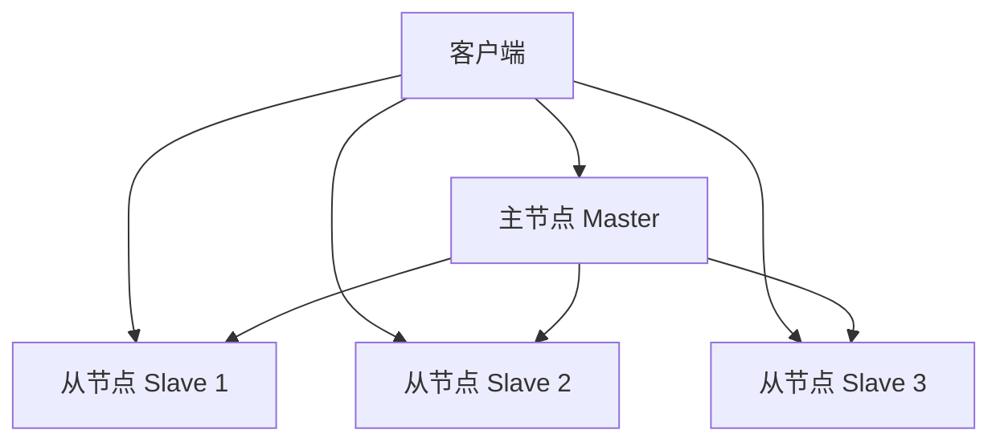
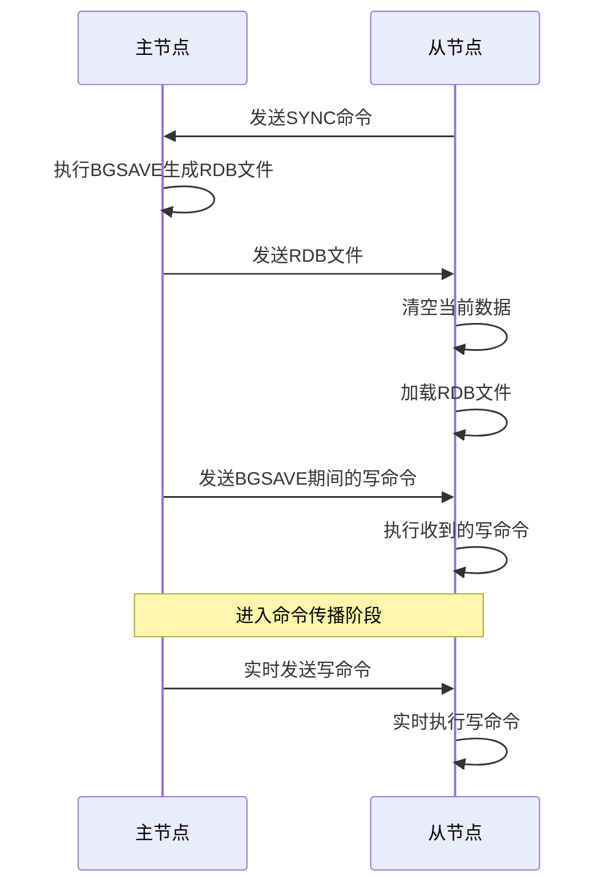
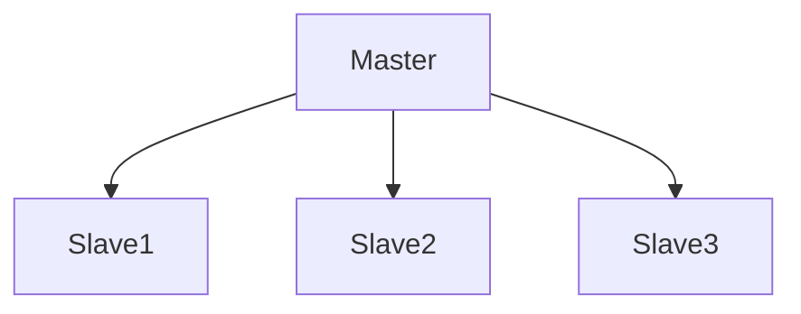
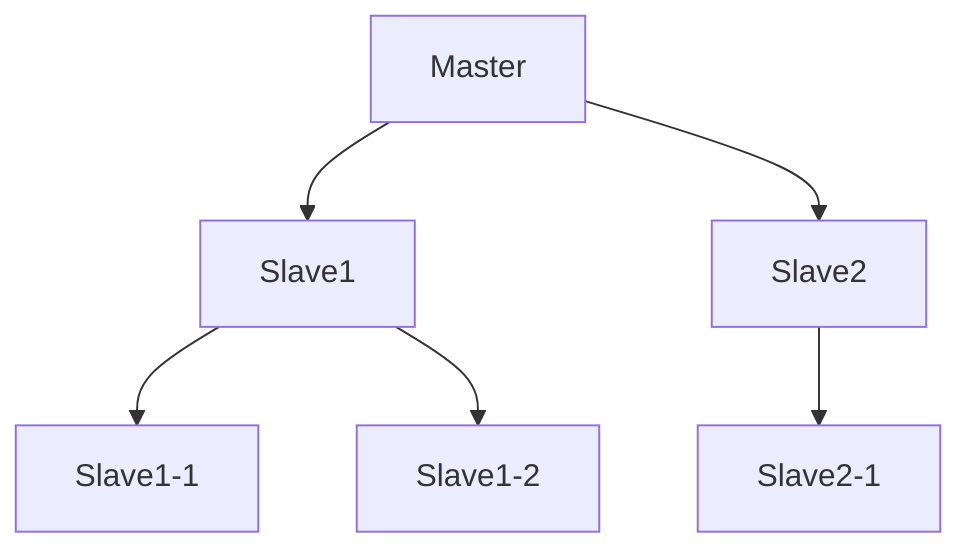
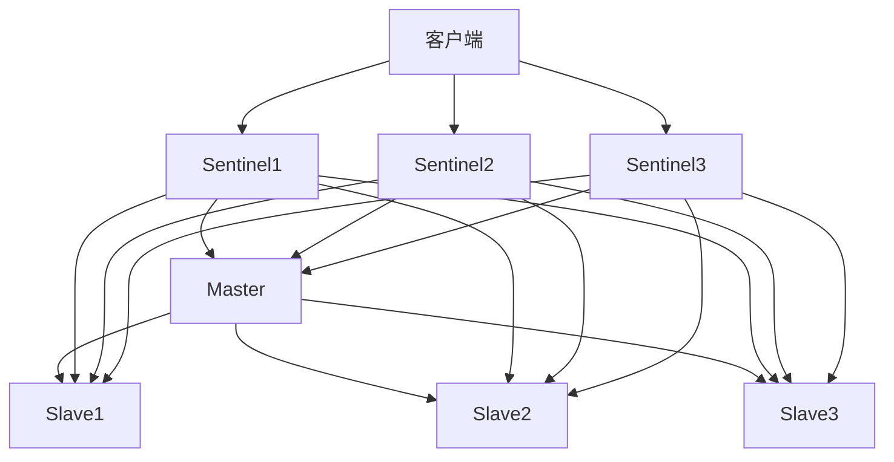
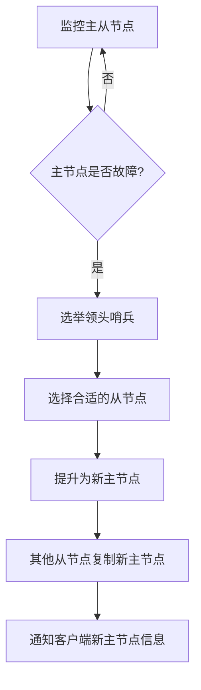
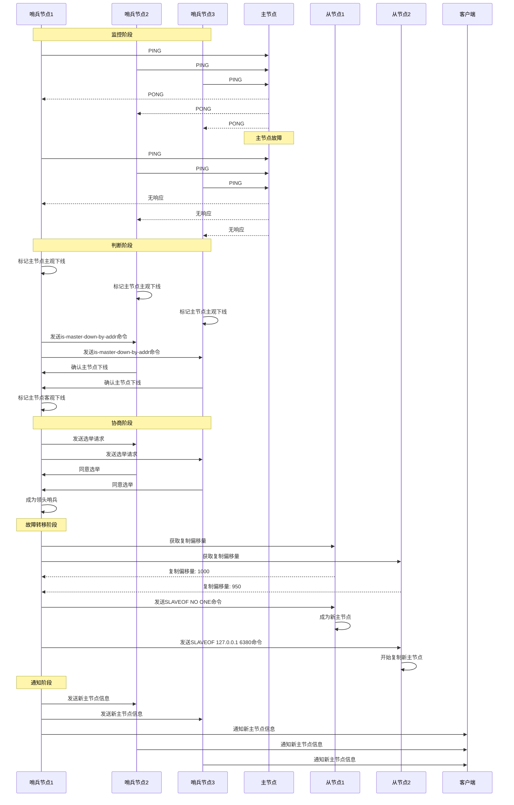

## 1. 简介

在实际应用中，单机Redis存在诸多限制，如单点故障、性能瓶颈、内存容量限制等。为了解决这些问题，Redis提供了主从复制（Master-Slave Replication）和哨兵模式（Sentinel）两种高可用性解决方案。

主从复制通过将数据从主节点复制到多个从节点，实现数据的备份和读写分离；哨兵模式则在主从复制的基础上，提供了自动故障转移功能，确保Redis集群的高可用性。

本文将详细介绍Redis主从复制和哨兵模式的原理、配置、工作流程以及实际应用。

## 2. 主从复制

### 2.1 主从复制基本概念

主从复制是指将一个Redis服务器（主节点）的数据复制到多个Redis服务器（从节点）的过程。主节点负责处理写命令和读命令，从节点主要负责处理读命令，从而实现读写分离。



### 2.2 主从复制的作用

1. **数据备份**：将主节点的数据复制到从节点，实现数据的备份和冗余。
2. **读写分离**：主节点负责写操作，从节点负责读操作，提高系统的并发处理能力。
3. **负载均衡**：将读请求分散到多个从节点，减轻主节点的负载。
4. **故障恢复**：当主节点发生故障时，可以手动将从节点提升为主节点，恢复服务。

### 2.3 主从复制的工作原理

主从复制的工作流程主要包括以下几个阶段：

1. **建立连接**：从节点通过`SLAVEOF`命令与主节点建立连接。
2. **同步数据**：从节点与主节点进行数据同步，获取主节点的完整数据副本。
3. **命令传播**：主节点将写命令传播给从节点，保持数据的一致性。



### 2.4 主从复制的同步方式

Redis主从复制支持两种同步方式：

1. **全量同步**：从节点第一次连接主节点时，获取主节点的完整数据副本。
2. **增量同步**：从节点与主节点断开连接后重新连接时，只获取断开期间主节点的写命令。

#### 2.4.1 全量同步

全量同步的工作流程：

1. 从节点向主节点发送`SYNC`命令。
2. 主节点执行`BGSAVE`命令生成RDB文件。
3. 主节点将生成的RDB文件发送给从节点。
4. 从节点接收RDB文件并加载到内存中。
5. 主节点将`BGSAVE`期间的写命令发送给从节点。
6. 从节点执行这些写命令，使数据与主节点保持一致。

#### 2.4.2 增量同步

增量同步的工作流程：

1. 主节点维护一个复制偏移量（Replication Offset），记录发送给从节点的字节数。
2. 从节点也维护一个复制偏移量，记录接收主节点的字节数。
3. 从节点还维护一个复制积压缓冲区（Replication Backlog Buffer），用于存储主节点最近的写命令。
4. 当从节点断开连接后重新连接时，会向主节点发送自己的复制偏移量。
5. 主节点检查复制积压缓冲区，如果包含从节点缺失的写命令，则只发送这些命令（增量同步）。
6. 如果不包含，则进行全量同步。

### 2.5 主从复制配置

#### 2.5.1 主节点配置

主节点一般不需要特殊配置，默认情况下即可接受从节点的连接请求。可以通过以下参数进行优化：

```conf
# 开启AOF持久化
appendonly yes
# 每秒钟同步一次
appendfsync everysec
# 启用复制积压缓冲区
repl-backlog-size 1mb
```

#### 2.5.2 从节点配置

从节点需要配置主节点的地址和端口：

```conf
# 配置主节点地址和端口
slaveof 127.0.0.1 6379
# 从节点只读
slave-read-only yes
# 启用复制积压缓冲区
repl-backlog-size 1mb
# 从节点优先级，用于故障转移
slave-priority 100
```

也可以在运行时通过命令配置：

```bash
# 在从节点上执行
SLAVEOF 127.0.0.1 6379
```

### 2.6 主从复制的拓扑结构

Redis主从复制支持多种拓扑结构：

#### 2.6.1 一主多从

一个主节点对应多个从节点，是最常见的拓扑结构。



#### 2.6.2 树状结构

从节点可以作为其他从节点的主节点，形成树状结构。



### 2.7 主从复制的注意事项

1. **数据一致性**：主从复制存在一定的延迟，可能导致数据不一致。
2. **主节点故障**：主节点故障后，需要手动将从节点提升为主节点。
3. **网络带宽**：大量从节点可能会占用主节点的网络带宽。
4. **从节点只读**：从节点默认是只读的，不能执行写命令。

## 3. 哨兵模式

### 3.1 哨兵模式基本概念

哨兵模式是Redis提供的高可用性解决方案，它在主从复制的基础上，增加了对主节点的监控、自动故障转移和配置管理功能。

哨兵模式由多个哨兵节点组成，这些节点协同工作，监控主从节点的状态，当主节点发生故障时，自动将从节点提升为主节点，确保服务的可用性。



### 3.2 哨兵模式的作用

1. **监控**：监控主从节点的状态，确保它们正常运行。
2. **自动故障转移**：当主节点发生故障时，自动将从节点提升为主节点。
3. **配置管理**：管理客户端的配置，当主节点发生变化时，更新客户端的配置。
4. **通知**：当节点状态发生变化时，通知客户端和管理员。

### 3.3 哨兵模式的工作原理

哨兵模式的工作流程主要包括以下几个阶段：

1. **监控阶段**：哨兵节点定期监控主从节点的状态。
2. **判断阶段**：判断主节点是否发生故障。
3. **协商阶段**：哨兵节点之间进行协商，选举出领头哨兵。
4. **故障转移阶段**：领头哨兵执行故障转移，将从节点提升为主节点。
5. **通知阶段**：通知其他节点和客户端新的主节点信息。



### 3.4 哨兵模式的核心功能

#### 3.4.1 节点监控

哨兵节点通过定期发送`PING`命令监控主从节点的状态：

1. **主观下线**：当哨兵节点在一定时间内没有收到主节点的响应时，认为主节点主观下线。
2. **客观下线**：当多个哨兵节点都认为主节点主观下线时，通过投票机制判断主节点客观下线。

#### 3.4.2 故障转移

当主节点被判断为客观下线时，哨兵节点会执行故障转移：

1. **选举领头哨兵**：通过Raft算法选举出一个领头哨兵。
2. **选择新主节点**：选择一个合适的从节点作为新的主节点。
3. **提升新主节点**：将选择的从节点提升为主节点。
4. **更新配置**：更新其他从节点的配置，使其复制新主节点。
5. **通知客户端**：通知客户端新主节点的信息。

#### 3.4.3 配置管理

哨兵节点维护着Redis集群的配置信息，当主节点发生变化时，会更新配置信息并通知客户端。

### 3.5 哨兵模式的配置

#### 3.5.1 哨兵节点配置

哨兵节点的配置文件（sentinel.conf）：

```conf
# 哨兵节点端口
port 26379
# 守护进程模式
daemonize yes
# 日志文件
logfile "/var/log/redis/sentinel.log"
# 数据目录
dir "/var/lib/redis/sentinel"
# 监控主节点，mymaster是主节点名称，127.0.0.1是主节点IP，6379是主节点端口，2是故障判断的最小哨兵数量
sentinel monitor mymaster 127.0.0.1 6379 2
# 连接主节点的密码
sentinel auth-pass mymaster yourpassword
# 主节点主观下线时间（毫秒）
sentinel down-after-milliseconds mymaster 30000
# 故障转移超时时间（毫秒）
sentinel failover-timeout mymaster 180000
# 故障转移时，同时同步的从节点数量
sentinel parallel-syncs mymaster 1
```

#### 3.5.2 启动哨兵节点

```bash
redis-sentinel /path/to/sentinel.conf
```

或

```bash
redis-server /path/to/sentinel.conf --sentinel
```

### 3.6 哨兵模式的故障转移流程

哨兵模式的故障转移流程主要包括以下几个步骤：



### 3.7 哨兵模式的注意事项

1. **哨兵数量**：哨兵节点的数量应该是奇数（至少3个），避免投票时出现平局。
2. **网络稳定性**：哨兵节点之间和哨兵节点与主从节点之间的网络连接要稳定。
3. **配置一致性**：所有哨兵节点的配置要保持一致。
4. **性能影响**：哨兵节点会定期发送命令监控主从节点，对性能有一定影响。

## 4. 主从复制与哨兵模式的对比

### 4.1 功能对比

| 特性 | 主从复制 | 哨兵模式 |
|------|----------|----------|
| 数据备份 | 支持 | 支持 |
| 读写分离 | 支持 | 支持 |
| 自动故障转移 | 不支持 | 支持 |
| 节点监控 | 不支持 | 支持 |
| 配置管理 | 不支持 | 支持 |
| 客户端通知 | 不支持 | 支持 |

### 4.2 优缺点对比

#### 4.2.1 主从复制

**优点**：

1. 配置简单，易于维护
2. 对性能影响小
3. 支持读写分离，提高并发处理能力

**缺点**：

1. 不支持自动故障转移
2. 主节点故障后需要手动恢复
3. 没有节点监控和配置管理功能

#### 4.2.2 哨兵模式

**优点**：

1. 支持自动故障转移
2. 提供节点监控功能
3. 提供配置管理和客户端通知功能
4. 提高系统的可用性

**缺点**：

1. 配置复杂，维护成本高
2. 对性能有一定影响
3. 故障转移过程中可能会出现短暂的服务中断

### 4.3 适用场景

#### 4.3.1 主从复制

1. **数据备份**：需要将数据备份到多个节点的场景。
2. **读写分离**：读请求量远大于写请求量的场景。
3. **负载均衡**：需要将读请求分散到多个节点的场景。
4. **资源有限**：对系统可用性要求不高，资源有限的场景。

#### 4.3.2 哨兵模式

1. **高可用性要求**：对系统可用性要求高，需要自动故障转移的场景。
2. **关键业务**：关键业务系统，需要确保服务不中断的场景。
3. **无人值守**：需要无人值守，自动恢复的场景。

## 5. 实际应用与注意事项

### 5.1 主从复制配置示例

#### 5.1.1 主节点配置（redis.conf）

```conf
# 端口
port 6379
# 守护进程模式
daemonize yes
# 绑定地址
bind 0.0.0.0
# 密码
requirepass yourpassword
# 日志文件
logfile "/var/log/redis/redis.log"
# 数据目录
dir "/var/lib/redis"
# 开启AOF持久化
appendonly yes
# 每秒钟同步一次
appendfsync everysec
```

#### 5.1.2 从节点配置（redis-slave.conf）

```conf
# 端口
port 6380
# 守护进程模式
daemonize yes
# 绑定地址
bind 0.0.0.0
# 密码
requirepass yourpassword
# 主节点密码
masterauth yourpassword
# 配置主节点
slaveof 127.0.0.1 6379
# 从节点只读
slave-read-only yes
# 日志文件
logfile "/var/log/redis/redis-slave.log"
# 数据目录
dir "/var/lib/redis-slave"
```

### 5.2 哨兵模式配置示例

#### 5.2.1 哨兵节点配置（sentinel.conf）

```conf
# 端口
port 26379
# 守护进程模式
daemonize yes
# 绑定地址
bind 0.0.0.0
# 日志文件
logfile "/var/log/redis/sentinel.log"
# 数据目录
dir "/var/lib/redis/sentinel"
# 监控主节点
sentinel monitor mymaster 127.0.0.1 6379 2
# 主节点密码
sentinel auth-pass mymaster yourpassword
# 主观下线时间
sentinel down-after-milliseconds mymaster 30000
# 故障转移超时时间
sentinel failover-timeout mymaster 180000
# 并行同步数量
sentinel parallel-syncs mymaster 1
```

### 5.3 客户端连接哨兵模式

使用Jedis客户端连接哨兵模式：

```java
import redis.clients.jedis.JedisPoolConfig;
import redis.clients.jedis.JedisSentinelPool;

import java.util.HashSet;
import java.util.Set;

public class SentinelExample {
    public static void main(String[] args) {
        // 哨兵节点集合
        Set<String> sentinels = new HashSet<>();
        sentinels.add("127.0.0.1:26379");
        sentinels.add("127.0.0.1:26380");
        sentinels.add("127.0.0.1:26381");

        // 主节点名称
        String masterName = "mymaster";
        // 密码
        String password = "yourpassword";
        // 连接池配置
        JedisPoolConfig poolConfig = new JedisPoolConfig();
        poolConfig.setMaxTotal(100);
        poolConfig.setMaxIdle(20);
        poolConfig.setMinIdle(5);

        // 创建哨兵连接池
        JedisSentinelPool sentinelPool = new JedisSentinelPool(masterName, sentinels, poolConfig, password);

        // 获取连接
        try (Jedis jedis = sentinelPool.getResource()) {
            // 执行命令
            jedis.set("key", "value");
            String result = jedis.get("key");
            System.out.println(result);
        }

        // 关闭连接池
        sentinelPool.close();
    }
}
```

### 5.4 注意事项

1. **网络配置**：确保主从节点和哨兵节点之间的网络连接稳定。
2. **密码配置**：主从节点和哨兵节点的密码要保持一致。
3. **持久化配置**：主节点要开启持久化，确保数据不丢失。
4. **资源配置**：根据业务需求配置节点的内存、CPU等资源。
5. **监控配置**：配置监控系统，实时监控节点的状态。
6. **备份策略**：制定定期备份策略，确保数据安全。
7. **测试故障转移**：定期测试故障转移功能，确保其正常工作。

## 6. Redis 7.0+主从复制与哨兵模式改进

### 6.1 主从复制改进

Redis 7.0对主从复制进行了多项改进：

1. **复制优化**：优化了复制的性能和稳定性。
2. **增量同步改进**：改进了增量同步的机制，减少数据传输量。
3. **多主复制**：支持多主复制，提高系统的可用性。

### 6.2 哨兵模式改进

Redis 7.0对哨兵模式进行了以下改进：

1. **哨兵监控优化**：优化了哨兵节点的监控机制，提高监控的准确性。
2. **故障转移优化**：优化了故障转移的流程，减少故障转移的时间。
3. **配置管理改进**：改进了配置管理功能，提高配置的一致性。

## 7. 总结

Redis主从复制和哨兵模式是Redis提供的两种高可用性解决方案。主从复制通过将数据从主节点复制到多个从节点，实现数据的备份和读写分离；哨兵模式则在主从复制的基础上，增加了对主节点的监控、自动故障转移和配置管理功能。

在实际应用中，应该根据业务需求和系统可用性要求选择合适的解决方案。对于数据备份和读写分离的需求，可以选择主从复制；对于高可用性要求高的关键业务系统，可以选择哨兵模式。

无论选择哪种解决方案，都需要合理配置和维护，确保系统的稳定性和可用性。同时，还需要定期测试和监控，及时发现和解决问题，确保系统的正常运行。

## 8. 参考资料

1. Redis官方文档：<https://redis.io/documentation>
2. Redis命令参考：<https://redis.io/commands>
3. 《Redis设计与实现》
4. 《Redis实战》
