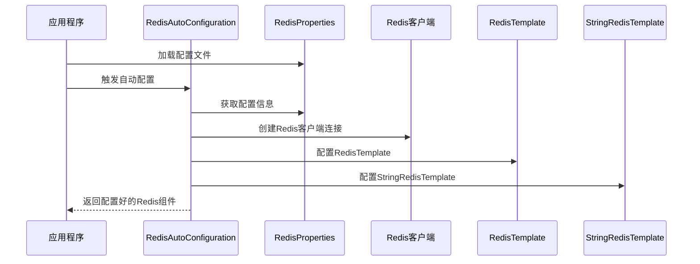

## 简介

Redis作为一款高性能的内存数据库，在现代Java应用中扮演着重要角色。Spring Boot作为主流的Java开发框架，提供了非常便捷的Redis整合方式。本文将详细介绍Redis与Spring Boot的整合方法，包括自动配置机制、客户端选择、基本使用、高级配置以及常见问题解决方案，帮助开发者快速构建基于Redis的Spring Boot应用。

## 架构知识点

### Spring Boot Redis自动配置机制

Spring Boot通过自动配置机制简化了Redis的整合过程，核心依赖于`spring-boot-starter-data-redis`启动器。其自动配置的主要流程如下：



### Redis客户端选择

Spring Boot支持两种主要的Redis客户端：

1. **Lettuce**：默认客户端，基于Netty实现，线程安全，支持异步操作，适合高并发场景
2. **Jedis**：传统客户端，简单易用，同步阻塞IO，多线程环境下需要使用连接池

### Spring Cache与Redis整合

Spring Cache提供了声明式缓存抽象，可与Redis无缝集成，主要涉及以下组件：

- `@Cacheable`：缓存方法结果
- `@CachePut`：更新缓存
- `@CacheEvict`：清除缓存
- `@Caching`：组合多个缓存操作
- `@CacheConfig`：类级别的缓存配置

## 源码分析

### Redis自动配置核心类

```java
// RedisAutoConfiguration核心逻辑
export class RedisAutoConfiguration {
    @Bean
    @ConditionalOnMissingBean(name = "redisTemplate")
    @ConditionalOnSingleCandidate(RedisConnectionFactory.class)
    public RedisTemplate<Object, Object> redisTemplate(RedisConnectionFactory redisConnectionFactory) {
        RedisTemplate<Object, Object> template = new RedisTemplate<>();
        template.setConnectionFactory(redisConnectionFactory);
        return template;
    }

    @Bean
    @ConditionalOnMissingBean
    @ConditionalOnSingleCandidate(RedisConnectionFactory.class)
    public StringRedisTemplate stringRedisTemplate(RedisConnectionFactory redisConnectionFactory) {
        return new StringRedisTemplate(redisConnectionFactory);
    }
}
```

### RedisProperties配置类

```java
// RedisProperties核心配置
export class RedisProperties {
    private int database = 0;
    private String url;
    private String host = "localhost";
    private int port = 6379;
    private String password;
    private boolean ssl;
    private Duration timeout;
    private Duration connectTimeout;
    private ClientType clientType;
    private final Lettuce lettuce = new Lettuce();
    private final Jedis jedis = new Jedis();
    // ...
}
```

## 实际应用

### 1. 基本整合步骤

#### 步骤1：添加依赖

```xml
<dependency>
    <groupId>org.springframework.boot</groupId>
    <artifactId>spring-boot-starter-data-redis</artifactId>
</dependency>

<!-- 如果需要使用Jedis客户端 -->
<dependency>
    <groupId>redis.clients</groupId>
    <artifactId>jedis</artifactId>
</dependency>
```

#### 步骤2：配置Redis连接信息

```yaml
spring:
  redis:
    host: localhost
    port: 6379
    password: yourpassword
    database: 0
    timeout: 3000ms
    lettuce:
      pool:
        max-active: 8
        max-idle: 8
        min-idle: 0
        max-wait: -1ms
```

### 2. RedisTemplate使用

#### 基本操作

```java
@Service
public class RedisService {

    @Autowired
    private RedisTemplate<String, Object> redisTemplate;

    @Autowired
    private StringRedisTemplate stringRedisTemplate;

    // String类型操作
    public void setString(String key, String value) {
        stringRedisTemplate.opsForValue().set(key, value);
    }

    public String getString(String key) {
        return stringRedisTemplate.opsForValue().get(key);
    }

    // Hash类型操作
    public void setHash(String key, String hashKey, Object value) {
        redisTemplate.opsForHash().put(key, hashKey, value);
    }

    public Object getHash(String key, String hashKey) {
        return redisTemplate.opsForHash().get(key, hashKey);
    }

    // List类型操作
    public void addToList(String key, Object value) {
        redisTemplate.opsForList().rightPush(key, value);
    }

    public List<Object> getList(String key, long start, long end) {
        return redisTemplate.opsForList().range(key, start, end);
    }

    // Set类型操作
    public void addToSet(String key, Object... values) {
        redisTemplate.opsForSet().add(key, values);
    }

    public Set<Object> getSet(String key) {
        return redisTemplate.opsForSet().members(key);
    }

    // Sorted Set类型操作
    public void addToZSet(String key, Object value, double score) {
        redisTemplate.opsForZSet().add(key, value, score);
    }

    public Set<Object> getZSet(String key, long start, long end) {
        return redisTemplate.opsForZSet().range(key, start, end);
    }
}
```

#### 自定义序列化器

```java
@Configuration
public class RedisConfig {

    @Bean
    public RedisTemplate<String, Object> redisTemplate(RedisConnectionFactory redisConnectionFactory) {
        RedisTemplate<String, Object> template = new RedisTemplate<>();
        template.setConnectionFactory(redisConnectionFactory);

        // 使用Jackson2JsonRedisSerializer来序列化和反序列化redis的value值
        Jackson2JsonRedisSerializer<Object> serializer = new Jackson2JsonRedisSerializer<>(Object.class);
        ObjectMapper mapper = new ObjectMapper();
        mapper.setVisibility(PropertyAccessor.ALL, JsonAutoDetect.Visibility.ANY);
        mapper.enableDefaultTyping(ObjectMapper.DefaultTyping.NON_FINAL);
        serializer.setObjectMapper(mapper);

        // 使用StringRedisSerializer来序列化和反序列化redis的key值
        StringRedisSerializer stringSerializer = new StringRedisSerializer();

        // key采用String的序列化方式
        template.setKeySerializer(stringSerializer);
        // hash的key也采用String的序列化方式
        template.setHashKeySerializer(stringSerializer);
        // value序列化方式采用jackson
        template.setValueSerializer(serializer);
        // hash的value序列化方式采用jackson
        template.setHashValueSerializer(serializer);

        template.afterPropertiesSet();
        return template;
    }
}
```

### 3. Spring Cache与Redis整合

#### 步骤1：启用缓存

```java
@SpringBootApplication
@EnableCaching
public class RedisDemoApplication {
    public static void main(String[] args) {
        SpringApplication.run(RedisDemoApplication.class, args);
    }
}
```

#### 步骤2：配置缓存

```yaml
spring:
  cache:
    type: redis
    redis:
      time-to-live: 600000ms  # 缓存过期时间10分钟
      key-prefix: "demo:"
      use-key-prefix: true
      cache-null-values: false
```

#### 步骤3：使用缓存注解

```java
@Service
@CacheConfig(cacheNames = "users")
public class UserService {

    @Autowired
    private UserRepository userRepository;

    @Cacheable(key = "#id", unless = "#result == null")
    public User getUserById(Long id) {
        // 实际查询数据库的操作
        return userRepository.findById(id).orElse(null);
    }

    @CachePut(key = "#user.id")
    public User saveUser(User user) {
        // 实际保存到数据库的操作
        return userRepository.save(user);
    }

    @CacheEvict(key = "#id")
    public void deleteUser(Long id) {
        // 实际从数据库删除的操作
        userRepository.deleteById(id);
    }

    @Caching(
        evict = {
            @CacheEvict(key = "#user.id"),
            @CacheEvict(cacheNames = "userList", allEntries = true)
        }
    )
    public User updateUser(User user) {
        // 实际更新数据库的操作
        return userRepository.save(user);
    }

    @Cacheable(cacheNames = "userList")
    public List<User> getAllUsers() {
        // 实际查询数据库的操作
        return userRepository.findAll();
    }
}
```

### 4. 哨兵模式与集群模式整合

#### 哨兵模式配置

```yaml
spring:
  redis:
    database: 0
    password: yourpassword
    sentinel:
      master: mymaster
      nodes:
        - 127.0.0.1:26379
        - 127.0.0.1:26380
        - 127.0.0.1:26381
    lettuce:
      pool:
        max-active: 8
        max-idle: 8
        min-idle: 0
        max-wait: -1ms
```

#### 集群模式配置

```yaml
spring:
  redis:
    password: yourpassword
    cluster:
      nodes:
        - 127.0.0.1:7000
        - 127.0.0.1:7001
        - 127.0.0.1:7002
        - 127.0.0.1:7003
        - 127.0.0.1:7004
        - 127.0.0.1:7005
      max-redirects: 3
    lettuce:
      pool:
        max-active: 8
        max-idle: 8
        min-idle: 0
        max-wait: -1ms
```

## 常见问题及解决方案

### 1. 序列化问题

**问题**：使用RedisTemplate存储Java对象时出现序列化错误或乱码

**解决方案**：配置自定义序列化器，确保key使用StringRedisSerializer，value使用Jackson2JsonRedisSerializer或FastJsonRedisSerializer

```java
@Bean
public RedisTemplate<String, Object> redisTemplate(RedisConnectionFactory redisConnectionFactory) {
    RedisTemplate<String, Object> template = new RedisTemplate<>();
    template.setConnectionFactory(redisConnectionFactory);
    
    // 配置序列化器...
    
    return template;
}
```

### 2. 连接池配置不合理

**问题**：Redis连接池配置不当导致连接泄漏或性能问题

**解决方案**：合理配置连接池参数，根据应用实际情况调整

```yaml
spring:
  redis:
    lettuce:
      pool:
        max-active: 8  # 最大连接数
        max-idle: 8    # 最大空闲连接数
        min-idle: 0    # 最小空闲连接数
        max-wait: -1ms # 最大等待时间，-1表示无限制
```

### 3. 缓存穿透、缓存击穿、缓存雪崩

**问题**：使用Spring Cache时遇到缓存穿透、缓存击穿或缓存雪崩问题

**解决方案**：

- 缓存穿透：使用布隆过滤器或缓存空对象
- 缓存击穿：使用互斥锁或热点数据永不过期
- 缓存雪崩：设置不同的过期时间或使用Redis集群

```java
// 缓存穿透解决方案：缓存空对象
@Cacheable(key = "#id", unless = "#result == null")
public User getUserById(Long id) {
    User user = userRepository.findById(id).orElse(null);
    // 如果查询结果为空，也缓存一个空对象
    if (user == null) {
        // 创建一个空的User对象，设置id
        user = new User();
        user.setId(id);
    }
    return user;
}
```

### 4. 事务支持问题

**问题**：Redis事务操作不生效

**解决方案**：使用SessionCallback或RedisCallback接口执行事务操作

```java
@Transactional
public void transferMoney(String fromAccount, String toAccount, double amount) {
    redisTemplate.execute(new SessionCallback<Object>() {
        @Override
        public Object execute(RedisOperations operations) throws DataAccessException {
            operations.multi();
            
            // 扣除转出账户余额
            operations.opsForValue().decrement(fromAccount, amount);
            // 增加转入账户余额
            operations.opsForValue().increment(toAccount, amount);
            
            // 执行事务
            return operations.exec();
        }
    });
}
```

## 注意事项

### 1. 客户端选择

- **Lettuce**：默认客户端，基于Netty，线程安全，支持异步操作，适合高并发场景
- **Jedis**：传统客户端，简单易用，同步阻塞IO，多线程环境下需要使用连接池

### 2. 连接池优化

- 根据应用负载情况合理配置连接池大小
- 设置适当的超时时间，避免长时间阻塞
- 定期检查连接池状态，及时释放资源

### 3. 序列化方式

- 优先使用JSON序列化，提高可读性和跨语言兼容性
- 避免使用JDK默认序列化，性能较差且可读性差
- 考虑使用Kryo等高效序列化框架，提高性能

### 4. 缓存策略

- 合理设置缓存过期时间，避免缓存数据过期或无限增长
- 使用缓存预热机制，提前加载热点数据
- 定期清理无效缓存，释放内存资源

### 5. 安全配置

- 设置强密码，避免未授权访问
- 配置Redis只监听本地地址或特定IP
- 使用SSL加密传输敏感数据
- 定期备份Redis数据

## 总结

本文详细介绍了Redis与Spring Boot的整合方法，包括自动配置机制、客户端选择、RedisTemplate使用、Spring Cache整合、哨兵模式和集群模式配置等内容。通过Spring Boot的自动配置，开发者可以快速搭建基于Redis的应用，提高开发效率。

在实际应用中，需要根据业务需求合理选择Redis客户端，优化连接池配置，配置合适的序列化方式，并注意缓存策略和安全配置。同时，要了解常见问题的解决方案，确保Redis在Spring Boot应用中稳定高效地运行。

通过本文的学习，相信读者已经掌握了Redis与Spring Boot整合的核心知识和实践技能，可以在实际项目中灵活应用Redis的强大功能。
