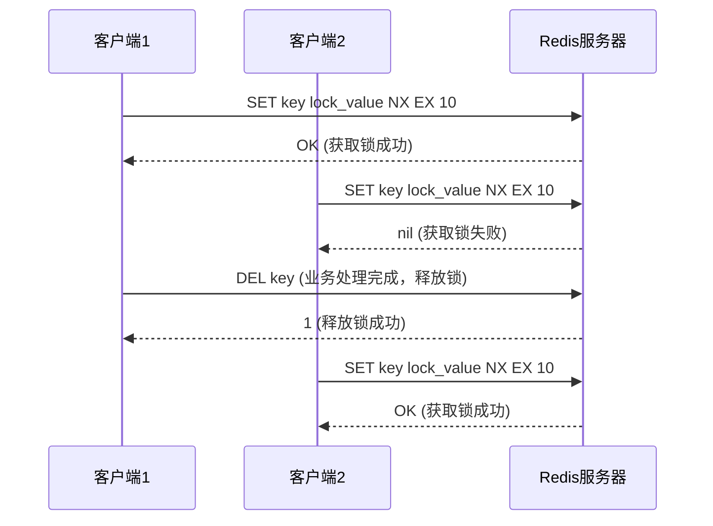
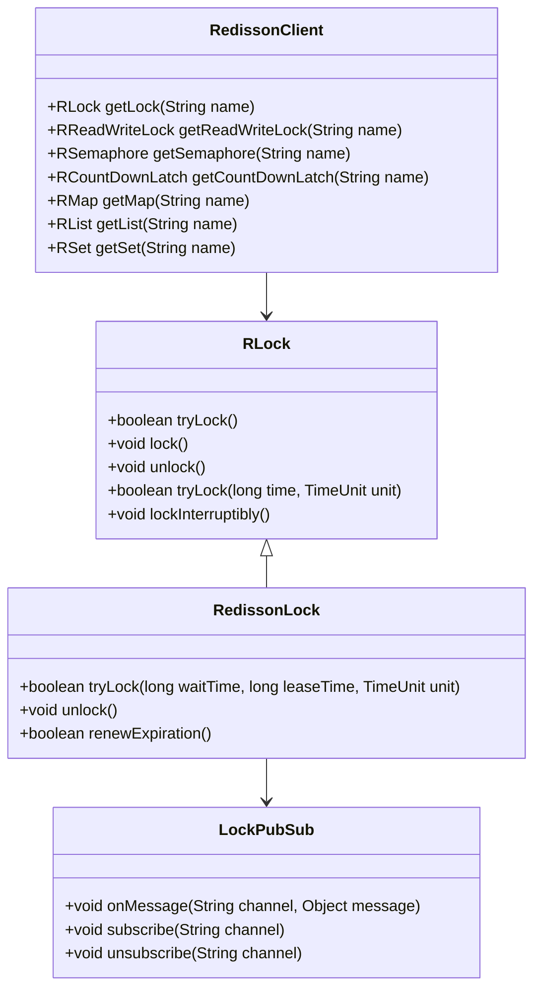

## 简介

在分布式系统中，保证数据一致性是一个核心挑战。分布式锁作为一种协调机制，用于解决多个进程或服务对共享资源的并发访问问题。Redis凭借其高性能、原子操作和丰富的命令集，成为实现分布式锁的理想选择。本文将详细介绍Redis分布式锁的实现原理、原生实现方式、Redisson框架的使用以及分布式锁的常见问题和解决方案，帮助开发者构建可靠的分布式锁系统。

## 架构知识点

### 分布式锁的基本概念

分布式锁是一种用于在分布式环境中协调多个进程或服务对共享资源访问的机制，需要满足以下特性：

1. **互斥性**：同一时刻只能有一个进程或服务持有锁
2. **可重入性**：同一个进程或服务可以多次获取同一把锁
3. **安全性**：锁只能被持有它的进程或服务释放
4. **可用性**：在分布式环境中，锁服务需要高可用
5. **死锁避免**：即使持有锁的进程崩溃，锁也能被正确释放

### Redis分布式锁实现原理

Redis实现分布式锁的核心是利用其原子操作和过期时间机制。基本原理如下：



### Redisson架构

Redisson是一个基于Redis的Java驻内存数据网格客户端，提供了丰富的分布式Java对象和服务，包括分布式锁。其架构如下：



## 源码分析

### 原生Redis分布式锁实现

```java
// 原生Redis分布式锁实现
public class RedisDistributedLock {
    
    private static final String LOCK_SUCCESS = "OK";
    private static final String SET_IF_NOT_EXIST = "NX";
    private static final String SET_WITH_EXPIRE_TIME = "EX";
    private static final Long RELEASE_SUCCESS = 1L;
    
    @Autowired
    private Jedis jedis;
    
    /**
     * 获取锁
     * @param lockKey 锁的键名
     * @param requestId 锁的持有者标识
     * @param expireTime 锁的过期时间（秒）
     * @return 是否获取成功
     */
    public boolean tryGetLock(String lockKey, String requestId, int expireTime) {
        String result = jedis.set(lockKey, requestId, SET_IF_NOT_EXIST, SET_WITH_EXPIRE_TIME, expireTime);
        return LOCK_SUCCESS.equals(result);
    }
    
    /**
     * 释放锁
     * @param lockKey 锁的键名
     * @param requestId 锁的持有者标识
     * @return 是否释放成功
     */
    public boolean releaseLock(String lockKey, String requestId) {
        String script = "if redis.call('get', KEYS[1]) == ARGV[1] then return redis.call('del', KEYS[1]) else return 0 end";
        Object result = jedis.eval(script, Collections.singletonList(lockKey), Collections.singletonList(requestId));
        return RELEASE_SUCCESS.equals(result);
    }
}
```

### Redisson分布式锁核心实现

```java
// RedissonLock.tryLock()方法核心逻辑
public boolean tryLock(long waitTime, long leaseTime, TimeUnit unit) throws InterruptedException {
    long startTime = System.currentTimeMillis();
    long threadId = Thread.currentThread().getId();
    Long ttl = tryAcquire(leaseTime, unit, threadId);
    
    // 如果ttl为null，表示获取锁成功
    if (ttl == null) {
        return true;
    }
    
    // 计算剩余等待时间
    long wait = waitTime - (System.currentTimeMillis() - startTime);
    if (wait <= 0) {
        // 等待时间已到，获取锁失败
        acquireFailed(threadId);
        return false;
    }
    
    // 订阅锁释放事件
    RFuture<RedissonLockEntry> subscribeFuture = subscribe(threadId);
    try {
        // 等待锁释放事件或超时
        subscribeFuture.await(wait, TimeUnit.MILLISECONDS);
    } finally {
        // 取消订阅
        unsubscribe(subscribeFuture, threadId);
    }
    
    // 递归尝试获取锁
    return tryLock(waitTime, leaseTime, unit);
}

// 续约锁的过期时间
private void renewExpiration() {
    ExpirationEntry ee = EXPIRATION_RENEWAL_MAP.get(getEntryName());
    if (ee == null) {
        return;
    }
    
    Timeout task = commandExecutor.getConnectionManager().newTimeout(new TimerTask() {
        @Override
        public void run(Timeout timeout) throws Exception {
            ExpirationEntry ent = EXPIRATION_RENEWAL_MAP.get(getEntryName());
            if (ent == null) {
                return;
            }
            Long threadId = ent.getFirstThreadId();
            if (threadId == null) {
                return;
            }
            
            // 续约锁的过期时间
            RFuture<Boolean> future = renewExpirationAsync(threadId);
            future.onComplete((res, e) -> {
                if (e != null) {
                    log.error("Can't update lock " + getName() + " expiration", e);
                    return;
                }
                
                if (res) {
                    // 递归调用续约
                    renewExpiration();
                }
            });
        }
    }, internalLockLeaseTime / 3, TimeUnit.MILLISECONDS);
    
    ee.setTimeout(task);
}
```

## 实际应用

### 1. 原生Redis分布式锁使用

```java
@Service
public class OrderService {
    
    @Autowired
    private RedisDistributedLock redisLock;
    
    public boolean createOrder(String userId, String productId, int quantity) {
        String lockKey = "order_lock:" + productId;
        String requestId = UUID.randomUUID().toString();
        int expireTime = 30; // 锁过期时间30秒
        
        try {
            // 尝试获取锁
            boolean isLocked = redisLock.tryGetLock(lockKey, requestId, expireTime);
            if (!isLocked) {
                // 获取锁失败，返回错误
                return false;
            }
            
            // 业务处理：检查库存、创建订单、扣减库存
            // ...
            
            return true;
        } finally {
            // 释放锁
            redisLock.releaseLock(lockKey, requestId);
        }
    }
}
```

### 2. Redisson分布式锁使用

#### 步骤1：添加依赖

```xml
<dependency>
    <groupId>org.redisson</groupId>
    <artifactId>redisson-spring-boot-starter</artifactId>
    <version>3.23.0</version>
</dependency>
```

#### 步骤2：配置Redisson

```yaml
spring:
  redis:
    host: localhost
    port: 6379
    password: yourpassword
    database: 0
    
redisson:
  threads: 16
  netty-threads: 32
  lock-watchdog-timeout: 30000
  single-server-config:
    address: redis://localhost:6379
    password: yourpassword
    database: 0
    connection-minimum-idle-size: 5
    connection-pool-size: 16
    timeout: 3000
```

#### 步骤3：使用Redisson分布式锁

```java
@Service
public class OrderService {
    
    @Autowired
    private RedissonClient redissonClient;
    
    public boolean createOrder(String userId, String productId, int quantity) {
        // 获取分布式锁
        RLock lock = redissonClient.getLock("order_lock:" + productId);
        
        try {
            // 尝试获取锁，最多等待5秒，锁定10秒后自动释放
            boolean isLocked = lock.tryLock(5, 10, TimeUnit.SECONDS);
            if (!isLocked) {
                // 获取锁失败，返回错误
                return false;
            }
            
            // 业务处理：检查库存、创建订单、扣减库存
            // ...
            
            return true;
        } catch (InterruptedException e) {
            Thread.currentThread().interrupt();
            return false;
        } finally {
            // 释放锁
            if (lock.isLocked() && lock.isHeldByCurrentThread()) {
                lock.unlock();
            }
        }
    }
}
```

### 3. 读写锁使用

```java
@Service
public class ProductService {
    
    @Autowired
    private RedissonClient redissonClient;
    
    public Product getProduct(String productId) {
        // 获取读锁
        RReadWriteLock rwLock = redissonClient.getReadWriteLock("product_rwlock:" + productId);
        RLock readLock = rwLock.readLock();
        
        try {
            readLock.lock();
            // 读取产品信息
            // ...
            return product;
        } finally {
            readLock.unlock();
        }
    }
    
    public Product updateProduct(Product product) {
        // 获取写锁
        RReadWriteLock rwLock = redissonClient.getReadWriteLock("product_rwlock:" + product.getId());
        RLock writeLock = rwLock.writeLock();
        
        try {
            writeLock.lock(5, 10, TimeUnit.SECONDS);
            // 更新产品信息
            // ...
            return product;
        } catch (InterruptedException e) {
            Thread.currentThread().interrupt();
            return null;
        } finally {
            if (writeLock.isLocked() && writeLock.isHeldByCurrentThread()) {
                writeLock.unlock();
            }
        }
    }
}
```

### 4. 信号量和倒计时门闩

```java
@Service
public class TaskService {
    
    @Autowired
    private RedissonClient redissonClient;
    
    // 限制并发任务数
    public void executeTask(String taskId) {
        RSemaphore semaphore = redissonClient.getSemaphore("task_semaphore");
        
        try {
            // 尝试获取许可，最多等待5秒
            boolean acquired = semaphore.tryAcquire(5, TimeUnit.SECONDS);
            if (!acquired) {
                // 获取许可失败，任务执行失败
                return;
            }
            
            // 执行任务
            // ...
            
        } catch (InterruptedException e) {
            Thread.currentThread().interrupt();
        } finally {
            // 释放许可
            semaphore.release();
        }
    }
    
    // 等待多个任务完成
    public void waitForTasks(String taskGroupId, int taskCount) {
        RCountDownLatch latch = redissonClient.getCountDownLatch("task_latch:" + taskGroupId);
        
        try {
            // 设置门闩计数
            latch.trySetCount(taskCount);
            // 等待所有任务完成
            latch.await();
            
            // 所有任务完成后的处理
            // ...
            
        } catch (InterruptedException e) {
            Thread.currentThread().interrupt();
        }
    }
    
    // 单个任务完成
    public void completeTask(String taskGroupId) {
        RCountDownLatch latch = redissonClient.getCountDownLatch("task_latch:" + taskGroupId);
        // 递减门闩计数
        latch.countDown();
    }
}
```

## 常见问题及解决方案

### 1. 锁过期问题

**问题**：锁的过期时间设置不合理，导致业务未处理完成锁就被释放

**解决方案**：

- 使用Redisson的自动续约机制（看门狗）
- 合理评估业务处理时间，设置足够长的过期时间

```java
// Redisson自动续约机制
RLock lock = redissonClient.getLock("order_lock");
// 不指定过期时间，Redisson会自动续约
lock.lock();
```

### 2. 锁释放错误

**问题**：锁被非持有它的客户端释放

**解决方案**：

- 使用唯一标识（如UUID）作为锁的值
- 释放锁时验证标识的正确性

```java
// 释放锁时验证标识
String script = "if redis.call('get', KEYS[1]) == ARGV[1] then return redis.call('del', KEYS[1]) else return 0 end";
Object result = jedis.eval(script, Collections.singletonList(lockKey), Collections.singletonList(requestId));
```

### 3. 死锁问题

**问题**：客户端获取锁后崩溃，导致锁无法释放

**解决方案**：

- 为锁设置合理的过期时间
- 使用Redisson的自动续约和监控机制

```java
// 设置过期时间避免死锁
SET key lock_value NX EX 10
```

### 4. 集群环境下的锁失效

**问题**：在Redis集群环境中，由于主从复制的异步性，可能导致锁失效

**解决方案**：

- 使用RedLock算法
- 确保Redis集群的可靠性
- 使用Redisson的RedLock实现

```java
// Redisson RedLock实现
RLock lock1 = redissonClient1.getLock("order_lock");
RLock lock2 = redissonClient2.getLock("order_lock");
RLock lock3 = redissonClient3.getLock("order_lock");

RedissonRedLock lock = new RedissonRedLock(lock1, lock2, lock3);
lock.lock();
try {
    // 业务处理
} finally {
    lock.unlock();
}
```

### 5. 性能问题

**问题**：大量客户端同时竞争锁，导致性能下降

**解决方案**：

- 减少锁的持有时间
- 使用细粒度锁
- 考虑使用分段锁
- 使用Redisson的公平锁机制

```java
// 使用公平锁
RLock fairLock = redissonClient.getFairLock("order_lock");
fairLock.lock();
```

## 注意事项

### 1. 锁的粒度

- **粗粒度锁**：锁定范围大，容易导致并发度低
- **细粒度锁**：锁定范围小，并发度高，但管理复杂
- **分段锁**：将资源分成多个段，每个段使用独立的锁，平衡并发度和管理复杂度

### 2. 锁的命名规范

- 锁的名称应包含业务标识和资源标识
- 使用统一的命名格式，便于管理和监控
- 避免使用过于简单的名称，防止命名冲突

```java
// 推荐的锁命名格式
String lockKey = "{业务模块}:{资源类型}:{资源ID}";
String orderLockKey = "order:lock:" + orderId;
String productLockKey = "product:lock:" + productId;
```

### 3. 锁的监控

- 监控锁的获取和释放情况
- 监控锁的持有时间
- 监控锁的竞争情况
- 及时发现和解决锁相关的性能问题

### 4. 高可用考虑

- 使用Redis集群或哨兵模式确保Redis的高可用
- 考虑使用Redisson的集群模式
- 设计锁服务的降级方案

### 5. 分布式锁的适用场景

- 分布式任务调度
- 分布式事务协调
- 共享资源的并发访问控制
- 防止重复操作

## 总结

本文详细介绍了Redis分布式锁的实现原理、原生实现方式以及Redisson框架的使用。Redis分布式锁凭借其高性能和简单易用的特点，在分布式系统中得到了广泛应用。Redisson作为一个成熟的Redis客户端框架，提供了丰富的分布式锁实现，包括可重入锁、读写锁、信号量、倒计时门闩等，同时解决了原生实现中的许多问题，如自动续约、死锁避免等。

在实际应用中，需要根据业务需求选择合适的分布式锁实现方式，合理设置锁的过期时间，避免锁的粒度过于粗糙或精细，并注意锁的监控和高可用设计。通过正确使用Redis分布式锁，可以有效解决分布式系统中的并发访问问题，保证数据的一致性和系统的可靠性。

随着分布式系统的不断发展，分布式锁的实现方式也在不断演进。Redisson作为一个活跃维护的框架，不断推出新的特性和优化，为开发者提供更强大、更可靠的分布式锁服务。在未来的分布式系统开发中，Redis和Redisson将继续发挥重要作用。
