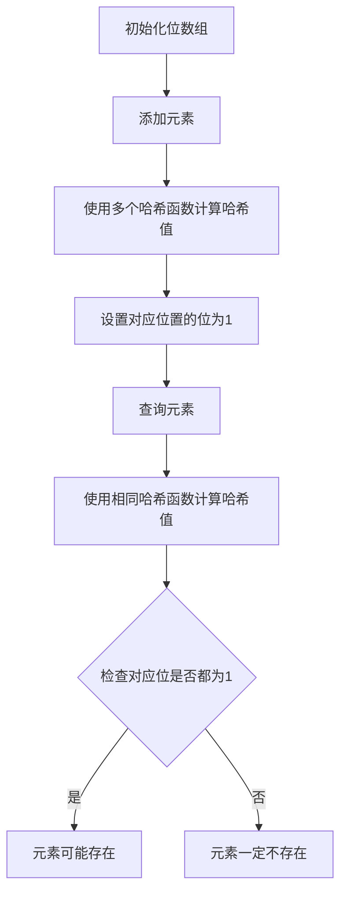
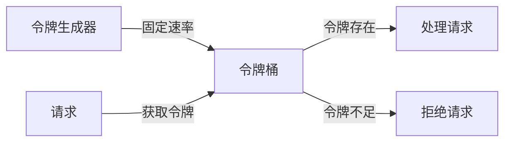
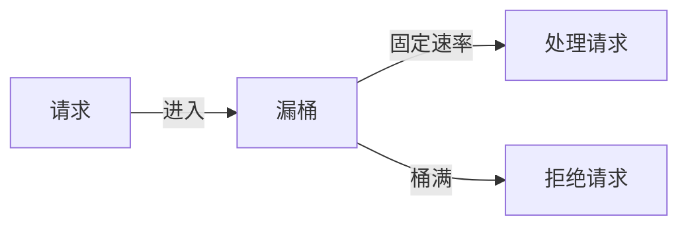
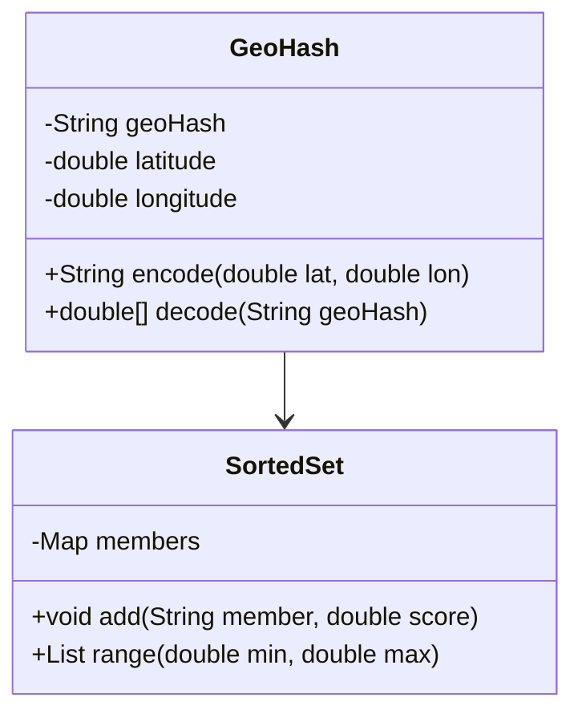
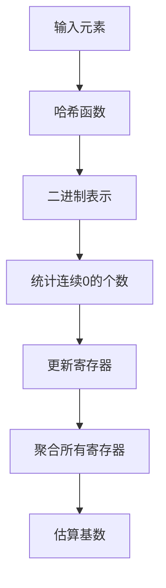
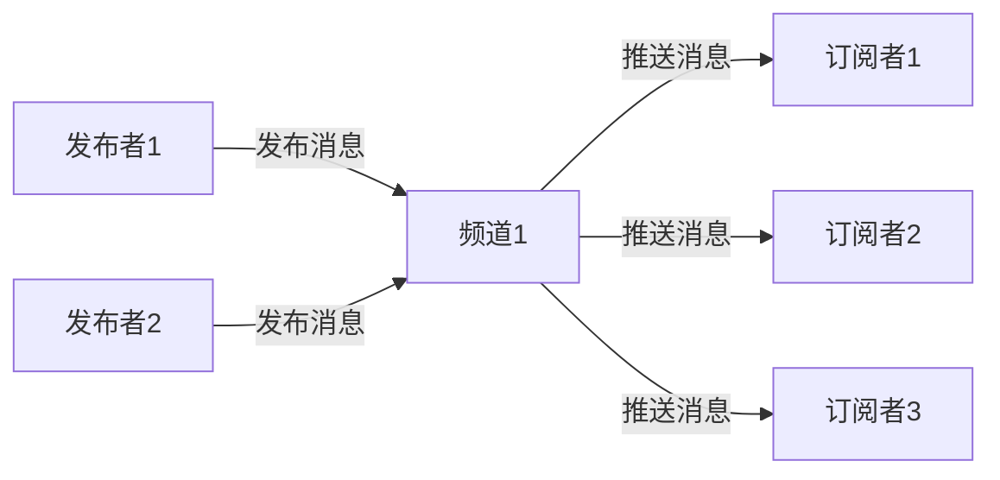
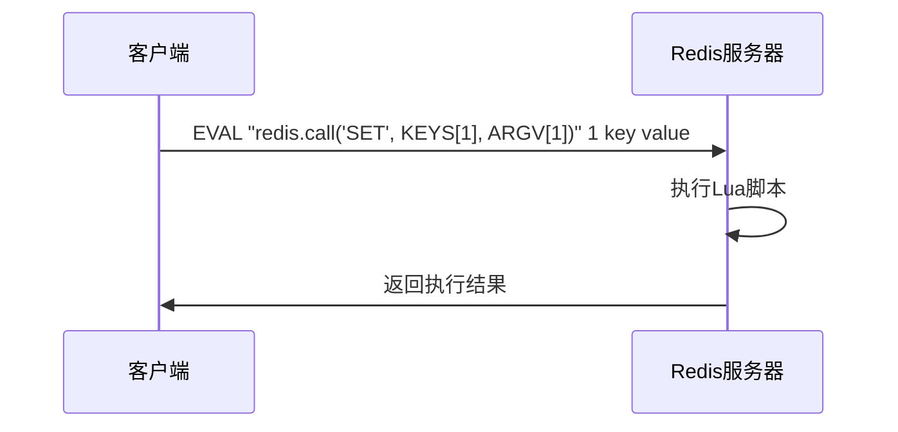

## 简介

Redis作为一款高性能的内存数据库，除了基本的数据结构和核心功能外，还提供了丰富的高级特性，这些特性能够帮助开发者解决复杂的业务场景问题。本文将详细介绍Redis的高级特性，包括布隆过滤器、限流机制、地理位置服务、基数统计、发布订阅模式、管道技术、Lua脚本等，并结合实际应用场景说明如何使用这些特性来提升系统性能和可靠性。

## 架构知识点

### 布隆过滤器（Bloom Filter）

布隆过滤器是一种空间效率极高的概率型数据结构，用于判断一个元素是否在集合中存在。它的特点是查询效率高、占用空间小，但存在一定的误判率（false positive）。

#### 工作原理

布隆过滤器由一个位数组和多个哈希函数组成：

1. 初始化：创建一个位数组，所有位初始化为0
2. 添加元素：使用多个哈希函数计算元素的哈希值，将对应位置的位设置为1
3. 查询元素：使用相同的哈希函数计算元素的哈希值，检查对应位置的位是否都为1
   - 如果有任何一位为0，则元素一定不存在
   - 如果所有位都为1，则元素可能存在（存在误判）



### 限流机制

限流是保护系统的重要手段，用于防止请求流量超过系统处理能力。Redis提供了多种限流实现方式：

#### 令牌桶算法

令牌桶算法是一种常用的限流算法，原理是系统以固定速率往桶中添加令牌，请求需要获取令牌才能被处理：



#### 漏桶算法

漏桶算法将请求放入桶中，以固定速率处理请求，无论输入流量如何变化：



### 地理位置服务（Geo）

Redis的Geo功能提供了地理位置数据的存储和查询能力，支持经纬度的存储、距离计算、范围查询等操作。

#### 数据结构

Geo功能基于Redis的有序集合（Sorted Set）实现，使用GeoHash算法将经纬度编码为64位整数：



### 基数统计（HyperLogLog）

HyperLogLog是一种用于估算集合基数的概率型数据结构，能够以极小的空间（约12KB）估算出大规模数据的基数。

#### 工作原理

HyperLogLog基于伯努利试验原理，通过统计随机事件的最大连续0的个数来估算基数：



### 发布订阅模式

Redis的发布订阅模式实现了消息的异步通信机制，支持多个发布者和多个订阅者。

#### 架构



### Lua脚本

Redis支持Lua脚本，允许用户原子性地执行多个Redis命令，确保操作的原子性和一致性。

#### 执行流程



## 源码分析

### 布隆过滤器实现

Redis 4.0+通过插件方式支持布隆过滤器，核心实现位于RedisBloom模块中：

```c
// 布隆过滤器添加元素
int BloomAdd(BloomFilter *bf, robj *ele) {
    size_t added = 0;
    uint64_t hash_val[BF_HASH_NUM];
    // 计算多个哈希值
    BloomHash(ele->ptr, sdslen(ele->ptr), hash_val);
    
    // 设置对应位置的位
    for (int i = 0; i < BF_HASH_NUM; i++) {
        uint64_t bitpos = hash_val[i] % bf->bitsize;
        if (RedisModule_BitfieldSet(bf->ctx, bf->key, BF_SUBKEY, bitpos, 1, 1) == 0) {
            added = 1;
        }
    }
    return added;
}

// 布隆过滤器查询元素
int BloomExists(BloomFilter *bf, robj *ele) {
    uint64_t hash_val[BF_HASH_NUM];
    // 计算多个哈希值
    BloomHash(ele->ptr, sdslen(ele->ptr), hash_val);
    
    // 检查对应位置的位
    for (int i = 0; i < BF_HASH_NUM; i++) {
        uint64_t bitpos = hash_val[i] % bf->bitsize;
        if (RedisModule_BitfieldGet(bf->ctx, bf->key, BF_SUBKEY, bitpos, 1) == 0) {
            return 0; // 元素不存在
        }
    }
    return 1; // 元素可能存在
}
```

### 限流实现

基于Redis的令牌桶限流实现：

```java
public boolean tryAcquire(String key, int capacity, double rate, TimeUnit timeUnit) {
    String luaScript = """
        local key = KEYS[1]
        local capacity = tonumber(ARGV[1])
        local rate = tonumber(ARGV[2])
        local now = tonumber(ARGV[3])
        
        local bucket = redis.call('hgetall', key)
        local currentTokens, lastRefillTime
        
        if table.getn(bucket) == 0 then
            currentTokens = capacity
            lastRefillTime = now
        else
            currentTokens = tonumber(bucket[2])
            lastRefillTime = tonumber(bucket[4])
            
            -- 计算时间差
            local timeDiff = now - lastRefillTime
            -- 计算新增令牌数
            local newTokens = math.floor(timeDiff * rate)
            
            if newTokens > 0 then
                currentTokens = math.min(currentTokens + newTokens, capacity)
                lastRefillTime = now
            end
        end
        
        if currentTokens > 0 then
            currentTokens = currentTokens - 1
            redis.call('hmset', key, 'currentTokens', currentTokens, 'lastRefillTime', lastRefillTime)
            -- 设置过期时间
            redis.call('expire', key, math.ceil(capacity / rate) + 1)
            return true
        else
            return false
        end
    """;
    
    long now = System.currentTimeMillis() / 1000;
    List<String> keys = Collections.singletonList(key);
    List<String> args = Arrays.asList(
        String.valueOf(capacity),
        String.valueOf(rate / timeUnit.toSeconds(1)),
        String.valueOf(now)
    );
    
    return (Boolean) redisTemplate.execute(new DefaultRedisScript<>(luaScript, Boolean.class), keys, args);
}
```

## 实际应用

### 布隆过滤器的应用

#### 缓存穿透防护

使用布隆过滤器防止缓存穿透，避免不存在的key频繁查询数据库：

```java
public Object getData(String key) {
    // 1. 先从布隆过滤器查询
    if (!bloomFilter.mightContain(key)) {
        return null;
    }
    
    // 2. 从缓存查询
    Object value = cache.get(key);
    if (value != null) {
        return value;
    }
    
    // 3. 从数据库查询
    value = database.get(key);
    if (value != null) {
        cache.put(key, value);
    }
    return value;
}
```

### 限流的应用

#### API接口限流

使用Redis实现API接口限流：

```java
@RestController
@RequestMapping("/api")
public class ApiController {
    
    @Autowired
    private RateLimiter rateLimiter;
    
    @GetMapping("/resource")
    public String getResource() {
        String key = "api:resource:" + RequestContextHolder.getRequestAttributes().getRemoteAddress();
        // 每分钟最多100个请求
        if (!rateLimiter.tryAcquire(key, 100, 1.0 / 60, TimeUnit.SECONDS)) {
            throw new RateLimitExceededException("请求频率过高，请稍后再试");
        }
        // 处理请求
        return "Success";
    }
}
```

### Geo的应用

#### 附近商家查询

使用Redis Geo实现附近商家查询：

```java
@Service
public class MerchantService {
    
    @Autowired
    private RedisTemplate redisTemplate;
    
    // 添加商家位置
    public void addMerchantLocation(String merchantId, double longitude, double latitude) {
        redisTemplate.opsForGeo().add("merchants", new Point(longitude, latitude), merchantId);
    }
    
    // 查询附近商家
    public List<String> findNearbyMerchants(double longitude, double latitude, double radius, String unit) {
        Circle circle = new Circle(new Point(longitude, latitude), new Distance(radius, DistanceUnit.fromString(unit)));
        GeoResults<GeoLocation<String>> results = redisTemplate.opsForGeo()
            .radius("merchants", circle, GeoRadiusCommandArgs.newGeoRadiusArgs().includeDistance());
        
        return results.getContent().stream()
            .map(result -> result.getContent().getName())
            .collect(Collectors.toList());
    }
}
```

### HyperLogLog的应用

#### UV统计

使用HyperLogLog实现网站UV统计：

```java
@Service
public class UvService {
    
    @Autowired
    private RedisTemplate redisTemplate;
    
    // 记录访问用户
    public void recordVisit(String userId) {
        redisTemplate.opsForHyperLogLog().add("uv:today", userId);
    }
    
    // 获取今日UV
    public long getTodayUv() {
        return redisTemplate.opsForHyperLogLog().size("uv:today");
    }
    
    // 合并多天UV
    public long getRangeUv(String... dates) {
        String[] keys = Arrays.stream(dates).map(date -> "uv:" + date).toArray(String[]::new);
        redisTemplate.opsForHyperLogLog().union("uv:range", keys);
        return redisTemplate.opsForHyperLogLog().size("uv:range");
    }
}
```

### 发布订阅的应用

#### 实时消息通知

使用Redis发布订阅实现实时消息通知：

```java
// 发布者
@Service
public class MessagePublisher {
    
    @Autowired
    private RedisTemplate redisTemplate;
    
    public void publishMessage(String channel, Object message) {
        redisTemplate.convertAndSend(channel, message);
    }
}

// 订阅者
@Component
public class MessageSubscriber implements MessageListener {
    
    @Override
    public void onMessage(Message message, byte[] pattern) {
        String channel = new String(pattern != null ? pattern : message.getChannel());
        String messageBody = new String(message.getBody());
        // 处理消息
        System.out.println("Received message: " + messageBody + " from channel: " + channel);
    }
}

// 配置
@Configuration
public class RedisConfig {
    
    @Bean
    public RedisMessageListenerContainer redisMessageListenerContainer(RedisConnectionFactory connectionFactory, MessageSubscriber subscriber) {
        RedisMessageListenerContainer container = new RedisMessageListenerContainer();
        container.setConnectionFactory(connectionFactory);
        container.addMessageListener(subscriber, new PatternTopic("notifications:*"));
        return container;
    }
}
```

### Lua脚本的应用

#### 原子操作

使用Lua脚本实现原子操作，确保多个命令的原子性：

```java
public boolean transfer(String from, String to, double amount) {
    String luaScript = """
        local from = KEYS[1]
        local to = KEYS[2]
        local amount = tonumber(ARGV[1])
        
        -- 检查余额
        local fromBalance = tonumber(redis.call('hget', from, 'balance'))
        if fromBalance < amount then
            return 0
        end
        
        -- 扣款
        redis.call('hincrbyfloat', from, 'balance', -amount)
        -- 入账
        redis.call('hincrbyfloat', to, 'balance', amount)
        
        return 1
    """;
    
    List<String> keys = Arrays.asList(from, to);
    List<String> args = Collections.singletonList(String.valueOf(amount));
    
    return (Long) redisTemplate.execute(new DefaultRedisScript<>(luaScript, Long.class), keys, args) == 1;
}
```

## 常见问题及解决方案

### 布隆过滤器的误判问题

**问题**：布隆过滤器存在误判率，可能将不存在的元素判断为存在。

**解决方案**：

- 合理设置布隆过滤器的参数（位数组大小、哈希函数数量）
- 结合其他机制（如缓存）减少误判影响
- 对于关键业务，使用精确的集合代替布隆过滤器

### 限流算法的选择

**问题**：如何选择合适的限流算法？

**解决方案**：

- 令牌桶算法适合允许突发流量的场景
- 漏桶算法适合严格控制流量的场景
- 滑动窗口算法适合需要精确控制时间窗口内请求数量的场景

### Geo的精度问题

**问题**：Redis Geo的精度有限，可能不适合高精度的位置计算。

**解决方案**：

- Redis Geo使用52位精度，在距离计算时存在一定误差
- 对于高精度需求，使用专业的地理信息系统（GIS）
- 结合其他技术（如PostGIS）提供更精确的位置服务

### HyperLogLog的精度问题

**问题**：HyperLogLog是概率型数据结构，存在一定的误差。

**解决方案**：

- HyperLogLog的误差率约为0.81%，通常满足UV统计等场景需求
- 对于需要精确计数的场景，使用Set或Sorted Set
- 结合其他技术（如Spark）进行精确统计

### 发布订阅的可靠性问题

**问题**：Redis发布订阅模式不保证消息的可靠性，存在消息丢失的风险。

**解决方案**：

- 使用持久化的消息队列（如Kafka、RocketMQ）代替
- 结合Redis的List结构实现可靠的发布订阅
- 实现消息确认机制，确保消息被正确处理

## 注意事项

### 布隆过滤器注意事项

1. **参数选择**：根据预期元素数量和可接受的误判率选择合适的位数组大小和哈希函数数量
2. **无法删除**：标准布隆过滤器不支持删除元素，如需删除功能可使用计数布隆过滤器
3. **内存消耗**：虽然布隆过滤器占用空间小，但随着元素数量增加，误判率会上升

### 限流注意事项

1. **限流粒度**：合理选择限流粒度（接口、用户、IP等）
2. **限流策略**：根据业务需求选择合适的限流策略（令牌桶、漏桶等）
3. **降级处理**：限流后提供友好的降级处理，避免用户体验差

### Geo注意事项

1. **坐标范围**：Redis Geo支持的坐标范围有限（纬度：-85.05112878到85.05112878，经度：-180到180）
2. **距离计算**：Redis Geo使用Haversine公式计算距离，存在一定误差
3. **性能优化**：对于大规模数据，可使用分区策略提高查询性能

### HyperLogLog注意事项

1. **精度与内存**：HyperLogLog的精度与内存消耗成正比
2. **不支持删除**：HyperLogLog不支持删除单个元素
3. **适合场景**：适合UV统计、独立访客数等不需要精确计数的场景

### 发布订阅注意事项

1. **消息丢失**：Redis发布订阅模式不持久化消息，订阅者离线期间的消息会丢失
2. **性能限制**：Redis单节点的发布订阅性能有限，不适合高并发场景
3. **扩展性**：Redis Cluster对发布订阅的支持有限，需要特殊处理

### Lua脚本注意事项

1. **性能影响**：复杂的Lua脚本可能影响Redis性能
2. **调试困难**：Lua脚本的调试相对困难，需要谨慎编写
3. **原子性**：确保Lua脚本的原子性，避免长时间阻塞Redis

## 总结

Redis的高级特性为开发者提供了强大的功能支持，能够解决各种复杂的业务场景问题。本文详细介绍了Redis的布隆过滤器、限流机制、地理位置服务、基数统计、发布订阅模式和Lua脚本等高级特性，包括它们的工作原理、实现方式和实际应用场景。

合理使用Redis的高级特性可以：

1. 提升系统性能：通过缓存、管道技术等减少网络开销
2. 增强系统可靠性：通过布隆过滤器、限流等保护系统
3. 简化开发：利用Redis提供的高级功能减少重复开发
4. 降低成本：使用Redis的内存数据库特性减少硬件成本

在实际应用中，需要根据业务需求选择合适的Redis高级特性，并注意其限制和最佳实践，以充分发挥Redis的优势，构建高性能、可靠的系统。
