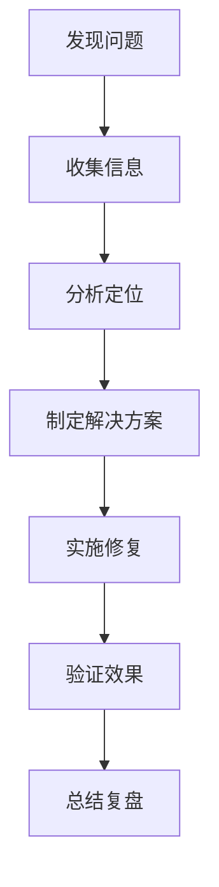
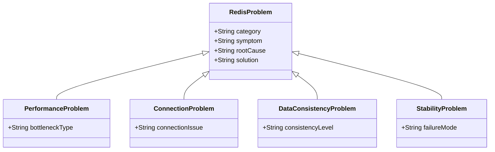

## 简介

Redis作为一款高性能的内存数据库，在大规模应用中扮演着重要角色。然而，在使用过程中，开发者可能会遇到各种问题，如性能瓶颈、连接异常、数据一致性问题等。本文将系统地总结Redis常见问题的症状、根因分析和解决方案，并提供故障排查的方法论和最佳实践，帮助开发者快速定位和解决Redis相关问题，确保系统的稳定性和可靠性。

## 架构知识点

### Redis故障排查方法论

Redis故障排查需要遵循科学的方法论，通常包括以下步骤：



### 关键信息收集

排查Redis问题时，需要收集以下关键信息：

1. **Redis日志**：包含错误信息、警告和运行状态
2. **监控指标**：内存使用、CPU负载、网络流量、命令执行时间等
3. **配置信息**：Redis配置文件和运行时配置
4. **系统信息**：服务器资源使用情况、操作系统版本等
5. **客户端信息**：连接数、请求模式、错误日志等

### 常见问题分类

Redis问题可以分为以下几类：



## 源码分析

### Redis错误处理机制

Redis内部实现了完善的错误处理机制，核心代码位于`server.c`和`networking.c`文件中：

```c
// 错误处理示例
void redisPanic(char *msg) {
    // 记录错误日志
    redisLog(REDIS_WARNING, "Redis panic: %s", msg);
    
    // 执行紧急保存
    if (server.saveparamslen > 0) {
        rdbSave(server.rdb_filename);
    }
    
    // 终止进程
    abort();
}

// 客户端错误处理
void addReplyError(redisClient *c, const char *err) {
    addReply(c, shared.errorbulk);
    addReplyBulkCString(c, err);
}

// 连接错误处理
void freeClient(redisClient *c) {
    // 清理客户端资源
    if (c->flags & REDIS_MONITOR) server.monitors--;
    if (c->flags & REDIS_SLAVE) freeSlaveClient(c);
    if (c->fd > 0) {
        // 关闭套接字
        aeDeleteFileEvent(server.el, c->fd, AE_READABLE);
        aeDeleteFileEvent(server.el, c->fd, AE_WRITABLE);
        close(c->fd);
    }
    // 释放客户端内存
    sdsfree(c->querybuf);
    listRelease(c->reply);
    zfree(c);
}
```

### 内存管理源码

Redis内存管理的核心代码位于`zmalloc.c`文件中：

```c
// 内存分配
void *zmalloc(size_t size) {
    void *ptr = malloc(size+PREFIX_SIZE);
    if (!ptr) zmalloc_oom_handler(size);
    #ifdef HAVE_MALLOC_SIZE
    update_zmalloc_stat_alloc(zmalloc_size(ptr));
    return ptr;
    #else
    *((size_t*)ptr) = size;
    update_zmalloc_stat_alloc(size+PREFIX_SIZE);
    return (char*)ptr+PREFIX_SIZE;
    #endif
}

// 内存不足处理
static void zmalloc_default_oom_handler(size_t size) {
    fprintf(stderr, "zmalloc: Out of memory trying to allocate %zu bytes\n", size);
    fflush(stderr);
    abort();
}
```

## 实际应用

### 性能问题排查与优化

#### 高内存使用率问题

**症状**：Redis内存使用率持续升高，接近或达到配置的内存上限

**排查步骤**：

```java
// 查看内存使用情况
redis-cli info memory

// 查找大key
redis-cli --bigkeys

// 查看内存分配详情
redis-cli memory doctor
```

**解决方案**：

- 实施key过期策略，定期清理无用数据
- 使用LRU/LFU淘汰策略，设置合理的maxmemory-policy
- 优化数据结构，使用更高效的数据类型
- 考虑集群扩容，分散内存压力

#### 高CPU使用率问题

**症状**：Redis进程CPU使用率过高

**排查步骤**：

```java
// 查看CPU使用情况
redis-cli info stats

// 监控命令执行时间
redis-cli --latency

// 查看慢查询日志
redis-cli config get slowlog-max-len
redis-cli slowlog get
```

**解决方案**：

- 优化慢查询命令，避免使用O(N)复杂度的命令
- 减少频繁的小命令，使用管道（Pipeline）批量处理
- 增加Redis实例数量，分散CPU负载
- 考虑使用Redis Cluster进行水平扩展

### 连接问题排查与解决

#### 连接数过多问题

**症状**：客户端无法连接Redis，报错"max number of clients reached"

**排查步骤**：

```java
// 查看当前连接数
redis-cli info clients

// 查看最大连接数配置
redis-cli config get maxclients
```

**解决方案**：

- 增加maxclients配置值
- 检查客户端连接泄露问题
- 使用连接池管理客户端连接
- 考虑使用Redis Cluster分散连接压力

#### 连接超时问题

**症状**：客户端连接Redis超时，报错"connection timeout"

**排查步骤**：

```java
// 检查网络连通性
ping redis-server-ip

// 检查Redis进程状态
ps -ef | grep redis

// 检查防火墙设置
iptables -L -n
```

**解决方案**：

- 检查网络配置，确保网络通畅
- 调整Redis超时配置（timeout）
- 优化客户端连接参数（connectTimeout、socketTimeout）
- 增加Redis实例，分散连接压力

### 数据一致性问题排查与解决

#### 主从复制延迟问题

**症状**：从节点数据与主节点不一致，存在明显延迟

**排查步骤**：

```java
// 查看主从复制状态
redis-cli info replication

// 监控复制延迟
redis-cli --latency -h slave-ip -p slave-port
```

**解决方案**：

- 优化网络环境，减少主从节点之间的网络延迟
- 调整主从复制配置（repl-backlog-size、repl-ping-slave-period等）
- 避免在主节点执行大命令或批量操作
- 考虑使用Redis Cluster，提高数据一致性

#### 数据丢失问题

**症状**：Redis数据意外丢失

**排查步骤**：

```java
// 检查持久化配置
redis-cli config get save
redis-cli config get appendonly

// 查看持久化日志
tail -f redis-server.log

// 检查数据文件完整性
redis-check-rdb dump.rdb
redis-check-aof appendonly.aof
```

**解决方案**：

- 启用AOF持久化，并设置适当的fsync策略
- 结合使用RDB和AOF持久化
- 定期备份数据文件
- 配置合理的过期策略，避免误删除

## 常见问题及解决方案

### 性能相关问题

#### 1. 大key问题

**症状**：某些key占用内存过大，导致内存使用率不均匀，影响性能

**解决方案**：

- 使用redis-cli --bigkeys命令定期检测大key
- 将大key拆分为多个小key，如将一个大Hash拆分为多个小Hash
- 对于列表类型的大key，可以使用LPOP/RPOP分批处理
- 考虑使用压缩算法压缩数据

#### 2. 慢查询问题

**症状**：某些命令执行时间过长，阻塞Redis主线程

**解决方案**：

- 配置慢查询日志，设置合理的slowlog-log-slower-than阈值
- 避免使用O(N)复杂度的命令，如KEYS、HGETALL、SMEMBERS等
- 对于必须使用的O(N)命令，添加LIMIT限制返回结果数量
- 考虑使用SCAN、HSCAN等迭代命令替代

#### 3. 内存碎片问题

**症状**：Redis实际使用内存远大于数据占用内存，内存碎片率过高

**解决方案**：

- 使用jemalloc内存分配器（Redis 5.0+默认使用）
- 配置maxmemory-policy为volatile-lru或allkeys-lru
- 定期重启Redis实例（适用于可容忍短暂服务中断的场景）
- 使用Redis 4.0+的MEMORY PURGE命令手动清理内存碎片（实验性）

### 连接相关问题

#### 1. 连接泄露问题

**症状**：Redis连接数持续增长，最终达到maxclients限制

**解决方案**：

- 检查客户端代码，确保连接使用后正确关闭
- 使用连接池管理客户端连接，限制最大连接数
- 设置合理的连接超时时间
- 定期检查并清理闲置连接

#### 2. 网络波动问题

**症状**：Redis连接频繁断开和重连，影响服务稳定性

**解决方案**：

- 优化网络环境，确保网络稳定
- 配置合理的TCP参数（如tcp-keepalive）
- 实现客户端重连机制，增加重连间隔和重试次数
- 使用哨兵模式或Cluster模式提高可用性

### 持久化相关问题

#### 1. RDB持久化失败

**症状**：RDB快照文件生成失败，或生成的文件损坏

**解决方案**：

- 检查磁盘空间是否充足
- 检查Redis用户是否有文件写入权限
- 配置合理的save参数，避免过于频繁的RDB快照
- 使用redis-check-rdb工具检查RDB文件完整性

#### 2. AOF文件过大问题

**症状**：AOF文件持续增长，占用大量磁盘空间

**解决方案**：

- 启用AOF重写机制（auto-aof-rewrite-percentage和auto-aof-rewrite-min-size）
- 手动执行BGREWRITEAOF命令进行AOF重写
- 结合使用RDB和AOF持久化，减少AOF文件大小
- 定期备份AOF文件并清理旧文件

#### 3. AOF恢复失败

**症状**：Redis重启时，AOF文件恢复失败

**解决方案**：

- 使用redis-check-aof工具检查并修复AOF文件
- 启用aof-load-truncated配置，允许加载截断的AOF文件
- 考虑使用AOF的no-appendfsync-on-rewrite配置，避免重写时的fsync阻塞

### 主从复制相关问题

#### 1. 主从复制中断

**症状**：主从复制关系中断，从节点无法同步主节点数据

**解决方案**：

- 检查网络连通性，确保主从节点之间可以正常通信
- 检查主节点是否设置了requirepass，从节点是否配置了masterauth
- 检查从节点的slaveof配置是否正确
- 考虑使用哨兵模式自动监控和恢复主从复制

#### 2. 从节点同步过慢

**症状**：从节点数据同步延迟过大，影响数据一致性

**解决方案**：

- 优化网络环境，减少主从节点之间的网络延迟
- 配置适当的repl-backlog-size，增加复制缓冲区大小
- 减少主节点的写入压力，避免频繁的大批量写入
- 考虑使用多从节点分担读请求压力

### Redis Cluster相关问题

#### 1. 集群节点故障

**症状**：Cluster中某个或多个节点故障，影响集群可用性

**解决方案**：

- 配置合理的cluster-node-timeout参数
- 确保集群有足够的副本节点，设置cluster-replica-count≥1
- 使用redis-trib.rb或redis-cli cluster命令监控集群状态
- 及时替换故障节点，保持集群完整性

#### 2. 数据分片不均匀

**症状**：Cluster中各节点的数据分片不均匀，导致负载不均衡

**解决方案**：

- 使用redis-cli cluster rebalance命令重新平衡数据分片
- 考虑使用hash tags将相关key分配到同一个槽位
- 优化key的命名规则，确保hash分布均匀

## 注意事项

### 监控与告警

1. **建立完善的监控体系**：监控Redis的关键指标，如内存使用、CPU负载、连接数、命令执行时间等
2. **设置合理的告警阈值**：针对不同指标设置告警阈值，及时发现潜在问题
3. **实现多维度监控**：从应用层、Redis层、系统层三个维度进行监控
4. **保存监控历史数据**：用于问题回溯和趋势分析

### 配置管理

1. **版本控制配置文件**：使用Git等版本控制工具管理Redis配置文件
2. **定期审核配置**：定期审核Redis配置，确保符合最佳实践
3. **备份配置文件**：在修改配置前备份当前配置，以便回滚
4. **使用配置模板**：为不同环境（开发、测试、生产）创建标准化的配置模板

### 安全管理

1. **设置强密码**：使用requirepass配置设置强密码
2. **限制访问IP**：使用bind配置限制可访问的IP地址
3. **禁用危险命令**：重命名或禁用危险命令，如FLUSHDB、FLUSHALL等
4. **启用SSL/TLS**：在生产环境中启用SSL/TLS加密传输

### 升级与维护

1. **制定升级计划**：升级Redis版本前制定详细的升级计划和回滚方案
2. **充分测试**：在测试环境中充分测试新版本的兼容性和稳定性
3. **灰度升级**：生产环境中采用灰度升级策略，逐步升级节点
4. **定期维护**：定期清理无用数据、检查持久化文件、优化配置等

## 总结

本文系统地总结了Redis常见问题的症状、根因分析和解决方案，涵盖了性能问题、连接问题、数据一致性问题、持久化问题、主从复制问题和Redis Cluster问题等多个方面。通过遵循科学的故障排查方法论，收集关键信息，分析定位问题，并实施针对性的解决方案，开发者可以快速有效地解决Redis相关问题。

在使用Redis时，开发者还需要注意以下几点：

1. 建立完善的监控告警体系，及时发现潜在问题
2. 遵循最佳实践配置Redis，避免常见的配置错误
3. 定期进行维护和优化，确保Redis的稳定性和性能
4. 持续学习Redis的新特性和最佳实践，不断提升技术水平

通过合理使用Redis并掌握故障排查技巧，开发者可以充分发挥Redis的优势，构建高性能、高可用的分布式系统。
