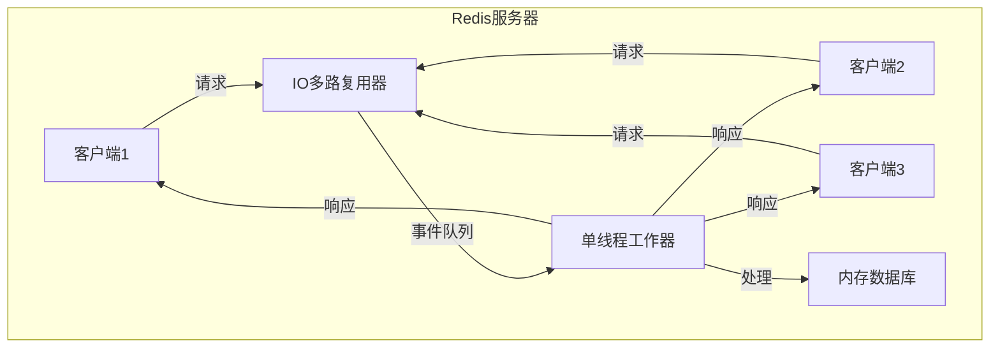
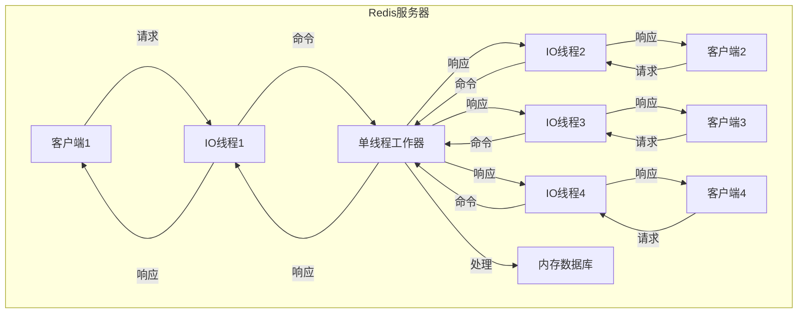
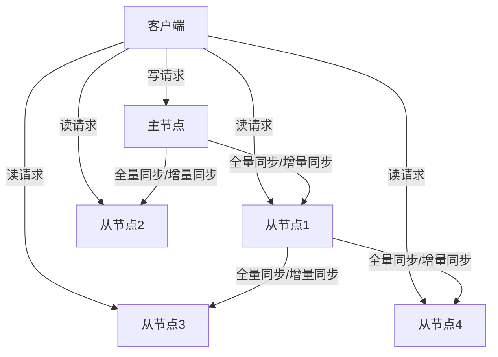
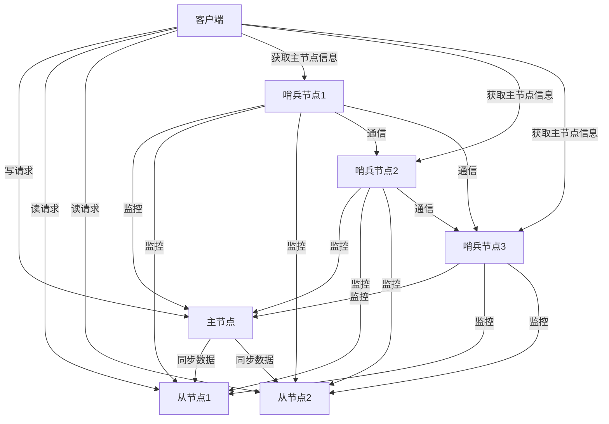
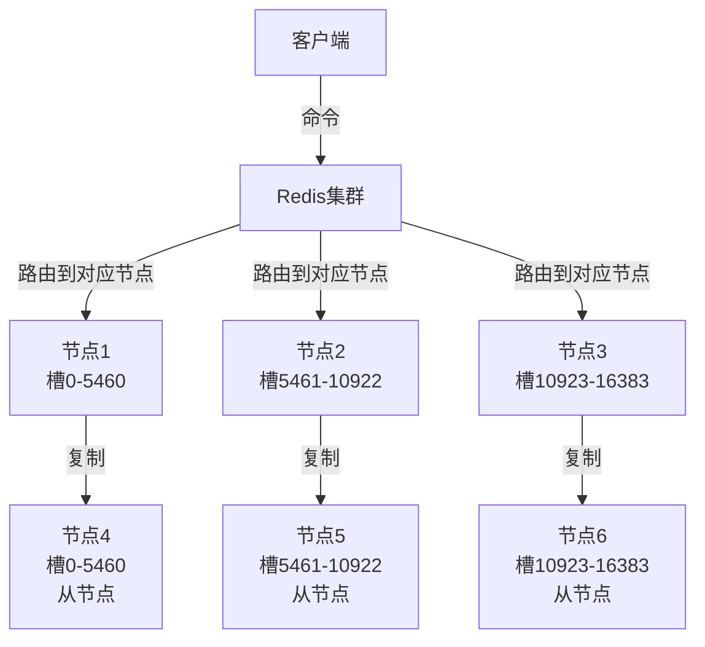
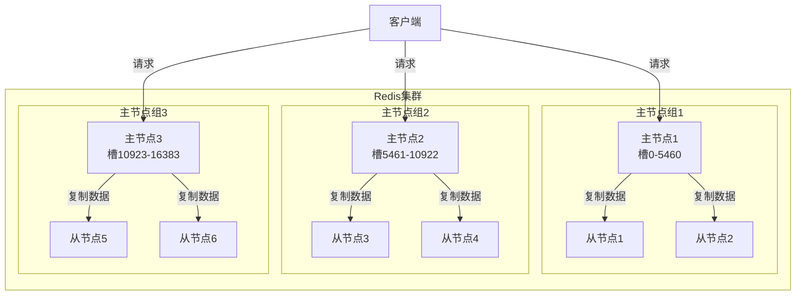
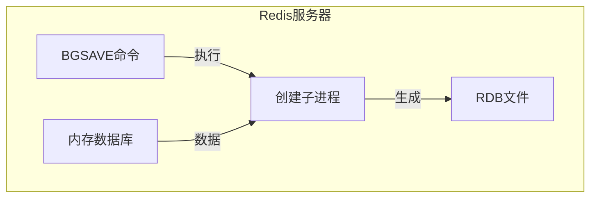
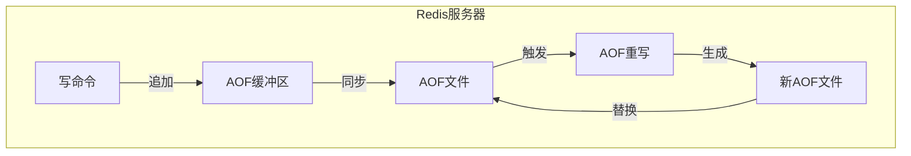

## 简介

Redis（Remote Dictionary Server）是一个开源的内存数据结构存储系统，它可以用作数据库、缓存和消息中间件。Redis以其高性能、丰富的数据结构和灵活的架构而闻名，被广泛应用于各种规模的应用系统中。

本文将深入分析Redis的架构设计，包括其独特的单线程模型、多线程应用场景、各种高可用模式（主从同步、哨兵模式、集群模式）以及数据持久化方案，帮助读者全面理解Redis的工作原理和最佳实践。

## Redis单线程模型与多线程应用

### Redis单线程模型

#### 单线程模型简介

Redis的核心处理逻辑是单线程的，这意味着所有客户端请求都由同一个线程按顺序处理。这种设计有以下优点：

1. **避免线程切换开销**：单线程不需要进行线程上下文切换，减少了CPU资源消耗
2. **避免锁竞争**：单线程不需要使用锁来保护共享数据，避免了死锁和锁竞争问题
3. **简化代码实现**：单线程模型使代码更加简洁、易于维护和调试
4. **充分利用内存**：Redis数据存储在内存中，单线程可以高效地访问内存数据

#### 单线程模型架构



Redis的单线程模型基于IO多路复用机制，它使用select、poll、epoll等系统调用同时监听多个客户端连接的IO事件。当有IO事件发生时，Redis会将这些事件放入事件队列，然后由单线程工作器按顺序处理这些事件。

#### 单线程模型的性能

尽管Redis是单线程的，但它的性能非常出色，主要原因是：

1. **内存操作**：Redis数据存储在内存中，内存访问速度非常快
2. **高效的数据结构**：Redis使用了高度优化的数据结构，如哈希表、跳表等
3. **非阻塞IO**：Redis使用IO多路复用机制，避免了IO阻塞
4. **减少网络往返**：Redis支持批量操作和管道技术，减少了网络往返次数

### Redis多线程应用

#### Redis 6.0前的多线程

在Redis 6.0之前，Redis的核心处理逻辑是单线程的，但以下操作是多线程的：

1. **数据持久化**：RDB和AOF文件的写入操作
2. **异步删除**：`UNLINK`、`FLUSHDB ASYNC`、`FLUSHALL ASYNC`等命令
3. **复制**：从节点接收主节点的数据时
4. **网络IO**：在某些情况下，网络IO操作可能由不同的线程处理

#### Redis 6.0后的多线程

Redis 6.0引入了多线程处理网络IO的功能，这是Redis架构的一个重要变化。多线程网络IO的主要特点是：

1. **核心处理逻辑仍然是单线程**：命令的执行仍然由单线程按顺序处理
2. **网络IO操作由多线程处理**：客户端连接的建立、读取请求、发送响应等操作由多个线程处理
3. **可配置的线程数**：可以通过配置文件设置IO线程的数量

#### Redis 6.0多线程架构



Redis 6.0的多线程架构使用了多个IO线程来处理网络请求和响应，而核心的命令执行仍然由单线程处理。这种设计既保持了单线程模型的简单性和安全性，又提高了网络IO的处理能力。

## Redis高可用模式

### 主从同步模式

#### 主从同步简介

主从同步是Redis最基本的高可用解决方案，它允许将一个Redis服务器（主节点）的数据复制到多个Redis服务器（从节点）。主从同步的主要作用是：

1. **数据冗余**：将数据复制到多个节点，提高数据的可靠性
2. **负载均衡**：将读请求分发到从节点，减轻主节点的压力
3. **故障恢复**：当主节点发生故障时，可以将从节点提升为主节点

#### 主从同步原理

主从同步包括两个阶段：全量同步和增量同步。

##### 全量同步

全量同步是指从节点首次连接到主节点时，主节点将所有数据发送给从节点。全量同步的过程如下：

1. 从节点发送`PSYNC ? -1`命令到主节点，请求全量同步
2. 主节点执行`BGSAVE`命令生成RDB文件
3. 主节点将RDB文件发送给从节点
4. 从节点接收并加载RDB文件
5. 主节点将生成RDB文件期间的写命令发送给从节点
6. 从节点执行这些写命令，保持数据与主节点一致

##### 增量同步

增量同步是指从节点与主节点建立连接后，主节点将后续的写命令发送给从节点。增量同步的过程如下：

1. 主节点维护一个复制积压缓冲区（replication backlog buffer），存储最近执行的写命令
2. 从节点发送`PSYNC <offset> <runid>`命令到主节点，请求增量同步
3. 主节点检查从节点的偏移量和运行ID
4. 如果偏移量在复制积压缓冲区范围内，主节点将从该偏移量开始的写命令发送给从节点
5. 从节点执行这些写命令，保持数据与主节点一致

#### 主从同步架构



主从同步支持链式复制，即从节点可以作为其他从节点的主节点。这种架构可以减轻主节点的复制压力。

### 哨兵模式

#### 哨兵模式简介

哨兵模式是Redis的一种高可用解决方案，它基于主从同步模式，增加了自动故障检测和故障转移功能。哨兵模式的主要作用是：

1. **监控**：监控主节点和从节点的运行状态
2. **自动故障转移**：当主节点发生故障时，自动将一个从节点提升为主节点
3. **通知**：当节点状态发生变化时，通知客户端
4. **配置管理**：为客户端提供最新的主节点信息

#### 哨兵模式原理

哨兵模式由一个或多个哨兵节点组成，这些哨兵节点监控着主节点和从节点。哨兵模式的核心功能是自动故障转移，其过程如下：

1. **故障检测**：哨兵节点定期向主节点和从节点发送PING命令，如果在规定时间内没有收到响应，则认为该节点不可达
2. **故障确认**：当一个哨兵节点认为主节点不可达时，它会向其他哨兵节点发送命令，询问它们是否也认为主节点不可达
3. **故障转移**：当大多数哨兵节点认为主节点不可达时，它们会选举一个哨兵节点来执行故障转移操作
4. **提升从节点**：执行故障转移的哨兵节点会从从节点中选择一个合适的节点作为新的主节点
5. **重新配置**：将其他从节点重新配置为新主节点的从节点
6. **通知客户端**：将新的主节点信息通知给客户端

#### 哨兵模式架构



哨兵模式通常由奇数个哨兵节点组成（至少3个），这样可以避免脑裂问题。

### 集群模式

#### 集群模式简介

集群模式是Redis的分布式解决方案，它允许将数据分布在多个Redis节点上，每个节点负责一部分数据。集群模式的主要作用是：

1. **水平扩展**：可以通过增加节点来扩展Redis的存储容量和处理能力
2. **高可用性**：当部分节点发生故障时，集群仍然可以正常工作
3. **自动分片**：自动将数据分布到不同的节点上
4. **自动故障转移**：当节点发生故障时，自动进行故障转移

#### 集群模式原理

Redis集群使用哈希槽（hash slot）来分布数据，它将整个键空间分为16384个哈希槽，每个节点负责一部分哈希槽。

##### 数据分布

当客户端发送命令到集群时，Redis会根据键的哈希值计算出对应的哈希槽，然后将命令路由到负责该哈希槽的节点。



##### 故障转移

当集群中的主节点发生故障时，集群会自动进行故障转移：

1. 从节点检测到主节点不可达
2. 从节点向其他节点发送投票请求
3. 如果从节点获得足够的投票，它会提升为主节点
4. 新主节点接管原主节点的哈希槽
5. 集群更新节点信息

#### 集群模式架构

Redis集群通常由多个主节点和从节点组成，每个主节点负责一部分哈希槽，每个主节点有一个或多个从节点。集群模式的架构图如下：



## Redis数据持久化方案

### RDB持久化

#### RDB持久化简介

RDB持久化是指将Redis在内存中的数据定期保存到磁盘上的RDB文件中。RDB文件是一个二进制文件，包含了Redis在某个时间点的所有数据。

#### RDB持久化原理

RDB持久化可以通过手动触发或自动触发。

##### 手动触发

手动触发RDB持久化的命令有两个：

1. `SAVE`：同步执行，会阻塞Redis服务器，直到RDB文件生成完成
2. `BGSAVE`：异步执行，会创建一个子进程来生成RDB文件，不会阻塞Redis服务器

##### 自动触发

自动触发RDB持久化可以通过配置文件设置，主要配置项有：

```conf
save 900 1      # 900秒内至少有1个键被修改，触发RDB持久化
save 300 10     # 300秒内至少有10个键被修改，触发RDB持久化
save 60 10000   # 60秒内至少有10000个键被修改，触发RDB持久化
```

#### RDB持久化流程



RDB持久化的优点是：
- RDB文件体积小，加载速度快
- 适合用于备份和灾难恢复

RDB持久化的缺点是：
- 数据安全性较低，可能会丢失最后一次持久化后的所有数据
- 生成RDB文件时需要消耗较多的CPU和内存资源

### AOF持久化

#### AOF持久化简介

AOF持久化是指将Redis执行的所有写命令追加到AOF文件中。当Redis重启时，它会重新执行AOF文件中的命令来恢复数据。

#### AOF持久化原理

AOF持久化的核心是将写命令追加到AOF文件中。AOF持久化的过程包括以下三个步骤：

1. **命令追加**：将写命令追加到AOF缓冲区
2. **文件同步**：将AOF缓冲区的内容同步到磁盘
3. **文件重写**：定期重写AOF文件，减少文件体积

#### AOF持久化配置

AOF持久化的主要配置项有：

```conf
appendonly yes              # 开启AOF持久化
appendfsync always          # 每次写命令都同步到磁盘
# appendfsync everysec      # 每秒同步一次到磁盘
# appendfsync no            # 由操作系统决定何时同步
auto-aof-rewrite-percentage 100  # 当AOF文件大小增长了100%时，触发重写
auto-aof-rewrite-min-size 64mb   # AOF文件最小重写大小
```

#### AOF持久化流程



AOF持久化的优点是：
- 数据安全性高，可以通过配置`appendfsync always`来确保不丢失任何数据
- AOF文件是文本文件，易于理解和修改

AOF持久化的缺点是：
- AOF文件体积较大，加载速度较慢
- 写命令追加到AOF文件时会消耗较多的IO资源

### RDB和AOF的选择

Redis支持同时开启RDB和AOF持久化，这种方式可以结合两者的优点：

- 使用AOF保证数据安全性
- 使用RDB进行备份和灾难恢复

在选择持久化方案时，需要根据实际需求进行权衡：

| 特性 | RDB | AOF |
|------|-----|-----|
| 数据安全性 | 低 | 高 |
| 文件体积 | 小 | 大 |
| 加载速度 | 快 | 慢 |
| IO消耗 | 低 | 高 |
| 适用场景 | 备份、灾难恢复 | 数据安全性要求高的场景 |

## 使用场景及最佳实践

### 单线程模型的最佳实践

1. **避免执行长时间运行的命令**：长时间运行的命令会阻塞Redis服务器，影响其他客户端请求
2. **使用批量操作和管道技术**：减少网络往返次数，提高性能
3. **合理设置超时时间**：避免客户端请求长时间等待
4. **监控Redis性能**：定期监控Redis的响应时间、内存使用情况等指标

### 多线程模型的最佳实践

1. **合理配置IO线程数**：IO线程数通常设置为CPU核心数的一半或相等
2. **避免在Redis中存储大型数据**：大型数据会增加网络IO开销，影响多线程性能
3. **使用压缩技术**：减少数据传输量，提高网络IO效率

### 高可用模式的最佳实践

1. **主从同步**：
   - 从节点数量不宜过多，一般建议不超过5个
   - 合理设置主节点的`repl-backlog-size`参数，确保增量同步的可靠性
   - 监控主从同步的延迟，及时发现同步问题

2. **哨兵模式**：
   - 使用奇数个哨兵节点（至少3个），避免脑裂问题
   - 合理设置哨兵的`down-after-milliseconds`参数，避免误判
   - 监控哨兵节点的状态，确保哨兵节点正常工作

3. **集群模式**：
   - 节点数量不宜过少，一般建议至少6个节点（3主3从）
   - 合理设置`cluster-node-timeout`参数，避免误判节点不可达
   - 监控集群的状态，及时发现和处理故障

### 数据持久化的最佳实践

1. **同时开启RDB和AOF**：结合两者的优点，提高数据安全性和可靠性
2. **合理设置RDB持久化策略**：根据数据重要性和写入频率设置合适的持久化策略
3. **合理设置AOF同步策略**：根据数据安全性要求选择合适的同步策略
4. **定期备份RDB和AOF文件**：避免因磁盘损坏等原因导致数据丢失
5. **监控持久化性能**：定期监控持久化操作的性能，避免影响Redis的正常运行

## 常见问题及解决方案

### 问题1：Redis内存使用过高

**症状**：Redis内存使用超过预期，可能导致性能下降或OOM。

**原因**：
- 存储了大量的大型数据
- 内存碎片严重
- 没有设置合理的过期时间

**解决方案**：
- 分析内存使用情况，识别占用内存较多的键
- 使用`MEMORY PURGE`命令清理内存碎片
- 为键设置合理的过期时间
- 使用内存淘汰策略，如`maxmemory-policy allkeys-lru`

### 问题2：主从同步延迟过高

**症状**：从节点的数据与主节点的数据不一致，延迟过高。

**原因**：
- 主节点写入负载过高
- 网络带宽不足
- 从节点性能不足

**解决方案**：
- 增加主节点的资源配置
- 优化网络环境，增加带宽
- 增加从节点的资源配置
- 合理设置主从同步的参数，如`repl-backlog-size`

### 问题3：哨兵模式脑裂

**症状**：哨兵模式中出现多个主节点，导致数据不一致。

**原因**：
- 网络分区导致哨兵节点之间无法通信
- 哨兵节点数量过少

**解决方案**：
- 使用奇数个哨兵节点（至少3个）
- 合理设置`quorum`参数，增加故障确认的难度
- 配置`down-after-milliseconds`参数，避免误判

### 问题4：集群模式数据分布不均匀

**症状**：集群中部分节点的负载过高，而其他节点的负载过低。

**原因**：
- 键的分布不均匀
- 哈希槽的分配不合理

**解决方案**：
- 使用合理的键命名策略，如使用哈希标签`{}`来控制键的分布
- 手动调整哈希槽的分配，确保数据分布均匀
- 监控节点的负载情况，及时调整集群结构

### 问题5：AOF文件体积过大

**症状**：AOF文件体积过大，导致加载速度慢和磁盘空间不足。

**原因**：
- 没有开启AOF重写
- AOF重写策略不合理

**解决方案**：
- 开启AOF重写功能
- 合理设置`auto-aof-rewrite-percentage`和`auto-aof-rewrite-min-size`参数
- 手动执行`BGREWRITEAOF`命令重写AOF文件

## 总结

本文深入分析了Redis的架构设计，包括其单线程模型、多线程应用、各种高可用模式（主从同步、哨兵模式、集群模式）以及数据持久化方案（RDB和AOF）。

### 架构对比

| 模式 | 优点 | 缺点 | 适用场景 |
|------|------|------|----------|
| 单线程模型 | 避免线程切换和锁竞争，代码简洁 | 无法充分利用多核CPU | 大多数Redis应用场景 |
| 多线程模型 | 提高网络IO性能 | 增加了代码复杂度 | 高并发网络IO场景 |
| 主从同步 | 数据冗余，负载均衡，故障恢复 | 手动故障转移，无法水平扩展 | 小型应用，读多写少场景 |
| 哨兵模式 | 自动故障转移，高可用性 | 无法水平扩展 | 中型应用，需要高可用性的场景 |
| 集群模式 | 水平扩展，自动分片，自动故障转移 | 配置复杂，运维成本高 | 大型应用，需要大规模存储和高可用性的场景 |

### 持久化方案对比

| 方案 | 优点 | 缺点 | 适用场景 |
|------|------|------|----------|
| RDB | 文件体积小，加载速度快 | 数据安全性低，可能丢失数据 | 备份，灾难恢复 |
| AOF | 数据安全性高，文件可读性好 | 文件体积大，加载速度慢 | 数据安全性要求高的场景 |
| RDB+AOF | 结合两者的优点 | 资源消耗大 | 对数据安全性和可靠性要求高的场景 |

### 最佳实践建议

1. **根据实际需求选择合适的架构模式**：小型应用可以使用主从同步模式，中型应用可以使用哨兵模式，大型应用可以使用集群模式
2. **同时开启RDB和AOF持久化**：提高数据安全性和可靠性
3. **合理配置Redis参数**：根据实际需求和硬件资源合理配置Redis参数
4. **监控Redis性能**：定期监控Redis的性能指标，及时发现和解决问题
5. **定期备份数据**：避免因硬件故障等原因导致数据丢失

通过本文的学习，相信读者已经对Redis的架构设计有了深入的理解，能够在实际项目中选择合适的Redis架构和配置方案，充分发挥Redis的性能优势。