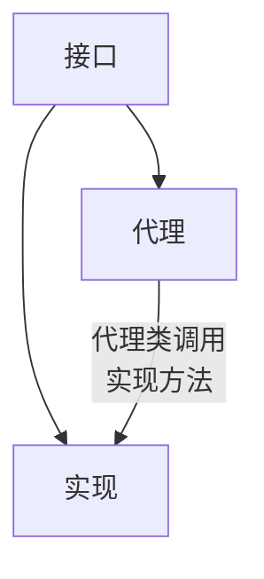

> 从代理模式开始, 看看java动态代理是怎么回事

## 何为代理

代理模式: 简单的说就是一个类代表另一个类的功能.



因此它应该符合以下:

1. 不直接操作实现类, 而是通过代理类进行操作. 但是代理类和实现类具有想通过的行为, 也就是实现相同的接口.
2. 职责更加清晰: 实现类实现接口的行为逻辑, 代理类进行增强.
3. 扩展性: 一方面体现在实现的多样性上, 另一方面是代理类对实现的增强.

下面我们按照上面的定义实现一个代理模式:

## 模拟售票

定义一个`ISell`接口模拟销售行为.

```java
public interface ISell {
    void sell();
}

```

`SellTicket`是这个行为的直接实现, 即售票的逻辑.

```java
public class SellTicket implements ISell {
    @Override
    public void sell() {
        System.out.println("====== 售出票了");
    }
}

```

`SellMerchainProxy` 是`SellTicket`的代理, 对售票行为进行了增强, 售票前创建订单, 售票后通知用户...

```java

public class SellMerchainProxy implements ISell {

    private SellTicket sellTicket;

    public SellMerchainProxy(SellTicket sellTicket) {
        this.sellTicket = sellTicket;
    }

    @Override
    public void sell() {
        createOrder();
        this.sellTicket.sell();
        updateStatus();
    }


    private void createOrder() {
        System.out.println("====== 创建订单");
    }

    private void updateStatus() {
        System.out.println("====== 通知用户购票成功");
    }
}

```

以上我们就实现了代理模式(静态代理), 下面进行测试. 注意所有的行为都是由代理类进行控制的. 因此我们只需创建代理类对象就可以了.

```java
public class TestProxy {

    public static void main(String[] args) {
        SellTicket sellTicket1 = new SellTicket();
        new SellMerchainProxy(sellTicket1).sell();
    }
}

```

运行结果:

```
====== 创建订单
====== 售出票了
====== 通知用户购票成功
```

缺点:

如果业务继续增加, 比如我们增加一个`IBuy`接口, 那么代理类必然要实现该接口, 并实现`IBuy`的接口方法. 如果接口越来越多, 那么这个代理类必然要继续实现更多方法. 而且每一次我们都要改动之前的代码. 这和开闭原则相违背.

因此就衍生出了动态代理方式.

## 动态代理

动态代理的动态表现在其代理对象是在运行时生成出来的.

下面我们通过jdk动态代理将上面的程序进行改造.

`ISell`和`SellTicket`不做任何修改, 增加`CommonInvocationHandler`以实现`InvocationHandler`.代码见下:

```java
public class CommonInvocationHandler implements InvocationHandler {

    private Object object;

    @Override
    public Object invoke(Object proxy, Method method, Object[] args) throws Throwable {
        return method.invoke(this.object, args);
    }


    public Object getProxy() {
        return Proxy.newProxyInstance(object.getClass().getClassLoader(),
                object.getClass().getInterfaces(), this);
    }

    public void setObject(Object object) {
        this.object = object;
    }
}

```

`Proxy`类提供创建动态代理类和实例的静态方法, 同时它也是所有创建出的代理类的父类.

`InvocationHandler`是要被代理对象的调用处理器实现的接口, 你也可以理解为该接口的实现都是调用处理器.
每一个代理对象都有一个相关联的调用处理器. 当代理对象调用一个方法, 该方法的调用是被分配到其调用处理器的`invoke`方法中执行.

`invoke()`该方法用来处理代理对象的方法调用, 并返回结果. 当代理对象调用与之相关联的方法时, 该方法会被一个调用处理器调用.
譬如我们的`CommonInvocationHandler`就是一个调用处理器. 当代理类调用`sell`方法的时候, 就会调用该方法进行处理, 并返回相应的结果.

下面通过测试类, 调用一下:

```java
public class TestProxy {

    public static void main(String[] args) {
        CommonInvocationHandler invocationHandler = new CommonInvocationHandler();
        // 动态代理
        ISell sellTicket = new SellTicket();
        invocationHandler.setObject(sellTicket);
        ISell sellProxy = (ISell) invocationHandler.getProxy();
        sellProxy.sell();

    }
}
```

可以看到如果新增加了接口, 我们就不再需要修改`CommonInvocationHandler`, 只需要增加对应的接口与实现, 之后创建代理对象调用即可.

譬如, 增加购买的逻辑:

```java
public interface IBuy {
    void buy();
}
public class BuyFlower implements IBuy {
    @Override
    public void buy() {
        System.out.println("====== 买花");
    }
}


```

测试类中增加:

```java
IBuy buyFlower = new BuyFlower();
invocationHandler.setObject(buyFlower);
IBuy buyProxy = (IBuy) invocationHandler.getProxy();
buyProxy.buy();

```

## 动态代理源码分析

首先, 先看一下如何获取一个代理对象. 我们明明没有写代理类啊?咋有了代理对象了呢?

java虚拟机规范规定类的加载阶段虚拟机需要:

1. 通过一个类的全限定名来获取定义此类的二进制字节流.
2. 将这个字节流所代表的静态存储结构转化为方法区的运行时数据结构.
3. 在内存中生成一个代表这个类的java.lang.Class对象, 作为方法区这个类的各种数据的访问入口.

其中`通过一个类的全限定名来获取定义此类的二进制字节流`没有规定二进制字节流从何处获取. 因此, 常见的加载方式如下:

1. 从zip压缩包中读取, 并成为jar, war, ear格式的基础.
2. 从网络中获取, 典型的应用为 web applet.
3. 通过动态代理在运行时生成.
4. 通过其他文件生成, 比如jsp生成对应的class
5. 从数据库读取
6. 从加密文件中获取
......

以上内容来自《深入理解java虚拟机》这本书.

我们就从`Proxy.newProxyInstance(object.getClass().getClassLoader(), object.getClass().getInterfaces(), this);`开始看起.

我们说过`Proxy`类提供创建动态代理类和实例的静态方法, 同时它也是所有创建出的代理类的父类. 有多种生成代理对象的方法, 上面的是最简单的一种创建方式.

它的三个参数依次是: 业务类的类加载器, 业务类的接口, 调用处理器对象.

```java
// todo 解决双重反射漏洞?
@CallerSensitive
public static Object newProxyInstance(ClassLoader loader,
                                          Class<?>[] interfaces,
                                          InvocationHandler h)
        throws IllegalArgumentException
    {
        Objects.requireNonNull(h);

        final Class<?>[] intfs = interfaces.clone();
        // 由于我们没有配置安全检查的配置, 因此sm为null
        final SecurityManager sm = System.getSecurityManager();
        if (sm != null) {
            checkProxyAccess(Reflection.getCallerClass(), loader, intfs);
        }

        // 获取代理类对象
        Class<?> cl = getProxyClass0(loader, intfs);
        try {
            if (sm != null) {
                checkNewProxyPermission(Reflection.getCallerClass(), cl);
            }
            // 获取构造器, 通过构造器传参方式创建代理对象.
            final Constructor<?> cons = cl.getConstructor(constructorParams);
            final InvocationHandler ih = h;
            if (!Modifier.isPublic(cl.getModifiers())) {
                AccessController.doPrivileged(new PrivilegedAction<Void>() {
                    public Void run() {
                        cons.setAccessible(true);
                        return null;
                    }
                });
            }
            // 创建代理对象, 并将InvocationHandler传入, 当我们调用接口(sell)方法时就会执行InvocationHandler中的invoke
            // 文章的最后一节我们会看看代理类的内容
            return cons.newInstance(new Object[]{h});
        } catch (IllegalAccessException|InstantiationException e) {
        ..........
    }

```

我们主要看`getProxyClass0`做了什么事情, 毕竟是从这个方法我们的元空间才有了代理类对象. 之后都是通过反射获取代理对象.

```java
private static final WeakCache<ClassLoader, Class<?>[], Class<?>>
        proxyClassCache = new WeakCache<>(new KeyFactory(), new ProxyClassFactory());
private static Class<?> getProxyClass0(ClassLoader loader,
                                        Class<?>... interfaces) {
    if (interfaces.length > 65535) {
        throw new IllegalArgumentException("interface limit exceeded");
    }

    // If the proxy class defined by the given loader implementing
    // the given interfaces exists, this will simply return the cached copy;
    // otherwise, it will create the proxy class via the ProxyClassFactory
    return proxyClassCache.get(loader, interfaces);
}
```

`proxyClassCache.get`从缓存中获取已经根据`loader`和`interfaces`生成的代理类. 如果不存在则重新生成.

`WeakCache`使用两层ConcurrentHashMap作为缓存, 第一层的key通过classloader生成, 第二层的key和value需要通过构造器传入subKey和value的生成策略.

```java
public WeakCache(BiFunction<K, P, ?> subKeyFactory,
                     BiFunction<K, P, V> valueFactory) {
    this.subKeyFactory = Objects.requireNonNull(subKeyFactory);
    this.valueFactory = Objects.requireNonNull(valueFactory);
}
```

subKey的生成如下, 针对不存在接口, 有一个接口, 两个接口, 两个接口以上有不同的实现.

```java
private static final Object key0 = new Object();
private static final class KeyFactory
    implements BiFunction<ClassLoader, Class<?>[], Object>
{
    @Override
    public Object apply(ClassLoader classLoader, Class<?>[] interfaces) {
        switch (interfaces.length) {
            case 1: return new Key1(interfaces[0]); // the most frequent
            case 2: return new Key2(interfaces[0], interfaces[1]);
            case 0: return key0;
            default: return new KeyX(interfaces);
        }
    }
}

```

`ProxyClassFactory`是代理类对象的生成策略. 通过接口的包路径加上`$Proxy`以及一个原子计数值得到一个全限定名. 注意只有非公共接口(访问标识不是public)才会生成在包路径下. 对于非公共的接口, 需要检验是否所有的接口都在同一包路径下(毕竟你的接口不是公共的你是如何访问到其他路径下的接口的?).

```java
private static final class ProxyClassFactory
    implements BiFunction<ClassLoader, Class<?>[], Class<?>>
{
    // prefix for all proxy class names
    private static final String proxyClassNamePrefix = "$Proxy";

    // next number to use for generation of unique proxy class names
    private static final AtomicLong nextUniqueNumber = new AtomicLong();

    @Override
    public Class<?> apply(ClassLoader loader, Class<?>[] interfaces) {

        Map<Class<?>, Boolean> interfaceSet = new IdentityHashMap<>(interfaces.length);
        // 遍历所有接口, 主要进行各个接口的校验
        for (Class<?> intf : interfaces) {
            /*
                * Verify that the class loader resolves the name of this
                * interface to the same Class object.
                */
            Class<?> interfaceClass = null;
            try {
                interfaceClass = Class.forName(intf.getName(), false, loader);
            } catch (ClassNotFoundException e) {
            }
            if (interfaceClass != intf) {
                throw new IllegalArgumentException(
                    intf + " is not visible from class loader");
            }
            /*
                * Verify that the Class object actually represents an
                * interface.
                */
            if (!interfaceClass.isInterface()) {
                throw new IllegalArgumentException(
                    interfaceClass.getName() + " is not an interface");
            }
            /*
                * Verify that this interface is not a duplicate.
                */
            if (interfaceSet.put(interfaceClass, Boolean.TRUE) != null) {
                throw new IllegalArgumentException(
                    "repeated interface: " + interfaceClass.getName());
            }
        }

        // 代理类的全限定名, 最终的名称由包名+$proxy+num构成
        String proxyPkg = null;     // package to define proxy class in
        int accessFlags = Modifier.PUBLIC | Modifier.FINAL;

        /*
            * Record the package of a non-public proxy interface so that the
            * proxy class will be defined in the same package.  Verify that
            * all non-public proxy interfaces are in the same package.
            */
        // 遍历所有接口获取包名, 同时检验所有的包名是否相同即接口是否在同一路径下
        for (Class<?> intf : interfaces) {
            int flags = intf.getModifiers();
            // 判断访问标识是否为public
            if (!Modifier.isPublic(flags)) {
                accessFlags = Modifier.FINAL;
                String name = intf.getName();
                int n = name.lastIndexOf('.');
                String pkg = ((n == -1) ? "" : name.substring(0, n + 1));
                if (proxyPkg == null) {
                    proxyPkg = pkg;
                } else if (!pkg.equals(proxyPkg)) {
                    throw new IllegalArgumentException(
                        "non-public interfaces from different packages");
                }
            }
        }

        // 如果包名不存在 则使用默认的包名
        if (proxyPkg == null) {
            // if no non-public proxy interfaces, use com.sun.proxy package
            proxyPkg = ReflectUtil.PROXY_PACKAGE + ".";
        }

        /*
            * Choose a name for the proxy class to generate.
            */
        long num = nextUniqueNumber.getAndIncrement();
        String proxyName = proxyPkg + proxyClassNamePrefix + num;

        /*
            * Generate the specified proxy class.
            */
        // 生成代理类的二进制字节码
        byte[] proxyClassFile = ProxyGenerator.generateProxyClass(
            proxyName, interfaces, accessFlags);
        try {
            // 获取类对象
            return defineClass0(loader, proxyName,
                                proxyClassFile, 0, proxyClassFile.length);
        } catch (ClassFormatError e) {
            /*
                * A ClassFormatError here means that (barring bugs in the
                * proxy class generation code) there was some other
                * invalid aspect of the arguments supplied to the proxy
                * class creation (such as virtual machine limitations
                * exceeded).
                */
            throw new IllegalArgumentException(e.toString());
        }
    }
}
```

`byte[] proxyClassFile = ProxyGenerator.generateProxyClass(proxyName, interfaces, accessFlags);` 这是生成代理类二进制字节流的关键.

`defineClass0(loader, proxyName, proxyClassFile, 0, proxyClassFile.length);` 根据全限定名和代理类字节流返回代理类对象.

至于生成class的具体代码, 可以查看`sun.misc.ProxyGenerator#generateClassFile`方法. 这里不再深究... 那段源码就是在纯手撸class.

## 代理类源码

`System.getProperties().setProperty("sun.misc.ProxyGenerator.saveGeneratedFiles", "true");` 可以将生成的代理类(class)以文件形式保存下来.

注意我们在生成代理类的时候, 如果接口访问标识不是public(`!Modifier.isPublic(flags)`)才会生成在接口目录中, 当是public的时候会生成在`public static final String PROXY_PACKAGE = "com.sun.proxy";`目录中.


其内容如下, 可以看到代理类继承了`Proxy`, 并实现了`ISell`接口, 这个接口就是我们想要代理的`SellTicket`实现的接口. 重写的`sell()`方法中调用了`InvocationHandler`中的`invoke`方法.

```java
//
// Source code recreated from a .class file by IntelliJ IDEA
// (powered by Fernflower decompiler)
//

package com.sun.proxy;

import java.lang.reflect.InvocationHandler;
import java.lang.reflect.Method;
import java.lang.reflect.Proxy;
import java.lang.reflect.UndeclaredThrowableException;
import proxy.ISell;

public final class $Proxy0 extends Proxy implements ISell {
    private static Method m1;
    private static Method m2;
    private static Method m3;
    private static Method m0;

    // 反射通过构造器传参传入调用处理器InvocationHandler
    public $Proxy0(InvocationHandler var1) throws  {
        super(var1);
    }

    public final boolean equals(Object var1) throws  {
        try {
            return (Boolean)super.h.invoke(this, m1, new Object[]{var1});
        } catch (RuntimeException | Error var3) {
            throw var3;
        } catch (Throwable var4) {
            throw new UndeclaredThrowableException(var4);
        }
    }

    public final String toString() throws  {
        try {
            return (String)super.h.invoke(this, m2, (Object[])null);
        } catch (RuntimeException | Error var2) {
            throw var2;
        } catch (Throwable var3) {
            throw new UndeclaredThrowableException(var3);
        }
    }

    // 继承ISell并实现sell方法, 这里实际调用了调用处理器的invoke方法.
    public final void sell() throws  {
        try {
            super.h.invoke(this, m3, (Object[])null);
        } catch (RuntimeException | Error var2) {
            throw var2;
        } catch (Throwable var3) {
            throw new UndeclaredThrowableException(var3);
        }
    }

    public final int hashCode() throws  {
        try {
            return (Integer)super.h.invoke(this, m0, (Object[])null);
        } catch (RuntimeException | Error var2) {
            throw var2;
        } catch (Throwable var3) {
            throw new UndeclaredThrowableException(var3);
        }
    }

    static {
        try {
            m1 = Class.forName("java.lang.Object").getMethod("equals", Class.forName("java.lang.Object"));
            m2 = Class.forName("java.lang.Object").getMethod("toString");
            m3 = Class.forName("proxy.ISell").getMethod("sell");
            m0 = Class.forName("java.lang.Object").getMethod("hashCode");
        } catch (NoSuchMethodException var2) {
            throw new NoSuchMethodError(var2.getMessage());
        } catch (ClassNotFoundException var3) {
            throw new NoClassDefFoundError(var3.getMessage());
        }
    }
}

```

## end

最后对调用处理器进行了一点修改, 可以参考使用.

```java
import java.lang.reflect.InvocationHandler;
import java.lang.reflect.Method;
import java.lang.reflect.Proxy;


/**
 * @Description:  一个公共的调用处理器, 如果为了更好的区分各种业务, object可以使用泛型方式,
 * 也就是要多实现几个不同的InvocationHandler
 * @Author:       nikola
 */
public class CommonInvocationHandler implements InvocationHandler {

    private Object object;

    @Override
    public Object invoke(Object proxy, Method method, Object[] args) throws Throwable {
        System.out.println(
                String.format("do something before %s", method.getName()));

        Object res = method.invoke(this.object, args);

        System.out.println(
                String.format("do something after %s, return %s", method.getName(), res));
        return res;
    }

    /**
     * 获取一个代理对象
     * @param object 被代理的对象, 被代理类与代理类都要实现相同接口.
     * @return 代理对象
     */
    public Object getProxy(Object object) {
        this.object = object;
        return Proxy.newProxyInstance(object.getClass().getClassLoader(),
                object.getClass().getInterfaces(), this);
    }
}
```
