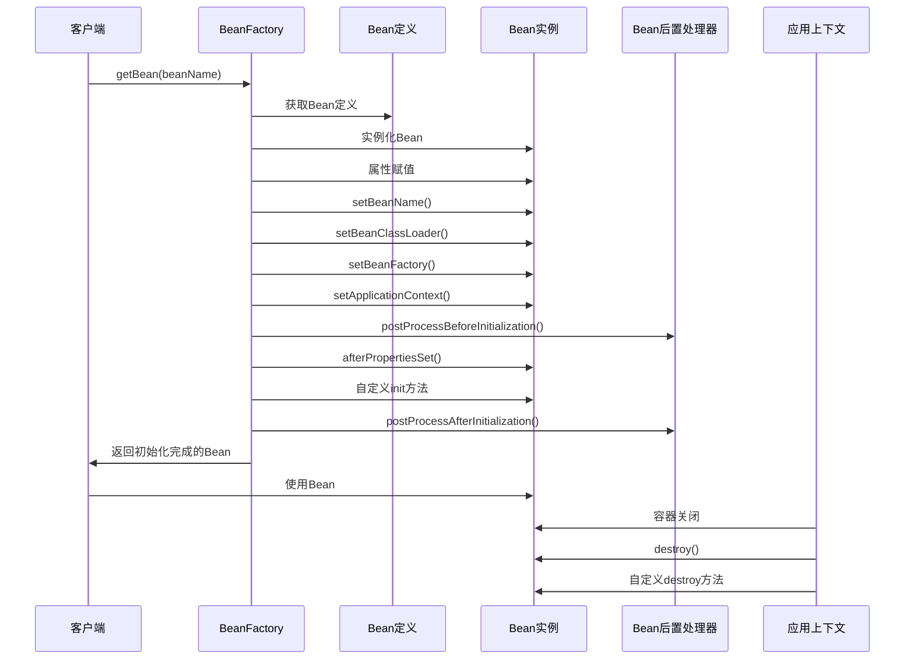

## 1. 简介

Spring Boot作为当前最流行的Java企业级开发框架之一，其核心功能之一就是依赖注入（DI）和控制反转（IoC）。Bean作为Spring容器中管理的核心对象，其生命周期的管理是Spring框架的基础。了解Bean的生命周期对于深入理解Spring Boot的工作原理、进行性能优化以及排查问题都具有重要意义。

本文将详细解析Spring Boot中Bean的完整生命周期，包括从Bean的定义、实例化、初始化到销毁的各个阶段，并结合源码分析和可视化图表进行说明。

## 2. 架构原理与源码分析

### 2.1 Bean生命周期概述

Spring Boot中Bean的生命周期主要包括以下几个阶段：

1. **Bean定义阶段**：Spring容器加载配置文件或扫描注解，解析出Bean的定义信息
2. **Bean实例化阶段**：根据Bean定义创建Bean实例
3. **属性赋值阶段**：为Bean的属性注入依赖
4. **初始化阶段**：执行各种初始化回调方法
5. **Bean使用阶段**：Bean可以被应用程序使用
6. **销毁阶段**：容器关闭时执行销毁回调方法

### 2.2 详细流程与源码分析

#### 2.2.1 Bean定义阶段

Bean定义阶段主要由`BeanDefinitionReader`和`BeanDefinitionScanner`负责，它们从XML配置文件或注解中解析出Bean的定义信息，并注册到`BeanDefinitionRegistry`中。

```java
// Bean定义信息存储在BeanDefinition中
public interface BeanDefinition extends AttributeAccessor, BeanMetadataElement {
    // Bean定义的各种属性和方法
}
```

#### 2.2.2 Bean实例化阶段

当容器需要一个Bean时，会调用`BeanFactory`的`getBean()`方法，该方法会触发Bean的实例化过程。实例化主要由`InstantiationStrategy`接口负责，默认实现是`SimpleInstantiationStrategy`和`CglibSubclassingInstantiationStrategy`。

```java
// BeanFactory接口定义了获取Bean的方法
public interface BeanFactory {
    Object getBean(String name) throws BeansException;
    <T> T getBean(String name, Class<T> requiredType) throws BeansException;
    // 其他方法
}
```

#### 2.2.3 属性赋值阶段

实例化完成后，Spring容器会为Bean的属性注入依赖。这个过程主要由`BeanWrapper`接口负责，它包装了Bean实例并提供了属性访问的方法。

```java
// BeanWrapper接口定义了属性访问的方法
public interface BeanWrapper extends ConfigurablePropertyAccessor {
    Object getWrappedInstance();
    Class<?> getWrappedClass();
    // 其他方法
}
```

#### 2.2.4 初始化阶段

属性赋值完成后，Spring容器会执行Bean的初始化方法。初始化阶段包括以下几个步骤：

1. 执行`BeanNameAware`的`setBeanName()`方法
2. 执行`BeanClassLoaderAware`的`setBeanClassLoader()`方法
3. 执行`BeanFactoryAware`的`setBeanFactory()`方法
4. 执行`ApplicationContextAware`的`setApplicationContext()`方法
5. 执行`BeanPostProcessor`的`postProcessBeforeInitialization()`方法
6. 执行`InitializingBean`的`afterPropertiesSet()`方法
7. 执行自定义的初始化方法（通过`@PostConstruct`注解或XML配置的`init-method`）
8. 执行`BeanPostProcessor`的`postProcessAfterInitialization()`方法

```java
// InitializingBean接口定义了初始化方法
public interface InitializingBean {
    void afterPropertiesSet() throws Exception;
}

// BeanPostProcessor接口定义了初始化前后的处理器方法
public interface BeanPostProcessor {
    Object postProcessBeforeInitialization(Object bean, String beanName) throws BeansException;
    Object postProcessAfterInitialization(Object bean, String beanName) throws BeansException;
}
```

#### 2.2.5 Bean使用阶段

初始化完成后，Bean就可以被应用程序使用了。此时的Bean是完全初始化和配置好的，可以正常提供服务。

#### 2.2.6 销毁阶段

当Spring容器关闭时，会执行Bean的销毁方法。销毁阶段包括以下几个步骤：

1. 执行`DisposableBean`的`destroy()`方法
2. 执行自定义的销毁方法（通过`@PreDestroy`注解或XML配置的`destroy-method`）

```java
// DisposableBean接口定义了销毁方法
public interface DisposableBean {
    void destroy() throws Exception;
}
```

## 3. 生命周期流程图

下面是Spring Boot中Bean的完整生命周期流程图：



## 4. 使用场景

了解Bean的生命周期对于以下场景非常有用：

1. **资源管理**：在Bean初始化时获取资源（如数据库连接、文件句柄等），在销毁时释放资源
2. **缓存初始化**：在Bean初始化时加载缓存数据，提高系统性能
3. **依赖检查**：在Bean初始化阶段检查必要的依赖是否已正确注入
4. **配置验证**：在Bean初始化阶段验证配置参数的有效性
5. **AOP代理**：通过`BeanPostProcessor`实现AOP代理功能

## 5. 代码示例

下面是一个展示Bean生命周期各个阶段的代码示例：

```java
import org.springframework.beans.BeansException;
import org.springframework.beans.factory.*;
import org.springframework.context.ApplicationContext;
import org.springframework.context.ApplicationContextAware;
import org.springframework.stereotype.Component;

import javax.annotation.PostConstruct;
import javax.annotation.PreDestroy;

@Component
public class LifecycleBean implements BeanNameAware, BeanClassLoaderAware, BeanFactoryAware, ApplicationContextAware, InitializingBean, DisposableBean {

    private String name;

    public LifecycleBean() {
        System.out.println("1. Bean构造方法执行");
    }

    public void setName(String name) {
        this.name = name;
        System.out.println("2. 属性赋值执行: name = " + name);
    }

    @Override
    public void setBeanName(String name) {
        System.out.println("3. BeanNameAware.setBeanName()执行: " + name);
    }

    @Override
    public void setBeanClassLoader(ClassLoader classLoader) {
        System.out.println("4. BeanClassLoaderAware.setBeanClassLoader()执行");
    }

    @Override
    public void setBeanFactory(BeanFactory beanFactory) throws BeansException {
        System.out.println("5. BeanFactoryAware.setBeanFactory()执行");
    }

    @Override
    public void setApplicationContext(ApplicationContext applicationContext) throws BeansException {
        System.out.println("6. ApplicationContextAware.setApplicationContext()执行");
    }

    @PostConstruct
    public void postConstruct() {
        System.out.println("7. @PostConstruct注解方法执行");
    }

    @Override
    public void afterPropertiesSet() throws Exception {
        System.out.println("8. InitializingBean.afterPropertiesSet()执行");
    }

    public void customInit() {
        System.out.println("9. 自定义init方法执行");
    }

    @PreDestroy
    public void preDestroy() {
        System.out.println("10. @PreDestroy注解方法执行");
    }

    @Override
    public void destroy() throws Exception {
        System.out.println("11. DisposableBean.destroy()执行");
    }

    public void customDestroy() {
        System.out.println("12. 自定义destroy方法执行");
    }

    public void doSomething() {
        System.out.println("Bean使用中: name = " + name);
    }
}
```

```java
import org.springframework.context.annotation.Bean;
import org.springframework.context.annotation.Configuration;

@Configuration
public class AppConfig {
    @Bean(initMethod = "customInit", destroyMethod = "customDestroy")
    public LifecycleBean lifecycleBean() {
        LifecycleBean bean = new LifecycleBean();
        bean.setName("TestBean");
        return bean;
    }
}
```

```java
import org.springframework.boot.SpringApplication;
import org.springframework.boot.autoconfigure.SpringBootApplication;
import org.springframework.context.ConfigurableApplicationContext;

@SpringBootApplication
public class Application {
    public static void main(String[] args) {
        ConfigurableApplicationContext context = SpringApplication.run(Application.class, args);
        LifecycleBean bean = context.getBean(LifecycleBean.class);
        bean.doSomething();
        context.close();
    }
}
```

运行上述代码，控制台输出如下：

```
1. Bean构造方法执行
2. 属性赋值执行: name = TestBean
3. BeanNameAware.setBeanName()执行: lifecycleBean
4. BeanClassLoaderAware.setBeanClassLoader()执行
5. BeanFactoryAware.setBeanFactory()执行
6. ApplicationContextAware.setApplicationContext()执行
7. @PostConstruct注解方法执行
8. InitializingBean.afterPropertiesSet()执行
9. 自定义init方法执行
Bean使用中: name = TestBean
10. @PreDestroy注解方法执行
11. DisposableBean.destroy()执行
12. 自定义destroy方法执行
```

## 6. 性能优化建议

1. **延迟初始化**：对于不常用的Bean，可以使用`@Lazy`注解或XML配置的`lazy-init="true"`进行延迟初始化，减少应用启动时间。

2. **原型Bean的使用**：原型Bean每次获取都会创建新实例，避免使用过多原型Bean导致内存占用过高。

3. **BeanPostProcessor的优化**：BeanPostProcessor会对所有Bean生效，避免在其中执行耗时操作，必要时可以通过`@Order`注解指定执行顺序。

4. **资源管理**：确保在Bean销毁阶段正确释放资源，避免内存泄漏。

5. **减少初始化逻辑**：将耗时的初始化逻辑移到异步方法中执行，提高应用启动速度。

## 7. 常见问题及解决方案

### 7.1 问题：Bean初始化顺序不当导致依赖问题

**解决方案**：
- 使用`@DependsOn`注解指定Bean的初始化顺序
- 通过构造函数注入代替字段注入，利用Spring的依赖解析机制保证正确的初始化顺序

### 7.2 问题：Bean销毁方法未执行

**解决方案**：
- 确保使用`ConfigurableApplicationContext`的`close()`方法关闭容器
- 对于Web应用，确保正确配置了`ContextLoaderListener`
- 避免使用`System.exit()`直接退出JVM

### 7.3 问题：`@PostConstruct`和`@PreDestroy`注解不生效

**解决方案**：
- 确保已添加`javax.annotation-api`依赖
- 在Spring Boot中，这些注解由`CommonAnnotationBeanPostProcessor`处理，确保该处理器已被正确注册

### 7.4 问题：Bean的作用域混淆

**解决方案**：
- 明确区分单例（Singleton）和原型（Prototype）作用域
- 对于Web应用，正确使用会话（Session）和请求（Request）作用域

## 8. 总结

本文详细解析了Spring Boot中Bean的完整生命周期，包括从Bean的定义、实例化、初始化到销毁的各个阶段。通过源码分析和可视化图表，我们可以看到Spring容器对Bean的生命周期进行了精细的管理，提供了丰富的扩展点（如`BeanPostProcessor`、各种Aware接口等）。

了解Bean的生命周期对于深入理解Spring Boot的工作原理、进行性能优化以及排查问题都具有重要意义。在实际开发中，我们可以利用Bean生命周期的各个阶段来实现各种功能，如资源管理、缓存初始化、配置验证等。

通过合理地使用Bean生命周期的扩展点和优化建议，我们可以构建出更加高效、稳定的Spring Boot应用。