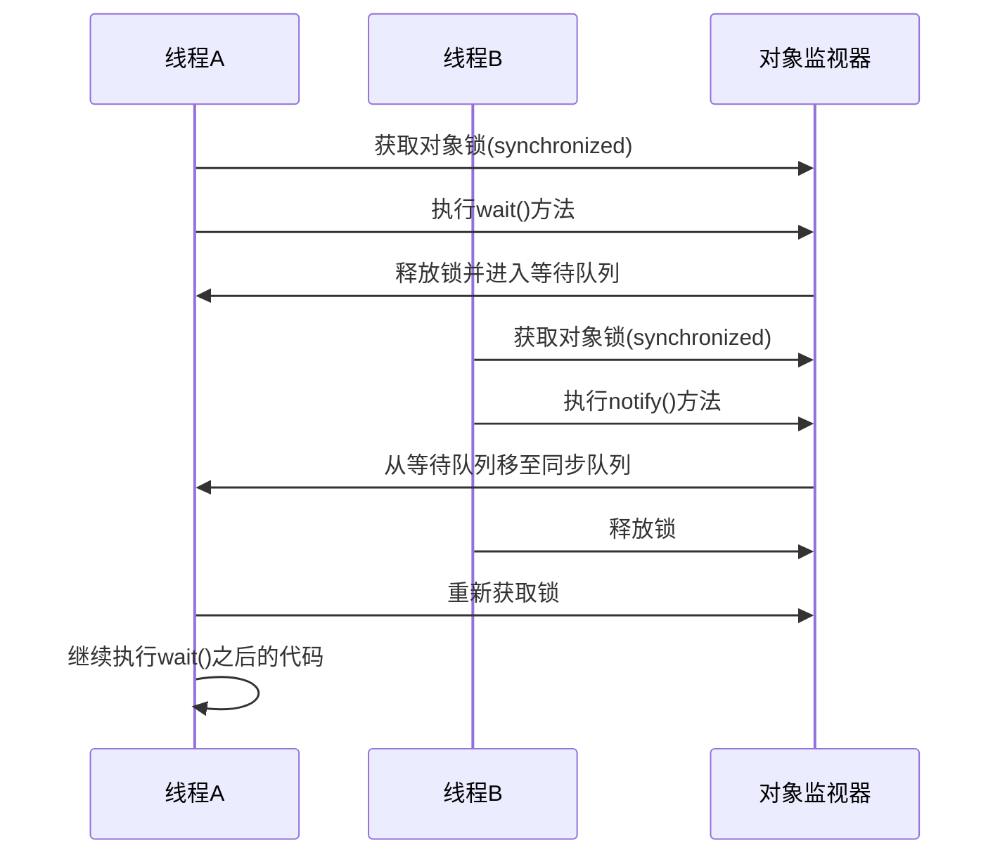
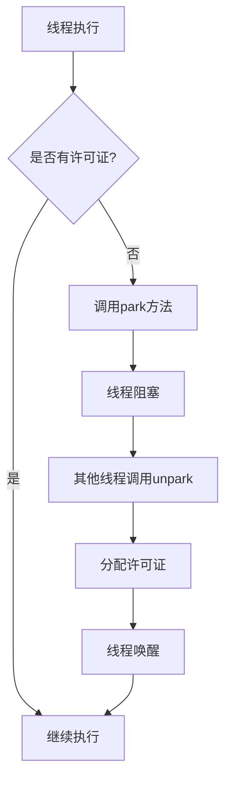
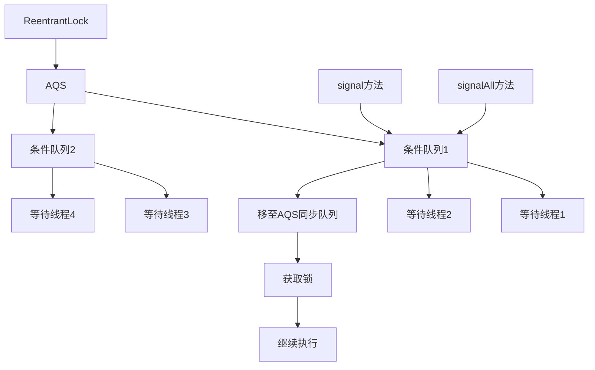
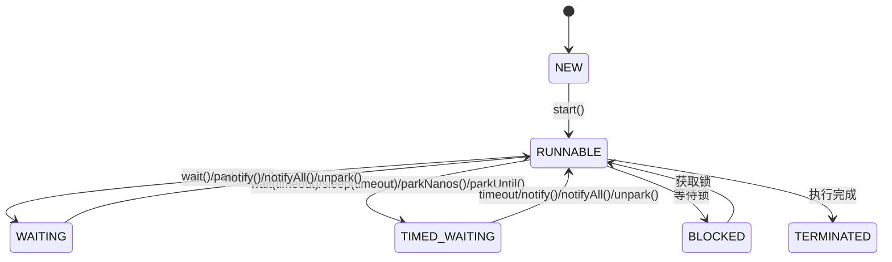

> 本文深入解析Java线程等待与唤醒机制，包括Object类的wait/notify方法、LockSupport的park/unpark方法以及Condition接口的使用与原理，帮助读者全面理解线程协作的核心机制。

## 一、wait/notify机制

### 1. 基本概念

wait和notify是Object类中定义的native方法，用于实现线程间的协作：

```java
// 等待直到被唤醒或超时
public final void wait() throws InterruptedException
public final native void wait(long timeout) throws InterruptedException
public final void wait(long timeout, int nanos) throws InterruptedException

// 唤醒一个等待在该对象上的线程
public final native void notify()

// 唤醒所有等待在该对象上的线程
public final native void notifyAll()
```

### 2. 核心原理

wait/notify机制依赖于对象的监视器锁（Monitor），其执行流程如下：



### 3. 关键特性

- **必须持有锁**：调用wait/notify/notifyAll方法前必须持有对象的锁
- **释放锁**：wait方法会释放当前持有的锁
- **等待队列**：调用wait的线程会进入对象的等待队列
- **通知机制**：notify随机唤醒一个等待线程，notifyAll唤醒所有等待线程
- **可中断**：wait方法可以响应中断
- **超时机制**：可以设置超时时间，避免无限等待

### 4. 生产消费示例

下面的例子是通过wait和notify实现的生产消费功能, 当生产数量达到一定值的时候唤醒消费线程生产等待, 消费到0唤醒生产线程消费等待.

```java
public class TestWaitNotify {

    private static Object obj = new Object();
    private static int count = 0;

    public static void main(String[] args) throws InterruptedException {

        new Thread(() -> {
            SleepUtil.sleepSecond(1);
            synchronized (obj) {
                while (true) {
                    SleepUtil.sleepSecond(1);
                    if (count >= 5) {
                        obj.notify();
                        System.out.println("consumer notify");
                        try {
                            System.out.println("producer wait");
                            obj.wait();
                        } catch (InterruptedException e) {
                            e.printStackTrace();
                        }
                    }
                    System.out.println("producer: " + ++count);
                }
            }
        }, "生产").start();


        new Thread(() -> {
            synchronized (obj) {
                while (true) {
                    if (count == 0) {
                        obj.notify();
                        System.out.println("producer notify");
                        try {
                            System.out.println("consumer wait");
                            obj.wait();
                        } catch (InterruptedException e) {
                            e.printStackTrace();
                        }

                    }
                    SleepUtil.sleepSecond(1);
                    System.out.println("consumer used: " + --count);

                }
            }
        }, "消费").start();

    }
}

```

执行结果:


## 二、park/unpark机制

### 1. 基本概念

LockSupport是JDK提供的一个线程阻塞工具类，其核心方法是park和unpark：

```java
// 阻塞当前线程
public static void park()
public static void park(Object blocker)
public static void parkNanos(long nanos)
public static void parkNanos(Object blocker, long nanos)
public static void parkUntil(long deadline)
public static void parkUntil(Object blocker, long deadline)

// 唤醒指定线程
public static void unpark(Thread thread)
```

### 2. 核心原理

park/unpark机制基于许可证（permit）实现：



### 3. 关键特性

- **无需持有锁**：park/unpark不需要获取对象锁
- **许可证机制**：每个线程最多持有一个许可证
- **精确唤醒**：可以指定唤醒特定线程
- **可中断**：park方法可以响应中断
- **带超时**：支持设置超时时间
- **Blocker参数**：用于调试，可通过jstack查看阻塞原因

### 4. 生产消费示例

下面是使用LockSupport的park和unpark实现的生产消费例子：

```java
public class TestParkUnpark {

    private static Thread producer = new ProducerThread("生产");
    private static Thread consumer = new ConsumerThread("消费");

    private static volatile int count = 0;

    public static void main(String[] args) {
        producer.start();
        consumer.start();
    }

    private static class ProducerThread extends Thread {

        public ProducerThread(String name) {
            super(name);
        }

        @Override
        public void run() {
            while (true) {
                SleepUtil.sleepSecond(2);
                System.out.println("producer: " + ++count);
                if (count >= 5) {
                    LockSupport.unpark(consumer);
                    LockSupport.park();
                }
            }
        }
    }

    private static class ConsumerThread extends Thread {

        public ConsumerThread(String name) {
            super(name);
        }

        @Override
        public void run() {
            while (true) {
                SleepUtil.sleepSecond(1);
                if (count <= 0) {
                    LockSupport.unpark(producer);
                    LockSupport.park();
                }
                System.out.println("consumer: " + --count);
            }
        }
    }
}


```

运行结果:


## 三、Condition接口

### 1. 基本概念

Condition是Java 5引入的接口，用于替代Object的wait/notify机制，提供更灵活的线程协作方式：

```java
public interface Condition {
    void await() throws InterruptedException;
    void awaitUninterruptibly();
    long awaitNanos(long nanosTimeout) throws InterruptedException;
    boolean await(long time, TimeUnit unit) throws InterruptedException;
    boolean awaitUntil(Date deadline) throws InterruptedException;
    void signal();
    void signalAll();
}
```

### 2. 使用示例

```java
public class ConditionExample {
    private final Lock lock = new ReentrantLock();
    private final Condition notEmpty = lock.newCondition();
    private final Condition notFull = lock.newCondition();
    private final Object[] buffer = new Object[10];
    private int count, putIndex, takeIndex;
    
    public void put(Object x) throws InterruptedException {
        lock.lock();
        try {
            while (count == buffer.length) {
                notFull.await();
            }
            buffer[putIndex] = x;
            if (++putIndex == buffer.length) putIndex = 0;
            ++count;
            notEmpty.signal();
        } finally {
            lock.unlock();
        }
    }
    
    public Object take() throws InterruptedException {
        lock.lock();
        try {
            while (count == 0) {
                notEmpty.await();
            }
            Object x = buffer[takeIndex];
            if (++takeIndex == buffer.length) takeIndex = 0;
            --count;
            notFull.signal();
            return x;
        } finally {
            lock.unlock();
        }
    }
}
```

### 3. 核心原理

Condition接口基于AQS（AbstractQueuedSynchronizer）实现，每个Condition对象对应一个等待队列：



## 四、三种机制的比较

| 特性 | wait/notify | park/unpark | Condition |
|------|-------------|-------------|-----------|
| 依赖对象 | 任意Java对象 | 无 | Lock对象 |
| 获取锁要求 | 必须持有对象锁 | 无需 | 必须持有Lock |
| 唤醒方式 | 随机唤醒/全部唤醒 | 精确唤醒 | 随机唤醒/全部唤醒 |
| 等待队列 | 每个对象一个 | 无（基于许可证） | 每个Condition一个 |
| 超时支持 | 支持 | 支持 | 支持 |
| 中断支持 | 支持 | 支持 | 支持 |
| 实现机制 | Object监视器 | AQS | AQS |
| 灵活性 | 低 | 中 | 高 |

## 五、线程状态转换

线程在等待与唤醒过程中会经历多种状态转换：



## 六、常见问题与最佳实践

### 1. 常见问题

- **虚假唤醒**：线程可能在没有收到通知的情况下被唤醒，因此必须使用循环条件检查
- **死锁**：不当的等待与唤醒顺序可能导致死锁
- **资源泄露**：忘记唤醒等待线程会导致线程永久等待
- **锁竞争**：notifyAll可能导致大量线程被唤醒，造成惊群效应

### 2. 最佳实践

- **使用循环检查条件**：始终在循环中调用wait/await方法

  ```java
  // 错误示例
  if (condition) {
      obj.wait();
  }
  
  // 正确示例
  while (condition) {
      obj.wait();
  }
  ```

- **优先使用notifyAll**：在不确定等待线程数量时，使用notifyAll更安全

- **选择合适的机制**：
  - 简单场景使用wait/notify
  - 需要精确唤醒使用park/unpark
  - 复杂场景使用Condition

- **避免嵌套锁**：在使用wait/notify时避免嵌套锁，减少死锁风险

- **使用带超时的等待**：避免线程永久等待

## 七、高级应用场景

### 1. 生产者-消费者模式

wait/notify、park/unpark和Condition都可以实现生产者-消费者模式，其中Condition提供了最灵活的实现方式。

### 2. 线程池中的应用

线程池使用Condition实现工作队列的管理和线程的等待与唤醒。

### 3. 消息队列的实现

消息队列可以使用Condition实现生产者和消费者之间的解耦和通信。

## 八、总结

Java提供了三种主要的线程等待与唤醒机制：

1. **wait/notify**：基于Object监视器的基本机制，适用于简单场景
2. **park/unpark**：基于许可证的机制，支持精确唤醒
3. **Condition**：基于AQS的高级机制，提供了更灵活的线程协作方式

选择合适的机制取决于具体的应用场景和需求。理解这些机制的原理和使用方法，对于编写高效、可靠的并发程序至关重要。

## 九、参考资料

1. [Java官方文档 - Object类](https://docs.oracle.com/javase/8/docs/api/java/lang/Object.html)
2. [Java官方文档 - LockSupport类](https://docs.oracle.com/javase/8/docs/api/java/util/concurrent/locks/LockSupport.html)
3. [Java官方文档 - Condition接口](https://docs.oracle.com/javase/8/docs/api/java/util/concurrent/locks/Condition.html)
