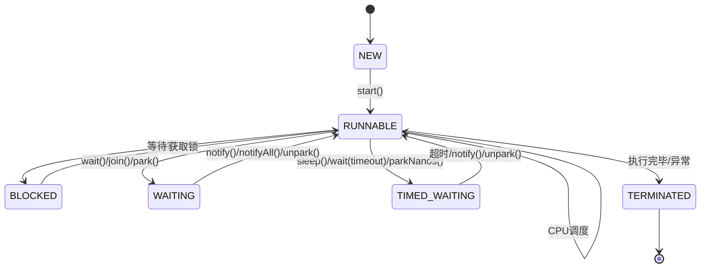
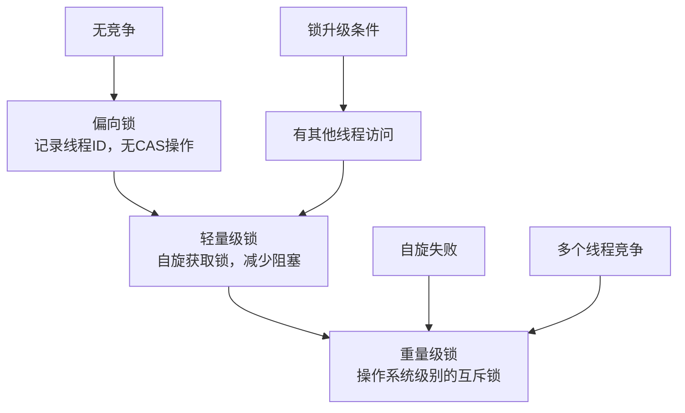

---
isOriginal: true
title: Java线程的状态与锁机制深度解析
tag:
  - thread
  - 线程状态
  - 锁
  - 并发编程
category: thread
date: 2020-04-06
icon: coffee
description: 深入解析Java线程的状态转换和各种锁机制，包括线程状态、锁分类、实现原理和最佳实践
sticky: false
timeline: true
article: true
star: false
---

> 本文深入解析Java线程的状态转换和各种锁机制，帮助读者全面理解并发编程中的核心概念和实现原理

## 一、线程的状态

### 1. 线程状态概述

Java线程共包括以下6种状态（基于JDK 1.5及以上）：

```java
// Thread类中的State枚举定义了6种线程状态
public enum State {
    NEW,          // 新建状态
    RUNNABLE,     // 可运行状态
    BLOCKED,      // 阻塞状态
    WAITING,      // 等待状态
    TIMED_WAITING, // 定时等待状态
    TERMINATED    // 终止状态
}
```

### 2. 线程状态详细解析

1. **新建状态(New)**: 线程对象被创建后，尚未调用start()方法。

   ```java
   Thread thread = new Thread(); // 线程处于NEW状态
   ```

2. **可运行状态(Runnable)**: 线程调用start()方法后进入此状态，包括就绪(Ready)和运行中(Running)两种子状态：
   - 就绪：线程已获取所需资源，等待CPU调度
   - 运行中：线程正在执行run()方法

3. **阻塞状态(BLOCKED)**: 线程等待获取锁时进入此状态，通常是因为尝试获取synchronized锁失败。

4. **等待状态(WAITING)**: 线程需要等待其他线程显式唤醒，常用方法包括：
   - Object.wait() - 等待其他线程调用notify()或notifyAll()
   - Thread.join() - 等待指定线程终止
   - LockSupport.park() - 等待其他线程调用unpark()

5. **定时等待状态(TIMED_WAITING)**: 线程在指定时间后自动唤醒，常用方法包括：
   - Thread.sleep(long millis) - 休眠指定时间
   - Object.wait(long timeout) - 等待指定时间或被唤醒
   - Thread.join(long millis) - 等待指定时间或线程终止
   - LockSupport.parkNanos(long nanos) - 定时阻塞
   - LockSupport.parkUntil(long deadline) - 阻塞至指定时间点

6. **终止状态(TERMINATED)**: 线程执行完毕或因异常退出run()方法。

### 3. 线程状态转换图



### 4. 线程状态转换示例

```java
public class ThreadStateExample {
    public static void main(String[] args) throws InterruptedException {
        // NEW状态
        Thread thread = new Thread(() -> {
            try {
                // RUNNABLE状态
                System.out.println("Thread is running");
                Thread.sleep(2000); // 进入TIMED_WAITING状态
                synchronized (ThreadStateExample.class) {
                    // 获取锁后进入RUNNABLE状态
                    System.out.println("Thread holds the lock");
                }
            } catch (InterruptedException e) {
                e.printStackTrace();
            }
        });
        
        System.out.println("Thread state before start(): " + thread.getState()); // NEW
        thread.start();
        System.out.println("Thread state after start(): " + thread.getState()); // RUNNABLE
        
        Thread.sleep(500);
        System.out.println("Thread state during sleep(): " + thread.getState()); // TIMED_WAITING
        
        thread.join();
        System.out.println("Thread state after join(): " + thread.getState()); // TERMINATED
    }
}

### 5. 常用方法对比

#### yield() 与 wait()的比较

| 特性 | yield() | wait() |
|------|---------|--------|
| 状态转换 | 运行状态 → 就绪状态 | 运行状态 → 等待状态 |
| 释放锁 | 不释放 | 释放 |
| 唤醒方式 | 自动 | 需要notify()/notifyAll() |
| 调用条件 | 无需持有锁 | 必须持有对象锁 |
| 异常 | 无 | InterruptedException |

#### sleep() 与 wait()的比较

| 特性 | sleep() | wait() |
|------|---------|--------|
| 所属类 | Thread | Object |
| 释放锁 | 不释放 | 释放 |
| 唤醒方式 | 自动超时 | 需要notify()/notifyAll()或超时 |
| 调用条件 | 无需持有锁 | 必须持有对象锁 |

### 6. 为什么notify(), wait()等函数定义在Object中

notify(), wait()等方法依赖于**对象监视器(monitor)**，而每个Java对象都有一个内置的监视器锁。这就是为什么这些方法定义在Object类而不是Thread类中的原因：

1. **监视器锁与对象关联**：每个对象都有且仅有一个监视器锁
2. **多线程共享对象**：线程通过共享对象进行通信
3. **灵活性**：可以基于任意对象进行线程间通信

```java
// 正确使用方式：基于共享对象调用wait/notify
Object lock = new Object();
synchronized (lock) {
    lock.wait();     // 线程释放lock锁并等待
}

synchronized (lock) {
    lock.notify();   // 唤醒一个等待lock锁的线程
}

## 二、锁机制

锁是多线程编程中用于保护共享资源的核心机制，Java提供了多种锁实现，适用于不同的并发场景。

### 1. 锁的基本分类

#### 乐观锁和悲观锁

**悲观锁(Pessimistic Lock)**：
- 认为并发环境下数据很容易被修改，因此在处理数据前先获取锁
- 持有锁期间，其他线程无法修改同一资源
- 实现方式：synchronized、ReentrantLock
- 适用场景：高并发写操作

**乐观锁(Optimistic Lock)**：
- 认为并发环境下数据很少被修改，因此先进行操作
- 提交时通过版本号或CAS(Compare And Swap)机制判断数据是否被修改
- 实现方式：CAS、数据库版本号
- 适用场景：高并发读操作

#### 公平锁和非公平锁

**公平锁(Fair Lock)**：
- 按照线程请求锁的时间顺序获取锁
- 避免线程饥饿，但性能略低
- 实现方式：ReentrantLock(true)

**非公平锁(Non-fair Lock)**：
- 线程获取锁的顺序不保证与请求顺序一致
- 允许"插队"，提高吞吐量
- 实现方式：synchronized、ReentrantLock(false)（默认）

#### 独占锁和共享锁

**独占锁(Exclusive Lock)**：
- 同一时间只能有一个线程持有锁
- 实现方式：synchronized、ReentrantLock
- 适用场景：写操作保护

**共享锁(Shared Lock)**：
- 同一时间允许多个线程持有锁
- 实现方式：ReentrantReadWriteLock.ReadLock、Semaphore
- 适用场景：读操作保护

#### 可重入锁(Reentrant Lock)

- 线程可以重复获取已经持有的锁，避免死锁
- 锁的获取次数会被计数，只有完全释放（计数为0）后其他线程才能获取
- 实现方式：synchronized、ReentrantLock

```java
// synchronized实现的可重入锁
public synchronized void method1() {
    // 已经持有锁
    method2(); // 可以再次获取同一把锁
}

public synchronized void method2() {
    // 执行操作
}

// ReentrantLock实现的可重入锁
Lock lock = new ReentrantLock();
public void method3() {
    lock.lock();
    try {
        method4(); // 可以再次获取同一把锁
    } finally {
        lock.unlock();
    }
}

public void method4() {
    lock.lock();
    try {
        // 执行操作
    } finally {
        lock.unlock();
    }
}
```

#### 自旋锁(Spin Lock)

- 线程尝试获取锁失败时，不会立即阻塞，而是循环尝试获取锁
- 优点：减少线程上下文切换的开销
- 缺点：占用CPU资源
- JVM参数：`-XX:PreBlockSpin`（默认10次）

```java
// 简单的自旋锁实现
public class SpinLock {
    private AtomicReference<Thread> owner = new AtomicReference<>();
    
    public void lock() {
        Thread current = Thread.currentThread();
        // 自旋获取锁
        while (!owner.compareAndSet(null, current)) {
            // 空循环，不断尝试获取锁
        }
    }
    
    public void unlock() {
        Thread current = Thread.currentThread();
        owner.compareAndSet(current, null);
    }
}
```

### 2. Java中的锁实现

| 锁类型 | 实现方式 | 特点 | 适用场景 |
|--------|----------|------|----------|
| 内置锁 | synchronized | 隐式获取释放，可重入 | 简单并发场景 |
| 显式锁 | ReentrantLock | 显式获取释放，可配置公平性 | 复杂并发场景 |
| 读写锁 | ReentrantReadWriteLock | 读共享，写独占 | 读写分离场景 |
| 乐观锁 | AtomicInteger等原子类 | 基于CAS实现 | 无锁并发场景 |
| 信号量 | Semaphore | 控制并发访问数量 | 限流场景 |
| 倒计时门闩 | CountDownLatch | 等待多个线程完成 | 任务协调场景 |
| 循环屏障 | CyclicBarrier | 等待所有线程到达后继续 | 阶段同步场景 |

### 3. 锁的优化技术

#### 1. 锁消除(Lock Elimination)

JVM自动分析代码，移除不必要的锁

```java
// 局部对象不需要锁，JVM会自动消除
public String concat(String s1, String s2) {
    StringBuffer sb = new StringBuffer();
    sb.append(s1);
    sb.append(s2);
    return sb.toString();
}
```

#### 2. 锁粗化(Lock Coarsening)

将多个连续的锁合并为一个大锁，减少锁的获取和释放次数

```java
// 优化前：多次获取释放锁
for (int i = 0; i < 100; i++) {
    synchronized (lock) {
        // 操作
    }
}

// 优化后：一次获取释放锁
 synchronized (lock) {
    for (int i = 0; i < 100; i++) {
        // 操作
    }
}
```

#### 3. 偏向锁、轻量级锁、重量级锁

JVM对synchronized的优化，根据竞争情况自动升级：



### 4. 死锁及避免

**死锁条件**：

1. 互斥条件：资源不能被共享
2. 请求与保持条件：线程持有一个资源并请求另一个
3. 不可剥夺条件：资源只能被持有者释放
4. 循环等待条件：线程间形成循环等待链

**避免死锁**：

1. 破坏循环等待条件：按固定顺序获取锁
2. 破坏请求与保持条件：一次获取所有资源
3. 使用定时锁：tryLock(timeout)
4. 死锁检测：使用工具如jstack检测死锁

```java
// 正确的锁获取顺序，避免死锁
public void method1() {
    synchronized (lock1) {
        synchronized (lock2) {
            // 操作
        }
    }
}

public void method2() {
    synchronized (lock1) { // 与method1保持相同顺序
        synchronized (lock2) {
            // 操作
        }
    }
}
```

## 三、总结

1. **线程状态**：Java定义了6种线程状态，通过各种方法实现状态转换
2. **线程通信**：使用wait/notify、park/unpark等机制实现线程间协作
3. **锁机制**：提供多种锁实现，满足不同并发场景需求
4. **锁优化**：JVM通过偏向锁、轻量级锁等技术优化锁性能
5. **死锁避免**：遵循锁获取顺序，使用定时锁等技术避免死锁

理解线程状态和锁机制是掌握Java并发编程的基础，合理使用这些机制可以提高程序的并发性能和可靠性。

## 四、参考资料

1. [Java官方文档 - Thread类](https://docs.oracle.com/javase/8/docs/api/java/lang/Thread.html)
2. [Java官方文档 - ReentrantLock类](https://docs.oracle.com/javase/8/docs/api/java/util/concurrent/locks/ReentrantLock.html)
