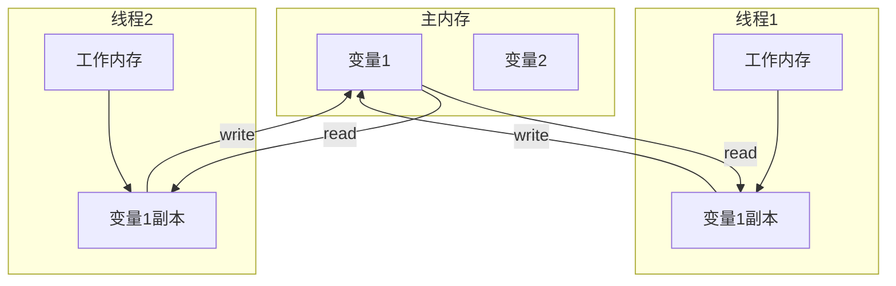
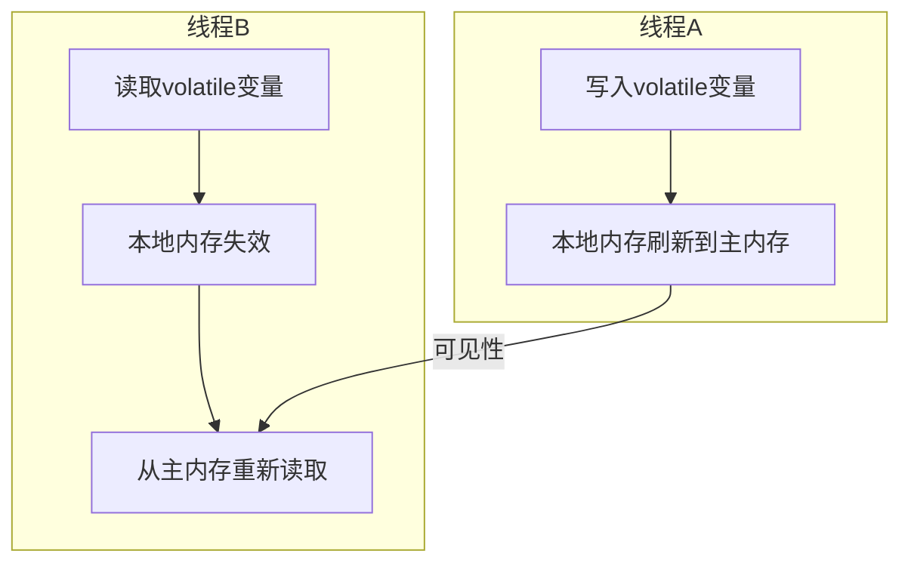
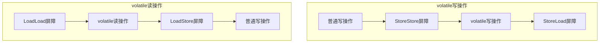
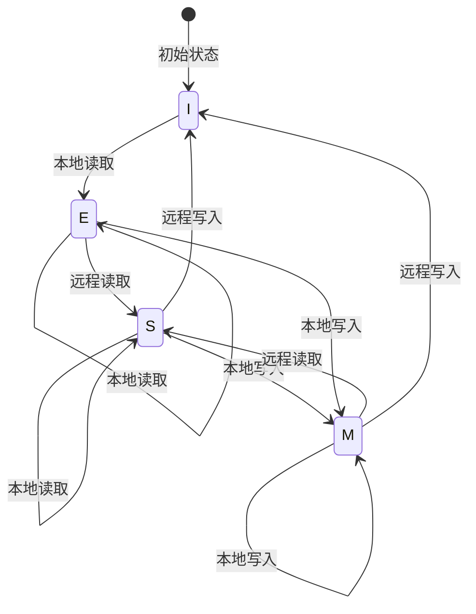
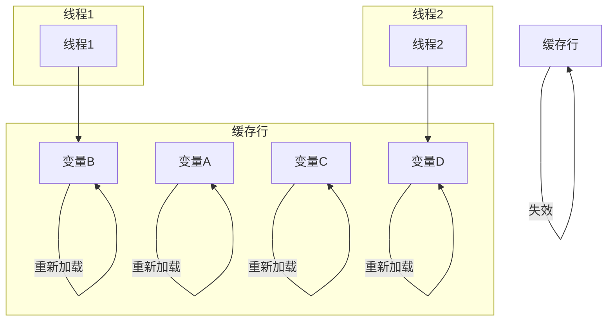

---
isOriginal: false
title: Java线程安全与volatile深度解析
tag:
  - thread
  - volatile
  - synchronized
  - 内存模型
  - 缓存一致性
  - MESI协议
  - 伪共享
category: thread
date: 2023-12-20
icon: coffee
description: 深入解析Java线程安全、volatile关键字底层原理、Java内存模型、缓存一致性协议(MESI)以及伪共享等高级并发编程概念
sticky: false
timeline: true
article: true
star: false
---

> 深入解析Java线程安全、volatile关键字底层原理、Java内存模型、缓存一致性协议以及伪共享等高级并发编程概念

## 一、并发与并行概述

### 1.1 并发（Concurrency）

`并发`是指多个任务在**同一时间段内**执行，但在**同一时刻**只有一个任务在CPU上执行。CPU通过时间分片（Time Slicing）技术，为每个任务分配时间片，当一个任务的时间片耗尽时，CPU会切换到其他任务执行。这种切换会产生上下文切换（Context Switch）开销，但能给人一种"同时执行"的错觉。

### 1.2 并行（Parallelism）

`并行`是指多个任务在**同一时刻**真正同时执行，需要多核CPU支持。每个CPU核心可以独立执行一个任务，实现真正的同时执行。

### 1.3 并发与并行的区别

| 特性 | 并发 | 并行 |
|------|------|------|
| 执行方式 | 时间分片，交替执行 | 多核同时执行 |
| CPU需求 | 单核即可 | 多核CPU |
| 上下文切换 | 有 | 无 |
| 真正同时 | 否 | 是 |

## 二、Java内存模型（JMM）

Java内存模型定义了线程如何与内存交互，以及变量在多线程环境下的可见性、原子性和有序性。

### 2.1 JMM的核心结构

JMM将内存分为两类：

- **主内存（Main Memory）**：所有线程共享的内存区域，存储所有变量
- **工作内存（Working Memory）**：每个线程独有的内存区域，存储变量的副本



### 2.2 内存原子操作

JMM定义了8种原子操作，用于实现主内存与工作内存之间的交互：

| 操作类型 | 操作 | 作用域 | 描述 |
|---------|------|--------|------|
| 主内存操作 | lock | 主内存 | 将变量标记为线程独占状态 |
| 主内存操作 | unlock | 主内存 | 释放变量的独占状态 |
| 主内存操作 | read | 主内存 | 将变量从主内存传输到工作内存 |
| 主内存操作 | write | 主内存 | 将变量从工作内存写回主内存 |
| 工作内存操作 | load | 工作内存 | 将read的数据加载到工作内存变量副本 |
| 工作内存操作 | use | 工作内存 | 将工作内存变量值传递给执行引擎 |
| 工作内存操作 | assign | 工作内存 | 将执行引擎结果赋值给工作内存变量 |
| 工作内存操作 | store | 工作内存 | 将工作内存变量值传输到主内存 |

### 2.3 操作规则限制

JMM对这些操作施加了严格的限制：

1. read和load、store和write必须成对出现
2. 不允许丢弃最近的assign操作
3. 不允许无原因地将数据写回主内存
4. 变量必须先初始化才能使用
5. lock和unlock必须配对
6. lock操作会清空工作内存中的变量值
7. 不允许解锁未锁定的变量
8. unlock前必须先同步变量到主内存

## 三、线程安全问题

### 3.1 线程安全的定义

线程安全是指当多个线程同时访问一个对象时，如果不需要额外的同步控制或协调机制，这个对象的行为仍然是正确的。

### 3.2 线程安全的三大特性

#### 3.2.1 原子性

原子性是指一个操作是不可中断的，要么全部执行成功，要么全部执行失败。

例如，`x++`不是原子操作，它包含三个步骤：

1. 读取x的值到工作内存
2. 对x的值加1
3. 将结果写回主内存

#### 3.2.2 可见性

可见性是指当一个线程修改了共享变量的值，其他线程能够立即看到修改后的结果。

#### 3.2.3 有序性

有序性是指程序执行的顺序按照代码的先后顺序执行。JVM和CPU可能会对指令进行重排序以提高性能，但在单线程环境下不会影响程序的正确性，这就是**as-if-serial**语义。然而在多线程环境下，指令重排序可能会导致意外的结果。

## 四、同步机制

### 4.1 synchronized关键字

synchronized是Java中最基本的同步机制，可以保证原子性、可见性和有序性。

#### 4.1.1 synchronized的工作原理

- **进入同步块**：将同步块中使用的变量从工作内存中清除，强制从主内存读取
- **执行同步块**：独占对象锁，其他线程无法进入
- **退出同步块**：将工作内存中的变量值刷新到主内存，释放对象锁

#### 4.1.2 synchronized的使用方式

```java
// 同步方法
public synchronized void method() {
    // 临界区代码
}

// 同步代码块
public void method() {
    synchronized(this) {
        // 临界区代码
    }
}
```

### 4.2 volatile关键字

volatile是一种轻量级的同步机制，只保证可见性和有序性，不保证原子性。

#### 4.2.1 volatile的工作原理

- **写操作**：当写入volatile变量时，JMM会将线程本地内存中的变量刷新到主内存
- **读操作**：当读取volatile变量时，JMM会将线程本地内存置为无效，强制从主内存读取



#### 4.2.2 volatile的底层实现

volatile关键字的实现依赖于硬件平台的内存屏障指令，不同的CPU架构有不同的实现方式。

##### 4.2.2.1 字节码层面

当使用volatile修饰变量时，编译器会在生成的字节码中添加一个`ACC_VOLATILE`标志。

```java
// 原代码
private volatile int count = 0;

// 字节码（简化版）
private int count;
flags: ACC_PRIVATE, ACC_VOLATILE
```

##### 4.2.2.2 JVM层面

JVM会根据`ACC_VOLATILE`标志，在volatile变量的读写操作前后插入内存屏障指令。

```java
// volatile写操作的JVM实现伪代码
store storeBarrier
store volatileVariable
storeLoadBarrier

// volatile读操作的JVM实现伪代码
loadLoadBarrier
load volatileVariable
loadStoreBarrier
```

##### 4.2.2.3 硬件层面

不同的CPU架构有不同的内存屏障指令：

- **x86架构**：使用`lock`前缀指令来实现内存屏障
- **ARM架构**：使用`dmb`（数据内存屏障）、`dsb`（数据同步屏障）等指令

在x86架构中，volatile写操作会被转换为带有`lock`前缀的指令，这会：

1. 确保指令的原子性
2. 禁止该指令与之前的指令重排序
3. 将写缓冲区的数据刷新到主内存
4. 使其他CPU中该变量的缓存失效

需要注意的是，在x86架构中，大多数内存屏障是免费的，只有StoreLoad屏障需要显式实现。这是因为x86架构本身提供了较强的内存序保证。

#### 4.2.3 volatile的使用场景

1. 状态标记量
2. 双重检查锁定（DCL）
3. 单例模式中的instance变量

#### 4.2.4 volatile不保证原子性的示例

```java
public class VolatileAtomicTest {
    private static volatile int count = 0;
    
    public static void main(String[] args) {
        for (int i = 0; i < 10; i++) {
            new Thread(() -> {
                for (int j = 0; j < 1000; j++) {
                    count++;
                }
            }).start();
        }
        // 等待所有线程执行完成
        try {
            Thread.sleep(2000);
        } catch (InterruptedException e) {
            e.printStackTrace();
        }
        System.out.println("count = " + count); // 结果可能小于10000
    }
}
```

#### 4.2.5 volatile的正确使用示例

##### 4.2.5.1 状态标记量

```java
public class VolatileFlagDemo {
    private volatile boolean running = true;
    
    public void start() {
        new Thread(() -> {
            while (running) {
                // 执行任务
                System.out.println("Running...");
                try {
                    Thread.sleep(100);
                } catch (InterruptedException e) {
                    e.printStackTrace();
                }
            }
            System.out.println("Stopped");
        }).start();
    }
    
    public void stop() {
        running = false;
    }
    
    public static void main(String[] args) {
        VolatileFlagDemo demo = new VolatileFlagDemo();
        demo.start();
        try {
            Thread.sleep(500);
        } catch (InterruptedException e) {
            e.printStackTrace();
        }
        demo.stop();
    }
}
```

##### 4.2.5.2 双重检查锁定模式(DCL)

```java
public class Singleton {
    // 必须使用volatile，防止指令重排序导致的问题
    private static volatile Singleton instance;
    
    private Singleton() {}
    
    public static Singleton getInstance() {
        if (instance == null) { // 第一次检查
            synchronized (Singleton.class) { // 加锁
                if (instance == null) { // 第二次检查
                    instance = new Singleton(); // 创建实例
                    // 这行代码包含三个步骤：
                    // 1. 分配内存空间
                    // 2. 初始化对象
                    // 3. 设置instance指向内存空间
                    // 如果没有volatile，可能会发生指令重排序，导致步骤3在步骤2之前执行
                    // 这样其他线程可能会获取到一个未完全初始化的对象
                }
            }
        }
        return instance;
    }
}

## 五、指令重排序与内存屏障

### 5.1 指令重排序

指令重排序是JVM为了提高性能而对指令执行顺序进行的优化，包括：
- 编译器重排序
- 指令级并行重排序
- 内存系统重排序

### 5.2 内存屏障

内存屏障是一种特殊的CPU指令，用于禁止特定类型的指令重排序，保证内存操作的可见性。

#### 5.2.1 内存屏障类型

| 屏障类型 | 描述 |
|---------|------|
| LoadLoad | 禁止读操作重排序 |
| StoreStore | 禁止写操作重排序 |
| LoadStore | 禁止读操作和写操作重排序 |
| StoreLoad | 禁止写操作和读操作重排序（开销最大，万能屏障） |



#### 5.2.2 volatile的内存屏障实现

- 写操作：在写操作前插入StoreStore屏障，写操作后插入StoreLoad屏障
- 读操作：在读操作前插入LoadLoad屏障，读操作后插入LoadStore屏障

## 六、缓存一致性协议

### 6.1 缓存一致性问题

在多核CPU环境下，每个CPU都有自己的缓存，如果多个CPU同时修改同一变量的缓存副本，会导致缓存不一致的问题。

### 6.2 MESI协议

MESI是最常用的缓存一致性协议，定义了缓存行的四种状态：

| 状态 | 英文 | 描述 |
|------|------|------|
| M | Modified | 缓存行有效，数据被修改，与主内存不一致，仅存在于本缓存 |
| E | Exclusive | 缓存行有效，数据与主内存一致，仅存在于本缓存 |
| S | Shared | 缓存行有效，数据与主内存一致，存在于多个缓存 |
| I | Invalid | 缓存行无效 |



#### 6.2.1 MESI协议的详细工作原理

MESI协议通过以下消息类型来实现缓存一致性：

| 消息类型 | 描述 |
|---------|------|
| Read | 请求从主内存或其他缓存读取数据 |
| Read Response | 响应Read请求，返回数据 |
| Invalid | 请求其他缓存将特定缓存行置为无效 |
| Invalid Acknowledge | 确认已将特定缓存行置为无效 |
| Writeback | 将修改过的缓存行写回主内存 |

#### 6.2.2 MESI协议的优化

MESI协议在实际实现中会有一些优化：

1. **Store Buffer**：
   - 当CPU要写一个缓存行时，如果该缓存行不在M状态，CPU会将写操作放入Store Buffer
   - CPU不需要等待Invalid Acknowledge消息，就可以继续执行后续指令
   - 当收到所有Invalid Acknowledge消息后，才将Store Buffer中的数据写入缓存

2. **Invalidate Queue**：
   - 当CPU收到Invalid消息时，会将其放入Invalidate Queue
   - CPU会立即发送Invalid Acknowledge消息，不需要等待实际的失效操作完成
   - 然后在适当的时机处理Invalidate Queue中的消息

3. **Store Forwarding**：
   - CPU可以直接从Store Buffer中读取自己最近写入的数据
   - 不需要等待数据被写入缓存

这些优化可以提高CPU的执行效率，但也可能导致一些内存一致性问题，需要通过内存屏障来解决。

#### 6.2.3 MESI协议的优缺点

**优点**：

- 实现简单，易于理解
- 能够保证缓存一致性
- 性能较好，特别是在读取操作频繁的场景

**缺点**：

- 写操作的开销较大，需要等待所有Invalid Acknowledge消息
- 可能导致总线流量较大
- 在某些场景下可能会出现缓存颠簸（Cache Thrashing）

#### 6.2.4 MESI状态转换示例

```java
// 示例代码：线程1和线程2同时访问commonInt变量
@Slf4j
public class MesiDemo {
    private int commonInt = 0;

    public static void main(String[] args) {
        new MesiDemo().test();
    }

    private void test() {
        // 线程1：3毫秒后修改commonInt
        Thread t1 = new Thread(() -> {
            try { Thread.sleep(3); } catch (InterruptedException e) {}
            log.info("线程1: {}", ++commonInt);
        });

        // 线程2：循环检查commonInt是否大于0
        Thread t2 = new Thread(() -> {
            while(true) {
                log.info("线程2: {}", commonInt);
                if (commonInt > 0) {
                    log.info("线程2退出循环: {}", commonInt);
                    break;
                }
            }
        });

        t1.start();
        t2.start();
    }
}
```

执行流程分析：

1. 线程2优先执行，读取commonInt=0，缓存行状态变为E（Exclusive）
2. 线程1开始执行，尝试读取commonInt，由于线程2缓存中存在该数据，两个线程的缓存行状态都变为S（Shared）
3. 线程2继续读取，缓存行状态保持S
4. 线程1执行++commonInt操作，缓存行状态变为M（Modified）
5. 线程1的缓存行失效，需要重新从主内存读取
6. 线程2读取到更新后的值，退出循环

## 七、伪共享（False Sharing）

### 7.1 伪共享的概念

CPU缓存以缓存行（Cache Line）为单位进行数据传输，通常为64字节。当多个变量被加载到同一缓存行时，一个变量的修改会导致整个缓存行失效，影响其他变量的性能，这就是伪共享。



### 7.2 避免伪共享的方法

#### 7.2.1 字节填充（JDK 8之前）

通过添加无用字段填充缓存行，避免多个变量出现在同一缓存行。

```java
public class PaddingDemo {
    private long value;
    // 填充6个long类型（48字节），加上value的8字节，共56字节
    // 不同JVM可能需要不同的填充大小
    private long p1, p2, p3, p4, p5, p6;
}
```

#### 7.2.2 @Contended注解（JDK 8及以后）

JDK 8提供了`@sun.misc.Contended`注解来解决伪共享问题。

```java
@Contended
public class ContendedDemo {
    private long value1;
    @Contended
    private long value2;
}
```

使用时需要添加JVM参数：

- `-XX:-RestrictContended`：允许在用户代码中使用@Contended注解
- `-XX:ContendedPaddingWidth=128`：设置填充宽度（默认128字节）

## 八、最佳实践

### 8.1 volatile的使用建议

1. 只用于修饰简单类型变量（int、long等）
2. 变量的写入操作不依赖其当前值
3. 不需要保证原子性的场景
4. 状态标记量（如boolean flag）
5. 与Atomic类结合使用，实现更复杂的原子操作

### 8.2 高性能并发编程技巧

1. 减少锁的粒度（如ConcurrentHashMap的分段锁）
2. 使用无锁数据结构（如Atomic类）
3. 避免伪共享（使用字节填充或@Contended注解）
4. 合理使用并发工具类（如CountDownLatch、CyclicBarrier）
5. 考虑使用线程本地存储（ThreadLocal）减少共享
6. 优先使用CAS操作代替锁
7. 使用读写锁（ReadWriteLock）提高并发读性能

### 8.3 常见并发陷阱

#### 8.3.1 死锁

```java
public class DeadlockDemo {
    private final Object lock1 = new Object();
    private final Object lock2 = new Object();
    
    public void method1() {
        synchronized (lock1) {
            System.out.println("Method1 acquired lock1");
            try {
                Thread.sleep(100);
            } catch (InterruptedException e) {
                e.printStackTrace();
            }
            synchronized (lock2) {
                System.out.println("Method1 acquired lock2");
            }
        }
    }
    
    public void method2() {
        synchronized (lock2) {
            System.out.println("Method2 acquired lock2");
            try {
                Thread.sleep(100);
            } catch (InterruptedException e) {
                e.printStackTrace();
            }
            synchronized (lock1) {
                System.out.println("Method2 acquired lock1");
            }
        }
    }
    
    public static void main(String[] args) {
        DeadlockDemo demo = new DeadlockDemo();
        new Thread(demo::method1).start();
        new Thread(demo::method2).start();
    }
}
```

#### 8.3.2 活锁

活锁是指线程不断尝试但无法取得进展的情况。

```java
public class LivelockDemo {
    private int count = 0;
    private final Object lock = new Object();
    
    public void increment() {
        while (true) {
            synchronized (lock) {
                if (count % 2 == 0) {
                    count++;
                    System.out.println("Increment: " + count);
                    break;
                }
            }
            // 释放锁后立即重新尝试，可能导致活锁
            Thread.yield();
        }
    }
    
    public void decrement() {
        while (true) {
            synchronized (lock) {
                if (count % 2 != 0) {
                    count--;
                    System.out.println("Decrement: " + count);
                    break;
                }
            }
            // 释放锁后立即重新尝试，可能导致活锁
            Thread.yield();
        }
    }
    
    public static void main(String[] args) {
        LivelockDemo demo = new LivelockDemo();
        new Thread(demo::increment).start();
        new Thread(demo::decrement).start();
    }
}
```

#### 8.3.3 饥饿

饥饿是指线程永远无法获得所需的资源，导致无法继续执行。

```java
public class StarvationDemo {
    private final Object lock = new Object();
    
    public void lowPriorityTask() {
        synchronized (lock) {
            System.out.println("Low priority task acquired lock");
            try {
                Thread.sleep(1000);
            } catch (InterruptedException e) {
                e.printStackTrace();
            }
        }
    }
    
    public void highPriorityTask() {
        synchronized (lock) {
            System.out.println("High priority task acquired lock");
        }
    }
    
    public static void main(String[] args) {
        StarvationDemo demo = new StarvationDemo();
        
        // 创建一个低优先级线程，长时间持有锁
        Thread lowPriorityThread = new Thread(demo::lowPriorityTask);
        lowPriorityThread.setPriority(Thread.MIN_PRIORITY);
        lowPriorityThread.start();
        
        // 创建多个高优先级线程，争夺锁
        for (int i = 0; i < 5; i++) {
            Thread highPriorityThread = new Thread(demo::highPriorityTask);
            highPriorityThread.setPriority(Thread.MAX_PRIORITY);
            highPriorityThread.start();
        }
    }
}

## 九、总结

本文深入解析了Java线程安全的核心概念，包括：
- 并发与并行的区别
- Java内存模型的工作原理
- 线程安全的三大特性（原子性、可见性、有序性）
- synchronized和volatile的实现原理与使用场景
- volatile的底层实现（字节码、JVM、硬件层面）
- 指令重排序与内存屏障的作用
- MESI缓存一致性协议的详细原理与优化
- 伪共享问题及其解决方案
- 并发编程的最佳实践和常见陷阱

### 9.1 关键结论

1. **volatile是轻量级同步机制**：只保证可见性和有序性，不保证原子性
2. **synchronized是重量级同步机制**：保证原子性、可见性和有序性
3. **内存屏障是实现同步的基础**：禁止指令重排序，保证内存操作的可见性
4. **MESI协议保证缓存一致性**：通过缓存行状态转换和消息传递实现
5. **避免伪共享可提高性能**：使用字节填充或@Contended注解

### 9.2 实际应用建议

1. **优先使用volatile**：在不需要保证原子性的场景下，volatile性能更好
2. **合理使用synchronized**：在需要保证原子性的场景下使用，注意减少锁的粒度
3. **理解MESI协议**：有助于理解并发编程中的内存可见性问题
4. **避免并发陷阱**：注意死锁、活锁、饥饿等问题
5. **关注性能优化**：减少同步开销，避免伪共享

掌握这些概念对于编写高效、安全的并发程序至关重要。在实际开发中，应根据具体场景选择合适的同步机制，平衡安全性与性能。
