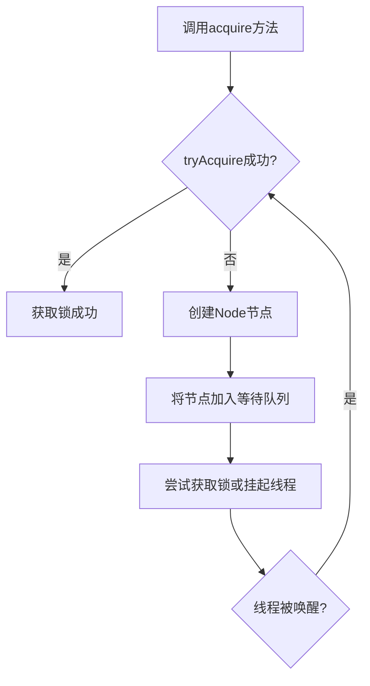
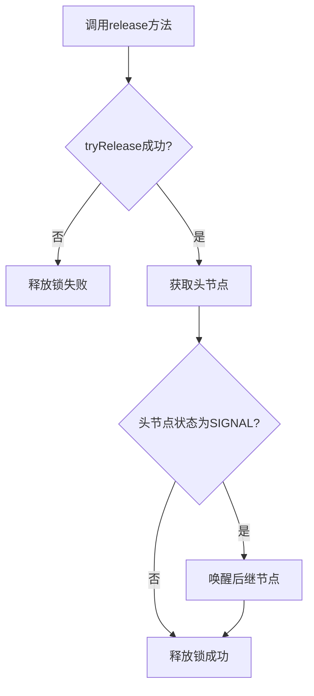
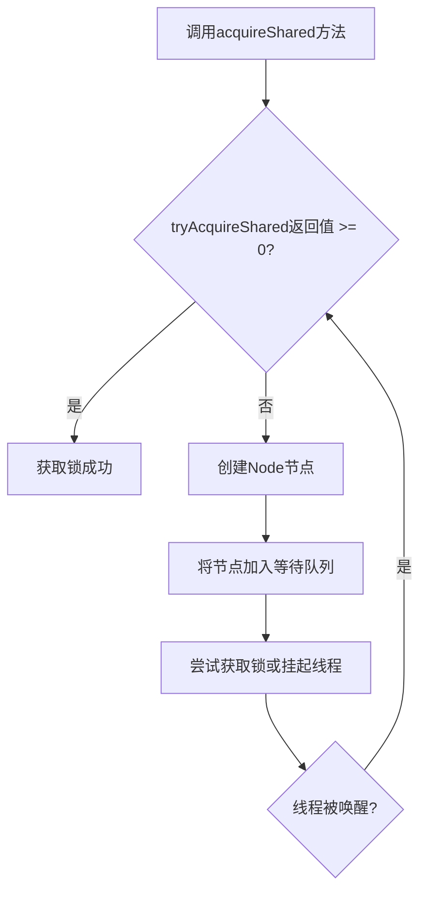
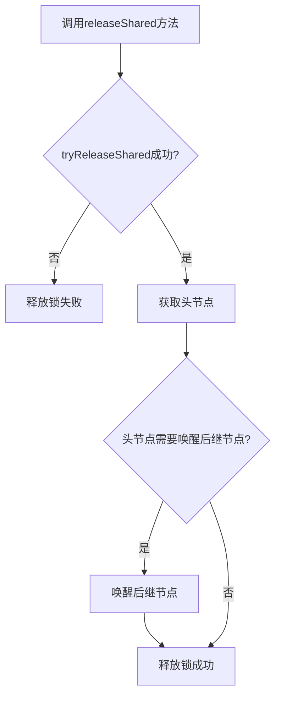

## AQS源码分析

### 一、概述

AQS(AbstractQueuedSynchronizer)是Java并发包中最核心的组件之一，它提供了一个框架，用于构建锁和同步器。ReentrantLock、Semaphore、CountDownLatch、CyclicBarrier等并发工具类都是基于AQS实现的。

AQS的核心思想是：
1. 维护一个状态变量，用于表示同步状态
2. 使用FIFO队列来管理等待线程
3. 提供模板方法，允许子类自定义同步策略

### 二、核心概念

#### 1. 同步状态

AQS使用一个32位的int变量来表示同步状态：

```java
private volatile int state;
```

不同的同步器可以根据需要定义状态的含义：
- **ReentrantLock**：state表示锁的重入次数
- **Semaphore**：state表示可用许可证数量
- **CountDownLatch**：state表示计数器的值

#### 2. 等待队列

AQS使用一个FIFO的双向链表来管理等待线程，每个节点代表一个等待线程：

```java
static final class Node {
    // 节点状态
    volatile int waitStatus;
    
    // 前驱节点
    volatile Node prev;
    
    // 后继节点
    volatile Node next;
    
    // 当前节点对应的线程
    volatile Thread thread;
    
    // 等待队列中的下一个节点
    Node nextWaiter;
}
```

节点状态（waitStatus）的可能取值：
- **CANCELLED(1)**：节点已取消
- **SIGNAL(-1)**：后继节点需要被唤醒
- **CONDITION(-2)**：节点在条件队列中
- **PROPAGATE(-3)**：共享模式下的传播状态
- **0**：初始状态

#### 3. 核心方法

AQS提供了以下核心方法：

```java
// 获取同步状态
protected final int getState() {
    return state;
}

// 设置同步状态
protected final void setState(int newState) {
    state = newState;
}

// CAS更新同步状态
protected final boolean compareAndSetState(int expect, int update) {
    return unsafe.compareAndSwapInt(this, stateOffset, expect, update);
}
```

### 三、类结构

AQS的类结构如下：

```java
public abstract class AbstractQueuedSynchronizer
    extends AbstractOwnableSynchronizer
    implements java.io.Serializable {
    
    // 等待队列的头节点
    private transient volatile Node head;
    
    // 等待队列的尾节点
    private transient volatile Node tail;
    
    // 同步状态
    private volatile int state;
    
    // Unsafe实例，用于直接操作内存
    private static final Unsafe unsafe = Unsafe.getUnsafe();
    
    // 状态变量的内存偏移量
    private static final long stateOffset;
    
    // 头节点的内存偏移量
    private static final long headOffset;
    
    // 尾节点的内存偏移量
    private static final long tailOffset;
    
    // 构造方法
    protected AbstractQueuedSynchronizer() {}
    
    // 模板方法，由子类实现
    protected boolean tryAcquire(int arg) {
        throw new UnsupportedOperationException();
    }
    
    protected boolean tryRelease(int arg) {
        throw new UnsupportedOperationException();
    }
    
    protected int tryAcquireShared(int arg) {
        throw new UnsupportedOperationException();
    }
    
    protected boolean tryReleaseShared(int arg) {
        throw new UnsupportedOperationException();
    }
    
    protected boolean isHeldExclusively() {
        throw new UnsupportedOperationException();
    }
    
    // 公共方法
    public final void acquire(int arg) { ... }
    public final boolean release(int arg) { ... }
    public final void acquireShared(int arg) { ... }
    public final boolean releaseShared(int arg) { ... }
    public final void acquireInterruptibly(int arg) { ... }
    public final boolean tryAcquireNanos(int arg, long nanosTimeout) { ... }
    public final void acquireSharedInterruptibly(int arg) { ... }
    public final boolean tryAcquireSharedNanos(int arg, long nanosTimeout) { ... }
    
    // 其他辅助方法
    private Node addWaiter(Node mode) { ... }
    private void enq(final Node node) { ... }
    private void setHead(Node node) { ... }
    private void unparkSuccessor(Node node) { ... }
    private void doReleaseShared() { ... }
    private boolean shouldParkAfterFailedAcquire(Node pred, Node node) { ... }
    private static boolean compareAndSetWaitStatus(Node node, int expect, int update) { ... }
    private static boolean compareAndSetNext(Node node, Node expect, Node update) { ... }
}
```

AQS的类结构采用了模板方法模式，子类需要实现`tryAcquire`、`tryRelease`等方法来定义具体的同步策略。

### 四、核心方法分析

#### 1. 独占锁获取(acquire)

`acquire`方法用于获取独占锁，其执行流程如下：



源码分析：

```java
public final void acquire(int arg) {
    if (!tryAcquire(arg) &&
        acquireQueued(addWaiter(Node.EXCLUSIVE), arg))
        selfInterrupt();
}
```

`acquire`方法的执行步骤：
1. 调用`tryAcquire`方法尝试获取锁
2. 如果获取成功，直接返回
3. 如果获取失败，调用`addWaiter`方法将当前线程加入等待队列
4. 调用`acquireQueued`方法在队列中等待获取锁
5. 如果线程在等待过程中被中断，调用`selfInterrupt`方法中断当前线程

#### 2. 独占锁释放(release)

`release`方法用于释放独占锁，其执行流程如下：



源码分析：

```java
public final boolean release(int arg) {
    if (tryRelease(arg)) {
        Node h = head;
        if (h != null && h.waitStatus != 0)
            unparkSuccessor(h);
        return true;
    }
    return false;
}
```

`release`方法的执行步骤：
1. 调用`tryRelease`方法尝试释放锁
2. 如果释放成功，获取等待队列的头节点
3. 如果头节点不为空且状态不为0，调用`unparkSuccessor`方法唤醒后继节点
4. 返回释放结果

#### 3. 共享锁获取(acquireShared)

`acquireShared`方法用于获取共享锁，其执行流程如下：



源码分析：

```java
public final void acquireShared(int arg) {
    if (tryAcquireShared(arg) < 0)
        doAcquireShared(arg);
}
```

`acquireShared`方法的执行步骤：
1. 调用`tryAcquireShared`方法尝试获取共享锁
2. 如果返回值大于等于0，表示获取成功，直接返回
3. 如果返回值小于0，表示获取失败，调用`doAcquireShared`方法在队列中等待获取锁

#### 4. 共享锁释放(releaseShared)

`releaseShared`方法用于释放共享锁，其执行流程如下：



源码分析：

```java
public final boolean releaseShared(int arg) {
    if (tryReleaseShared(arg)) {
        doReleaseShared();
        return true;
    }
    return false;
}
```

`releaseShared`方法的执行步骤：
1. 调用`tryReleaseShared`方法尝试释放共享锁
2. 如果释放成功，调用`doReleaseShared`方法唤醒等待队列中的后继节点
3. 返回释放结果

### 五、等待队列的实现

AQS使用双向链表实现等待队列，队列的节点是`Node`类的实例。

#### 1. 添加节点(addWaiter)

`addWaiter`方法用于将线程添加到等待队列的尾部：

```java
private Node addWaiter(Node mode) {
    // 创建新节点
    Node node = new Node(Thread.currentThread(), mode);
    // 尝试快速添加到队列尾部
    Node pred = tail;
    if (pred != null) {
        node.prev = pred;
        if (compareAndSetTail(pred, node)) {
            pred.next = node;
            return node;
        }
    }
    // 如果快速添加失败，使用enq方法
    enq(node);
    return node;
}
```

#### 2. 入队(enq)

`enq`方法用于将节点添加到队列，如果队列不存在则创建队列：

```java
private Node enq(final Node node) {
    for (;;) {
        Node t = tail;
        if (t == null) { // 队列不存在，创建头节点
            if (compareAndSetHead(new Node()))
                tail = head;
        } else { // 队列存在，添加到尾部
            node.prev = t;
            if (compareAndSetTail(t, node)) {
                t.next = node;
                return t;
            }
        }
    }
}
```

`enq`方法使用CAS操作和自旋来保证线程安全地将节点添加到队列中。

#### 3. 出队(setHead)

`setHead`方法用于将节点设置为头节点：

```java
private void setHead(Node node) {
    head = node;
    node.thread = null;
    node.prev = null;
}
```

### 六、AQS的实现原理

#### 1. 独占锁的实现

以ReentrantLock为例，说明独占锁的实现原理：

```java
// ReentrantLock的内部类Sync继承自AQS
abstract static class Sync extends AbstractQueuedSynchronizer {
    // 尝试获取独占锁
    protected final boolean tryAcquire(int acquires) {
        final Thread current = Thread.currentThread();
        int c = getState();
        if (c == 0) { // 状态为0，表示锁可用
            if (compareAndSetState(0, acquires)) {
                setExclusiveOwnerThread(current);
                return true;
            }
        }
        else if (current == getExclusiveOwnerThread()) { // 当前线程已经持有锁
            int nextc = c + acquires;
            if (nextc < 0) // 溢出
                throw new Error("Maximum lock count exceeded");
            setState(nextc);
            return true;
        }
        return false;
    }
    
    // 尝试释放独占锁
    protected final boolean tryRelease(int releases) {
        int c = getState() - releases;
        if (Thread.currentThread() != getExclusiveOwnerThread())
            throw new IllegalMonitorStateException();
        boolean free = false;
        if (c == 0) { // 状态为0，表示锁完全释放
            free = true;
            setExclusiveOwnerThread(null);
        }
        setState(c);
        return free;
    }
}
```

ReentrantLock通过实现`tryAcquire`和`tryRelease`方法来定义独占锁的获取和释放策略。

#### 2. 共享锁的实现

以Semaphore为例，说明共享锁的实现原理：

```java
// Semaphore的内部类Sync继承自AQS
abstract static class Sync extends AbstractQueuedSynchronizer {
    // 尝试获取共享锁
    protected int tryAcquireShared(int acquires) {
        for (;;) {
            int available = getState();
            int remaining = available - acquires;
            if (remaining < 0 ||
                compareAndSetState(available, remaining))
                return remaining;
        }
    }
    
    // 尝试释放共享锁
    protected final boolean tryReleaseShared(int releases) {
        for (;;) {
            int current = getState();
            int next = current + releases;
            if (next < current) // 溢出
                throw new Error("Maximum permit count exceeded");
            if (compareAndSetState(current, next))
                return true;
        }
    }
}
```

Semaphore通过实现`tryAcquireShared`和`tryReleaseShared`方法来定义共享锁的获取和释放策略。

### 七、AQS的应用场景

AQS是构建Java并发工具类的基础，主要应用场景包括：

1. **独占锁**：ReentrantLock
2. **共享锁**：Semaphore、CountDownLatch
3. **读写锁**：ReentrantReadWriteLock
4. **条件变量**：Condition
5. **其他同步工具**：CyclicBarrier、Exchanger

### 八、AQS源码优化点分析

#### 1. 高效的状态管理

使用volatile变量和CAS操作来管理同步状态，保证了状态的可见性和原子性。

#### 2. 无锁队列操作

等待队列的操作（入队、出队）使用CAS操作和自旋来实现，避免了锁竞争。

#### 3. 合理的锁粒度

AQS只在必要时使用锁，例如在管理等待队列时，减少了锁竞争。

#### 4. 模板方法模式

采用模板方法模式，将通用逻辑放在父类中，特定逻辑由子类实现，提高了代码的复用性和扩展性。

#### 5. 线程安全的设计

通过CAS操作、volatile变量和合理的同步策略，保证了AQS的线程安全性。

### 九、AQS使用建议

1. **了解AQS的核心概念**：熟悉同步状态、等待队列和核心方法
2. **正确选择同步器**：根据需求选择合适的同步器，如ReentrantLock、Semaphore等
3. **避免过度使用锁**：尽量使用无锁数据结构或CAS操作来提高性能
4. **合理设置锁的粒度**：避免锁粒度过大或过小
5. **注意死锁风险**：在使用锁时，注意避免死锁

### 十、总结

AQS是Java并发包中最核心的组件之一，它提供了一个框架，用于构建锁和同步器。AQS的核心思想是维护一个状态变量和一个等待队列，通过模板方法模式允许子类自定义同步策略。

AQS的主要特点包括：
1. 高效的状态管理
2. 无锁队列操作
3. 支持独占锁和共享锁
4. 提供丰富的同步方法
5. 良好的扩展性

深入理解AQS的源码实现，有助于我们更好地使用Java并发包中的工具类，提高并发编程的效率和质量。

### 十一、参考资料

1. [Java 8官方文档 - AbstractQueuedSynchronizer](https://docs.oracle.com/javase/8/docs/api/java/util/concurrent/locks/AbstractQueuedSynchronizer.html)
2. [Java并发编程实战](https://book.douban.com/subject/10484692/)
3. [Java并发编程的艺术](https://book.douban.com/subject/26591326/)