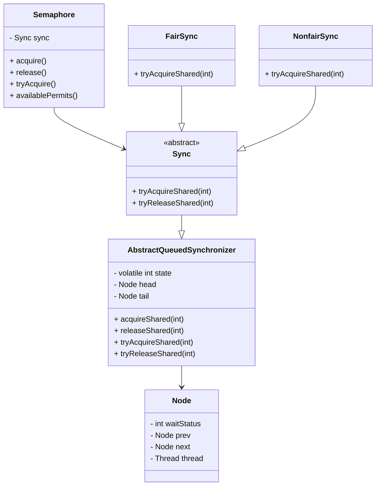
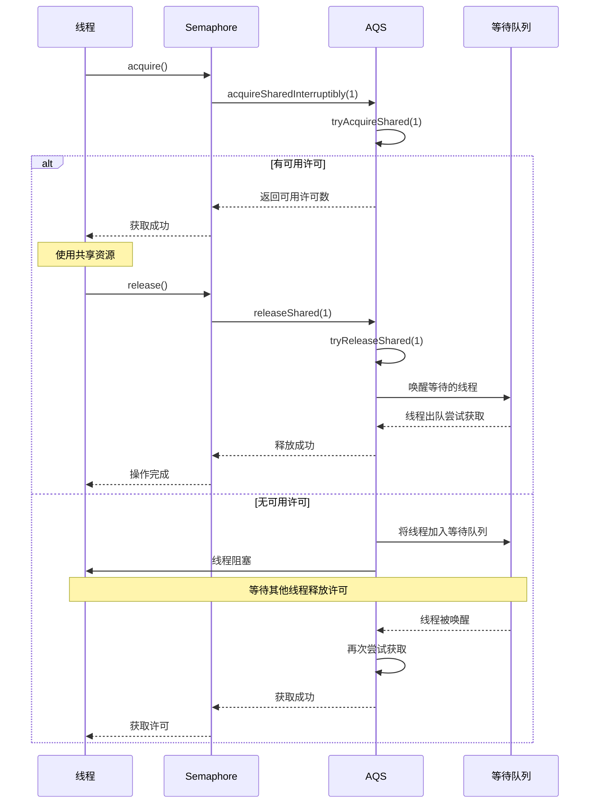

## 1. 什么是Semaphore

Semaphore(信号量)是一种线程同步机制，用于控制同时访问共享资源的线程数量。它维护了一个许可集，在许可可用时允许访问共享资源，并在许可被使用时阻塞访问请求。

### 1.1 Semaphore的核心概念

- **许可集(Permits)**：控制可以同时访问共享资源的最大线程数
- **公平/非公平模式**：决定线程获取许可的顺序
- **共享资源**：需要被并发控制访问的资源
- **阻塞机制**：当无可用许可时，线程会被阻塞直到许可可用

### 1.2 Semaphore与其他并发工具的对比

| 并发工具 | 主要用途 | 资源限制 | 适用场景 |
|---------|---------|---------|--------|
| Semaphore | 控制并发访问数量 | 可配置的许可数 | 限流、资源池管理 |
| CountDownLatch | 等待多个线程完成 | 计数器减至0 | 任务协调、并发任务等待 |
| CyclicBarrier | 多线程同步点 | 固定参与线程数 | 阶段任务、数据同步 |
| ReentrantLock | 互斥访问 | 单一锁 | 排他性资源访问 |
| ReadWriteLock | 读写分离 | 区分读写权限 | 读多写少场景 |

## 2. Semaphore的实际应用场景

Semaphore常用于以下场景：

1. **资源池管理**：控制数据库连接池、线程池、网络连接等资源的并发访问数量
2. **限流**：限制API或服务的并发请求数量，保护系统稳定性
3. **任务调度**：控制同时执行的任务数量，避免系统过载
4. **权限控制**：控制特定操作的并发执行数量

## 3. 案例：礼物销售系统

### 3.1 场景描述

考虑这样一种场景：我们有n个礼物，有m个窗口，每个窗口都可以单独售卖礼物，礼物卖完即止。

在这个场景里，一方面要对礼物数量进行线程安全控制，防止商品超卖；另外一方面，可以通过`Semaphore`控制窗口的数量。

### 3.2 礼物管理器实现

首先解决商品超卖的问题，这里通过`GiftManager`进行商品的数量管理，实际应用的时候，往往需要与数据库进行交互。`addGiftCount`和`removeGiftCount`通过`synchronized`进行同步，确保线程安全。

`getInstance`方法实现了双重检查锁定的单例模式，对外部只提供一个`GiftManager`的对象实例。

### 3.3 并发安全问题

虽然含有`getGiftCount`方法，但是在多线程情况下，获取到的商品数量在之后进行操作时可能不是准确的。具体来说，当在t1时刻获取到了数量，在t2时刻进行数量阈值判断的时候，t2时刻的商品数量可能就和t1时刻的不相同。这也是在`removeGiftCount`方法中需要再次进行数量判断的原因。

### 3.4 礼物管理器完整代码

```java
@Slf4j
public final class GiftManager {
    // 单例实例，使用volatile保证多线程可见性
    private static volatile GiftManager instance;
    // 当前礼物数量
    private int giftCount;

    // 私有构造函数防止外部实例化
    private GiftManager() {
    }

    // 线程安全地增加礼物数量
    public synchronized void addGiftCount(int giftCount) {
        this.giftCount += giftCount;
        log.info("当前礼物数量为：{}", this.giftCount);
    }

    // 线程安全地减少礼物数量，返回是否成功
    public synchronized boolean removeGiftCount(int giftCount) {
        // 检查礼物是否充足
        if (this.giftCount <= 0) {
            return false;
        }
        this.giftCount -= giftCount;
        return true;
    }

    // 获取当前礼物数量
    public int getGiftCount() {
        return giftCount;
    }

    /**
     * 获取单例 - 使用双重检查锁定模式
     */
    public static GiftManager getInstance() {
        if (instance == null) {
            synchronized (GiftManager.class) {
                if (instance == null) {
                    instance = new GiftManager();
                }
            }
        }

        return instance;
    }
}
```

### 3.5 买家类实现 - 使用Semaphore控制并发

我们实现GiftBuyer类来模拟购买礼物的用户，通过Semaphore控制并发访问窗口的数量：

```java
public class GiftBuyer implements Runnable {
    
    // 信号量，用于控制对窗口的并发访问
    private final Semaphore semaphore;
    
    /**
     * 构造函数
     * @param semaphore 信号量实例
     */
    public GiftBuyer(Semaphore semaphore) {
        this.semaphore = semaphore;
    }
    
    @Override
    public void run() {
        try {
            // 获取许可，尝试占用一个窗口
            semaphore.acquire();
            
            try {
                // 尝试购买礼物
                GiftManager giftManager = GiftManager.getInstance();
                boolean result = giftManager.removeGiftCount(1);
                
                // 模拟购买过程中的处理时间
                Thread.sleep(new Random().nextInt(1000));
                
                if (result) {
                    System.out.println(Thread.currentThread().getName() + " 购买礼物成功");
                } else {
                    System.out.println(Thread.currentThread().getName() + " 购买失败，礼物已售罄");
                }
            } finally {
                // 无论购买是否成功，都释放许可，让出窗口
                semaphore.release();
            }
        } catch (InterruptedException e) {
            Thread.currentThread().interrupt();
        }
    }
}
```

### 3.6 测试类 - 模拟销售场景

下面是测试类，用于模拟多线程购买礼物的场景：

```java
@Slf4j
public class TestSemaphore {

    public static void main(String[] args) {
        // 设置礼物数量
        int giftCount = 1;
        // 设置柜台（窗口）数量
        int windowCount = 100;
        
        // 初始化礼物管理器并添加礼物
        GiftManager giftManager = GiftManager.getInstance();
        giftManager.addGiftCount(giftCount);
        
        // 创建信号量，控制同时可以购买的用户数量
        Semaphore semaphore = new Semaphore(windowCount);
        
        // 只要礼物存在就可以继续购买
        while (giftManager.getGiftCount() > 0) {
            // 检查是否有可用许可，如果没有则等待
            if (semaphore.availablePermits() == 0) {
                log.info("没有空闲的柜台，剩余礼物: {}", giftManager.getGiftCount());
                // 休眠1秒避免CPU过度消耗
                try {
                    Thread.sleep(1000);
                } catch (InterruptedException e) {
                    Thread.currentThread().interrupt();
                }
                continue;
            }
            
            // 创建并启动新的购买线程
            new Thread(new GiftBuyer(semaphore)).start();
        }
        
        log.info("剩余礼物: {}", giftManager.getGiftCount());
    }
}
```

### 3.7 运行结果与分析

运行上述代码后，输出类似于：


当只有一个礼物而多个线程同时尝试购买时，Semaphore确保了只有有限数量的线程可以同时尝试购买操作，但由于礼物数量有限（只有1个），最终只有一个线程能够成功购买。

## 4. Semaphore原理解析

### 4.1 Semaphore的设计原理与AQS基础

Semaphore基于Java并发包中的AQS（AbstractQueuedSynchronizer）框架实现，是一种计数信号量，用于控制对共享资源的访问。它允许多个线程同时访问一个资源，但限制最大并发访问数量。

AQS是Java并发包的基础框架，通过内置的FIFO等待队列和状态变量（state）来实现同步机制。在Semaphore中，AQS的state变量表示当前可用的许可数量。

Semaphore支持两种工作模式：

1. **公平模式**：线程按照请求许可的顺序获取许可（FIFO顺序）
2. **非公平模式**：线程获取许可的顺序不保证与请求顺序一致（默认模式），可能出现"插队"现象

### 4.2 Semaphore的核心实现架构



### 4.3 Semaphore的核心数据结构

Semaphore的核心数据结构在AQS中实现，主要包括：

1. **AQS中的状态值(state)**：表示当前可用的许可数量，使用volatile关键字保证可见性
2. **等待队列**：基于CLH（Craig, Landin, and Hagersten）锁实现的FIFO队列，存储获取不到许可而被阻塞的线程
3. **同步器实现**：通过Sync的两个子类（FairSync和NonfairSync）实现不同的获取策略

AQS节点状态常量：

- **CANCELLED (1)**：节点已取消
- **SIGNAL (-1)**：后继节点需要被唤醒
- **CONDITION (-2)**：节点在条件队列中
- **PROPAGATE (-3)**：共享模式下的传播状态
- **0**：初始状态

### 4.4 Semaphore核心方法的源码分析

#### 4.4.1 构造函数深度分析

```java
// 非公平模式构造函数（默认）
public Semaphore(int permits) {
    // 默认使用非公平模式，性能更高
    sync = new NonfairSync(permits);
}

// 指定公平/非公平模式的构造函数
public Semaphore(int permits, boolean fair) {
    // 根据fair参数选择合适的同步器实现
    sync = fair ? new FairSync(permits) : new NonfairSync(permits);
}
```

**Sync基类实现**：

```java
abstract static class Sync extends AbstractQueuedSynchronizer {
    private static final long serialVersionUID = 1192457210091910933L;

    Sync(int permits) {
        // 直接设置AQS的state为初始许可数量
        setState(permits);
    }

    // 获取当前可用许可数量
    final int getPermits() {
        return getState();
    }

    // 非公平模式的尝试获取共享实现
    final int nonfairTryAcquireShared(int acquires) {
        for (;;) {
            // 获取当前可用许可数量
            int available = getState();
            // 计算获取后剩余的许可数量
            int remaining = available - acquires;
            // 如果剩余许可不足，或者CAS操作成功（更新剩余许可数量），则返回
            if (remaining < 0 ||
                compareAndSetState(available, remaining))
                return remaining;
        }
    }

    // 释放共享许可的实现
    protected final boolean tryReleaseShared(int releases) {
        for (;;) {
            int current = getState();
            int next = current + releases;
            // 检查整数溢出
            if (next < current) // overflow
                throw new Error("Maximum permit count exceeded");
            // CAS更新许可数量
            if (compareAndSetState(current, next))
                return true;
        }
    }
}
```

#### 4.4.2 acquire方法深度解析

**Semaphore的acquire方法**：

```java
public void acquire() throws InterruptedException {
    // 委托给AQS的acquireSharedInterruptibly方法，请求1个许可
    sync.acquireSharedInterruptibly(1);
}
```

**AQS中的模板方法**：

```java
public final void acquireSharedInterruptibly(int arg) throws InterruptedException {
    // 检查线程是否已被中断
    if (Thread.interrupted())
        throw new InterruptedException();
    // 尝试获取共享资源，如果返回值小于0表示获取失败
    if (tryAcquireShared(arg) < 0)
        // 获取失败，将线程加入等待队列并阻塞
        doAcquireSharedInterruptibly(arg);
}
```

**公平模式与非公平模式对比**：

**1. 非公平模式实现**：

```java
// NonfairSync类中的实现
protected int tryAcquireShared(int acquires) {
    // 直接委托给sync基类的nonfairTryAcquireShared方法
    return nonfairTryAcquireShared(acquires);
}
```

**2. 公平模式实现**：

```java
// FairSync类中的实现
protected int tryAcquireShared(int acquires) {
    for (;;) {
        // 关键区别：公平模式会检查是否有线程在等待队列中
        if (hasQueuedPredecessors())
            return -1; // 有前驱线程，获取失败
        
        // 与非公平模式相同的获取逻辑
        int available = getState();
        int remaining = available - acquires;
        if (remaining < 0 || compareAndSetState(available, remaining))
            return remaining;
    }
}
```

**技术深度分析**：

- **hasQueuedPredecessors()** 方法确保严格的FIFO顺序，防止后来的线程插队获取许可
- 两种模式的核心差异在于：非公平模式下，新到达的线程可能会先于等待队列中的线程获取许可
- 非公平模式在高并发场景下通常有更高的吞吐量，但可能导致某些线程长时间饥饿
- 公平模式保证了线程获取许可的顺序性，但可能因为上下文切换导致吞吐量下降

#### 4.4.3 release方法深度解析

**Semaphore的release方法**：

```java
public void release() {
    // 委托给AQS的releaseShared方法，释放1个许可
    sync.releaseShared(1);
}
```

**AQS中的模板方法**：

```java
public final boolean releaseShared(int arg) {
    // 尝试释放共享资源
    if (tryReleaseShared(arg)) {
        // 释放成功，唤醒等待队列中的线程
        doReleaseShared();
        return true;
    }
    return false;
}
```

**Semaphore的释放实现**：

```java
// 在Sync基类中实现，公平和非公平模式共用
protected final boolean tryReleaseShared(int releases) {
    for (;;) {
        int current = getState();
        int next = current + releases;
        
        // 安全检查：防止整数溢出
        if (next < current) // overflow
            throw new Error("Maximum permit count exceeded");
            
        // 使用CAS操作原子地更新状态
        if (compareAndSetState(current, next))
            return true;
    }
}
```

**关键技术要点**：

- release操作与获取模式无关，公平和非公平模式使用相同的释放实现
- 使用无锁算法（CAS）确保多线程环境下的原子性
- 释放操作不会导致线程阻塞，总是立即返回
- 许可数量可以超过初始值，因为release操作不检查上限（仅防止溢出）
- 成功释放后，通过doReleaseShared()唤醒等待队列中的线程

### 4.5 Semaphore的工作流程

下面是Semaphore的工作流程图，展示了线程获取和释放许可的过程：



### 4.6 Semaphore的高级方法

#### 4.6.1 带超时的acquire方法

带超时的acquire方法允许线程在指定时间内尝试获取许可，如果超时则放弃尝试：

```java
public boolean tryAcquire(long timeout, TimeUnit unit) throws InterruptedException {
    // 转换超时时间为纳秒
    return sync.tryAcquireSharedNanos(1, unit.toNanos(timeout));
}
```

**AQS中的模板方法实现**：

```java
public final boolean tryAcquireSharedNanos(int arg, long nanosTimeout) throws InterruptedException {
    // 检查中断状态
    if (Thread.interrupted())
        throw new InterruptedException();
    // 尝试获取，如果失败则进入超时等待
    return tryAcquireShared(arg) >= 0 ||
        doAcquireSharedNanos(arg, nanosTimeout);
}
```

**使用示例**：

```java
Semaphore semaphore = new Semaphore(3);
try {
    // 尝试在5秒内获取许可
    boolean acquired = semaphore.tryAcquire(5, TimeUnit.SECONDS);
    if (acquired) {
        try {
            // 使用共享资源
            System.out.println("成功获取许可并使用资源");
        } finally {
            semaphore.release();
        }
    } else {
        System.out.println("超时，未能获取许可");
    }
} catch (InterruptedException e) {
    Thread.currentThread().interrupt();
    System.err.println("线程被中断");
}
```

带超时的方法对于避免线程无限期等待非常有用，特别适合以下场景：

- 需要响应性的系统，不能无限等待
- 实现超时重试逻辑
- 避免资源死锁
- 实现断路器模式

#### 4.6.2 获取多个许可

```java
// 获取指定数量的许可
public void acquire(int permits) throws InterruptedException {
    if (permits < 0) throw new IllegalArgumentException();
    sync.acquireSharedInterruptibly(permits);
}

// 释放指定数量的许可
public void release(int permits) {
    if (permits < 0) throw new IllegalArgumentException();
    sync.releaseShared(permits);
}
```

#### 4.6.3 获取可用许可数量

```java
// 返回当前可用的许可数量
public int availablePermits() {
    return sync.getPermits();
}

// 返回等待获取许可的线程估计数
public int getQueueLength() {
    return sync.getQueueLength();
}
```

## 5. Semaphore性能分析与最佳实践

### 5.1 性能影响因素

使用Semaphore时，需要考虑以下性能影响因素：

1. **许可数量**：太多的许可会降低限流效果，太少则会导致线程频繁等待
2. **队列长度**：等待队列过长会增加线程调度开销
3. **公平/非公平模式**：公平模式可能导致较高的上下文切换开销，但保证公平性；非公平模式性能更好但可能导致线程饥饿
4. **并发度**：过高的并发度会加剧竞争，增加线程等待时间

### 5.2 与其他并发工具的性能对比

| 并发工具 | 性能特点 | 适用场景 |
|---------|---------|--------|
| Semaphore | 中等开销，灵活的许可控制 | 需要限制并发数量的场景 |
| CountDownLatch | 低开销，一次性使用 | 等待多个任务完成 |
| CyclicBarrier | 中等开销，可重用 | 多阶段同步 |
| ReentrantLock | 低开销（非公平模式），高安全性 | 互斥访问 |
| Synchronized | 低开销（JDK 8+），使用简单 | 简单的同步需求 |

### 5.3 最佳实践建议

#### 5.3.1 使用try-finally确保许可释放

始终在finally块中释放许可，防止因异常导致的资源泄漏：

```java
semaphore.acquire();
try {
    // 使用共享资源
} finally {
    semaphore.release();
}
```

#### 5.3.2 选择合适的公平/非公平模式

- **非公平模式**（默认）：性能更好，适用于对公平性要求不高的场景
- **公平模式**：保证线程获取顺序，适用于对顺序敏感的业务场景

#### 5.3.3 合理设置许可数量

根据系统负载和资源容量设置合适的许可数量：

```java
// 根据CPU核心数设置
int threadCount = Runtime.getRuntime().availableProcessors();
Semaphore semaphore = new Semaphore(threadCount * 2); // 通常设置为CPU核心数的1-4倍
```

#### 5.3.4 使用tryAcquire避免长时间阻塞

对于非关键路径，可以使用带超时的tryAcquire避免线程长时间等待：

```java
if (semaphore.tryAcquire(500, TimeUnit.MILLISECONDS)) {
    try {
        // 使用共享资源
    } finally {
        semaphore.release();
    }
} else {
    // 处理获取失败的情况
}
```

## 6. 常见问题与解决方案

### 6.1 许可未释放导致死锁

**问题**：未在finally块中释放许可，导致其他线程无法获取许可

**解决方案**：始终使用try-finally确保许可释放

### 6.2 公平性与性能的平衡

**问题**：公平模式下性能下降明显

**解决方案**：

- 对性能敏感的场景使用非公平模式
- 对顺序敏感的场景使用公平模式
- 考虑使用带超时的tryAcquire作为折中方案

### 6.3 线程饥饿

**问题**：非公平模式下，某些线程可能长时间无法获取许可

**解决方案**：

- 考虑切换到公平模式
- 增加许可数量
- 实现线程优先级调度

### 6.4 许可数量不合理

**问题**：许可数量过多或过少影响系统性能

**解决方案**：

- 进行性能测试，找到最佳许可数量
- 考虑动态调整许可数量
- 监控系统负载，适时调整

## 7. 更多应用场景示例

### 7.1 数据库连接池限流

```java
public class ConnectionPool {
    private final Semaphore semaphore;
    private final List<Connection> connections;
    private final Queue<Connection> availableConnections;
    
    public ConnectionPool(int poolSize) {
        this.semaphore = new Semaphore(poolSize, true); // 使用公平模式
        this.connections = new ArrayList<>(poolSize);
        this.availableConnections = new ConcurrentLinkedQueue<>();
        
        // 初始化连接池
        for (int i = 0; i < poolSize; i++) {
            Connection conn = createConnection(); // 创建连接
            connections.add(conn);
            availableConnections.add(conn);
        }
    }
    
    public Connection getConnection(long timeout, TimeUnit unit) throws InterruptedException {
        if (semaphore.tryAcquire(timeout, unit)) {
            try {
                Connection conn = availableConnections.poll();
                if (conn != null) {
                    return new ConnectionProxy(conn, this);
                }
                throw new IllegalStateException("No connections available");
            } catch (Exception e) {
                semaphore.release(); // 出错时释放许可
                throw e;
            }
        }
        throw new TimeoutException("Timeout waiting for connection");
    }
    
    public void releaseConnection(Connection conn) {
        // 归还连接到池中
        if (conn instanceof ConnectionProxy) {
            ConnectionProxy proxy = (ConnectionProxy) conn;
            availableConnections.add(proxy.getConnection());
        }
        semaphore.release(); // 释放许可
    }
    
    private Connection createConnection() {
        // 创建数据库连接的具体实现
        return null; // 示例代码，实际需返回真实连接
    }
    
    // 内部代理类，用于在连接关闭时自动释放许可
    private static class ConnectionProxy implements Connection {
        private final Connection realConnection;
        private final ConnectionPool pool;
        
        // 实现Connection接口的各种方法...
    }
}
```

### 7.2 API限流控制

```java
public class ApiRateLimiter {
    private final Semaphore semaphore;
    private final ScheduledExecutorService scheduler;
    
    public ApiRateLimiter(int maxRequestsPerSecond) {
        this.semaphore = new Semaphore(maxRequestsPerSecond);
        this.scheduler = Executors.newScheduledThreadPool(1);
        
        // 每秒重置许可
        scheduler.scheduleAtFixedRate(() -> {
            int available = semaphore.availablePermits();
            int toRelease = maxRequestsPerSecond - available;
            if (toRelease > 0) {
                semaphore.release(toRelease);
            }
        }, 1, 1, TimeUnit.SECONDS);
    }
    
    public boolean tryAcquire() {
        return semaphore.tryAcquire();
    }
    
    public void shutdown() {
        scheduler.shutdown();
    }
}

// 使用示例
public class ApiController {
    private final ApiRateLimiter limiter = new ApiRateLimiter(100); // 每秒最多100个请求
    
    @RequestMapping("/api/resource")
    public ResponseEntity<?> getResource() {
        if (!limiter.tryAcquire()) {
            return ResponseEntity.status(HttpStatus.TOO_MANY_REQUESTS).body("请求过于频繁，请稍后再试");
        }
        
        // 处理请求
        return ResponseEntity.ok("资源内容");
    }
}
```

## 8. 总结

### 8.1 Semaphore的优势

1. **灵活控制并发数量**：可根据需要设置任意数量的许可
2. **支持公平与非公平模式**：适应不同的业务需求
3. **丰富的API**：提供超时、批量获取等多种操作方式
4. **与AQS紧密集成**：基于JUC框架的可靠实现

### 8.2 使用建议

1. **合理设置许可数量**：根据系统资源和负载情况调整
2. **始终释放许可**：使用try-finally确保资源释放
3. **选择合适的模式**：权衡公平性和性能需求
4. **考虑替代方案**：在简单场景下，可能有更轻量级的解决方案
5. **监控与调优**：定期监控系统性能，适时调整参数

Semaphore是Java并发编程中强大而灵活的工具，通过合理使用，可以有效控制资源访问并提升系统稳定性。希望本文的深入解析和最佳实践建议对您有所帮助。

## 9. 参考资料

1. Java官方文档 - java.util.concurrent.Semaphore
2. Java并发编程实战（Brian Goetz著）
3. Java并发编程艺术（方腾飞等著）
4. 深入理解Java虚拟机（周志明著）

---

通过本系列文章，我们深入探讨了Semaphore的原理、实现和应用场景。在实际开发中，合理使用Semaphore可以有效控制系统资源的并发访问，提高系统的稳定性和性能。

如果您有任何疑问或建议，请在评论区留言，我们将尽快回复。感谢您的阅读！
