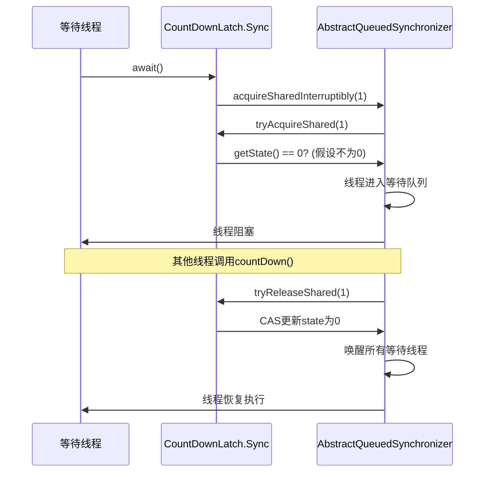

## 1. 什么是CountDownLatch

CountDownLatch是Java并发包中的一种同步工具，用于协调多个线程的执行。它允许一个或多个线程等待，直到其他线程完成一组操作后再继续执行。

### 1.1 CountDownLatch的核心概念

- **计数器(Counter)**：初始化一个正整数，表示需要等待的事件数量
- **等待线程(Waiting Threads)**：调用`await()`方法等待计数器归零的线程
- **工作线程(Working Threads)**：完成任务后调用`countDown()`方法减少计数器的线程
- **同步点(Synchronization Point)**：当计数器归零时，所有等待线程被释放的时刻

### 1.2 CountDownLatch的基本用法

```java
// 初始化计数器为3
CountDownLatch latch = new CountDownLatch(3);

// 等待线程
new Thread(() -> {
    try {
        System.out.println("等待线程：等待其他线程完成任务");
        latch.await(); // 阻塞等待计数器归零
        System.out.println("等待线程：所有任务已完成，继续执行");
    } catch (InterruptedException e) {
        Thread.currentThread().interrupt();
    }
}).start();

// 工作线程1
new Thread(() -> {
    System.out.println("工作线程1：开始执行任务");
    // 模拟任务执行
    try { Thread.sleep(1000); } catch (InterruptedException e) {}
    System.out.println("工作线程1：任务完成");
    latch.countDown(); // 计数器减1
}).start();

// 工作线程2和3类似...
```

### 1.3 CountDownLatch与其他并发工具的对比

| 并发工具 | 主要用途 | 重置性 | 适用场景 |
|---------|---------|-------|--------|
| CountDownLatch | 等待多个线程完成 | 不可重置 | 任务协调、并发任务等待 |
| CyclicBarrier | 多线程同步点 | 可重置 | 阶段任务、数据同步 |
| Semaphore | 控制并发访问数量 | 可动态调整许可 | 限流、资源池管理 |
| Exchanger | 两个线程交换数据 | 单次交换 | 数据交换、流水线处理 |

## 2. CountDownLatch的实际应用场景

### 2.1 并发任务协调

CountDownLatch常用于等待一组并发任务完成后再进行下一步操作：

```java
// 等待所有子任务完成后进行汇总
public void processTasks() throws InterruptedException {
    int taskCount = 5;
    CountDownLatch latch = new CountDownLatch(taskCount);
    List<Future<Result>> futures = new ArrayList<>();
    
    // 提交任务
    for (int i = 0; i < taskCount; i++) {
        futures.add(executor.submit(() -> {
            try {
                // 执行任务
                return doTask();
            } finally {
                latch.countDown(); // 确保任务完成后计数器减1
            }
        }));
    }
    
    // 等待所有任务完成
    latch.await();
    
    // 汇总结果
    List<Result> results = new ArrayList<>();
    for (Future<Result> future : futures) {
        results.add(future.get());
    }
    
    // 处理汇总结果
    processResults(results);
}
```

### 2.2 服务启动协调

在分布式系统或复杂应用启动时，CountDownLatch可以确保所有必要组件都初始化完成：

```java
// 应用启动协调器
public class ApplicationStartupCoordinator {
    private static final CountDownLatch STARTUP_LATCH = new CountDownLatch(3);
    
    public static void main(String[] args) throws InterruptedException {
        // 启动必要服务
        startDatabaseService();
        startCacheService();
        startMessageService();
        
        // 等待所有服务启动完成
        STARTUP_LATCH.await();
        
        // 所有服务启动完成，启动应用
        startApplication();
    }
    
    private static void startDatabaseService() {
        new Thread(() -> {
            System.out.println("启动数据库服务...");
            // 初始化数据库连接池等
            STARTUP_LATCH.countDown();
            System.out.println("数据库服务启动完成");
        }).start();
    }
    
    // 其他服务启动方法类似...
}
```

### 2.3 性能测试

在性能测试中，CountDownLatch可用于协调测试线程的开始和结束：

```java
// 并发性能测试工具
public class PerformanceTest {
    private static final int THREAD_COUNT = 100;
    private static final CountDownLatch START_LATCH = new CountDownLatch(1);
    private static final CountDownLatch END_LATCH = new CountDownLatch(THREAD_COUNT);
    
    public static void main(String[] args) throws InterruptedException {
        // 创建测试线程
        for (int i = 0; i < THREAD_COUNT; i++) {
            new Thread(() -> {
                try {
                    START_LATCH.await(); // 等待开始信号
                    // 执行测试操作
                    performTestOperation();
                } catch (InterruptedException e) {
                    Thread.currentThread().interrupt();
                } finally {
                    END_LATCH.countDown(); // 标记完成
                }
            }).start();
        }
        
        // 预热
        Thread.sleep(1000);
        
        long startTime = System.nanoTime();
        
        // 发出开始信号
        START_LATCH.countDown();
        
        // 等待所有测试完成
        END_LATCH.await();
        
        long endTime = System.nanoTime();
        
        // 计算性能指标
        System.out.println("总执行时间：" + (endTime - startTime) / 1_000_000 + "ms");
        System.out.println("每秒操作数：" + (THREAD_COUNT * 1_000_000_000L) / (endTime - startTime));
    }
    
    private static void performTestOperation() {
        // 执行测试的操作
    }
}
```

## 3. CountDownLatch的核心原理

### 3.1 CountDownLatch的类结构

CountDownLatch基于AQS(AbstractQueuedSynchronizer)实现，其核心结构如下：

```java
public class CountDownLatch {
    private final Sync sync;
    
    // 内部Sync类继承自AQS
    private static final class Sync extends AbstractQueuedSynchronizer {
        Sync(int count) {
            setState(count); // 将计数器值设置为AQS的state
        }
        
        // 实现AQS的tryAcquireShared方法
        protected int tryAcquireShared(int acquires) {
            return (getState() == 0) ? 1 : -1;
        }
        
        // 实现AQS的tryReleaseShared方法
        protected boolean tryReleaseShared(int releases) {
            // 循环直到CAS成功或计数器已为0
            for (;;) {
                int c = getState();
                if (c == 0) return false;
                int nextc = c - 1;
                if (compareAndSetState(c, nextc))
                    return nextc == 0;
            }
        }
    }
    
    // 构造方法
    public CountDownLatch(int count) {
        if (count < 0) throw new IllegalArgumentException("count < 0");
        this.sync = new Sync(count);
    }
    
    // 核心方法
    public void await() throws InterruptedException { ... }
    public boolean await(long timeout, TimeUnit unit) throws InterruptedException { ... }
    public void countDown() { ... }
    public long getCount() { ... }
}
```

### 3.2 await()方法的工作原理

await()方法用于等待计数器归零：

```java
public void await() throws InterruptedException {
    sync.acquireSharedInterruptibly(1);
}
```

其执行流程如下：

1. 调用AQS的acquireSharedInterruptibly方法
2. 在tryAcquireShared中检查state是否为0
3. 如果state不为0，线程进入等待队列
4. 当其他线程调用countDown使state变为0时，唤醒所有等待线程



### 3.3 countDown()方法的工作原理

countDown()方法用于减少计数器值：

```java
public void countDown() {
    sync.releaseShared(1);
}
```

其执行流程如下：

1. 调用AQS的releaseShared方法
2. 在tryReleaseShared中使用CAS原子更新state值
3. 如果更新后state为0，唤醒所有等待线程
4. 如果更新后state不为0，仅更新计数器值

### 3.4 不可重置性分析

CountDownLatch的不可重置性是其设计特点之一：

```java
// AQS的state一旦被设置为0，CountDownLatch无法重置
public boolean tryReleaseShared(int releases) {
    for (;;) {
        int c = getState();
        if (c == 0) return false; // 计数器已为0，直接返回
        // ...
    }
}
```

这种设计确保了CountDownLatch的简单性和可靠性，适用于一次性的任务协调场景。

## 4. CountDownLatch的源码深度解析

### 4.1 核心Sync内部类

Sync类是CountDownLatch的核心，继承自AQS：

```java
private static final class Sync extends AbstractQueuedSynchronizer {
    private static final long serialVersionUID = 4982264981922014374L;
    
    // 构造方法，设置初始计数器值
    Sync(int count) {
        setState(count);
    }
    
    // 获取当前计数器值
    int getCount() {
        return getState();
    }
    
    // 共享模式下的尝试获取
    protected int tryAcquireShared(int acquires) {
        return (getState() == 0) ? 1 : -1;
    }
    
    // 共享模式下的尝试释放
    protected boolean tryReleaseShared(int releases) {
        // 循环直到CAS成功或计数器已为0
        for (;;) {
            int c = getState();
            if (c == 0) return false;
            int nextc = c - 1;
            if (compareAndSetState(c, nextc))
                return nextc == 0;
        }
    }
}
```

### 4.2 await()方法源码详解

CountDownLatch提供了两种await()方法：

1. **可中断的等待**：

    ```java
    public void await() throws InterruptedException {
        sync.acquireSharedInterruptibly(1);
    }
    ```

2. **带超时的等待**：

    ```java
    public boolean await(long timeout, TimeUnit unit) throws InterruptedException {
        return sync.tryAcquireSharedNanos(1, unit.toNanos(timeout));
    }
    ```

这些方法最终调用AQS的共享模式获取方法，利用AQS的队列机制实现线程等待。

### 4.3 countDown()方法源码详解

countDown()方法的实现非常简洁：

```java
public void countDown() {
    sync.releaseShared(1);
}
```

它调用AQS的releaseShared方法，该方法会：

1. 调用tryReleaseShared尝试释放共享资源
2. 如果释放成功且需要唤醒后续线程，则执行doReleaseShared唤醒等待线程

### 4.4 内存可见性保证

CountDownLatch通过AQS的state变量提供了内存可见性保证：

- state变量使用volatile修饰，确保线程间的可见性
- CAS操作提供了原子性和内存屏障效果
- 线程唤醒机制确保了状态变更的及时传播

## 5. CountDownLatch的最佳实践

### 5.1 正确处理异常

始终在finally块中调用countDown()，确保即使任务执行异常也能正确减少计数器：

```java
ExecutorService executor = Executors.newFixedThreadPool(5);
CountDownLatch latch = new CountDownLatch(5);

for (int i = 0; i < 5; i++) {
    executor.submit(() -> {
        try {
            // 执行任务
            doTask();
        } catch (Exception e) {
            // 处理异常
            log.error("任务执行异常", e);
        } finally {
            // 确保计数器减少
            latch.countDown();
        }
    });
}
```

### 5.2 避免死锁

确保所有线程都能正确调用countDown()：

```java
// 错误示例：部分线程可能未调用countDown
if (condition) {
    latch.countDown();
}

// 正确示例：确保所有路径都调用countDown
try {
    if (condition) {
        doSomething();
    } else {
        doSomethingElse();
    }
} finally {
    latch.countDown();
}
```

### 5.3 合理设置计数器初始值

确保计数器初始值与实际参与的线程数或任务数一致：

```java
// 错误示例：计数器值与任务数不匹配
int taskCount = 5;
CountDownLatch latch = new CountDownLatch(10); // 错误的初始值

// 正确示例：计数器值与任务数一致
CountDownLatch latch = new CountDownLatch(taskCount);
```

### 5.4 考虑使用超时机制

在可能出现长时间等待的情况下，使用带超时的await()方法：

```java
// 使用超时避免无限等待
if (latch.await(30, TimeUnit.SECONDS)) {
    // 所有任务完成
    processResults();
} else {
    // 超时处理
    handleTimeout();
}
```

## 6. CountDownLatch的常见问题与解决方案

### 6.1 计数器永远不会归零

**症状**：等待线程永远阻塞在await()方法

**原因**：

- 计数器初始值设置错误
- 部分线程未调用countDown()
- 线程执行过程中发生未捕获的异常

**解决方案**：

- 仔细检查计数器初始值
- 使用finally块确保countDown()被调用
- 添加异常处理和日志记录
- 使用带超时的await()方法

### 6.2 内存泄漏风险

**症状**：CountDownLatch对象无法被垃圾回收

**原因**：

- 等待线程被中断或取消，但CountDownLatch仍被引用
- 工作线程执行缓慢或阻塞

**解决方案**：

- 及时释放对CountDownLatch的引用
- 使用try-with-resources或显式清理
- 监控线程执行状态

### 6.3 性能考量

**症状**：高并发场景下性能下降

**原因**：

- 大量线程同时等待
- 频繁的countDown()调用导致CAS竞争

**解决方案**：

- 考虑使用CyclicBarrier替代（如果需要重复使用）
- 减少等待线程数量
- 优化任务执行逻辑，减少CAS竞争

## 7. CountDownLatch在Spring框架中的应用

### 7.1 Spring Batch中的任务协调

Spring Batch使用CountDownLatch协调多个步骤的执行：

```java
// 简化示例：Spring Batch内部使用CountDownLatch协调任务
public class StepExecutionAggregator {
    private final CountDownLatch latch;
    private final List<StepExecution> stepExecutions = Collections.synchronizedList(new ArrayList<>());
    
    public StepExecutionAggregator(int stepCount) {
        this.latch = new CountDownLatch(stepCount);
    }
    
    public void addStepExecution(StepExecution execution) {
        stepExecutions.add(execution);
        latch.countDown();
    }
    
    public List<StepExecution> awaitAll() throws InterruptedException {
        latch.await();
        return stepExecutions;
    }
}
```

### 7.2 Spring Integration中的消息处理

在Spring Integration中，CountDownLatch可用于测试消息流的完成：

```java
// 测试Spring Integration消息流
@SpringBootTest
public class MessageFlowTest {
    @Autowired
    private MessageChannel inputChannel;
    
    @Test
    public void testMessageFlow() throws InterruptedException {
        int messageCount = 10;
        CountDownLatch latch = new CountDownLatch(messageCount);
        
        // 监听输出通道
        outputChannel.subscribe(message -> {
            // 处理接收到的消息
            latch.countDown();
        });
        
        // 发送测试消息
        for (int i = 0; i < messageCount; i++) {
            inputChannel.send(MessageBuilder.withPayload("test-" + i).build());
        }
        
        // 等待所有消息处理完成
        assertTrue(latch.await(5, TimeUnit.SECONDS));
    }
}
```

## 8. 总结与重要知识点回顾

### 8.1 CountDownLatch核心要点

1. **不可重置的计数器**：一旦计数器归零，无法重新设置
2. **基于AQS实现**：利用AQS的共享模式和等待队列机制
3. **线程安全**：所有方法都是线程安全的
4. **中断支持**：支持响应线程中断
5. **超时机制**：提供带超时的等待方法

### 8.2 关键实现原理

- **共享模式**：CountDownLatch使用AQS的共享模式实现多线程等待
- **CAS操作**：使用compareAndSetState确保计数器更新的原子性
- **等待队列**：使用AQS的CLH队列维护等待线程
- **内存可见性**：通过volatile的state变量保证线程间的状态可见性

### 8.3 适用场景总结

- **并发任务协调**：等待一组任务完成
- **服务启动协调**：确保所有组件初始化完成
- **性能测试**：协调测试线程的开始和结束
- **资源初始化**：等待所有资源加载完成

### 8.4 最佳实践总结

1. 始终在finally块中调用countDown()
2. 确保计数器初始值与实际任务数一致
3. 考虑使用带超时的await()方法
4. 避免在CountDownLatch上产生死锁
5. 及时释放对CountDownLatch的引用

通过本文的深入分析，我们全面了解了CountDownLatch的原理、实现和最佳实践。CountDownLatch作为Java并发包中的重要工具，为线程同步和任务协调提供了简洁而强大的解决方案，是构建高性能并发应用的重要工具之一。
