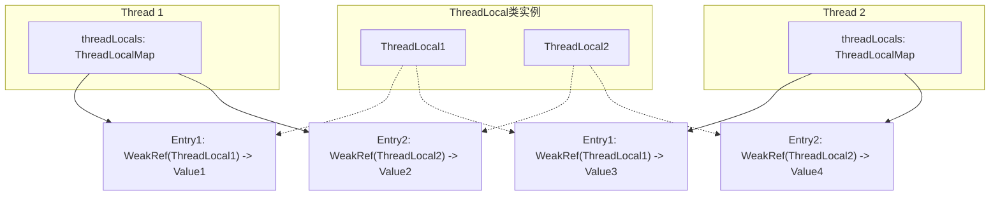
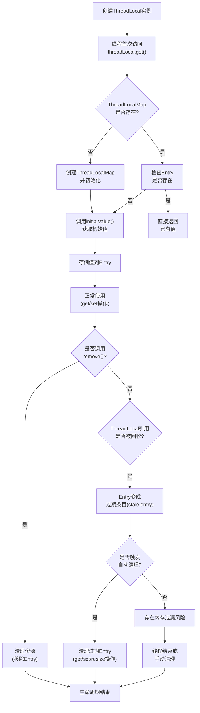

--- 
title: ThreadLocal源码分析 
category: 线程池 
tag: 
  - 线程池 
  - ThreadLocal 

description: 详解ThreadLocal的基本概念、核心源码结构、使用案例、常见问题及解决方案 
date: 2025-11-30 
author: nikola 
icon: article 
isOriginal: true 
sticky: false 
timeline: true 
article: true 
star: false 
---

# ThreadLocal源码分析

## 1. ThreadLocal基本概念和原理

### 1.1 什么是ThreadLocal

ThreadLocal是Java中一个非常重要的并发工具类，它提供了一种线程本地存储机制，允许每个线程拥有自己独立的变量副本。简单来说，ThreadLocal为每个线程创建了一个"线程私有"的变量空间，线程之间的变量互不干扰，从而在多线程环境下避免了线程安全问题。

### 1.2 ThreadLocal的设计理念

ThreadLocal的核心设计理念是"空间换时间"，通过为每个线程分配独立的变量副本，避免了线程间的同步竞争，从而提高了并发性能。与锁机制不同，ThreadLocal完全消除了线程间的竞争，因为每个线程操作的是自己的变量副本，不存在数据竞争条件。

### 1.3 ThreadLocal的工作原理

ThreadLocal的工作原理可以概括为以下几点：

1. 每个Thread对象内部都维护了一个名为`threadLocals`的实例变量，它的类型是`ThreadLocal.ThreadLocalMap`，用于存储线程本地变量
2. `ThreadLocalMap`是ThreadLocal的静态内部类，它是一个定制化的哈希表，专门为ThreadLocal设计
3. 当线程通过`ThreadLocal.get()`方法获取变量时，实际上是从当前线程的`threadLocals`成员变量中查找对应的value
4. 当线程通过`ThreadLocal.set()`方法设置变量时，实际上是将变量存储到当前线程的`threadLocals`成员变量中
5. `ThreadLocal`对象本身作为`ThreadLocalMap`的key，而变量值作为value
6. ThreadLocal采用了弱引用设计来避免内存泄漏问题，但这种设计仍需要开发者正确使用才能完全避免内存泄漏

## 2. ThreadLocal核心源码分析

### 2.1 ThreadLocal类的结构

首先，让我们来看一下ThreadLocal类的主要结构：

```java
public class ThreadLocal<T> {
    // 内部类，用于存储线程本地变量
    static class ThreadLocalMap {
        // 内部类，代表ThreadLocalMap中的一个条目
        static class Entry extends WeakReference<ThreadLocal<?>> {
            // 当前ThreadLocal关联的值
            Object value;
            
            Entry(ThreadLocal<?> k, Object v) {
                // 调用WeakReference的构造方法，将ThreadLocal作为弱引用存储
                super(k);
                // 强引用存储值
                value = v;
            }
        }
        
        // ThreadLocalMap的底层存储结构
        private Entry[] table;
        // ThreadLocalMap中的条目数量
        private int size = 0;
        // 扩容阈值，默认为初始容量的2/3
        private int threshold; // Default to 0
        
        // 其他成员变量和方法
    }
    
    // 用于计算ThreadLocal的哈希值，保证不同ThreadLocal实例有不同的哈希值
    private final int threadLocalHashCode = nextHashCode();
    
    // 原子类，用于生成线程安全的哈希码
    private static AtomicInteger nextHashCode = new AtomicInteger();
    
    // 哈希码增量，用于减少哈希冲突
    private static final int HASH_INCREMENT = 0x61c88647;
    
    // 主要方法
    public T get() {}
    public void set(T value) {}
    public void remove() {}
    protected T initialValue() {}
    
    // 其他辅助方法
}
```

### 2.2 ThreadLocalMap的设计

ThreadLocalMap是ThreadLocal的核心，它是一个定制化的哈希表，专门用于存储线程本地变量。与HashMap不同，ThreadLocalMap具有以下特点：

1. 它的key是ThreadLocal对象的弱引用（WeakReference），这是为了避免内存泄漏
2. 它的value是强引用，直接引用存储的对象
3. 它使用开放地址法（线性探测）解决哈希冲突，而不是HashMap使用的链表法（拉链法）
4. 它的初始容量为16，负载因子为2/3
5. 它不提供公共的访问方法，完全由ThreadLocal类进行管理
6. ThreadLocalMap设计为Thread类的一个成员变量，而不是作为ThreadLocal的成员变量

### 2.3 核心方法源码分析

#### 2.3.1 get()方法

```java
public T get() {
    // 获取当前线程
    Thread t = Thread.currentThread();
    // 获取当前线程的ThreadLocalMap
    ThreadLocalMap map = getMap(t);
    if (map != null) {
        // 从map中获取Entry
        ThreadLocalMap.Entry e = map.getEntry(this);
        if (e != null) {
            @SuppressWarnings("unchecked")
            // 返回value
            T result = (T)e.value;
            return result;
        }
    }
    // 如果map不存在或Entry不存在，返回初始值
    return setInitialValue();
}
```

这个方法的执行流程如下：
1. 获取当前正在执行的线程
2. 从线程中获取ThreadLocalMap对象
3. 如果map存在，则尝试从中获取与当前ThreadLocal关联的Entry对象
4. 如果Entry存在，则返回其value值
5. 如果map不存在或Entry不存在，则调用setInitialValue()方法设置并返回初始值

#### 2.3.2 set()方法

```java
public void set(T value) {
    // 获取当前线程
    Thread t = Thread.currentThread();
    // 获取当前线程的ThreadLocalMap
    ThreadLocalMap map = getMap(t);
    if (map != null) {
        // 如果map存在，直接设置值
        map.set(this, value);
    } else {
        // 如果map不存在，创建一个新的map
        createMap(t, value);
    }
}
```

这个方法的执行流程如下：
1. 获取当前正在执行的线程
2. 从线程中获取ThreadLocalMap对象
3. 如果map存在，调用map.set()方法将当前ThreadLocal对象和对应的值存储到map中
4. 如果map不存在，调用createMap()方法为当前线程创建一个新的ThreadLocalMap，并将值存储进去

#### 2.3.3 getMap()和createMap()方法

```java
// 获取线程的ThreadLocalMap
ThreadLocalMap getMap(Thread t) {
    // 直接返回线程的threadLocals字段
    return t.threadLocals;
}

// 为线程创建ThreadLocalMap
void createMap(Thread t, T firstValue) {
    // 初始化线程的threadLocals字段
    t.threadLocals = new ThreadLocalMap(this, firstValue);
}
```

这两个辅助方法非常重要，它们是ThreadLocal与Thread之间建立联系的关键。getMap()直接访问Thread对象的threadLocals字段，而createMap()则负责初始化该字段。

#### 2.3.4 remove()方法

```java
public void remove() {
    // 获取当前线程的ThreadLocalMap
    ThreadLocalMap m = getMap(Thread.currentThread());
    if (m != null) {
        // 从map中移除当前ThreadLocal对应的Entry
        m.remove(this);
    }
}
```

remove()方法负责清理资源，避免内存泄漏。它的执行流程是：
1. 获取当前线程的ThreadLocalMap
2. 如果map存在，调用map.remove()方法移除与当前ThreadLocal关联的Entry

#### 2.3.5 setInitialValue()方法

```java
private T setInitialValue() {
    // 获取初始值
    T value = initialValue();
    // 获取当前线程
    Thread t = Thread.currentThread();
    // 获取当前线程的ThreadLocalMap
    ThreadLocalMap map = getMap(t);
    if (map != null) {
        // 如果map存在，设置初始值
        map.set(this, value);
    } else {
        // 如果map不存在，创建一个新的map
        createMap(t, value);
    }
    // 返回初始值
    return value;
}
```

setInitialValue()方法在线程首次访问ThreadLocal变量或ThreadLocalMap不存在时被调用。它的执行流程与set()方法类似，但值是通过initialValue()方法获取的。

#### 2.3.6 initialValue()方法

```java
protected T initialValue() {
    // 默认返回null
    return null;
}
```

这个方法用于提供ThreadLocal变量的初始值，默认返回null。可以通过继承ThreadLocal并重写此方法来提供自定义的初始值，或者使用withInitial()静态方法（Java 8及以上）创建ThreadLocal实例。

```java
// Java 8及以上可用的静态工厂方法
public static <S> ThreadLocal<S> withInitial(Supplier<? extends S> supplier) {
    return new SuppliedThreadLocal<>(supplier);
}
```

#### 2.3.7 nextHashCode()方法

```java
private static int nextHashCode() {
    // 使用AtomicInteger生成线程安全的哈希码
    return nextHashCode.getAndAdd(HASH_INCREMENT);
}
```

这个方法使用AtomicInteger生成线程安全的哈希码，每次增加HASH_INCREMENT值，这个值是斐波那契散列乘数，能有效减少哈希冲突。

### 2.4 ThreadLocalMap的核心方法

ThreadLocalMap是ThreadLocal实现的核心，其关键方法实现细节将在第3节"ThreadLocalMap深度源码分析"中进行详细阐述。
```

### 2.5 ThreadLocal的工作原理图解

ThreadLocal的工作原理可以通过以下示意图来理解：



### 2.6 ThreadLocal的生命周期

ThreadLocal的完整生命周期包括创建、初始化、使用、清理和回收等多个阶段。下面的流程图展示了ThreadLocal在应用中的完整生命周期：



#### ThreadLocal生命周期的关键阶段：

1. **创建阶段**：创建ThreadLocal实例，通常声明为static final常量
2. **初始化阶段**：线程首次调用get()方法时，如果ThreadLocalMap不存在则创建，然后通过initialValue()获取初始值
3. **使用阶段**：线程通过get()和set()方法访问和修改本地变量值
4. **清理阶段**：通过调用remove()方法主动清理资源，或触发自动清理机制
5. **回收阶段**：当ThreadLocal引用被回收且相关资源被清理后，生命周期结束

正确管理ThreadLocal的生命周期对于避免内存泄漏至关重要。特别是在线程池环境中，应该始终在使用完毕后调用remove()方法。

从图中可以看出：
1. 每个Thread对象维护了自己的ThreadLocalMap
2. 同一个ThreadLocal实例可以被多个线程使用，但在每个线程中都有独立的值
3. ThreadLocal对象作为WeakReference存储在Entry中，而值是强引用
4. 线程之间的ThreadLocal值完全隔离，互不影响

通过ThreadLocal的工作原理图解，我们可以更直观地理解为什么ThreadLocal能够实现线程本地变量的功能，同时也能更好地理解可能出现的内存泄漏问题（在5.1节详细讨论）。

### 2.6 InheritableThreadLocal

除了普通的ThreadLocal，Java还提供了一个InheritableThreadLocal类，它继承自ThreadLocal，允许子线程继承父线程的ThreadLocal变量值。

```java
public class InheritableThreadLocal<T> extends ThreadLocal<T> {
    // 当创建子线程时，将父线程的InheritableThreadLocal值复制到子线程
    protected T childValue(T parentValue) {
        return parentValue;
    }
    
    // 获取线程的inheritableThreadLocals而不是threadLocals
    ThreadLocalMap getMap(Thread t) {
        return t.inheritableThreadLocals;
    }
    
    // 创建线程的inheritableThreadLocals而不是threadLocals
    void createMap(Thread t, T firstValue) {
        t.inheritableThreadLocals = new ThreadLocalMap(this, firstValue);
    }
}
```

InheritableThreadLocal的工作原理与ThreadLocal基本相同，但它使用Thread对象的inheritableThreadLocals字段而不是threadLocals字段。当创建新线程时，如果父线程的inheritableThreadLocals不为null，子线程会复制父线程的这些值。

**注意事项**：
1. InheritableThreadLocal仅在创建子线程时复制值，之后父线程和子线程的修改互不影响
2. 在线程池中使用时需要特别小心，因为线程会被复用，可能导致数据混乱
3. 复制是浅拷贝，如果值对象是可变的，父线程和子线程修改该对象会相互影响

## 3. ThreadLocalMap深度源码分析

ThreadLocalMap是ThreadLocal的核心实现，它作为Thread类的成员变量存储线程本地变量。本节将深入分析ThreadLocalMap的源码实现和优化策略。

### 3.1 ThreadLocalMap的设计原理

ThreadLocalMap是一个自定义的哈希表实现，它专为ThreadLocal的使用场景进行了优化。其设计特点包括：

1. **自定义哈希表**：不使用Java标准库中的HashMap，而是针对ThreadLocal场景定制
2. **键的弱引用存储**：使用ThreadLocal对象作为键，并且采用弱引用方式存储
3. **开放地址法**：使用开放地址法解决哈希冲突，而不是链表或红黑树
4. **自动清理机制**：在get和set操作中会自动清理过期的Entry（key为null的条目）

### 3.2 核心数据结构

ThreadLocalMap的核心数据结构如下：

```java
static class ThreadLocalMap {
    // Entry继承自WeakReference，使用ThreadLocal对象作为弱引用
    static class Entry extends WeakReference<ThreadLocal<?>> {
        /** The value associated with this ThreadLocal. */
        Object value;

        Entry(ThreadLocal<?> k, Object v) {
            super(k);
            value = v;
        }
    }

    // 初始容量必须是2的幂
    private static final int INITIAL_CAPACITY = 16;

    // 存储Entry的数组
    private Entry[] table;

    // 已存储的条目数量
    private int size = 0;

    // 扩容阈值
    private int threshold; // 默认是容量的2/3

    // 设置扩容阈值
    private void setThreshold(int len) {
        threshold = len * 2 / 3;
    }
}
```

### 3.3 哈希计算与冲突解决

ThreadLocalMap使用以下机制进行哈希计算和冲突解决：

#### 3.3.1 哈希码生成

ThreadLocal对象的哈希码通过`nextHashCode()`方法生成，该方法使用了黄金分割比例（1664525）来减少哈希冲突：

```java
// ThreadLocal中的哈希相关字段
private final int threadLocalHashCode = nextHashCode();

// 使用AtomicInteger保证线程安全
private static AtomicInteger nextHashCode = new AtomicInteger();

// 黄金分割比例，用于减少哈希冲突
private static final int HASH_INCREMENT = 0x61c88647;

// 生成下一个哈希码
private static int nextHashCode() {
    return nextHashCode.getAndAdd(HASH_INCREMENT);
}
```

这种设计利用了斐波那契散列法（Fibonacci Hashing）的思想，可以在开放地址法中更好地分散元素，减少哈希冲突。

#### 3.3.2 索引计算

在ThreadLocalMap中，索引计算非常简单直接：

```java
// 计算索引：threadLocalHashCode与数组长度-1进行按位与操作
int i = key.threadLocalHashCode & (table.length - 1);
```

由于数组长度总是2的幂，`table.length - 1`的二进制表示全为1，这样可以确保计算出的索引在数组范围内，相当于取模运算但效率更高。

#### 3.3.3 冲突解决策略

ThreadLocalMap使用开放地址法中的线性探测（Linear Probing）来解决哈希冲突：

```java
// 在set方法中，当发生冲突时使用线性探测
private static int nextIndex(int i, int len) {
    return ((i + 1 < len) ? i + 1 : 0);
}

// 或者向前查找（在getEntryAfterMiss方法中）
private static int prevIndex(int i, int len) {
    return ((i - 1 >= 0) ? i - 1 : len - 1);
}
```

这种简单的线性探测策略在ThreadLocal使用场景下通常足够高效，因为大多数情况下ThreadLocal变量数量较少，冲突概率低。

### 3.4 核心方法详解

#### 3.4.1 getEntry()方法

```java
private Entry getEntry(ThreadLocal<?> key) {
    // 计算哈希值，使用与运算替代取模运算提高性能
    int i = key.threadLocalHashCode & (table.length - 1);
    // 获取对应的Entry
    Entry e = table[i];
    // 如果Entry存在且key匹配，直接返回Entry
    if (e != null && e.get() == key) {
        return e;
    } else {
        // 处理哈希冲突或key已被回收的情况
        return getEntryAfterMiss(key, i, e);
    }
}
```

**getEntryAfterMiss()方法**用于处理在第一次查找失败后的情况，它会继续线性探测，同时清理遇到的过期Entry：

```java
private Entry getEntryAfterMiss(ThreadLocal<?> key, int i, Entry e) {
    Entry[] tab = table;
    int len = tab.length;

    while (e != null) {
        ThreadLocal<?> k = e.get();
        // 找到匹配的key
        if (k == key) {
            return e;
        }
        // 清理过期Entry
        if (k == null) {
            expungeStaleEntry(i);
        } else {
            i = nextIndex(i, len);
        }
        e = tab[i];
    }
    return null;
}
```

#### 3.4.2 set()方法

```java
private void set(ThreadLocal<?> key, Object value) {
    Entry[] tab = table;
    int len = tab.length;
    // 计算哈希值
    int i = key.threadLocalHashCode & (len-1);
    
    // 线性探测查找合适的位置
    for (Entry e = tab[i]; e != null; e = tab[i = nextIndex(i, len)]) {
        ThreadLocal<?> k = e.get();
        
        // 如果key匹配，更新value并返回
        if (k == key) {
            e.value = value;
            return;
        }
        
        // 如果key为null（说明ThreadLocal对象已被回收），替换旧的Entry
        if (k == null) {
            replaceStaleEntry(key, value, i);
            return;
        }
    }
    
    // 如果没有找到对应的Entry，创建一个新的Entry
    tab[i] = new Entry(key, value);
    int sz = ++size;
    
    // 清理过期的Entry，如果清理后size仍超过阈值则进行扩容
    if (!cleanSomeSlots(i, sz) && sz >= threshold) {
        rehash();
    }
}
```

**replaceStaleEntry()方法**是ThreadLocalMap中一个重要的优化方法，它在设置新值的同时会清理过期Entry：

```java
private void replaceStaleEntry(ThreadLocal<?> key, Object value, int staleSlot) {
    Entry[] tab = table;
    int len = tab.length;
    Entry e;

    // 向前扫描寻找过期的Entry
    int slotToExpunge = staleSlot;
    for (int i = prevIndex(staleSlot, len); 
         (e = tab[i]) != null; 
         i = prevIndex(i, len)) {
        if (e.get() == null) {
            slotToExpunge = i;
        }
    }

    // 向后扫描寻找key或更多过期Entry
    for (int i = nextIndex(staleSlot, len);
         (e = tab[i]) != null;
         i = nextIndex(i, len)) {
        ThreadLocal<?> k = e.get();

        // 如果找到key，将其移到staleSlot位置
        if (k == key) {
            e.value = value;
            tab[i] = tab[staleSlot];
            tab[staleSlot] = e;

            // 清理过期Entry
            if (slotToExpunge == staleSlot) {
                slotToExpunge = i;
            }
            cleanSomeSlots(expungeStaleEntry(slotToExpunge), len);
            return;
        }

        // 如果找到另一个过期Entry且之前没找到
        if (k == null && slotToExpunge == staleSlot) {
            slotToExpunge = i;
        }
    }

    // 如果没找到key，在staleSlot位置放置新Entry
    tab[staleSlot].value = null;
    tab[staleSlot] = new Entry(key, value);

    // 清理过期Entry
    if (slotToExpunge != staleSlot) {
        cleanSomeSlots(expungeStaleEntry(slotToExpunge), len);
    }
}
```

#### 3.4.3 remove()方法

```java
private void remove(ThreadLocal<?> key) {
    Entry[] tab = table;
    int len = tab.length;
    // 计算哈希值
    int i = key.threadLocalHashCode & (len-1);
    
    // 线性探测查找对应的Entry
    for (Entry e = tab[i]; e != null; e = tab[i = nextIndex(i, len)]) {
        if (e.get() == key) {
            // 清除Entry的弱引用
            e.clear();
            // 清理过期的Entry和该位置后的相关条目
            expungeStaleEntry(i);
            return;
        }
    }
}
```

#### 3.4.4 内存泄漏清理机制

**expungeStaleEntry()方法**是ThreadLocalMap中核心的清理方法，它会清理指定位置及之后的过期Entry，并对表进行重新哈希：

```java
private int expungeStaleEntry(int staleSlot) {
    Entry[] tab = table;
    int len = tab.length;

    // 清除该位置的值引用
    tab[staleSlot].value = null;
    tab[staleSlot] = null;
    size--;

    // 重新哈希后面的Entry，直到遇到null
    Entry e;
    int i;
    for (i = nextIndex(staleSlot, len);
         (e = tab[i]) != null;
         i = nextIndex(i, len)) {
        ThreadLocal<?> k = e.get();
        // 如果key为null，清理该Entry
        if (k == null) {
            e.value = null;
            tab[i] = null;
            size--;
        } else {
            // 重新计算哈希位置
            int h = k.threadLocalHashCode & (len - 1);
            // 如果位置发生变化，需要移动Entry
            if (h != i) {
                tab[i] = null;
                // 线性探测找到新位置
                while (tab[h] != null) {
                    h = nextIndex(h, len);
                }
                tab[h] = e;
            }
        }
    }
    return i;
}
```

**cleanSomeSlots()方法**是一种启发式清理机制，用于清理表中的部分过期Entry：

```java
private boolean cleanSomeSlots(int i, int n) {
    boolean removed = false;
    Entry[] tab = table;
    int len = tab.length;
    do {
        i = nextIndex(i, len);
        Entry e = tab[i];
        // 如果发现过期Entry，调用expungeStaleEntry进行清理
        if (e != null && e.get() == null) {
            n = len; // 重置搜索范围
            removed = true;
            i = expungeStaleEntry(i);
        }
    } while ( (n >>>= 1) != 0 ); // 右移相当于除以2，搜索log2(n)个位置
    return removed;
}
```

### 3.5 扩容机制

ThreadLocalMap的扩容机制与HashMap有明显区别，主要体现在：

1. **扩容触发条件**：当元素数量超过阈值（默认是容量的2/3）时触发扩容
2. **扩容方式**：新容量为旧容量的2倍，但需要重新计算所有元素的索引
3. **扩容过程**：在扩容的同时会清理过期的Entry

扩容源码如下：

```java
private void resize() {
    Entry[] oldTab = table;
    int oldLen = oldTab.length;
    int newLen = oldLen * 2; // 新容量为旧容量的2倍
    Entry[] newTab = new Entry[newLen];
    int count = 0;

    // 重新计算所有元素的索引
    for (int j = 0; j < oldLen; ++j) {
        Entry e = oldTab[j];
        if (e != null) {
            ThreadLocal<?> k = e.get();
            if (k == null) {
                e.value = null; // 帮助GC
            } else {
                int h = k.threadLocalHashCode & (newLen - 1);
                // 线性探测找位置
                while (newTab[h] != null) {
                    h = nextIndex(h, newLen);
                }
                newTab[h] = e;
                count++;
            }
        }
    }

    // 设置新的阈值和数组
    setThreshold(newLen);
    size = count;
    table = newTab;
}
```

### 3.6 性能优化策略

ThreadLocalMap实现了多项性能优化策略：

1. **延迟初始化**：ThreadLocalMap在首次使用时才会被创建，避免不必要的内存消耗

2. **懒清理**：在访问时才清理过期条目，平衡了性能和内存占用

3. **高效的哈希计算**：使用黄金分割比例生成哈希码，减少冲突

4. **按位与运算计算索引**：利用数组长度为2的幂的特性，使用位运算代替取模

5. **优化的扩容机制**：扩容时会清理过期条目，避免无效扩容

### 3.7 ThreadLocalMap使用的优化建议

基于对ThreadLocalMap源码的分析，可以提出以下优化建议：

1. **减少ThreadLocal实例数量**：每个ThreadLocal实例都会占用ThreadLocalMap中的一个条目，减少ThreadLocal实例数量可以降低哈希冲突概率

2. **使用复合对象存储多个相关值**：
   ```java
   // 避免使用多个ThreadLocal
   private static final ThreadLocal<String> USER_ID = new ThreadLocal<>();
   private static final ThreadLocal<String> USER_NAME = new ThreadLocal<>();
   
   // 推荐使用单个ThreadLocal存储复合对象
   private static final ThreadLocal<UserContext> USER_CONTEXT = 
       ThreadLocal.withInitial(UserContext::new);
   ```

3. **及时清理不再使用的值**：通过调用`remove()`方法主动清理，减少过期Entry的数量

4. **避免存储大对象**：大对象会占用更多内存，且在扩容时需要更多的复制操作

5. **考虑使用静态ThreadLocal**：静态ThreadLocal实例生命周期长，减少创建和初始化的开销
```

## 4. ThreadLocal使用案例

### 4.1 基本使用案例

```java
public class ThreadLocalDemo {
    // 创建ThreadLocal对象
    private static ThreadLocal<Integer> threadLocal = new ThreadLocal<Integer>() {
        @Override
        protected Integer initialValue() {
            // 设置初始值
            return 0;
        }
    };
    
    public static void main(String[] args) {
        // 创建两个线程
        Thread thread1 = new Thread(() -> {
            try {
                // 获取初始值
                System.out.println("Thread1 initial value: " + threadLocal.get());
                // 设置值
                threadLocal.set(100);
                // 获取设置后的值
                System.out.println("Thread1 after set: " + threadLocal.get());
            } finally {
                // 移除值，避免内存泄漏
                threadLocal.remove();
            }
        });
        
        Thread thread2 = new Thread(() -> {
            try {
                // 获取初始值
                System.out.println("Thread2 initial value: " + threadLocal.get());
                // 设置值
                threadLocal.set(200);
                // 获取设置后的值
                System.out.println("Thread2 after set: " + threadLocal.get());
            } finally {
                // 移除值，避免内存泄漏
                threadLocal.remove();
            }
        });
        
        // 启动线程
        thread1.start();
        thread2.start();
    }
}
```

### 4.2 实际应用案例：Spring中的ThreadLocal

在Spring框架中，ThreadLocal被广泛应用于事务管理、安全认证等场景。例如，Spring的`TransactionSynchronizationManager`类使用ThreadLocal来存储当前线程的事务信息：

```java
public abstract class TransactionSynchronizationManager {
    private static final ThreadLocal<Map<Object, Object>> resources = 
        new NamedThreadLocal<>("Transactional resources");
    
    private static final ThreadLocal<Set<TransactionSynchronization>> synchronizations = 
        new NamedThreadLocal<>("Transaction synchronizations");
    
    private static final ThreadLocal<String> currentTransactionName = 
        new NamedThreadLocal<>("Current transaction name");
    
    // 其他代码...
}

## 4. ThreadLocal在实际框架中的应用案例

### 4.1 Spring框架中的应用

Spring框架广泛使用ThreadLocal来存储请求上下文信息，主要应用场景包括：

1. **事务管理**：
   ```java
   // Spring通过ThreadLocal存储当前事务状态
   private static final ThreadLocal<TransactionInfo> currentTransactionInfo = 
       new NamedThreadLocal<>("Current aspect-driven transaction");
   ```

2. **请求上下文**：
   ```java
   // RequestContextHolder使用ThreadLocal存储请求上下文
   private static final ThreadLocal<RequestAttributes> requestAttributesHolder = 
       new NamedThreadLocal<>("Request attributes");
   private static final ThreadLocal<RequestAttributes> inheritableRequestAttributesHolder = 
       new NamedInheritableThreadLocal<>("Inheritable request attributes");
   ```

3. **国际化支持**：
   ```java
   // LocaleContextHolder使用ThreadLocal存储当前语言环境
   private static final ThreadLocal<LocaleContext> localeContextHolder = 
       new NamedThreadLocal<>("LocaleContext");
   ```

### 4.2 MyBatis框架中的应用

MyBatis使用ThreadLocal来管理数据库会话和事务：

1. **SqlSession管理**：
   ```java
   // SqlSessionManager使用ThreadLocal存储SqlSession
   private final ThreadLocal<SqlSession> localSqlSession = new ThreadLocal<>();
   ```

2. **分页插件**：
   - 分页插件如PageHelper使用ThreadLocal存储分页参数，确保在同一线程的查询中应用正确的分页设置

### 4.3 Web应用中的典型用法

在Web应用中，ThreadLocal常用于存储用户会话信息和请求上下文：

1. **用户身份信息**：
   ```java
   // 用户上下文管理
   public class UserContext {
       private static final ThreadLocal<UserInfo> currentUser = 
           ThreadLocal.withInitial(() -> null);
           
       public static void setCurrentUser(UserInfo user) {
           currentUser.set(user);
       }
           
       public static UserInfo getCurrentUser() {
           return currentUser.get();
       }
           
       public static void clear() {
           currentUser.remove();
       }
   }
   ```

2. **请求追踪**：
   ```java
   // 请求ID追踪
   public class RequestIdHolder {
       private static final ThreadLocal<String> requestId = 
           ThreadLocal.withInitial(() -> UUID.randomUUID().toString());
           
       public static String getRequestId() {
           return requestId.get();
       }
           
       public static void clear() {
           requestId.remove();
       }
   }
   ```

### 4.4 框架应用案例的共同特点

通过分析各种框架中ThreadLocal的应用，可以发现以下共同特点：

1. **静态常量声明**：通常将ThreadLocal声明为private static final常量

2. **封装工具类**：提供静态方法访问ThreadLocal，隐藏实现细节

3. **生命周期管理**：在适当的时候调用remove()清理资源

4. **配合过滤器/拦截器**：在Web应用中，通常在过滤器或拦截器中设置和清理ThreadLocal

5. **线程隔离需求**：用于存储线程特有的状态信息，需要在多个组件间共享

## 5. ThreadLocal常见问题及解决方案

### 5.1 内存泄漏问题

#### 5.1.1 内存泄漏的根本原因

ThreadLocal内存泄漏是最常见且危害较大的问题，其根本原因需要从引用关系和对象生命周期来分析：

1. **引用链分析**：
   - 线程对象（Thread）持有ThreadLocalMap的强引用
   - ThreadLocalMap持有Entry对象的强引用
   - Entry对象持有value的强引用
   - Entry对象持有ThreadLocal的弱引用

2. **内存泄漏产生的条件**：
   - 当ThreadLocal对象没有外部强引用指向它时，会被GC回收（因为Entry中只持有弱引用）
   - 但此时Entry对象和value对象仍然被ThreadLocalMap持有强引用
   - 如果线程对象一直存活（例如线程池中的核心线程），就形成了一个强引用链：`Thread -> ThreadLocalMap -> Entry -> Value`
   - 这导致即使ThreadLocal被回收，Value对象仍然无法被回收，从而造成内存泄漏

3. **JDK的弱引用设计意图**：
   - 弱引用设计的目的是让ThreadLocal能够及时被回收，避免因ThreadLocal对象本身导致的内存泄漏
   - 但这种设计并不能解决Value对象的内存泄漏问题
   - JDK设计者假设ThreadLocal对象通常是静态的或生命周期较长的，而线程最终会终止，从而释放整个ThreadLocalMap

#### 5.1.2 内存泄漏的影响和风险

1. **内存占用增加**：随着时间推移，未清理的ThreadLocal值会不断累积
2. **垃圾回收压力增大**：频繁创建大对象而不释放会增加GC负担
3. **潜在的OutOfMemoryError**：在极端情况下可能导致内存溢出
4. **线程池环境风险更高**：因为线程被复用且长期存活，内存泄漏会持续累积

#### 5.1.3 解决方案

为了彻底避免ThreadLocal内存泄漏，我们应该采取以下措施：

1. **主动清理资源**：
   - 总是在使用完ThreadLocal后调用`remove()`方法清理
   - 使用`try-finally`块确保`remove()`方法无论如何都会被执行

   ```java
   ThreadLocal<UserInfo> userThreadLocal = new ThreadLocal<>();
   try {
       userThreadLocal.set(currentUser);
       // 使用ThreadLocal变量
       processUserRequest();
   } finally {
       // 确保资源被清理
       userThreadLocal.remove();
   }
   ```

2. **使用ThreadLocal.remove()工具类**：
   - 创建工具类封装ThreadLocal的使用，自动处理资源清理
   - 利用Java的自动资源管理（try-with-resources）机制

3. **合理设置线程池大小**：
   - 避免线程池过大，减少长时间存活的线程数量
   - 考虑定期回收空闲线程（设置合适的keepAliveTime）

4. **避免存储大对象**：
   - ThreadLocal中尽量存储轻量级对象
   - 对于大对象，考虑使用引用类型或及时清理

5. **监控和检测**：
   - 定期检查内存使用情况
   - 使用JVM内存分析工具（如JProfiler、MAT）检测潜在的内存泄漏

#### 5.1.4 ThreadLocal内存泄漏的检测方法

1. **使用JVM参数**：
   ```
   -XX:+HeapDumpOnOutOfMemoryError -XX:HeapDumpPath=/path/to/dumps
   ```

2. **使用JConsole或VisualVM**：监控线程和内存使用情况

3. **使用MAT分析堆转储**：查找ThreadLocalMap中大量的Entry对象

4. **自定义检测工具**：
   ```java
   public class ThreadLocalLeakDetector {
       public static void checkThreadLocals() {
           Thread currentThread = Thread.currentThread();
           // 通过反射获取ThreadLocalMap并分析其大小
           // 实现省略...
       }
   }
   ```

### 5.2 线程池中的ThreadLocal问题

#### 4.2.1 问题描述

在线程池中，线程会被复用，如果前一个任务使用了ThreadLocal但没有清理，那么后一个任务可能会读取到前一个任务的残留数据，从而导致数据不一致问题。

#### 4.2.2 解决方案

1. 总是在任务结束时调用`remove()`方法清理ThreadLocal变量
2. 使用`InheritableThreadLocal`时要特别小心，因为它会继承父线程的ThreadLocal变量

### 5.3 InheritableThreadLocal的问题

#### 4.3.1 问题描述

`InheritableThreadLocal`是ThreadLocal的子类，它允许子线程继承父线程的ThreadLocal变量。但在使用线程池时，由于线程会被复用，`InheritableThreadLocal`可能会导致意外的数据共享。

#### 4.3.2 解决方案

1. 谨慎使用`InheritableThreadLocal`，特别是在线程池中
2. 总是在任务结束时调用`remove()`方法清理

## 6. ThreadLocal使用的最佳实践和注意事项

### 6.1 使用模式和规范

1. **使用private static修饰符**：
   - 将ThreadLocal变量声明为`private static final`以避免重复创建ThreadLocal实例
   - 静态变量确保所有实例共享同一个ThreadLocal对象，减少内存消耗
   - 示例：
     ```java
     private static final ThreadLocal<UserInfo> USER_THREAD_LOCAL = 
         ThreadLocal.withInitial(() -> new UserInfo());
     ```

2. **使用try-with-resources或try-finally确保清理**：
   - 无论代码是否抛出异常，都要确保调用`remove()`方法
   - 在Java 7+中，可以考虑创建一个包装类实现AutoCloseable接口
   - 示例：
     ```java
     try (ThreadLocalResource<UserInfo> resource = 
             ThreadLocalResource.with(USER_THREAD_LOCAL, currentUser)) {
         // 使用ThreadLocal变量
         processRequest();
     } // 自动调用remove()
     ```

3. **为复杂场景创建工具类**：
   - 封装ThreadLocal的创建、设置、获取和清理操作
   - 提供简洁的API并确保资源正确管理
   - 示例：
     ```java
     public class ThreadLocalContext {
         private static final ThreadLocal<Map<String, Object>> CONTEXT = 
             ThreadLocal.withInitial(HashMap::new);
              
         public static void put(String key, Object value) {
             CONTEXT.get().put(key, value);
         }
              
         @SuppressWarnings("unchecked")
         public static <T> T get(String key) {
             return (T) CONTEXT.get().get(key);
         }
              
         public static void clear() {
             CONTEXT.remove();
         }
     }
     ```

### 6.2 性能优化建议

1. **适当使用ThreadLocal的初始值功能**：
   - 使用`withInitial()`静态工厂方法避免重复创建对象
   - 为频繁使用的值提供预初始化
   
2. **减少ThreadLocal中的数据量**：
   - 只存储必要的数据，避免存储大对象或完整的实体类
   - 考虑只存储ID或引用，而不是整个对象

3. **避免过度使用ThreadLocal**：
   - ThreadLocal虽然方便，但不是解决所有线程隔离问题的银弹
   - 对于简单场景，方法参数传递可能更直接且内存效率更高

4. **注意ThreadLocalMap的扩容问题**：
   - 避免在单个ThreadLocalMap中存储过多条目
   - 如果必须存储，考虑使用单一ThreadLocal变量存储Map对象，而非多个ThreadLocal变量

### 6.3 常见陷阱和规避方法

1. **InheritableThreadLocal的风险**：
   - **问题**：子线程继承父线程的值可能导致意外的数据共享
   - **解决方案**：
     - 谨慎使用InheritableThreadLocal
     - 确保在子线程中根据需要重置或清理继承的值
     - 注意线程池环境中使用时的特殊处理

2. **可变对象的并发修改**：
   - **问题**：ThreadLocal中存储的可变对象可能被错误共享
   - **解决方案**：
     - 存储不可变对象或创建深拷贝
     - 提供线程安全的可变对象访问方法
     - 明确文档说明对象的线程安全性要求

### 6.4 代码审查要点

在代码审查中，针对ThreadLocal的使用，重点关注以下方面：

1. **是否有清理机制**：检查是否在适当的地方调用了`remove()`方法
2. **是否有可能的内存泄漏**：评估ThreadLocal变量的生命周期和作用域
3. **使用场景是否合适**：判断是否确实需要使用ThreadLocal，还是有更好的替代方案
4. **继承场景是否处理正确**：如果涉及线程创建或使用InheritableThreadLocal，确认行为符合预期
5. **性能影响评估**：评估ThreadLocal的使用是否会导致性能问题或内存压力

### 6.5 高级最佳实践

1. **与依赖注入框架结合使用**：
   - 在Spring等框架中，可以结合Scope("request")和ThreadLocal实现请求级别隔离
   - 利用AOP自动管理ThreadLocal的生命周期

2. **使用ThreadLocal作为缓存**：
   - 在方法调用链中缓存临时对象，避免重复计算
   - 示例：
     ```java
     public class CalculationCache {
         private static final ThreadLocal<Map<String, Object>> CACHE = 
             ThreadLocal.withInitial(HashMap::new);
              
         public static <T> T getOrCompute(String key, Supplier<T> supplier) {
             @SuppressWarnings("unchecked")
             T value = (T) CACHE.get().get(key);
             if (value == null) {
                 value = supplier.get();
                 CACHE.get().put(key, value);
             }
             return value;
         }
              
         public static void clear() {
             CACHE.remove();
         }
     }
     ```

3. **使用弱引用包装大对象**：
   - 对于大对象，可以考虑使用WeakReference包装，在内存压力大时允许被回收
   - 示例：
     ```java
     private static final ThreadLocal<WeakReference<LargeObject>> LARGE_OBJECT_REF = 
         ThreadLocal.withInitial(() -> new WeakReference<>(null));
              
     public static LargeObject getLargeObject() {
         WeakReference<LargeObject> ref = LARGE_OBJECT_REF.get();
         LargeObject obj = ref != null ? ref.get() : null;
         if (obj == null) {
             obj = createLargeObject(); // 创建大对象的昂贵操作
             LARGE_OBJECT_REF.set(new WeakReference<>(obj));
         }
         return obj;
     }
     ```

## 7. ThreadLocal的优缺点和使用建议

### 7.1 优点

1. **线程安全**：ThreadLocal为每个线程提供了独立的变量副本，避免了线程间的同步竞争
2. **性能优良**：通过空间换时间，提高了并发性能
3. **API简单易用**：ThreadLocal的API设计简洁，容易理解和使用
4. **解耦代码**：ThreadLocal可以将线程相关的状态与业务逻辑分离

### 7.2 缺点

1. **内存泄漏风险**：如果使用不当，可能会导致内存泄漏
2. **线程池复用问题**：在线程池中使用ThreadLocal需要特别小心，避免数据残留
3. **调试困难**：ThreadLocal变量是线程私有的，调试起来比较困难
4. **可能隐藏设计问题**：过度使用ThreadLocal可能会隐藏系统设计上的问题，如职责不清、耦合度高等

### 7.3 使用建议

1. **只在必要时使用**：不要滥用ThreadLocal，只有当线程间需要隔离变量时才使用
2. **总是清理资源**：使用`try-finally`块确保`remove()`方法被执行
3. **避免存储大对象**：ThreadLocal中存储的对象不宜过大，以免占用过多内存
4. **谨慎使用InheritableThreadLocal**：特别是在线程池中
5. **考虑替代方案**：在某些情况下，可以考虑使用其他并发工具，如`ConcurrentHashMap`、`AtomicReference`等

## 8. 总结

ThreadLocal是Java中一个非常重要的并发工具类，它提供了一种线程本地存储机制，允许每个线程拥有自己独立的变量副本。通过空间换时间的设计理念，ThreadLocal避免了线程间的同步竞争，提高了并发性能。

然而，ThreadLocal也存在一些问题，如内存泄漏风险、线程池复用问题等。因此，在使用ThreadLocal时，我们需要特别小心，遵循最佳实践，确保正确使用。

总的来说，ThreadLocal是一个强大的工具，但也是一把双刃剑。只有正确理解其原理和使用场景，才能充分发挥其优势，避免潜在的问题。