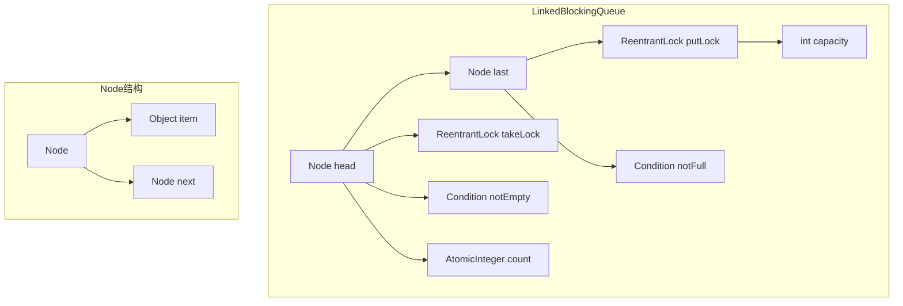

> 深入解析Java 8中BlockingQueue接口及其实现类的原理、使用方法和适用场景，并通过实际案例展示如何在并发编程中正确使用这些队列

## 一、BlockingQueue概述

### 1.1 什么是BlockingQueue

`BlockingQueue`是Java并发包（java.util.concurrent）中提供的一种线程安全的队列数据结构，它在普通队列的基础上增加了以下核心特性：

- **线程安全**：所有操作都是线程安全的，无需额外同步
- **阻塞操作**：当队列满时，插入操作会阻塞；当队列空时，获取操作会阻塞
- **可中断性**：支持响应中断的阻塞操作
- **超时机制**：支持带超时时间的阻塞操作

### 1.2 BlockingQueue的核心方法

| 操作类型 | 抛出异常 | 返回特殊值 | 阻塞 | 超时 |
|---------|---------|-----------|------|------|
| 插入 | add(e) | offer(e) | put(e) | offer(e, time, unit) |
| 移除 | remove() | poll() | take() | poll(time, unit) |
| 检查 | element() | peek() | 不支持 | 不支持 |

## 二、主要的BlockingQueue实现

### 2.1 ArrayBlockingQueue

**核心特点：**
- 基于数组实现的有界阻塞队列
- 创建时必须指定容量大小
- 支持公平/非公平访问策略（默认非公平）
- 内部使用一个ReentrantLock来保证线程安全
- 条件变量notEmpty和notFull用于实现阻塞功能

**内部结构：**

```mermaid
flowchart TD
    subgraph ArrayBlockingQueue
        A[Object[] items] --> B[ReentrantLock lock]
        B --> C[Condition notEmpty]
        B --> D[Condition notFull]
        A --> E[int takeIndex]
        A --> F[int putIndex]
        A --> G[int count]
    end
```

**使用示例：**
```java
import java.util.concurrent.ArrayBlockingQueue;
import java.util.concurrent.BlockingQueue;

public class ArrayBlockingQueueExample {
    public static void main(String[] args) {
        // 创建容量为5的有界队列，使用公平策略
        BlockingQueue<String> queue = new ArrayBlockingQueue<>(5, true);
        
        // 生产者线程
        Thread producer = new Thread(() -> {
            try {
                for (int i = 0; i < 10; i++) {
                    String item = "Item " + i;
                    queue.put(item); // 当队列满时会阻塞
                    System.out.println("生产者生产: " + item);
                    Thread.sleep(500);
                }
            } catch (InterruptedException e) {
                Thread.currentThread().interrupt();
            }
        });
        
        // 消费者线程
        Thread consumer = new Thread(() -> {
            try {
                for (int i = 0; i < 10; i++) {
                    String item = queue.take(); // 当队列空时会阻塞
                    System.out.println("消费者消费: " + item);
                    Thread.sleep(1000);
                }
            } catch (InterruptedException e) {
                Thread.currentThread().interrupt();
            }
        });
        
        producer.start();
        consumer.start();
    }
}
```

### 2.2 LinkedBlockingQueue

**核心特点：**
- 基于链表实现的可选有界阻塞队列（默认无界，容量为Integer.MAX_VALUE）
- 创建时可指定容量大小
- 内部使用两个ReentrantLock（takeLock和putLock）实现并发控制
- 条件变量notEmpty和notFull分别与两个锁关联
- 支持更高的并发性能，生产者和消费者可以同时操作

**内部结构：**


### 2.3 PriorityBlockingQueue

**核心特点：**
- 基于二叉堆实现的无界优先级阻塞队列
- 元素按照自然顺序或自定义Comparator排序
- 不保证同优先级元素的顺序
- 内部使用一个ReentrantLock保证线程安全
- 自动扩容机制

**使用示例：**
```java
import java.util.Comparator;
import java.util.concurrent.PriorityBlockingQueue;

public class PriorityBlockingQueueExample {
    public static void main(String[] args) {
        // 创建一个按优先级排序的阻塞队列
        PriorityBlockingQueue<Task> queue = new PriorityBlockingQueue<>(5, Comparator.comparingInt(Task::getPriority));
        
        // 添加任务
        queue.add(new Task(3, "任务3"));
        queue.add(new Task(1, "任务1"));
        queue.add(new Task(5, "任务5"));
        queue.add(new Task(2, "任务2"));
        
        // 取出任务（按优先级顺序）
        while (!queue.isEmpty()) {
            Task task = queue.poll();
            System.out.println("执行任务: " + task.getName() + " (优先级: " + task.getPriority() + ")");
        }
    }
    
    static class Task {
        private int priority;
        private String name;
        
        public Task(int priority, String name) {
            this.priority = priority;
            this.name = name;
        }
        
        public int getPriority() {
            return priority;
        }
        
        public String getName() {
            return name;
        }
    }
}
```

### 2.4 DelayQueue

**核心特点：**
- 基于PriorityQueue实现的无界延迟阻塞队列
- 元素必须实现Delayed接口
- 只有当元素的延迟时间到期后，才能从队列中取出
- 内部使用一个ReentrantLock保证线程安全
- 适用于定时任务、缓存过期等场景

**使用示例：**
```java
import java.util.concurrent.DelayQueue;
import java.util.concurrent.Delayed;
import java.util.concurrent.TimeUnit;

public class DelayQueueExample {
    public static void main(String[] args) throws InterruptedException {
        DelayQueue<DelayedTask> queue = new DelayQueue<>();
        
        // 添加延迟任务
        queue.put(new DelayedTask(2, "任务1", TimeUnit.SECONDS));
        queue.put(new DelayedTask(5, "任务2", TimeUnit.SECONDS));
        queue.put(new DelayedTask(1, "任务3", TimeUnit.SECONDS));
        
        System.out.println("开始执行延迟任务...");
        
        // 取出并执行到期的任务
        while (!queue.isEmpty()) {
            DelayedTask task = queue.take(); // 阻塞直到有任务到期
            System.out.println("执行延迟任务: " + task.getName() + " (延迟时间: " + task.getDelay(TimeUnit.SECONDS) + "秒)");
        }
    }
    
    static class DelayedTask implements Delayed {
        private final long deadline;
        private final String name;
        
        public DelayedTask(long delay, String name, TimeUnit unit) {
            this.deadline = System.nanoTime() + unit.toNanos(delay);
            this.name = name;
        }
        
        @Override
        public long getDelay(TimeUnit unit) {
            return unit.convert(deadline - System.nanoTime(), TimeUnit.NANOSECONDS);
        }
        
        @Override
        public int compareTo(Delayed o) {
            return Long.compare(this.deadline, ((DelayedTask) o).deadline);
        }
        
        public String getName() {
            return name;
        }
    }
}
```

### 2.5 SynchronousQueue

**核心特点：**
- 没有内部容量的阻塞队列，每个插入操作必须等待一个相应的删除操作
- 支持公平/非公平访问策略（默认非公平）
- 内部使用Transferer接口实现，根据策略不同有两种实现：TransferQueue和TransferStack
- 适用于线程之间的直接传递数据，性能极高

### 2.6 LinkedTransferQueue

**核心特点：**
- 基于链表实现的无界阻塞传输队列
- 实现了TransferQueue接口，扩展了BlockingQueue的功能
- 支持立即传输（transfer）和超时传输（tryTransfer）
- 当有消费者在等待时，生产者可以直接将元素传递给消费者
- 内部使用CAS操作实现线程安全，性能优异

### 2.7 LinkedBlockingDeque

**核心特点：**
- 基于双向链表实现的可选有界阻塞双端队列
- 创建时可指定容量大小（默认无界）
- 支持从队列两端插入和移除元素
- 内部使用一个ReentrantLock和两个条件变量实现并发控制
- 适用于需要双向操作的场景

## 三、实际案例分析：生产者-消费者模式

### 3.1 传统生产者-消费者问题

生产者-消费者模式是并发编程中的经典问题，BlockingQueue提供了一种优雅的解决方案。下面是一个基于BlockingQueue的生产者-消费者模式实现：

```java
import java.util.concurrent.ArrayBlockingQueue;
import java.util.concurrent.BlockingQueue;
import java.util.concurrent.ExecutorService;
import java.util.concurrent.Executors;

public class ProducerConsumerPattern {
    private static final int QUEUE_CAPACITY = 10;
    private static final int NUM_PRODUCERS = 3;
    private static final int NUM_CONSUMERS = 2;
    private static final int TOTAL_ITEMS = 20;
    
    private static BlockingQueue<Item> queue = new ArrayBlockingQueue<>(QUEUE_CAPACITY);
    private static volatile int producedItems = 0;
    private static volatile boolean done = false;
    
    public static void main(String[] args) {
        ExecutorService executor = Executors.newFixedThreadPool(NUM_PRODUCERS + NUM_CONSUMERS);
        
        // 启动生产者线程
        for (int i = 0; i < NUM_PRODUCERS; i++) {
            executor.submit(new Producer(i));
        }
        
        // 启动消费者线程
        for (int i = 0; i < NUM_CONSUMERS; i++) {
            executor.submit(new Consumer(i));
        }
        
        // 等待所有任务完成
        try {
            while (producedItems < TOTAL_ITEMS) {
                Thread.sleep(100);
            }
            done = true;
            executor.shutdown();
        } catch (InterruptedException e) {
            Thread.currentThread().interrupt();
        }
    }
    
    static class Producer implements Runnable {
        private final int id;
        
        public Producer(int id) {
            this.id = id;
        }
        
        @Override
        public void run() {
            try {
                while (producedItems < TOTAL_ITEMS) {
                    Item item = new Item(producedItems++);
                    queue.put(item);
                    System.out.printf("生产者 %d 生产了: %s%n", id, item);
                    Thread.sleep((int) (Math.random() * 1000));
                }
            } catch (InterruptedException e) {
                Thread.currentThread().interrupt();
            }
        }
    }
    
    static class Consumer implements Runnable {
        private final int id;
        
        public Consumer(int id) {
            this.id = id;
        }
        
        @Override
        public void run() {
            try {
                while (!done || !queue.isEmpty()) {
                    Item item = queue.poll(500, TimeUnit.MILLISECONDS);
                    if (item != null) {
                        System.out.printf("消费者 %d 消费了: %s%n", id, item);
                        Thread.sleep((int) (Math.random() * 1500));
                    }
                }
            } catch (InterruptedException e) {
                Thread.currentThread().interrupt();
            }
        }
    }
    
    static class Item {
        private final int id;
        
        public Item(int id) {
            this.id = id;
        }
        
        @Override
        public String toString() {
            return "Item{id=" + id + "}";
        }
    }
}
```

### 3.2 日志处理系统案例

下面是一个使用BlockingQueue实现的简单日志处理系统：

```java
import java.util.concurrent.BlockingQueue;
import java.util.concurrent.LinkedBlockingQueue;
import java.util.concurrent.TimeUnit;

public class LogProcessingSystem {
    private static final int QUEUE_CAPACITY = 1000;
    private static final int PROCESSORS_COUNT = 5;
    
    private BlockingQueue<LogEntry> logQueue = new LinkedBlockingQueue<>(QUEUE_CAPACITY);
    private LogProcessor[] processors;
    private volatile boolean running = true;
    
    public LogProcessingSystem() {
        processors = new LogProcessor[PROCESSORS_COUNT];
        for (int i = 0; i < PROCESSORS_COUNT; i++) {
            processors[i] = new LogProcessor(i, logQueue);
            new Thread(processors[i]).start();
        }
    }
    
    public void log(String message, LogLevel level, String source) {
        try {
            LogEntry entry = new LogEntry(message, level, source, System.currentTimeMillis());
            if (logQueue.offer(entry, 1, TimeUnit.SECONDS)) {
                System.out.println("日志已添加到队列: " + entry);
            } else {
                System.err.println("日志队列已满，无法添加日志: " + entry);
            }
        } catch (InterruptedException e) {
            Thread.currentThread().interrupt();
        }
    }
    
    public void shutdown() {
        running = false;
        for (LogProcessor processor : processors) {
            processor.shutdown();
        }
    }
    
    static class LogEntry {
        private final String message;
        private final LogLevel level;
        private final String source;
        private final long timestamp;
        
        // 构造函数和getter方法
        
        @Override
        public String toString() {
            return String.format("[%tT] %s %s %s", timestamp, level, source, message);
        }
    }
    
    enum LogLevel {
        DEBUG, INFO, WARN, ERROR
    }
    
    static class LogProcessor implements Runnable {
        private final int id;
        private final BlockingQueue<LogEntry> queue;
        private volatile boolean running = true;
        
        public LogProcessor(int id, BlockingQueue<LogEntry> queue) {
            this.id = id;
            this.queue = queue;
        }
        
        @Override
        public void run() {
            while (running || !queue.isEmpty()) {
                try {
                    LogEntry entry = queue.poll(500, TimeUnit.MILLISECONDS);
                    if (entry != null) {
                        processLog(entry);
                    }
                } catch (InterruptedException e) {
                    Thread.currentThread().interrupt();
                }
            }
            System.out.printf("日志处理器 %d 已关闭%n", id);
        }
        
        private void processLog(LogEntry entry) {
            // 模拟日志处理逻辑
            System.out.printf("日志处理器 %d 正在处理日志: %s%n", id, entry);
            try {
                Thread.sleep((int) (Math.random() * 100));
            } catch (InterruptedException e) {
                Thread.currentThread().interrupt();
            }
        }
        
        public void shutdown() {
            running = false;
        }
    }
    
    public static void main(String[] args) {
        LogProcessingSystem logSystem = new LogProcessingSystem();
        
        // 模拟日志产生
        for (int i = 0; i < 20; i++) {
            LogLevel level = LogLevel.values()[i % 4];
            logSystem.log("这是一条测试日志 " + i, level, "Source-" + (i % 3));
            try {
                Thread.sleep(100);
            } catch (InterruptedException e) {
                Thread.currentThread().interrupt();
            }
        }
        
        // 关闭日志系统
        try {
            Thread.sleep(2000);
        } catch (InterruptedException e) {
            Thread.currentThread().interrupt();
        }
        logSystem.shutdown();
    }
}
```

## 四、各种BlockingQueue的对比总结

### 4.1 核心特性对比

| 队列类型 | 数据结构 | 容量 | 线程安全实现 | 适用场景 |
|---------|---------|------|-------------|---------|
| ArrayBlockingQueue | 数组 | 有界 | 单锁 | 固定大小的队列，需要公平性控制 |
| LinkedBlockingQueue | 链表 | 可选有界 | 双锁 | 高并发场景，生产者和消费者并发操作 |
| PriorityBlockingQueue | 二叉堆 | 无界 | 单锁 | 需要按优先级处理任务的场景 |
| DelayQueue | 二叉堆 | 无界 | 单锁 | 定时任务、缓存过期等延迟执行场景 |
| SynchronousQueue | 无内部结构 | 无界（概念上） | CAS或锁 | 线程间直接传递数据，高吞吐量场景 |
| LinkedTransferQueue | 链表 | 无界 | CAS | 高性能传输队列，支持直接传递 |
| LinkedBlockingDeque | 双向链表 | 可选有界 | 单锁 | 需要双向操作的队列场景 |

### 4.2 性能对比

1. **吞吐量**：SynchronousQueue > LinkedTransferQueue > LinkedBlockingQueue > ArrayBlockingQueue > PriorityBlockingQueue > DelayQueue
2. **内存占用**：Linked系列（LinkedBlockingQueue、LinkedTransferQueue等）由于需要维护链表节点，内存占用相对较高；ArrayBlockingQueue内存占用固定且较低
3. **CPU利用率**：使用CAS实现的队列（如SynchronousQueue、LinkedTransferQueue）CPU利用率更高，因为减少了锁的竞争

### 4.3 选择建议

- 如果需要固定大小的队列，优先选择**ArrayBlockingQueue**
- 如果需要高并发的生产者-消费者模型，优先选择**LinkedBlockingQueue**
- 如果需要按优先级处理任务，选择**PriorityBlockingQueue**
- 如果需要延迟执行任务，选择**DelayQueue**
- 如果需要线程间直接传递数据，选择**SynchronousQueue**或**LinkedTransferQueue**
- 如果需要双向操作队列，选择**LinkedBlockingDeque**

## 五、最佳实践

### 5.1 避免无界队列的陷阱

1. **LinkedBlockingQueue**默认是无界的，可能导致内存溢出，建议始终指定合理的容量
2. **PriorityBlockingQueue**和**DelayQueue**也是无界的，需要注意元素的增长速度

### 5.2 合理选择队列容量

1. 根据系统的内存限制和处理能力，设置合适的队列容量
2. 对于生产者速度远快于消费者的场景，队列容量不宜过大，避免内存溢出
3. 对于消费者速度远快于生产者的场景，队列容量可以适当增大，提高系统的吞吐量

### 5.3 使用超时操作

1. 使用带超时时间的操作（如offer、poll）代替无限阻塞的操作（如put、take）
2. 超时操作可以避免线程永久阻塞，提高系统的健壮性

### 5.4 正确处理中断

1. 当线程被中断时，BlockingQueue的阻塞操作会抛出InterruptedException
2. 应该正确处理这些异常，通常是恢复线程的中断状态并退出线程

### 5.5 监控队列状态

1. 定期监控队列的大小和使用率，及时发现潜在问题
2. 可以使用JMX或自定义监控工具来监控队列的状态

## 六、总结

Java 8中的BlockingQueue提供了丰富的实现类，每个实现类都有其独特的特性和适用场景。通过本文的介绍，我们了解了：

1. BlockingQueue的核心概念和方法
2. Java 8中主要的BlockingQueue实现类及其原理
3. 如何使用BlockingQueue解决实际问题
4. 各种队列的对比和选择建议

在实际开发中，我们应该根据具体的业务需求和性能要求，选择合适的BlockingQueue实现类。同时，遵循最佳实践，确保系统的稳定性和性能。