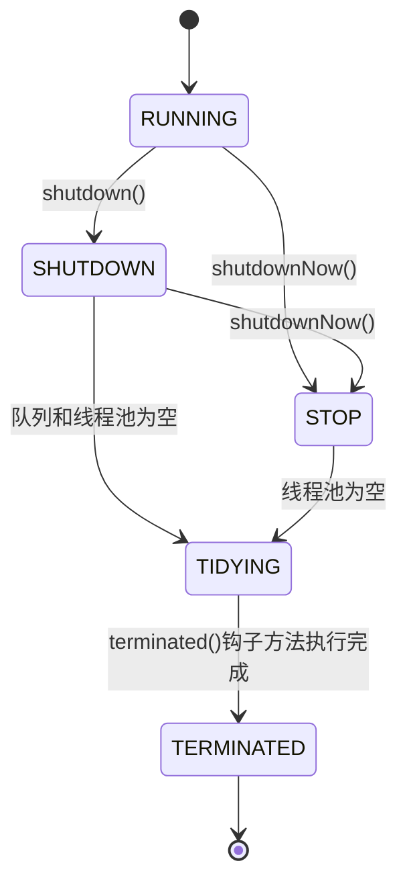
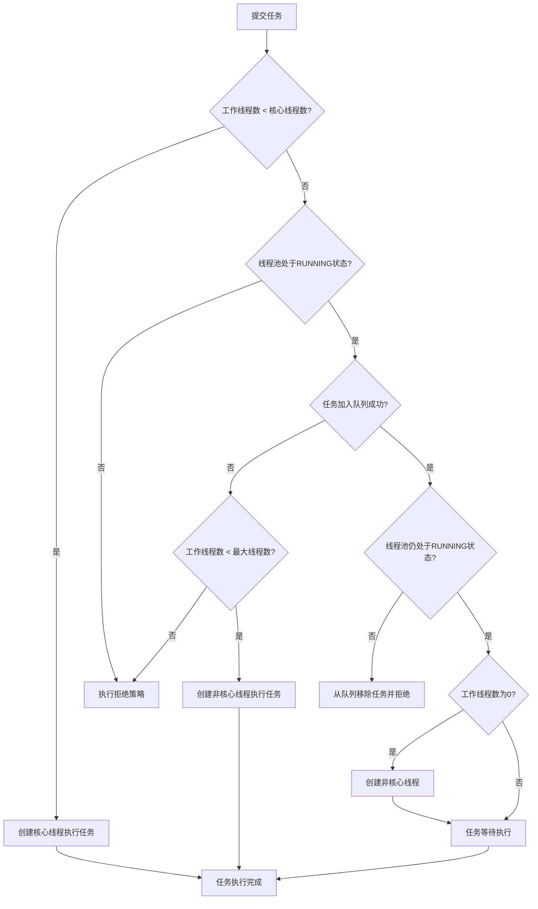

## 线程池源码分析

在Java并发编程中，线程池是一个核心组件，它提供了高效的线程管理机制。Java 8中的线程池实现主要基于`java.util.concurrent.ThreadPoolExecutor`类，本文将深入分析其源码实现，揭示线程池的工作原理和核心机制。

## 一、ThreadPoolExecutor类结构

`ThreadPoolExecutor`是Java线程池的核心实现类，它继承自`AbstractExecutorService`，并实现了`ExecutorService`接口。其类结构如下：

```java
public class ThreadPoolExecutor extends AbstractExecutorService {
    // 线程池状态控制字段
    private final AtomicInteger ctl = new AtomicInteger(ctlOf(RUNNING, 0));
    private static final int COUNT_BITS = Integer.SIZE - 3;
    private static final int CAPACITY   = (1 << COUNT_BITS) - 1;
    
    // 线程池状态定义
    private static final int RUNNING    = -1 << COUNT_BITS;
    private static final int SHUTDOWN   =  0 << COUNT_BITS;
    private static final int STOP       =  1 << COUNT_BITS;
    private static final int TIDYING    =  2 << COUNT_BITS;
    private static final int TERMINATED =  3 << COUNT_BITS;
    
    // 核心参数
    private final BlockingQueue<Runnable> workQueue;
    private final ReentrantLock mainLock = new ReentrantLock();
    private final HashSet<Worker> workers = new HashSet<>();
    private final Condition termination = mainLock.newCondition();
    private int corePoolSize;
    private int maximumPoolSize;
    private long keepAliveTime;
    private volatile boolean allowCoreThreadTimeOut;
    private volatile int largestPoolSize;
    private volatile long completedTaskCount;
    private volatile ThreadFactory threadFactory;
    private volatile RejectedExecutionHandler handler;
    private volatile long keepAliveTime;
    
    // 内部类Worker
    private final class Worker extends AbstractQueuedSynchronizer implements Runnable {
        // Worker实现
    }
    
    // 核心方法
    public void execute(Runnable command) { ... }
    private boolean addWorker(Runnable firstTask, boolean core) { ... }
    private void processWorkerExit(Worker w, boolean completedAbruptly) { ... }
    // 其他方法
}
```

## 二、线程池状态管理

线程池使用一个32位的整数`ctl`来同时存储线程池状态和工作线程数量，其中高3位表示状态，低29位表示线程数。

### 1. 状态定义

```java
// 高3位表示线程池状态
private static final int COUNT_BITS = Integer.SIZE - 3;
private static final int CAPACITY   = (1 << COUNT_BITS) - 1;

// 线程池状态值（按生命周期顺序）
private static final int RUNNING    = -1 << COUNT_BITS; // 接受新任务并处理队列中的任务
private static final int SHUTDOWN   =  0 << COUNT_BITS; // 不接受新任务，但处理队列中的任务
private static final int STOP       =  1 << COUNT_BITS; // 不接受新任务，不处理队列中的任务，中断正在执行的任务
private static final int TIDYING    =  2 << COUNT_BITS; // 所有任务已终止，工作线程数为0，准备执行terminated()钩子方法
private static final int TERMINATED =  3 << COUNT_BITS; // terminated()方法执行完成
```

### 2. 状态转换方法

```java
// 获取状态
private static int runStateOf(int c)     { return c & ~CAPACITY; }
// 获取线程数
private static int workerCountOf(int c)  { return c & CAPACITY; }
// 组合状态和线程数
private static int ctlOf(int rs, int wc) { return rs | wc; }
```

### 3. 状态转换流程

线程池的状态转换遵循严格的生命周期，可用以下状态图表示：



具体转换规则：

1. **RUNNING** → **SHUTDOWN**：调用shutdown()方法
2. **RUNNING/SHUTDOWN** → **STOP**：调用shutdownNow()方法
3. **SHUTDOWN** → **TIDYING**：队列和线程池都为空
4. **STOP** → **TIDYING**：线程池为空
5. **TIDYING** → **TERMINATED**：调用terminated()钩子方法完成

## 三、核心组件Worker类

`Worker`是ThreadPoolExecutor的内部类，它实现了`Runnable`接口并继承了`AbstractQueuedSynchronizer`（AQS），用于表示工作线程。

### 1. Worker类结构

```java
private final class Worker extends AbstractQueuedSynchronizer implements Runnable {
    // 工作线程
    final Thread thread;
    // 初始任务
    Runnable firstTask;
    // 完成的任务数
    volatile long completedTasks;
    
    // 构造方法
    Worker(Runnable firstTask) {
        setState(-1); // 在调用runWorker之前禁止中断
        this.firstTask = firstTask;
        this.thread = getThreadFactory().newThread(this);
    }
    
    // 实现Runnable接口
    public void run() {
        runWorker(this);
    }
    
    // AQS方法实现
    protected boolean isHeldExclusively() { return getState() != 0; }
    protected boolean tryAcquire(int unused) { ... }
    protected boolean tryRelease(int unused) { ... }
    
    // 中断控制方法
    public void lock() { acquire(1); }
    public boolean tryLock() { return tryAcquire(1); }
    public void unlock() { release(1); }
    public boolean isLocked() { return isHeldExclusively(); }
    
    // 中断方法
    void interruptIfStarted() {
        Thread t;
        if (getState() >= 0 && (t = thread) != null && !t.isInterrupted()) {
            try {
                t.interrupt();
            } catch (SecurityException ignore) {
            }
        }
    }
}
```

### 2. Worker的作用与生命周期

Worker类的主要作用：

1. **封装工作线程**：将线程和任务封装在一起
2. **状态管理**：通过AQS实现锁机制，控制线程的中断状态
3. **任务计数**：记录线程完成的任务数量
4. **生命周期管理**：管理工作线程的创建、执行和销毁

Worker类的生命周期可用以下流程图表示：

```mermaid
flowchart TD
    A[创建Worker实例] --> B[设置state=-1禁止中断]
    B --> C[创建工作线程]
    C --> D[线程池添加Worker]
    D --> E[调用线程start()方法]
    E --> F[执行runWorker()方法]
    F --> G[设置state=0允许中断]
    G --> H{有任务需要执行?}
    H -- 是 --> I[获取并执行任务]
    I --> J[更新完成任务计数]
    J --> H
    H -- 否 --> K[执行processWorkerExit()]
    K --> L[从线程池移除Worker]
    L --> M[Worker生命周期结束]
```

Worker实例的生命周期从创建开始，经过线程启动、任务执行，到最终被线程池移除并销毁。

## 四、核心方法分析

### 1. execute()方法

`execute()`是线程池的核心方法，用于提交任务。其执行流程如下：



其工作流程如下：

```java
public void execute(Runnable command) {
    if (command == null)
        throw new NullPointerException();
    
    // 获取当前线程池状态和线程数
    int c = ctl.get();
    
    // 步骤1：如果工作线程数小于核心线程数，创建新的核心线程
    if (workerCountOf(c) < corePoolSize) {
        if (addWorker(command, true))
            return;
        c = ctl.get();
    }
    
    // 步骤2：如果线程池处于RUNNING状态，将任务加入队列
    if (isRunning(c) && workQueue.offer(command)) {
        // 双重检查，防止线程池状态在加入队列后发生变化
        int recheck = ctl.get();
        if (!isRunning(recheck) && remove(command))
            // 如果线程池不再运行，拒绝任务
            reject(command);
        else if (workerCountOf(recheck) == 0)
            // 如果没有工作线程，创建非核心线程
            addWorker(null, false);
    }
    
    // 步骤3：如果队列已满，尝试创建非核心线程
    else if (!addWorker(command, false))
        // 如果创建失败（线程数已达最大值），拒绝任务
        reject(command);
}
```

### 2. addWorker()方法

`addWorker()`方法用于创建新的工作线程，其实现较为复杂：

```java
private boolean addWorker(Runnable firstTask, boolean core) {
    retry:
    for (;;) {
        int c = ctl.get();
        int rs = runStateOf(c);
        
        // 检查是否应该创建新线程的条件
        if (rs >= SHUTDOWN &&
            !(rs == SHUTDOWN && firstTask == null && !workQueue.isEmpty()))
            return false;
        
        for (;;) {
            int wc = workerCountOf(c);
            if (wc >= CAPACITY || wc >= (core ? corePoolSize : maximumPoolSize))
                return false;
            if (compareAndIncrementWorkerCount(c))
                break retry;
            c = ctl.get();
            if (runStateOf(c) != rs)
                continue retry;
        }
    }
    
    boolean workerStarted = false;
    boolean workerAdded = false;
    Worker w = null;
    try {
        // 创建新的Worker
        w = new Worker(firstTask);
        final Thread t = w.thread;
        if (t != null) {
            final ReentrantLock mainLock = this.mainLock;
            mainLock.lock();
            try {
                int rs = runStateOf(ctl.get());
                
                if (rs < SHUTDOWN ||
                    (rs == SHUTDOWN && firstTask == null)) {
                    if (t.isAlive())
                        throw new IllegalThreadStateException();
                    workers.add(w);
                    int s = workers.size();
                    if (s > largestPoolSize)
                        largestPoolSize = s;
                    workerAdded = true;
                }
            } finally {
                mainLock.unlock();
            }
            if (workerAdded) {
                t.start();
                workerStarted = true;
            }
        }
    } finally {
        if (!workerStarted)
            addWorkerFailed(w);
    }
    return workerStarted;
}
```

### 3. runWorker()方法

`runWorker()`方法是工作线程的核心执行逻辑：

```java
final void runWorker(Worker w) {
    Thread wt = Thread.currentThread();
    Runnable task = w.firstTask;
    w.firstTask = null;
    w.unlock(); // 允许中断
    boolean completedAbruptly = true;
    try {
        // 循环获取任务：先处理初始任务，然后从队列中获取
        while (task != null || (task = getTask()) != null) {
            w.lock();
            
            // 检查线程池状态，如果需要中断则中断当前线程
            if ((runStateAtLeast(ctl.get(), STOP) ||
                 (Thread.interrupted() && runStateAtLeast(ctl.get(), STOP))) &&
                !wt.isInterrupted())
                wt.interrupt();
            
            try {
                // 任务执行前的钩子方法
                beforeExecute(wt, task);
                Throwable thrown = null;
                try {
                    // 执行任务
                    task.run();
                } catch (RuntimeException x) {
                    thrown = x; throw x;
                } catch (Error x) {
                    thrown = x; throw x;
                } catch (Throwable x) {
                    thrown = x; throw new Error(x);
                } finally {
                    // 任务执行后的钩子方法
                    afterExecute(task, thrown);
                }
            } finally {
                task = null;
                w.completedTasks++;
                w.unlock();
            }
        }
        completedAbruptly = false;
    } finally {
        // 处理工作线程退出
        processWorkerExit(w, completedAbruptly);
    }
}
```

### 4. getTask()方法

`getTask()`方法用于从队列中获取任务：

```java
private Runnable getTask() {
    boolean timedOut = false; // 上次从队列获取任务是否超时
    
    for (;;) {
        int c = ctl.get();
        int rs = runStateOf(c);
        
        // 检查线程池状态
        if (rs >= SHUTDOWN && (rs >= STOP || workQueue.isEmpty())) {
            decrementWorkerCount();
            return null;
        }
        
        int wc = workerCountOf(c);
        
        // 决定是否需要超时控制
        boolean timed = allowCoreThreadTimeOut || wc > corePoolSize;
        
        // 如果工作线程数超过最大线程数，或者超时且队列为空，减少工作线程数
        if ((wc > maximumPoolSize || (timed && timedOut))
            && (wc > 1 || workQueue.isEmpty())) {
            if (compareAndDecrementWorkerCount(c))
                return null;
            continue;
        }
        
        try {
            // 从队列中获取任务
            Runnable r = timed ?
                workQueue.poll(keepAliveTime, TimeUnit.NANOSECONDS) :
                workQueue.take();
            if (r != null)
                return r;
            timedOut = true;
        } catch (InterruptedException retry) {
            timedOut = false;
        }
    }
}
```

### 5. processWorkerExit()方法

`processWorkerExit()`方法处理工作线程退出：

```java
private void processWorkerExit(Worker w, boolean completedAbruptly) {
    // 如果是异常退出，减少工作线程数
    if (completedAbruptly)
        decrementWorkerCount();
    
    final ReentrantLock mainLock = this.mainLock;
    mainLock.lock();
    try {
        // 更新完成任务计数
        completedTaskCount += w.completedTasks;
        // 从工作线程集合中移除
        workers.remove(w);
    } finally {
        mainLock.unlock();
    }
    
    // 尝试终止线程池
    tryTerminate();
    
    int c = ctl.get();
    // 如果线程池处于RUNNING或SHUTDOWN状态，需要维持一定数量的工作线程
    if (runStateLessThan(c, STOP)) {
        if (!completedAbruptly) {
            int min = allowCoreThreadTimeOut ? 0 : corePoolSize;
            if (min == 0 && !workQueue.isEmpty())
                min = 1;
            if (workerCountOf(c) >= min)
                return; // 不需要创建新线程
        }
        // 创建新的工作线程
        addWorker(null, false);
    }
}
```

## 五、线程池工作流程总结

线程池的完整工作流程可用以下流程图表示：

```mermaid
flowchart TD
    A[提交任务到线程池] --> B{当前线程数 < corePoolSize?}
    B -- 是 --> C[创建核心线程执行任务]
    B -- 否 --> D{队列未满?}
    D -- 是 --> E[任务加入工作队列]
    D -- 否 --> F{当前线程数 < maximumPoolSize?}
    F -- 是 --> G[创建非核心线程执行任务]
    F -- 否 --> H[执行拒绝策略]
    
    subgraph 任务执行与线程管理
    C --> I[工作线程执行任务]
    G --> I
    E --> J[工作线程从队列获取任务]
    J --> I
    I --> K{任务执行完成?}
    K -- 是 --> L{队列是否为空?}
    L -- 否 --> J
    L -- 是 --> M{当前线程数 > corePoolSize?}
    M -- 是 --> N{线程空闲时间 > keepAliveTime?}
    N -- 是 --> O[回收非核心线程]
    N -- 否 --> P[等待新任务]
    M -- 否 --> P
    P --> J
    end
    
    subgraph 线程池终止
    Q[调用shutdown()/shutdownNow()] --> R{线程池状态变为SHUTDOWN/STOP}
    R --> S{停止接受新任务}
    S --> T{中断正在执行的任务(shutdownNow)}
    T --> U{等待现有任务执行完成}
    U --> V{工作线程数为0}
    V --> W[线程池状态变为TERMINATED]
    end
```

具体流程如下：

1. **提交任务**：调用`execute()`方法提交任务
2. **创建核心线程**：如果工作线程数小于核心线程数，创建新的核心线程
3. **加入队列**：如果核心线程数已满，将任务加入工作队列
4. **创建非核心线程**：如果队列已满，创建新的非核心线程
5. **执行拒绝策略**：如果线程数已达最大值，执行拒绝策略
6. **执行任务**：工作线程从队列中获取任务并执行
7. **线程回收**：非核心线程空闲时间超过keepAliveTime后被回收
8. **线程池终止**：调用shutdown()或shutdownNow()方法终止线程池

## 六、线程池源码优化点分析

### 1. 高效的状态管理

使用一个32位整数同时存储状态和线程数，减少了volatile变量的数量，提高了并发性能。

### 2. 双重检查机制

在`execute()`方法中，将任务加入队列后进行双重检查，确保线程池状态的一致性。

### 3. 合理的锁粒度

使用`mainLock`保护workers集合等共享资源，但在执行任务时不持有锁，减少锁竞争。

### 4. 钩子方法设计

提供了`beforeExecute()`、`afterExecute()`和`terminated()`等钩子方法，方便用户扩展线程池功能。

### 5. 优雅的线程中断

通过Worker类的锁机制，控制线程的中断状态，确保线程安全地中断。

## 七、线程池使用建议

1. **避免使用Executors创建线程池**：Executors创建的线程池存在潜在的内存溢出风险
2. **自定义线程池参数**：根据实际需求设置corePoolSize、maximumPoolSize、workQueue等参数
3. **合理设置队列大小**：使用有界队列避免内存溢出
4. **选择合适的拒绝策略**：根据业务需求选择AbortPolicy、CallerRunsPolicy等拒绝策略
5. **监控线程池状态**：定期监控线程池的活跃线程数、队列大小等指标
6. **正确关闭线程池**：使用shutdown()或shutdownNow()方法关闭线程池，并等待线程池终止

## 八、总结

Java 8线程池的源码实现体现了优秀的并发编程思想和设计模式：

1. **状态机设计**：通过状态机管理线程池的生命周期
2. **工作窃取模式**：工作线程从队列中获取任务执行
3. **模板方法模式**：通过钩子方法提供扩展点
4. **生产者-消费者模式**：任务提交者和执行者分离
5. **线程安全设计**：使用CAS、锁等机制保证线程安全

深入理解线程池的源码实现，有助于我们更好地使用和优化线程池，提高并发编程的效率和质量。

## 九、参考资料

1. [Java 8官方文档 - ThreadPoolExecutor](https://docs.oracle.com/javase/8/docs/api/java/util/concurrent/ThreadPoolExecutor.html)
2. [Java并发编程实战](https://book.douban.com/subject/10484692/)
3. [深入理解Java虚拟机](https://book.douban.com/subject/24722612/)

---

本文详细分析了Java 8线程池的源码实现，包括线程池的状态管理、核心组件、核心方法和工作流程。通过深入理解线程池的源码，我们可以更好地使用和优化线程池，提高并发编程的效率和质量。