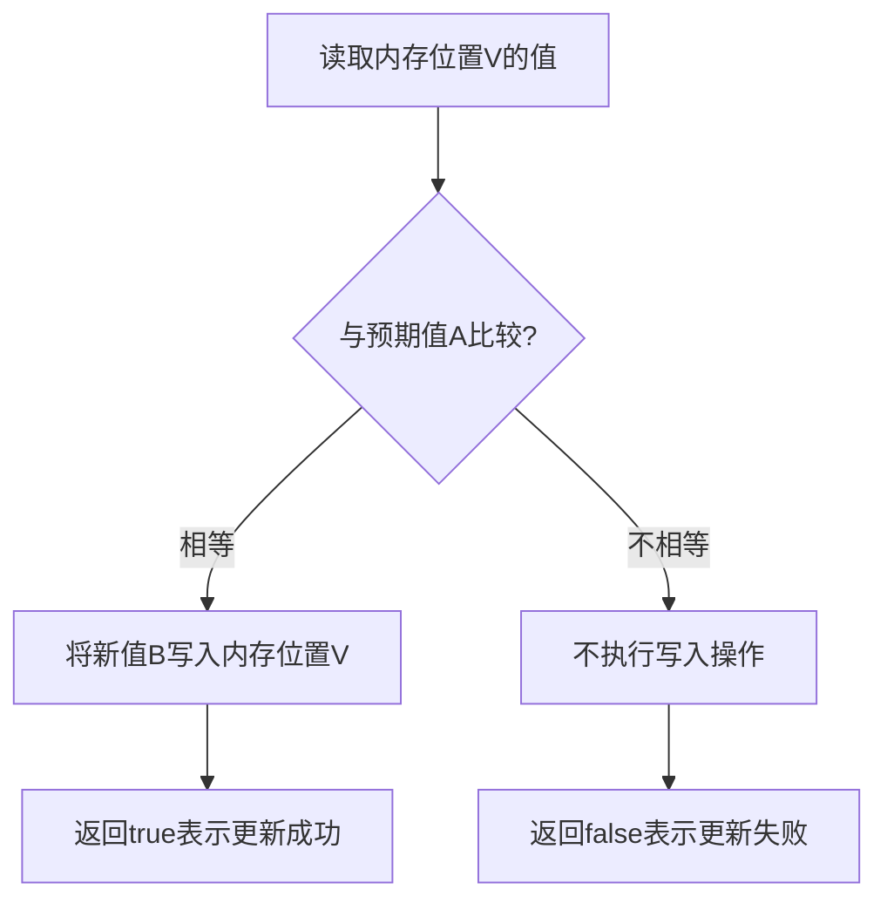
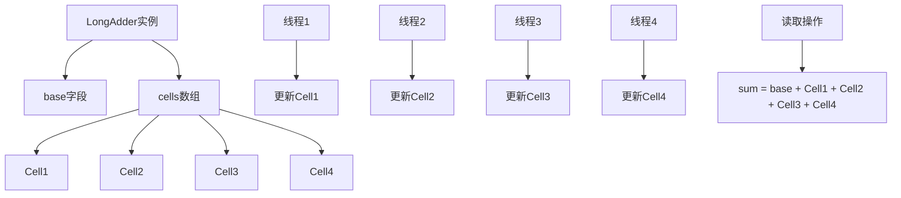

> 本文深入解析Java原子操作类的实现原理，包括CAS机制、Unsafe类的使用、ABA问题及解决方案，帮助读者全面理解原子操作在并发编程中的应用。

## 一、原子操作概述

### 1. 什么是原子操作

原子操作是指在执行过程中不会被其他线程中断的操作，要么全部执行成功，要么全部不执行。在并发编程中，原子操作是实现线程安全的重要手段。

### 2. 原子操作的实现方式

Java中实现原子操作的方式主要有两种：

1. **锁机制**：使用synchronized或Lock接口保证操作的原子性
2. **无锁机制**：使用CAS（Compare-And-Swap）实现原子操作，这是Atomic系列类的实现基础

### 3. Atomic系列类的分类

Java提供了丰富的原子操作类，主要分为以下几类：

| 类别 | 代表类 | 功能 |
|------|--------|------|
| 基本类型 | AtomicInteger, AtomicLong, AtomicBoolean | 基本类型的原子操作 |
| 引用类型 | AtomicReference, AtomicStampedReference, AtomicMarkableReference | 引用类型的原子操作 |
| 数组类型 | AtomicIntegerArray, AtomicLongArray, AtomicReferenceArray | 数组元素的原子操作 |
| 更新器 | AtomicIntegerFieldUpdater, AtomicLongFieldUpdater, AtomicReferenceFieldUpdater | 对象字段的原子操作 |
| 高级原子类 | LongAdder, LongAccumulator, DoubleAdder, DoubleAccumulator | 高性能原子累加器 |

## 二、CAS机制详解

### 1. CAS的基本原理

CAS（Compare-And-Swap）是一种无锁算法，其核心思想是：在更新一个值之前，先比较该值是否与预期值相同，如果相同则更新，否则不更新并返回旧值。

CAS操作包含三个操作数：

- **内存位置**（V）：要更新的变量地址
- **预期值**（A）：期望该内存位置的值
- **新值**（B）：准备设置的新值

CAS的执行过程如下：



### 2. CAS的硬件支持

CAS操作的原子性是由硬件保证的。现代CPU提供了特殊的指令来实现原子的CAS操作，例如：

- x86架构：`cmpxchg`指令
- ARM架构：`ldrex`/`strex`指令

JVM通过JNI调用这些硬件指令来实现CAS操作。

### 3. CAS的优缺点

**优点**：

- 不需要加锁，避免了上下文切换和线程调度的开销
- 高并发场景下性能优于锁机制
- 实现简单，逻辑清晰

**缺点**：

- **ABA问题**：内存位置的值从A变为B，再变回A，CAS操作无法检测到这种变化
- **自旋开销**：如果CAS操作失败，需要不断重试，可能导致CPU资源浪费
- **只能保证单个变量的原子操作**：无法实现多个变量的原子操作

## 三、Unsafe类的使用

### 1. Unsafe类概述

Unsafe类是Java中一个特殊的类，位于`sun.misc`包下，提供了一系列底层操作，包括：

- 内存操作
- CAS操作
- 线程调度
- 类加载
- 对象操作

Unsafe类的方法大多是native方法，直接调用底层操作系统的API。

### 2. 获取Unsafe实例

Unsafe类的构造方法是私有的，无法直接创建实例。可以通过反射获取：

```java
import sun.misc.Unsafe;
import java.lang.reflect.Field;

public class UnsafeExample {
    public static Unsafe getUnsafe() {
        try {
            Field field = Unsafe.class.getDeclaredField("theUnsafe");
            field.setAccessible(true);
            return (Unsafe) field.get(null);
        } catch (Exception e) {
            throw new RuntimeException(e);
        }
    }
}
```

### 3. Unsafe类的CAS操作

Unsafe类提供了以下CAS方法：

```java
// 比较并交换int类型的值
public final native boolean compareAndSwapInt(Object var1, long var2, int var4, int var5);

// 比较并交换long类型的值
public final native boolean compareAndSwapLong(Object var1, long var2, long var4, long var6);

// 比较并交换Object类型的值
public final native boolean compareAndSwapObject(Object var1, long var2, Object var4, Object var5);
```

这些方法是Atomic系列类实现的基础。

## 四、AtomicInteger源码分析

### 1. AtomicInteger的核心成员变量

```java
public class AtomicInteger extends Number implements java.io.Serializable {
    private static final long serialVersionUID = 6214790243416807050L;

    // 获取Unsafe实例
    private static final Unsafe unsafe = Unsafe.getUnsafe();
    // value字段的内存偏移量
    private static final long valueOffset;

    static {
        try {
            // 计算value字段的内存偏移量
            valueOffset = unsafe.objectFieldOffset
                (AtomicInteger.class.getDeclaredField("value"));
        } catch (Exception ex) { throw new Error(ex); }
    }

    // 存储实际值的volatile变量
    private volatile int value;
}
```

### 2. AtomicInteger的核心方法

#### 2.1 getAndIncrement()方法

```java
public final int getAndIncrement() {
    return unsafe.getAndAddInt(this, valueOffset, 1);
}
```

该方法调用了Unsafe类的getAndAddInt方法，实现了原子的自增操作。

#### 2.2 getAndAddInt()方法的实现

```java
public final int getAndAddInt(Object var1, long var2, int var4) {
    int var5;
    do {
        // 读取内存位置的值
        var5 = this.getIntVolatile(var1, var2);
        // 执行CAS操作，如果失败则重试
    } while(!this.compareAndSwapInt(var1, var2, var5, var5 + var4));
    // 返回旧值
    return var5;
}
```

该方法使用自旋CAS实现原子操作，如果CAS操作失败，则不断重试，直到成功为止。

#### 2.3 compareAndSet()方法

```java
public final boolean compareAndSet(int expect, int update) {
    return unsafe.compareAndSwapInt(this, valueOffset, expect, update);
}
```

该方法直接调用Unsafe类的compareAndSwapInt方法，实现CAS操作。

## 五、AtomicReference与ABA问题

### 1. AtomicReference的使用

AtomicReference用于实现引用类型的原子操作：

```java
public class AtomicReferenceExample {
    public static void main(String[] args) {
        User user = new User("Alice", 25);
        AtomicReference<User> atomicUser = new AtomicReference<>(user);
        
        User newUser = new User("Bob", 30);
        // 原子更新引用
        boolean updated = atomicUser.compareAndSet(user, newUser);
        System.out.println("更新结果: " + updated);
        System.out.println("当前用户: " + atomicUser.get());
    }
    
    static class User {
        private String name;
        private int age;
        
        public User(String name, int age) {
            this.name = name;
            this.age = age;
        }
        
        @Override
        public String toString() {
            return "User{name='" + name + "', age=" + age + "}";
        }
    }
}
```

### 2. ABA问题

ABA问题是CAS操作的一个潜在问题：

```plaintext
线程1: 读取变量值为A
线程2: 将变量值从A改为B
线程3: 将变量值从B改回A
线程1: 执行CAS操作，发现变量值仍为A，于是将其改为C
```

从线程1的角度来看，变量值没有变化，但实际上已经经历了A→B→A的变化。在某些场景下，这种变化可能会导致问题。

## 六、AtomicStampedReference与AtomicMarkableReference

### 1. AtomicStampedReference

AtomicStampedReference通过为引用添加版本号来解决ABA问题：

```java
public class AtomicStampedReferenceExample {
    public static void main(String[] args) {
        String initialRef = "A";
        int initialStamp = 0;
        
        AtomicStampedReference<String> asr = new AtomicStampedReference<>(initialRef, initialStamp);
        
        // 获取当前值和版本号
        String currentRef = asr.getReference();
        int currentStamp = asr.getStamp();
        
        // 原子更新，需要同时匹配值和版本号
        boolean updated = asr.compareAndSet(currentRef, "B", currentStamp, currentStamp + 1);
        System.out.println("更新结果: " + updated);
        System.out.println("当前值: " + asr.getReference());
        System.out.println("当前版本号: " + asr.getStamp());
    }
}
```

### 2. AtomicMarkableReference

AtomicMarkableReference通过为引用添加一个布尔标记来解决ABA问题，相比AtomicStampedReference更轻量级：

```java
public class AtomicMarkableReferenceExample {
    public static void main(String[] args) {
        String initialRef = "A";
        boolean initialMark = false;
        
        AtomicMarkableReference<String> amr = new AtomicMarkableReference<>(initialRef, initialMark);
        
        // 获取当前值和标记
        boolean[] markHolder = new boolean[1];
        String currentRef = amr.get(markHolder);
        boolean currentMark = markHolder[0];
        
        // 原子更新，需要同时匹配值和标记
        boolean updated = amr.compareAndSet(currentRef, "B", currentMark, !currentMark);
        System.out.println("更新结果: " + updated);
        System.out.println("当前值: " + amr.getReference());
        System.out.println("当前标记: " + amr.isMarked());
    }
}
```

## 七、AtomicLong与LongAdder对比

### 1. AtomicLong的性能瓶颈

在高并发场景下，大量线程同时更新同一个AtomicLong实例时，CAS操作的失败率会很高，导致大量自旋重试，浪费CPU资源。

### 2. LongAdder的设计思想

LongAdder是Java 8引入的高性能原子累加器，其设计思想是：

- 将一个计数器拆分为多个子计数器
- 每个线程更新自己的子计数器
- 读取时将所有子计数器的值相加

### 3. LongAdder的实现原理



### 4. AtomicLong与LongAdder的性能对比

| 特性 | AtomicLong | LongAdder |
|------|------------|-----------|
| 设计思想 | 单一计数器 | 分段计数器 |
| 读取性能 | O(1) | O(n)，需要遍历所有cells |
| 写入性能 | 高并发下较差 | 高并发下性能优异 |
| 内存占用 | 低 | 高并发下内存占用较高 |
| 适用场景 | 读取频繁，写入较少 | 写入频繁，读取较少 |

## 八、原子类的最佳实践

### 1. 选择合适的原子类

- 基本类型原子操作：使用AtomicInteger, AtomicLong, AtomicBoolean
- 引用类型原子操作：使用AtomicReference, AtomicStampedReference, AtomicMarkableReference
- 高并发累加场景：使用LongAdder, DoubleAdder
- 复杂累加操作：使用LongAccumulator, DoubleAccumulator

### 2. 避免ABA问题

- 简单场景：可以忽略ABA问题
- 复杂场景：使用AtomicStampedReference或AtomicMarkableReference

### 3. 减少CAS重试次数

- 合理设计竞争条件，减少线程间的竞争
- 高并发场景下考虑使用分段锁或LongAdder等类

### 4. 注意内存可见性

Atomic系列类的value字段使用volatile修饰，保证了内存可见性。但需要注意的是，复合操作（如先检查后更新）仍然需要额外的同步机制。

### 5. 原子类与锁的选择

| 场景 | 推荐方案 |
|------|----------|
| 简单的原子更新 | Atomic系列类 |
| 复杂的原子操作 | synchronized或Lock |
| 高并发累加 | LongAdder |
| 多变量原子更新 | 锁机制或AtomicReference<自定义对象> |

## 九、总结

Java原子操作类是并发编程中的重要工具，其基于CAS机制实现，提供了高效的线程安全操作。本文深入解析了原子操作类的实现原理，包括：

1. CAS机制的基本原理和硬件支持
2. Unsafe类在原子操作中的作用
3. AtomicInteger的源码分析
4. ABA问题及解决方案
5. AtomicLong与LongAdder的性能对比

掌握原子操作类的使用和原理，对于编写高效、可靠的并发程序至关重要。在实际应用中，应根据具体场景选择合适的原子类，并遵循最佳实践，以获得最佳的性能和可靠性。

## 十、参考资料

1. [Java官方文档 - AtomicInteger](https://docs.oracle.com/javase/8/docs/api/java/util/concurrent/atomic/AtomicInteger.html)
2. [Java官方文档 - LongAdder](https://docs.oracle.com/javase/8/docs/api/java/util/concurrent/atomic/LongAdder.html)
3. [JSR-133: Java Memory Model and Thread Specification](https://jcp.org/en/jsr/detail?id=133)
4. [The Java Language Specification](https://docs.oracle.com/javase/specs/jls/se8/html/)
