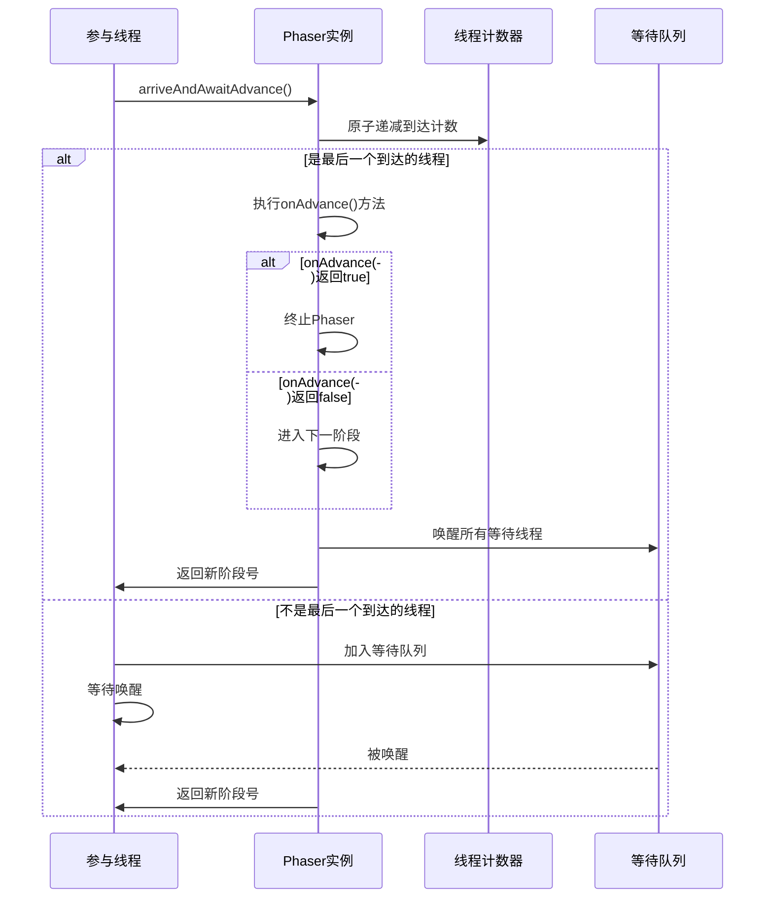

## 1. 线程协作工具概述

在并发编程中，线程协作是指多个线程之间相互配合，共同完成某个任务的过程。Java提供了多种线程协作工具，如CountDownLatch、CyclicBarrier、Phaser等，它们可以帮助开发者更方便地实现复杂的并发控制逻辑。

### 1.1 线程协作工具的分类

根据协作方式和功能特点，Java线程协作工具可以分为以下几类：

| 工具类 | 主要功能 | 核心特性 |
|--------|----------|----------|
| CountDownLatch | 等待一组线程完成 | 一次性使用，计数器递减到0后释放所有等待线程 |
| CyclicBarrier | 等待一组线程到达屏障点 | 可重复使用，计数器递减到0后触发屏障动作，然后重置计数器 |
| Phaser | 阶段式任务协作 | 支持动态调整参与线程数量，支持分阶段执行任务 |
| Semaphore | 控制并发访问数量 | 维护一组许可证，线程需要获取许可证才能执行 |
| Exchanger | 线程间交换数据 | 允许两个线程在指定点交换数据 |

### 1.2 线程协作的核心需求

线程协作的核心需求主要包括：

1. **同步等待**：等待所有线程完成特定阶段
2. **条件触发**：满足特定条件后执行后续操作
3. **动态调整**：支持动态添加或移除参与协作的线程
4. **阶段控制**：支持分阶段执行复杂任务
5. **资源共享**：在协作过程中安全地共享资源

## 2. CyclicBarrier深度解析

CyclicBarrier是一种可重复使用的线程协作工具，它允许一组线程互相等待，直到所有线程都到达某个屏障点，然后一起继续执行。

### 2.1 基本概念与使用方法

#### 核心API

```java
public class CyclicBarrier {
    // 创建CyclicBarrier，指定参与线程数量
    public CyclicBarrier(int parties) { ... }
    
    // 创建CyclicBarrier，指定参与线程数量和屏障动作
    public CyclicBarrier(int parties, Runnable barrierAction) { ... }
    
    // 等待所有线程到达屏障点
    public int await() throws InterruptedException, BrokenBarrierException { ... }
    
    // 等待指定时间，如果超时则抛出TimeoutException
    public int await(long timeout, TimeUnit unit) throws InterruptedException, BrokenBarrierException, TimeoutException { ... }
    
    // 获取参与线程数量
    public int getParties() { ... }
    
    // 获取当前等待的线程数量
    public int getNumberWaiting() { ... }
    
    // 重置CyclicBarrier到初始状态
    public void reset() { ... }
    
    // 判断CyclicBarrier是否已被破坏
    public boolean isBroken() { ... }
}
```

#### 使用示例

```java
public class CyclicBarrierExample {
    public static void main(String[] args) {
        // 创建CyclicBarrier，指定5个线程参与，设置屏障动作
        CyclicBarrier barrier = new CyclicBarrier(5, () -> {
            System.out.println("所有线程都已到达屏障点，开始执行屏障动作");
        });
        
        // 创建并启动5个线程
        for (int i = 0; i < 5; i++) {
            final int threadId = i;
            new Thread(() -> {
                try {
                    System.out.println("线程 " + threadId + " 正在执行任务");
                    Thread.sleep(1000); // 模拟任务执行时间
                    System.out.println("线程 " + threadId + " 已完成任务，等待其他线程");
                    
                    // 等待所有线程到达屏障点
                    barrier.await();
                    
                    System.out.println("线程 " + threadId + " 继续执行后续任务");
                } catch (InterruptedException | BrokenBarrierException e) {
                    e.printStackTrace();
                }
            }).start();
        }
    }
}
```

输出结果：

```plaintext
线程 0 正在执行任务
线程 1 正在执行任务
线程 2 正在执行任务
线程 3 正在执行任务
线程 4 正在执行任务
线程 0 已完成任务，等待其他线程
线程 1 已完成任务，等待其他线程
线程 2 已完成任务，等待其他线程
线程 3 已完成任务，等待其他线程
线程 4 已完成任务，等待其他线程
所有线程都已到达屏障点，开始执行屏障动作
线程 4 继续执行后续任务
线程 0 继续执行后续任务
线程 1 继续执行后续任务
线程 2 继续执行后续任务
线程 3 继续执行后续任务
```

### 2.2 核心实现原理

CyclicBarrier的核心实现基于ReentrantLock和Condition，主要包括以下几个部分：

#### 内部结构

```java
public class CyclicBarrier {
    private final ReentrantLock lock = new ReentrantLock();
    private final Condition trip = lock.newCondition();
    private final int parties; // 参与线程数量
    private final Runnable barrierCommand; // 屏障动作
    private Generation generation = new Generation(); // 当前代
    private int count; // 当前等待线程数量
    
    // 内部类，表示CyclicBarrier的一代
    private static class Generation {
        boolean broken = false;
    }
    
    // 其他方法...
}
```

#### await()方法核心实现

```java
public int await() throws InterruptedException, BrokenBarrierException {
    final ReentrantLock lock = this.lock;
    lock.lock();
    try {
        final Generation g = generation;
        
        // 检查当前屏障是否已被破坏
        if (g.broken) {
            throw new BrokenBarrierException();
        }
        
        // 检查线程是否被中断
        if (Thread.interrupted()) {
            breakBarrier(); // 破坏屏障
            throw new InterruptedException();
        }
        
        int index = --count; // 递减等待线程数量
        
        // 如果当前是最后一个到达的线程
        if (index == 0) {
            boolean ranAction = false;
            try {
                final Runnable command = barrierCommand;
                if (command != null) {
                    command.run(); // 执行屏障动作
                }
                ranAction = true;
                nextGeneration(); // 进入下一代
                return 0;
            } finally {
                if (!ranAction) {
                    breakBarrier(); // 屏障动作执行失败，破坏屏障
                }
            }
        }
        
        // 循环等待，直到所有线程到达或屏障被破坏
        for (;;) {
            try {
                trip.await(); // 等待其他线程
            } catch (InterruptedException ie) {
                if (g == generation && !g.broken) {
                    breakBarrier(); // 破坏屏障
                    throw ie;
                } else {
                    Thread.currentThread().interrupt(); // 重新设置中断状态
                }
            }
            
            // 检查屏障是否已被破坏
            if (g.broken) {
                throw new BrokenBarrierException();
            }
            
            // 检查是否进入了下一代
            if (g != generation) {
                return index;
            }
        }
    } finally {
        lock.unlock();
    }
}
```

#### 下一代生成与屏障重置

```java
private void nextGeneration() {
    trip.signalAll(); // 唤醒所有等待线程
    count = parties; // 重置计数器
    generation = new Generation(); // 创建新一代
}

private void breakBarrier() {
    generation.broken = true; // 标记屏障已被破坏
    count = parties; // 重置计数器
    trip.signalAll(); // 唤醒所有等待线程
}
```

### 2.3 CyclicBarrier的核心特性

1. **可重复使用**：当所有线程到达屏障点后，CyclicBarrier会自动重置，可以继续使用
2. **屏障动作**：当所有线程到达屏障点后，可以执行一个预定义的屏障动作
3. **异常处理**：支持处理线程中断和屏障破坏等异常情况
4. **计数精确**：精确控制参与协作的线程数量
5. **状态跟踪**：可以获取当前等待线程数量和屏障状态

### 2.4 CyclicBarrier与CountDownLatch的对比

| 特性 | CyclicBarrier | CountDownLatch |
|------|---------------|----------------|
| 可重复性 | 可重复使用 | 一次性使用 |
| 计数器方向 | 递减到0后重置 | 递减到0后结束 |
| 线程角色 | 所有线程都是等待者 | 有等待者和计数器递减者 |
| 屏障动作 | 支持 | 不支持 |
| 异常处理 | 支持BrokenBarrierException | 不支持 |
| 适用场景 | 多轮次协作任务 | 一次性等待任务 |

## 3. Phaser深度解析

Phaser是Java 7引入的一种高级线程协作工具，它提供了比CyclicBarrier和CountDownLatch更灵活的功能，支持动态调整参与线程数量和分阶段执行任务。

### 3.1 基本概念与使用方法

#### 核心API

```java
public class Phaser {
    // 创建Phaser，初始参与线程数量为0
    public Phaser() { ... }
    
    // 创建Phaser，指定初始参与线程数量
    public Phaser(int parties) { ... }
    
    // 创建Phaser，指定父Phaser
    public Phaser(Phaser parent) { ... }
    
    // 创建Phaser，指定父Phaser和初始参与线程数量
    public Phaser(Phaser parent, int parties) { ... }
    
    // 注册一个参与线程
    public int register() { ... }
    
    // 批量注册多个参与线程
    public int bulkRegister(int parties) { ... }
    
    // 到达屏障点，等待其他线程
    public int arriveAndAwaitAdvance() throws InterruptedException { ... }
    
    // 到达屏障点，但不等待其他线程
    public int arrive() { ... }
    
    // 到达屏障点，然后注销自己
    public int arriveAndDeregister() { ... }
    
    // 获取当前阶段号
    public int getPhase() { ... }
    
    // 获取当前注册的参与线程数量
    public int getRegisteredParties() { ... }
    
    // 获取当前等待的线程数量
    public int getArrivedParties() { ... }
    
    // 获取当前未到达的线程数量
    public int getUnarrivedParties() { ... }
    
    // 强制终止Phaser
    public void forceTermination() { ... }
    
    // 判断Phaser是否已被终止
    public boolean isTerminated() { ... }
    
    // 等待Phaser到达指定阶段或被终止
    public int awaitAdvance(int phase) throws InterruptedException { ... }
    
    // 等待指定时间
    public int awaitAdvanceInterruptibly(int phase, long timeout, TimeUnit unit) throws InterruptedException, TimeoutException { ... }
    
    // 预定义方法，可重写以实现自定义逻辑
    protected boolean onAdvance(int phase, int registeredParties) { ... }
}
```

#### 使用示例

```java
public class PhaserExample {
    public static void main(String[] args) {
        // 创建Phaser，初始参与线程数量为1（主线程）
        Phaser phaser = new Phaser(1) {
            @Override
            protected boolean onAdvance(int phase, int registeredParties) {
                System.out.println("阶段 " + phase + " 完成，当前参与线程数: " + registeredParties);
                return registeredParties == 0; // 当参与线程数为0时终止
            }
        };
        
        // 创建并启动3个线程
        for (int i = 0; i < 3; i++) {
            final int threadId = i;
            phaser.register(); // 注册参与线程
            new Thread(() -> {
                try {
                    // 第一阶段任务
                    System.out.println("线程 " + threadId + " 执行第一阶段任务");
                    Thread.sleep(1000);
                    phaser.arriveAndAwaitAdvance(); // 到达屏障点，等待其他线程
                    
                    // 第二阶段任务
                    System.out.println("线程 " + threadId + " 执行第二阶段任务");
                    Thread.sleep(1000);
                    phaser.arriveAndAwaitAdvance(); // 到达屏障点，等待其他线程
                    
                    // 第三阶段任务
                    System.out.println("线程 " + threadId + " 执行第三阶段任务");
                    Thread.sleep(1000);
                    phaser.arriveAndDeregister(); // 到达屏障点，然后注销自己
                } catch (InterruptedException e) {
                    e.printStackTrace();
                }
            }).start();
        }
        
        try {
            // 主线程等待所有线程完成第一阶段
            phaser.arriveAndAwaitAdvance();
            
            // 主线程等待所有线程完成第二阶段
            phaser.arriveAndAwaitAdvance();
            
            // 主线程等待所有线程完成第三阶段
            phaser.arriveAndDeregister();
        } catch (InterruptedException e) {
            e.printStackTrace();
        }
        
        System.out.println("所有阶段任务完成，Phaser已终止: " + phaser.isTerminated());
    }
}
```

输出结果：

```
线程 0 执行第一阶段任务
线程 1 执行第一阶段任务
线程 2 执行第一阶段任务
阶段 0 完成，当前参与线程数: 4
线程 1 执行第二阶段任务
线程 0 执行第二阶段任务
线程 2 执行第二阶段任务
阶段 1 完成，当前参与线程数: 4
线程 1 执行第三阶段任务
线程 0 执行第三阶段任务
线程 2 执行第三阶段任务
阶段 2 完成，当前参与线程数: 1
所有阶段任务完成，Phaser已终止: true
```

### 3.2 核心实现原理

Phaser的核心实现基于ForkJoinPool和CAS操作，主要包括以下几个部分：

#### 内部结构

```java
public class Phaser {
    private static final class Registration {
        final Phaser phaser; // 所属Phaser
        final Registration parent; // 父注册
        final int phase; // 注册时的阶段
        final boolean root; // 是否为根注册
        Registration next; // 下一个注册
        // ...
    }
    
    private static final class QNode {
        final Phaser phaser; // 所属Phaser
        final Thread thread; // 等待的线程
        final long deadline; // 超时时间
        volatile QNode next; // 下一个等待节点
        // ...
    }
    
    private volatile PartyCounter partyCounter; // 参与线程计数器
    private volatile int phase; // 当前阶段号
    private volatile QNode head; // 等待队列头节点
    private volatile QNode tail; // 等待队列尾节点
    private final Phaser parent; // 父Phaser
    private Registration root; // 根注册
    // ...
}
```

#### arriveAndAwaitAdvance()方法核心流程



#### 动态调整参与线程数量

Phaser支持通过register()和bulkRegister()方法动态添加参与线程，通过arriveAndDeregister()方法动态移除参与线程。这种动态调整能力使得Phaser非常适合处理动态线程池场景。

### 3.3 Phaser的核心特性

1. **动态线程数量**：支持动态添加或移除参与协作的线程
2. **阶段式执行**：支持分阶段执行复杂任务，每个阶段可以有不同的参与线程
3. **层次结构**：支持创建Phaser树结构，实现更复杂的协作模式
4. **自定义逻辑**：可以重写onAdvance()方法实现自定义的阶段转换逻辑
5. **终止控制**：支持手动或自动终止Phaser
6. **超时支持**：支持等待超时机制

### 3.4 Phaser与CyclicBarrier的对比

| 特性 | Phaser | CyclicBarrier |
|------|--------|---------------|
| 动态线程数量 | 支持 | 不支持 |
| 阶段控制 | 支持多阶段 | 不支持 |
| 层次结构 | 支持 | 不支持 |
| 自定义逻辑 | 支持重写onAdvance() | 仅支持屏障动作 |
| 终止机制 | 支持自动和手动终止 | 不支持 |
| 超时支持 | 支持 | 支持 |
| 性能开销 | 较高 | 较低 |
| 适用场景 | 复杂动态协作任务 | 简单固定线程协作 |

## 4. 最佳实践与常见问题

### 4.1 CyclicBarrier最佳实践

1. **合理设置参与线程数量**
   - 确保参与线程数量与实际需求一致
   - 避免设置过大或过小的参与线程数量

2. **正确处理异常**

   ```java
   try {
       barrier.await();
   } catch (InterruptedException e) {
       // 处理线程中断
       Thread.currentThread().interrupt();
   } catch (BrokenBarrierException e) {
       // 处理屏障被破坏
       log.error("Barrier broken", e);
   }
   ```

3. **谨慎使用reset()方法**
   - reset()方法会破坏当前代的屏障，唤醒所有等待线程
   - 只有在确定需要重置时才使用reset()方法

4. **避免死锁**
   - 确保所有参与线程都能到达屏障点
   - 避免在屏障动作中执行可能阻塞的操作

### 4.2 Phaser最佳实践

1. **合理设计阶段划分**
   - 将复杂任务划分为合理的阶段
   - 每个阶段的任务应该相对独立

2. **有效管理线程注册**

   ```java
   // 注册线程
   phaser.register();
   try {
       // 执行任务
       // ...
   } finally {
       // 注销线程，确保资源释放
       phaser.arriveAndDeregister();
   }
   ```

3. **正确重写onAdvance()方法**

   ```java
   Phaser phaser = new Phaser() {
       @Override
       protected boolean onAdvance(int phase, int registeredParties) {
           System.out.println("Phase " + phase + " completed with " + registeredParties + " parties");
           return registeredParties == 0; // 当没有注册线程时终止
       }
   };
   ```

4. **使用层次结构处理复杂场景**

   ```java
   Phaser rootPhaser = new Phaser();
   Phaser subPhaser1 = new Phaser(rootPhaser);
   Phaser subPhaser2 = new Phaser(rootPhaser);
   ```

### 4.3 常见问题与解决方案

#### 问题1：线程一直等待，无法继续执行

**原因**：

- 参与线程数量设置错误
- 部分线程未能到达屏障点
- 线程在到达屏障点前被中断或抛出异常

**解决方案**：

- 仔细检查参与线程数量
- 确保所有线程都能正常执行到await()或arriveAndAwaitAdvance()方法
- 正确处理线程中断和异常

#### 问题2：Phaser无法终止

**原因**：

- onAdvance()方法返回false
- 还有注册的线程未注销

**解决方案**：

- 确保onAdvance()方法在适当条件下返回true
- 使用arriveAndDeregister()方法正确注销线程
- 必要时使用forceTermination()方法强制终止

#### 问题3：屏障动作执行失败

**原因**：

- 屏障动作中抛出未捕获的异常

**解决方案**：

- 在屏障动作中添加异常处理
- 监控屏障动作的执行状态

## 5. 应用场景案例

### 5.1 CyclicBarrier应用场景

#### 场景1：并行数据处理

```java
public class DataProcessor {
    private final CyclicBarrier barrier;
    private final List<DataChunk> dataChunks;
    private final List<Result> results;
    
    public DataProcessor(List<DataChunk> dataChunks, int threadCount) {
        this.dataChunks = dataChunks;
        this.results = Collections.synchronizedList(new ArrayList<>());
        this.barrier = new CyclicBarrier(threadCount, this::mergeResults);
    }
    
    public void process() {
        ExecutorService executor = Executors.newFixedThreadPool(barrier.getParties());
        
        for (int i = 0; i < barrier.getParties(); i++) {
            final int threadId = i;
            executor.submit(() -> {
                try {
                    // 处理分配的数据块
                    List<Result> partialResults = processDataChunk(threadId);
                    results.addAll(partialResults);
                    
                    // 等待所有线程完成数据处理
                    barrier.await();
                } catch (InterruptedException | BrokenBarrierException e) {
                    e.printStackTrace();
                }
            });
        }
        
        executor.shutdown();
    }
    
    private List<Result> processDataChunk(int threadId) {
        // 模拟数据处理
        List<Result> partialResults = new ArrayList<>();
        int start = threadId * (dataChunks.size() / barrier.getParties());
        int end = (threadId + 1) * (dataChunks.size() / barrier.getParties());
        
        for (int i = start; i < end; i++) {
            DataChunk chunk = dataChunks.get(i);
            Result result = chunk.process();
            partialResults.add(result);
        }
        
        return partialResults;
    }
    
    private void mergeResults() {
        // 合并所有部分结果
        System.out.println("所有线程完成数据处理，开始合并结果");
        System.out.println("合并结果数量: " + results.size());
        // 执行结果合并逻辑
    }
    
    private static class DataChunk {
        private final int id;
        private final String data;
        
        public DataChunk(int id, String data) {
            this.id = id;
            this.data = data;
        }
        
        public Result process() {
            // 模拟数据处理
            try {
                Thread.sleep(100);
            } catch (InterruptedException e) {
                e.printStackTrace();
            }
            return new Result(id, "processed_" + data);
        }
    }
    
    private static class Result {
        private final int chunkId;
        private final String processedData;
        
        public Result(int chunkId, String processedData) {
            this.chunkId = chunkId;
            this.processedData = processedData;
        }
    }
}
```

#### 场景2：多轮次测试

```java
public class MultiRoundTest {
    private final CyclicBarrier barrier;
    private final int rounds;
    private final int threadCount;
    
    public MultiRoundTest(int threadCount, int rounds) {
        this.threadCount = threadCount;
        this.rounds = rounds;
        this.barrier = new CyclicBarrier(threadCount, this::printRoundResult);
    }
    
    public void runTests() {
        ExecutorService executor = Executors.newFixedThreadPool(threadCount);
        
        for (int i = 0; i < threadCount; i++) {
            final int threadId = i;
            executor.submit(() -> {
                try {
                    for (int round = 0; round < rounds; round++) {
                        System.out.println("线程 " + threadId + " 执行第 " + round + " 轮测试");
                        // 执行测试逻辑
                        Thread.sleep(500);
                        
                        // 等待所有线程完成当前轮次
                        barrier.await();
                    }
                } catch (InterruptedException | BrokenBarrierException e) {
                    e.printStackTrace();
                }
            });
        }
        
        executor.shutdown();
    }
    
    private void printRoundResult() {
        System.out.println("================ 一轮测试完成 ================");
    }
}
```

### 5.2 Phaser应用场景

#### 场景1：分阶段任务处理

```java
public class StagedTaskProcessor {
    private final Phaser phaser;
    private final List<Task> tasks;
    private final int threadCount;
    
    public StagedTaskProcessor(List<Task> tasks, int threadCount) {
        this.tasks = tasks;
        this.threadCount = threadCount;
        this.phaser = new Phaser(threadCount) {
            @Override
            protected boolean onAdvance(int phase, int registeredParties) {
                System.out.println("阶段 " + phase + " 完成，当前注册线程数: " + registeredParties);
                return registeredParties == 0; // 当没有注册线程时终止
            }
        };
    }
    
    public void process() {
        ExecutorService executor = Executors.newFixedThreadPool(threadCount);
        
        for (int i = 0; i < threadCount; i++) {
            final int threadId = i;
            executor.submit(() -> {
                try {
                    // 阶段1：数据准备
                    System.out.println("线程 " + threadId + " 执行数据准备阶段");
                    prepareData(threadId);
                    phaser.arriveAndAwaitAdvance();
                    
                    // 阶段2：数据处理
                    System.out.println("线程 " + threadId + " 执行数据处理阶段");
                    processData(threadId);
                    phaser.arriveAndAwaitAdvance();
                    
                    // 阶段3：结果生成
                    System.out.println("线程 " + threadId + " 执行结果生成阶段");
                    generateResults(threadId);
                    phaser.arriveAndDeregister();
                } catch (InterruptedException e) {
                    e.printStackTrace();
                }
            });
        }
        
        executor.shutdown();
    }
    
    private void prepareData(int threadId) {
        // 模拟数据准备
        try {
            Thread.sleep(800);
        } catch (InterruptedException e) {
            e.printStackTrace();
        }
    }
    
    private void processData(int threadId) {
        // 模拟数据处理
        try {
            Thread.sleep(1200);
        } catch (InterruptedException e) {
            e.printStackTrace();
        }
    }
    
    private void generateResults(int threadId) {
        // 模拟结果生成
        try {
            Thread.sleep(600);
        } catch (InterruptedException e) {
            e.printStackTrace();
        }
    }
    
    private static class Task {
        private final int id;
        private final String data;
        
        public Task(int id, String data) {
            this.id = id;
            this.data = data;
        }
    }
}
```

#### 场景2：动态线程协作

```java
public class DynamicThreadCoordinator {
    private final Phaser phaser;
    private final int initialThreads;
    private final int maxThreads;
    
    public DynamicThreadCoordinator(int initialThreads, int maxThreads) {
        this.initialThreads = initialThreads;
        this.maxThreads = maxThreads;
        this.phaser = new Phaser(initialThreads);
    }
    
    public void run() {
        ExecutorService executor = Executors.newCachedThreadPool();
        
        // 初始线程
        for (int i = 0; i < initialThreads; i++) {
            final int threadId = i;
            executor.submit(() -> {
                try {
                    for (int phase = 0; phase < 3; phase++) {
                        System.out.println("线程 " + threadId + " 执行阶段 " + phase);
                        Thread.sleep(500);
                        
                        if (phase == 0 && phaser.getRegisteredParties() < maxThreads) {
                            // 在第一阶段后动态添加线程
                            int newThreadId = phaser.getRegisteredParties();
                            System.out.println("动态添加线程 " + newThreadId);
                            phaser.register();
                            
                            executor.submit(() -> {
                                try {
                                    for (int newPhase = phase; newPhase < 3; newPhase++) {
                                        System.out.println("动态线程 " + newThreadId + " 执行阶段 " + newPhase);
                                        Thread.sleep(500);
                                        
                                        if (newPhase == 2) {
                                            phaser.arriveAndDeregister();
                                        } else {
                                            phaser.arriveAndAwaitAdvance();
                                        }
                                    }
                                } catch (InterruptedException e) {
                                    e.printStackTrace();
                                }
                            });
                        }
                        
                        if (phase == 2) {
                            phaser.arriveAndDeregister();
                        } else {
                            phaser.arriveAndAwaitAdvance();
                        }
                    }
                } catch (InterruptedException e) {
                    e.printStackTrace();
                }
            });
        }
        
        executor.shutdown();
        
        // 等待所有线程完成
        while (!phaser.isTerminated()) {
            phaser.awaitAdvance(phaser.getPhase());
        }
        
        System.out.println("所有线程协作完成");
    }
}
```

## 6. 总结

CyclicBarrier和Phaser是Java并发包中提供的两种强大的线程协作工具，它们各自具有独特的特性和适用场景：

### 6.1 核心功能对比

| 工具类 | 核心功能 | 最佳适用场景 |
|--------|----------|--------------|
| CyclicBarrier | 固定线程数的重复协作 | 多轮次固定线程数的任务协作 |
| Phaser | 动态线程数的阶段式协作 | 复杂的动态线程数和多阶段任务 |

### 6.2 选择建议

1. **选择CyclicBarrier的场景**：
   - 线程数量固定且已知
   - 需要重复使用的屏障机制
   - 简单的线程协作需求
   - 性能要求较高

2. **选择Phaser的场景**：
   - 线程数量动态变化
   - 需要分阶段执行复杂任务
   - 需要层次化的协作结构
   - 自定义阶段转换逻辑

### 6.3 关键技术要点

1. **同步机制**：两者都基于显式锁和条件变量实现同步
2. **异常处理**：正确处理中断和屏障破坏等异常
3. **资源管理**：合理设置参与线程数量，避免资源浪费
4. **性能考虑**：根据实际需求选择合适的协作工具，避免过度设计
5. **扩展性**：Phaser提供了更好的扩展性，支持动态调整和层次结构

### 6.4 未来发展

随着Java并发编程的不断发展，线程协作工具也在不断演进。Java 9引入了更加强大的并发工具，如CompletableFuture的增强和Flow API等。但CyclicBarrier和Phaser作为经典的线程协作工具，仍然是Java并发编程中不可或缺的重要组成部分。

在实际应用中，选择合适的线程协作工具需要综合考虑任务需求、线程数量、性能要求和扩展性等因素。通过合理使用CyclicBarrier和Phaser，可以更加高效地实现复杂的并发控制逻辑，提高应用程序的性能和可维护性。
