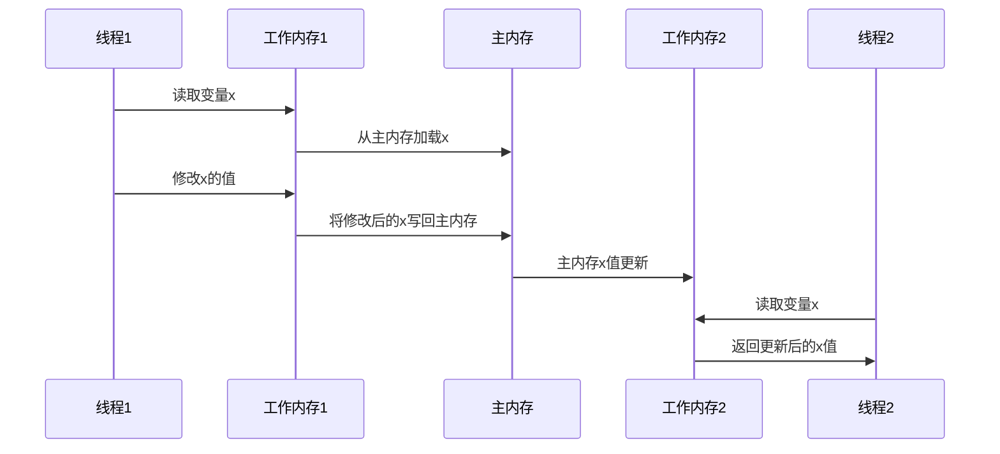

## 一、JMM概述

### 1.1 什么是Java内存模型

Java内存模型（Java Memory Model, JMM）是Java虚拟机规范中定义的一种抽象的内存模型，用于规范多线程程序中变量的访问行为。JMM的主要目的是解决由于多线程环境下的缓存一致性、指令重排序等问题导致的内存可见性问题，确保程序在不同的硬件平台上都能表现出一致的内存访问行为。

### 1.2 JMM的设计目标

JMM的设计目标主要有两个：

1. **屏蔽硬件差异**：不同的硬件平台有不同的内存模型，JMM通过抽象的内存模型，为Java程序员提供了统一的内存访问语义，屏蔽了底层硬件的差异。

2. **确保内存可见性**：在多线程环境下，当一个线程修改了共享变量的值，其他线程能够立即看到这个修改后的值，避免出现内存可见性问题。

### 1.3 JMM的内存结构

JMM将内存划分为两个主要区域：

1. **主内存（Main Memory）**：所有线程共享的内存区域，包含了所有的共享变量。

2. **工作内存（Working Memory）**：每个线程私有的内存区域，包含了该线程使用到的共享变量的副本。

线程对共享变量的操作必须在工作内存中进行，不能直接访问主内存。线程之间的通信通过主内存来完成。



## 二、内存屏障

### 2.1 什么是内存屏障

内存屏障（Memory Barrier）是一种CPU指令，用于控制内存操作的顺序和可见性。内存屏障可以防止指令重排序，并确保内存操作的结果能够被其他线程立即看到。

### 2.2 内存屏障的类型

JMM定义了四种类型的内存屏障：

1. **LoadLoad屏障**：确保在该屏障之前的所有读操作都已经完成，然后才执行该屏障之后的读操作。

2. **StoreStore屏障**：确保在该屏障之前的所有写操作都已经完成，然后才执行该屏障之后的写操作。

3. **LoadStore屏障**：确保在该屏障之前的所有读操作都已经完成，然后才执行该屏障之后的写操作。

4. **StoreLoad屏障**：确保在该屏障之前的所有写操作都已经完成，然后才执行该屏障之后的读操作。这是最强大的内存屏障，会导致缓存刷新和失效。

### 2.3 内存屏障的实现

不同的硬件平台有不同的内存屏障指令。JMM会根据不同的硬件平台，将Java代码中的内存屏障指令翻译为对应的硬件内存屏障指令。

例如，在x86架构上：

- LoadLoad屏障和LoadStore屏障由硬件自动保证
- StoreStore屏障通过`sfence`指令实现
- StoreLoad屏障通过`mfence`或`lock`前缀指令实现

## 三、指令重排序

### 3.1 什么是指令重排序

指令重排序是指编译器或处理器为了提高程序性能，对指令的执行顺序进行重新排序的优化技术。指令重排序可以分为三种类型：

1. **编译器重排序**：编译器在不改变程序语义的前提下，调整指令的执行顺序。

2. **处理器重排序**：处理器在不影响程序结果的情况下，调整指令的执行顺序。

3. **内存系统重排序**：由于内存系统的缓存和缓冲区，导致指令的执行结果看起来像是被重排序了。

### 3.2 指令重排序的影响

指令重排序可能会导致多线程程序出现内存可见性问题。例如，在单线程环境下，下面的代码：

```java
int a = 0;
boolean flag = false;

a = 1;        // 操作1
flag = true;  // 操作2
```

在单线程环境下，操作1总是在操作2之前执行，程序的结果是确定的。但是在多线程环境下，由于指令重排序，操作2可能会在操作1之前执行，导致其他线程看到flag为true时，a的值仍然是0。

### 3.3 禁止指令重排序

JMM通过volatile关键字和synchronized关键字来禁止指令重排序，确保程序的内存可见性。

## 四、happens-before原则

### 4.1 什么是happens-before原则

happens-before原则是JMM中定义的一套规则，用于确定一个操作的结果是否对另一个操作可见。如果操作A happens-before操作B，那么操作A的结果对操作B可见，并且操作A的执行顺序在操作B之前。

### 4.2 happens-before原则的具体规则

JMM定义了以下8条happens-before规则：

1. **程序顺序规则**：在同一个线程中，按照程序的顺序，前面的操作happens-before后面的操作。

2. **监视器锁规则**：一个线程释放锁的操作happens-before另一个线程获取同一个锁的操作。

3. **volatile变量规则**：对一个volatile变量的写操作happens-before后续对同一个volatile变量的读操作。

4. **线程启动规则**：调用Thread.start()方法happens-before线程中的任何操作。

5. **线程终止规则**：线程中的任何操作happens-before其他线程检测到该线程已经终止（通过Thread.join()或Thread.isAlive()）。

6. **线程中断规则**：对线程interrupt()方法的调用happens-before被中断线程检测到中断事件（通过Thread.interrupted()或Thread.isInterrupted()）。

7. **对象终结规则**：一个对象的构造函数执行完成happens-before该对象的finalize()方法执行。

8. **传递性规则**：如果操作A happens-before操作B，操作B happens-before操作C，那么操作A happens-before操作C。

### 4.3 happens-before原则的应用

happens-before原则是判断程序是否存在内存可见性问题的重要依据。在多线程程序中，只要满足happens-before规则，就可以确保操作的结果对其他线程可见。

## 五、volatile的内存语义

### 5.1 volatile变量的特性

volatile是Java中用于修饰共享变量的关键字，具有以下两个特性：

1. **内存可见性**：当一个线程修改了volatile变量的值，其他线程能够立即看到这个修改后的值。

2. **禁止指令重排序**：volatile变量的读写操作不会被重排序，确保程序的执行顺序与预期一致。

### 5.2 volatile的内存语义

volatile变量的写操作具有以下内存语义：

1. **可见性**：写操作会立即刷新到主内存。

2. **禁止重排序**：写操作之前的所有操作都不会被重排序到写操作之后。

volatile变量的读操作具有以下内存语义：

1. **可见性**：读操作会从主内存读取最新的值。

2. **禁止重排序**：读操作之后的所有操作都不会被重排序到读操作之前。

### 5.3 volatile的实现原理

volatile变量的内存语义是通过内存屏障来实现的：

1. **写操作**：在volatile变量的写操作之后插入StoreStore屏障和StoreLoad屏障。

2. **读操作**：在volatile变量的读操作之前插入LoadLoad屏障和LoadStore屏障。

这些内存屏障确保了volatile变量的读写操作不会被重排序，并且写操作的结果能够立即被其他线程看到。

### 5.4 volatile的使用场景

volatile主要用于以下场景：

1. **状态标志**：用于表示某个线程的状态，例如是否终止、是否完成等。

2. **双重检查锁定**：在单例模式的双重检查锁定实现中，用于确保实例的可见性。

3. **独立变量的原子操作**：当共享变量的操作是独立的原子操作时，可以使用volatile来确保可见性。

## 六、final的内存语义

### 6.1 final变量的特性

final是Java中用于修饰常量的关键字，具有以下特性：

1. **不可变性**：final变量一旦初始化完成，就不能被修改。

2. **内存可见性**：当final变量初始化完成后，其他线程能够立即看到final变量的值。

### 6.2 final的内存语义

final变量的写操作具有以下内存语义：

1. **可见性**：final变量初始化完成后，其他线程能够立即看到final变量的值。

2. **禁止重排序**：final变量的初始化操作不会被重排序到构造函数之外。

final变量的读操作具有以下内存语义：

1. **可见性**：读操作会从主内存读取最新的值。

### 6.3 final的实现原理

final变量的内存语义是通过内存屏障来实现的：

1. **写操作**：在final变量的初始化完成后，插入StoreStore屏障，确保final变量的初始化操作不会被重排序到构造函数之外。

2. **读操作**：在final变量的读操作之前，插入LoadLoad屏障，确保final变量的读操作不会被重排序到构造函数调用之前。

### 6.4 final的使用注意事项

在使用final变量时，需要注意以下几点：

1. **避免逸出**：不要在构造函数中将this引用逸出，否则其他线程可能会看到未初始化完成的final变量。

2. **复合对象**：如果final变量是复合对象，那么final关键字只保证引用的不可变性，不保证对象内部状态的不可变性。

## 七、JMM与硬件内存模型的关系

### 7.1 硬件内存模型

现代计算机系统的硬件内存模型通常包括以下几个层次：

1. **寄存器**：CPU内部的高速缓存，访问速度最快。

2. **L1缓存**：CPU核心内部的缓存，访问速度较快。

3. **L2缓存**：CPU核心之间共享的缓存，访问速度较慢。

4. **L3缓存**：所有CPU核心共享的缓存，访问速度更慢。

5. **主内存**：所有CPU共享的内存，访问速度最慢。

不同的硬件平台有不同的内存模型，例如x86架构的内存模型比较强，而ARM架构的内存模型比较弱。

### 7.2 JMM与硬件内存模型的映射

JMM通过内存屏障等机制，将Java代码中的内存访问操作映射到底层硬件的内存访问操作，确保程序在不同的硬件平台上都能表现出一致的内存访问行为。

### 7.3 内存一致性模型

内存一致性模型是指多线程程序中内存访问操作的可见性和顺序性的约束。常见的内存一致性模型包括：

1. **强一致性模型**：所有线程看到的内存操作顺序都是一致的，就像所有的内存操作都在一个全局的内存总线上执行一样。

2. **弱一致性模型**：线程看到的内存操作顺序可能不一致，需要通过同步机制来确保一致性。

3. **释放-获取一致性模型**：通过释放操作和获取操作来建立happens-before关系，确保内存可见性。

JMM采用的是释放-获取一致性模型，通过synchronized和volatile等同步机制来确保内存可见性。

## 八、总结

Java内存模型（JMM）是Java虚拟机规范中定义的一种抽象的内存模型，用于规范多线程程序中变量的访问行为。JMM通过内存屏障、指令重排序、happens-before原则等机制，确保程序在不同的硬件平台上都能表现出一致的内存访问行为。

理解JMM对于编写正确的多线程程序至关重要。在实际开发中，我们应该正确使用volatile、synchronized等同步机制，确保程序的内存可见性和线程安全。

## 九、参考资料

1. 《Java并发编程的艺术》
2. 《深入理解Java虚拟机》
3. Java虚拟机规范
4. JSR-133: Java Memory Model and Thread Specification
