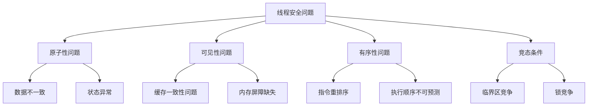

## 线程安全概述

线程安全是并发编程中的核心概念，指的是当多个线程同时访问共享资源时，程序能够保持其正确性和一致性。在多线程环境下，不恰当的资源访问可能导致数据竞争、原子性问题、可见性问题和有序性问题等并发安全隐患。

### 线程安全的核心问题



## 原子性与原子操作

原子性是指一个操作或多个操作要么全部执行完成，要么完全不执行，不存在中间状态。在Java中，提供了多种机制来保证原子性：

### 1. 基本数据类型的原子性

```java
// 基本类型的赋值操作是原子的
int a = 10;  // 原子操作
long b = 20L;  // 64位类型在64位JVM上也是原子的
```

### 2. 使用synchronized关键字

```java
public class AtomicCounter {
    private int count = 0;
    
    public synchronized void increment() {
        count++;  // 原子操作
    }
    
    public synchronized int getCount() {
        return count;  // 原子操作
    }
}
```

### 3. 使用Lock接口

```java
public class LockCounter {
    private int count = 0;
    private final Lock lock = new ReentrantLock();
    
    public void increment() {
        lock.lock();
        try {
            count++;
        } finally {
            lock.unlock();
        }
    }
}
```

### 4. 使用Atomic类

```java
public class AtomicClassCounter {
    private final AtomicInteger count = new AtomicInteger(0);
    
    public void increment() {
        count.incrementAndGet();  // 原子操作
    }
    
    public int getCount() {
        return count.get();  // 原子操作
    }
}
```

## 可见性与内存屏障

可见性是指当一个线程修改了共享变量的值，其他线程能够立即看到这个修改。在多核心CPU环境下，每个核心都有自己的缓存，可能导致缓存不一致问题。

### 1. 使用volatile关键字

```java
public class VisibilityExample {
    private volatile boolean flag = false;
    
    public void setFlag() {
        flag = true;  // 修改对其他线程可见
    }
    
    public void checkFlag() {
        while (!flag) {
            // 循环直到flag变为true
        }
        System.out.println("Flag is now true!");
    }
}
```

### 2. 使用synchronized或Lock

```java
public class SyncVisibilityExample {
    private boolean flag = false;
    
    public synchronized void setFlag() {
        flag = true;  // 写入锁释放时会刷新缓存
    }
    
    public synchronized boolean getFlag() {
        return flag;  // 读取锁获取时会刷新缓存
    }
}
```

## 有序性与指令重排序

有序性是指程序执行的顺序按照代码的先后顺序执行。编译器和CPU为了优化性能，可能会对指令进行重排序。

### 1. 使用volatile防止重排序

```java
public class Singleton {
    private static volatile Singleton instance;
    
    private Singleton() {}
    
    public static Singleton getInstance() {
        if (instance == null) {
            synchronized (Singleton.class) {
                if (instance == null) {
                    instance = new Singleton();  // volatile防止指令重排序
                }
            }
        }
        return instance;
    }
}
```

### 2. 使用final关键字

```java
public class FinalExample {
    private final int value;
    private static FinalExample instance;
    
    public FinalExample(int value) {
        this.value = value;  // final字段保证构造完成后对其他线程可见
    }
    
    public static void init() {
        instance = new FinalExample(42);
    }
}
```

## 线程安全的实现策略

### 1. 不可变对象

```java
public final class ImmutablePerson {
    private final String name;
    private final int age;
    
    public ImmutablePerson(String name, int age) {
        this.name = name;
        this.age = age;
    }
    
    public String getName() {
        return name;
    }
    
    public int getAge() {
        return age;
    }
    
    // 不提供setter方法
}
```

### 2. 线程封闭

```java
public class ThreadLocalExample {
    private static final ThreadLocal<Integer> threadLocal = ThreadLocal.withInitial(() -> 0);
    
    public void increment() {
        threadLocal.set(threadLocal.get() + 1);
    }
    
    public int getValue() {
        return threadLocal.get();
    }
}
```

### 3. 无锁编程

```java
public class LockFreeCounter {
    private final AtomicInteger count = new AtomicInteger(0);
    
    public void increment() {
        int current;
        int next;
        do {
            current = count.get();
            next = current + 1;
        } while (!count.compareAndSet(current, next));
    }
    
    public int getCount() {
        return count.get();
    }
}
```

## 常见线程安全问题与解决方案

### 1. 死锁

**问题描述：** 两个或多个线程互相等待对方释放资源，导致程序永远阻塞。

**解决方案：**

```java
// 1. 避免嵌套锁
// 2. 固定锁获取顺序
public class DeadlockAvoidance {
    private static final Object lock1 = new Object();
    private static final Object lock2 = new Object();
    
    public void method1() {
        synchronized (lock1) {
            synchronized (lock2) {
                // 业务逻辑
            }
        }
    }
    
    public void method2() {
        synchronized (lock1) {  // 保持相同的锁顺序
            synchronized (lock2) {
                // 业务逻辑
            }
        }
    }
}
```

### 2. 活锁

**问题描述：** 线程不断尝试获取资源，但总是失败，导致程序无法继续执行。

**解决方案：**

```java
public class LivelockAvoidance {
    private volatile boolean isReady = false;
    
    public void process() {
        while (!isReady) {
            // 做一些工作
            try {
                Thread.sleep(100);  // 随机延迟避免活锁
            } catch (InterruptedException e) {
                Thread.currentThread().interrupt();
            }
        }
    }
}
```

### 3. 饥饿

**问题描述：** 线程长期无法获得资源，导致程序无法正常执行。

**解决方案：**

```java
// 使用公平锁避免饥饿
public class StarvationAvoidance {
    private final Lock fairLock = new ReentrantLock(true);  // 公平锁
    
    public void process() {
        fairLock.lock();
        try {
            // 业务逻辑
        } finally {
            fairLock.unlock();
        }
    }
}
```

## 线程安全的最佳实践

### 1. 优先使用并发集合

```java
// 使用ConcurrentHashMap替代HashMap
Map<String, String> concurrentMap = new ConcurrentHashMap<>();

// 使用CopyOnWriteArrayList替代ArrayList
List<String> concurrentList = new CopyOnWriteArrayList<>();

// 使用BlockingQueue实现线程安全的队列
BlockingQueue<String> queue = new LinkedBlockingQueue<>();
```

### 2. 最小化锁的范围

```java
public class FineGrainedLocking {
    private final Object lock1 = new Object();
    private final Object lock2 = new Object();
    
    private int count1 = 0;
    private int count2 = 0;
    
    public void increment1() {
        synchronized (lock1) {
            count1++;
        }
    }
    
    public void increment2() {
        synchronized (lock2) {
            count2++;
        }
    }
}
```

### 3. 避免不必要的同步

```java
public class EfficientSynchronization {
    private volatile int sharedValue;
    private final Object lock = new Object();
    
    // 只读操作不需要同步
    public int getSharedValue() {
        return sharedValue;
    }
    
    // 写入操作需要同步
    public void updateSharedValue(int newValue) {
        synchronized (lock) {
            sharedValue = newValue;
            // 其他需要同步的操作
        }
    }
}
```

### 4. 使用线程安全的工具类

```java
// 使用CountDownLatch协调线程
CountDownLatch latch = new CountDownLatch(3);

// 使用Semaphore控制并发数
Semaphore semaphore = new Semaphore(5);

// 使用CyclicBarrier实现线程同步
CyclicBarrier barrier = new CyclicBarrier(3);
```

### 5. 正确使用ThreadLocal

```java
public class ThreadLocalBestPractice {
    private static final ThreadLocal<SimpleDateFormat> dateFormat = 
        ThreadLocal.withInitial(() -> new SimpleDateFormat("yyyy-MM-dd"));
    
    public String formatDate(Date date) {
        return dateFormat.get().format(date);
    }
    
    // 使用后清理ThreadLocal资源
    public void cleanup() {
        dateFormat.remove();
    }
}
```

## 性能优化与权衡

### 1. 选择合适的同步机制

| 同步机制 | 优势 | 劣势 | 适用场景 |
|---------|------|------|---------|
| synchronized | 简单易用，JVM自动管理 | 性能开销较大，无法中断 | 简单并发场景 |
| Lock接口 | 可中断，可超时，公平锁 | 需要手动释放 | 复杂并发场景 |
| Atomic类 | 无锁，高性能 | 功能有限 | 简单原子操作 |
| ThreadLocal | 无竞争，高性能 | 内存占用大 | 线程私有数据 |

### 2. 避免过度同步

```java
// 错误做法：同步整个方法
public synchronized void process() {
    // 耗时的I/O操作
    // 不需要同步的计算操作
    // 需要同步的共享资源访问
}

// 正确做法：只同步临界区
public void process() {
    // 耗时的I/O操作
    // 不需要同步的计算操作
    
    synchronized (this) {
        // 需要同步的共享资源访问
    }
}
```

### 3. 使用读写锁提高并发性能

```java
public class ReadWriteLockExample {
    private final ReadWriteLock rwLock = new ReentrantReadWriteLock();
    private final Lock readLock = rwLock.readLock();
    private final Lock writeLock = rwLock.writeLock();
    
    private Map<String, String> cache = new HashMap<>();
    
    public String get(String key) {
        readLock.lock();
        try {
            return cache.get(key);
        } finally {
            readLock.unlock();
        }
    }
    
    public void put(String key, String value) {
        writeLock.lock();
        try {
            cache.put(key, value);
        } finally {
            writeLock.unlock();
        }
    }
}
```

## 总结

线程安全是Java并发编程中的核心概念，理解和掌握线程安全技术对于开发高性能、高可靠性的并发应用至关重要。本文介绍了线程安全的核心问题、实现机制和最佳实践，包括：

1. **原子性**：使用synchronized、Lock和Atomic类保证操作的原子性
2. **可见性**：使用volatile和同步机制保证共享变量的可见性
3. **有序性**：使用volatile和final关键字防止指令重排序
4. **线程安全策略**：不可变对象、线程封闭、无锁编程
5. **常见问题与解决方案**：死锁、活锁、饥饿的避免方法
6. **最佳实践**：使用并发集合、最小化锁范围、避免不必要的同步
7. **性能优化**：选择合适的同步机制、使用读写锁、避免过度同步

通过合理应用这些技术和最佳实践，开发者可以构建高效、安全的并发应用程序，避免常见的并发安全问题。
