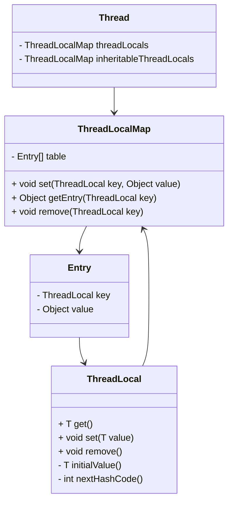
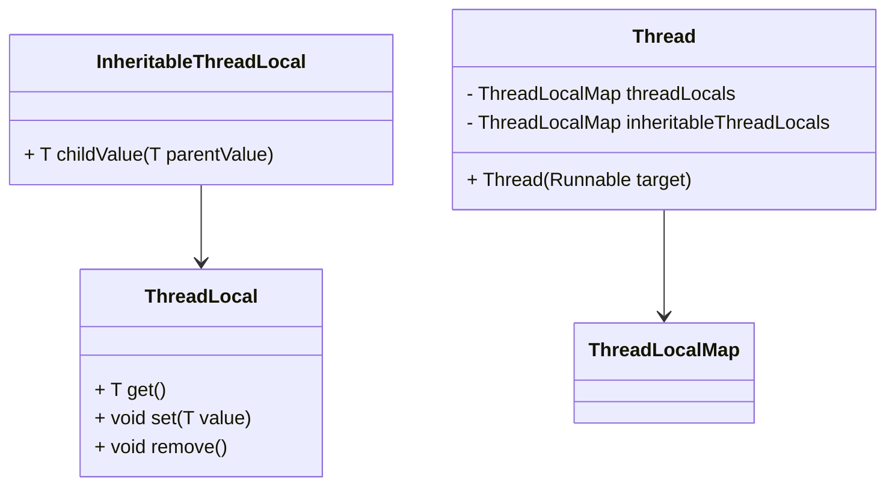
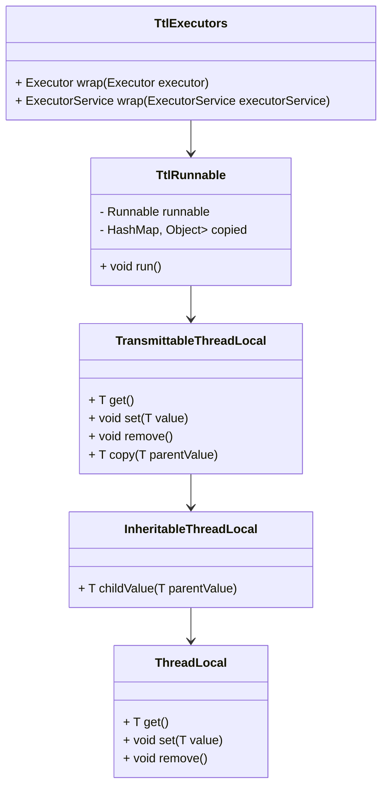

## 简介

在Java多线程编程中，线程本地变量是一种重要的机制，它允许每个线程拥有自己独立的变量副本，避免了线程安全问题。Java提供了`ThreadLocal`类来实现这一机制，但在某些场景下，我们需要将线程本地变量传递给子线程或线程池中的线程，这时候就需要用到`InheritableThreadLocal`和`TransmittableThreadLocal`。

本文将深入分析这三种线程本地变量机制的原理、实现和应用场景，帮助读者理解它们的区别和适用范围。

## ThreadLocal原理与实现

### ThreadLocal简介

`ThreadLocal`是Java提供的一个线程本地变量工具类，它允许每个线程拥有自己独立的变量副本，从而避免了线程安全问题。`ThreadLocal`的主要特点是：

1. 线程隔离：每个线程拥有自己的变量副本
2. 隐式传递：无需显式在方法间传递参数
3. 简化代码：减少了方法参数的数量

### ThreadLocal架构原理

`ThreadLocal`的实现基于以下架构：



从架构图可以看出：

1. 每个`Thread`对象都包含一个`ThreadLocalMap`实例，用于存储该线程的所有线程本地变量
2. `ThreadLocalMap`是`ThreadLocal`的内部类，它使用数组来存储键值对
3. `Entry`是`ThreadLocalMap`的内部类，它的键是`ThreadLocal`对象，值是线程本地变量的值
4. `Entry`继承自`WeakReference`，使用弱引用存储键，避免内存泄漏

### ThreadLocal源码分析

#### ThreadLocal的get方法

```java
public T get() {
    Thread t = Thread.currentThread();
    ThreadLocalMap map = getMap(t);
    if (map != null) {
        ThreadLocalMap.Entry e = map.getEntry(this);
        if (e != null) {
            @SuppressWarnings("unchecked")
            T result = (T)e.value;
            return result;
        }
    }
    return setInitialValue();
}
```

`get`方法的执行流程：

1. 获取当前线程
2. 获取当前线程的`ThreadLocalMap`
3. 如果`ThreadLocalMap`不为null，则尝试获取当前`ThreadLocal`对应的`Entry`
4. 如果`Entry`不为null，则返回`Entry`的值
5. 如果`ThreadLocalMap`为null或`Entry`为null，则调用`setInitialValue`方法设置初始值

#### ThreadLocal的set方法

```java
public void set(T value) {
    Thread t = Thread.currentThread();
    ThreadLocalMap map = getMap(t);
    if (map != null) {
        map.set(this, value);
    } else {
        createMap(t, value);
    }
}
```

`set`方法的执行流程：

1. 获取当前线程
2. 获取当前线程的`ThreadLocalMap`
3. 如果`ThreadLocalMap`不为null，则将当前`ThreadLocal`和值存储到`ThreadLocalMap`中
4. 如果`ThreadLocalMap`为null，则调用`createMap`方法创建`ThreadLocalMap`并存储值

#### ThreadLocalMap的set方法

```java
private void set(ThreadLocal<?> key, Object value) {
    Entry[] tab = table;
    int len = tab.length;
    int i = key.threadLocalHashCode & (len-1);

    for (Entry e = tab[i]; e != null; e = tab[i = nextIndex(i, len)]) {
        ThreadLocal<?> k = e.get();

        if (k == key) {
            e.value = value;
            return;
        }

        if (k == null) {
            replaceStaleEntry(key, value, i);
            return;
        }
    }

    tab[i] = new Entry(key, value);
    int sz = ++size;
    if (!cleanSomeSlots(i, sz) && sz >= threshold) {
        rehash();
    }
}
```

`ThreadLocalMap`的`set`方法使用开放地址法解决哈希冲突：

1. 计算`ThreadLocal`的哈希值对应的数组索引
2. 如果该索引位置的`Entry`不为null且键相同，则更新值
3. 如果该索引位置的`Entry`不为null但键为null（弱引用被回收），则替换过期条目
4. 如果该索引位置的`Entry`为null，则创建新的`Entry`
5. 清理过期条目并检查是否需要扩容

## InheritableThreadLocal原理与实现

### InheritableThreadLocal简介

`InheritableThreadLocal`是`ThreadLocal`的子类，它允许子线程继承父线程的线程本地变量。`InheritableThreadLocal`的主要特点是：

1. 子线程继承父线程的线程本地变量
2. 只在子线程创建时继承一次
3. 父线程后续修改线程本地变量不会影响子线程

### InheritableThreadLocal架构原理



从架构图可以看出：

1. `InheritableThreadLocal`继承自`ThreadLocal`
2. `Thread`类不仅包含`threadLocals`字段，还包含`inheritableThreadLocals`字段
3. 当创建子线程时，会将父线程的`inheritableThreadLocals`复制到子线程

### InheritableThreadLocal源码分析

#### InheritableThreadLocal的实现

```java
public class InheritableThreadLocal<T> extends ThreadLocal<T> {
    protected T childValue(T parentValue) {
        return parentValue;
    }

    ThreadLocalMap getMap(Thread t) {
       return t.inheritableThreadLocals;
    }

    void createMap(Thread t, T firstValue) {
        t.inheritableThreadLocals = new ThreadLocalMap(this, firstValue);
    }
}
```

`InheritableThreadLocal`的实现非常简单：

1. 重写了`childValue`方法，用于在子线程创建时复制父线程的值
2. 重写了`getMap`方法，返回线程的`inheritableThreadLocals`字段
3. 重写了`createMap`方法，创建`ThreadLocalMap`并赋值给线程的`inheritableThreadLocals`字段

#### 子线程创建时的继承过程

```java
private void init(ThreadGroup g, Runnable target, String name, long stackSize, AccessControlContext acc, boolean inheritThreadLocals) {
    // ...
    if (inheritThreadLocals && parent.inheritableThreadLocals != null) {
        this.inheritableThreadLocals = ThreadLocal.createInheritedMap(parent.inheritableThreadLocals);
    }
    // ...
}
```

在`Thread`类的`init`方法中，当`inheritThreadLocals`为true且父线程的`inheritableThreadLocals`不为null时，会调用`ThreadLocal.createInheritedMap`方法复制父线程的`inheritableThreadLocals`到子线程。

#### createInheritedMap方法

```java
static ThreadLocalMap createInheritedMap(ThreadLocalMap parentMap) {
    return new ThreadLocalMap(parentMap);
}
```

```java
private ThreadLocalMap(ThreadLocalMap parentMap) {
    Entry[] parentTable = parentMap.table;
    int len = parentTable.length;
    setThreshold(len);
    table = new Entry[len];

    for (int j = 0; j < len; j++) {
        Entry e = parentTable[j];
        if (e != null) {
            @SuppressWarnings("unchecked")
            ThreadLocal<Object> key = (ThreadLocal<Object>) e.get();
            if (key != null) {
                Object value = key.childValue(e.value);
                Entry c = new Entry(key, value);
                int h = key.threadLocalHashCode & (len - 1);
                while (table[h] != null) {
                    h = nextIndex(h, len);
                }
                table[h] = c;
                size++;
            }
        }
    }
}
```

`createInheritedMap`方法创建一个新的`ThreadLocalMap`，并复制父线程`ThreadLocalMap`中的所有非null条目到新的`ThreadLocalMap`中。

### InheritableThreadLocal的局限性

`InheritableThreadLocal`虽然解决了线程本地变量从父线程传递到子线程的问题，但它存在以下局限性：

1. 只在子线程创建时继承一次，父线程后续修改线程本地变量不会影响子线程
2. 不支持线程池场景，因为线程池中的线程是预先创建的，不会在每次任务执行时重新创建
3. 可能导致内存泄漏，与`ThreadLocal`类似

## TransmittableThreadLocal原理与实现

### TransmittableThreadLocal简介

`TransmittableThreadLocal`是阿里巴巴开源的一个Java库，它扩展了`InheritableThreadLocal`，解决了线程池场景下线程本地变量传递的问题。`TransmittableThreadLocal`的主要特点是：

1. 支持线程池场景下线程本地变量的传递
2. 支持父线程修改线程本地变量后，子线程也能获取到最新值
3. 提供了灵活的配置选项

### TransmittableThreadLocal架构原理



从架构图可以看出：

1. `TransmittableThreadLocal`继承自`InheritableThreadLocal`
2. `TtlRunnable`包装了原始的`Runnable`，并在运行前复制线程本地变量
3. `TtlExecutors`提供了包装线程池的方法，自动将任务包装为`TtlRunnable`

### TransmittableThreadLocal源码分析

#### TransmittableThreadLocal的实现

```java
public class TransmittableThreadLocal<T> extends InheritableThreadLocal<T> {
    public T copy(T parentValue) {
        return parentValue;
    }

    @Override
    public final void set(T value) {
        super.set(value);
        if (null == value) {
            removeValue();
        } else {
            addValue();
        }
    }

    @Override
    public final T get() {
        T value = super.get();
        if (null != value) {
            addValue();
        }
        return value;
    }

    @Override
    public final void remove() {
        removeValue();
        super.remove();
    }

    private void addValue() {
        if (!holder.get().containsKey(this)) {
            holder.get().put(this, null);
        }
    }

    private void removeValue() {
        holder.get().remove(this);
    }

    private static final InheritableThreadLocal<WeakHashMap<TransmittableThreadLocal<?>, ?>> holder =
            new InheritableThreadLocal<WeakHashMap<TransmittableThreadLocal<?>, ?>>() {
                @Override
                protected WeakHashMap<TransmittableThreadLocal<?>, ?> initialValue() {
                    return new WeakHashMap<TransmittableThreadLocal<?>, Object>();
                }

                @Override
                protected WeakHashMap<TransmittableThreadLocal<?>, ?> childValue(WeakHashMap<TransmittableThreadLocal<?>, ?> parentValue) {
                    return new WeakHashMap<TransmittableThreadLocal<?>, Object>(parentValue);
                }
            };
}
```

`TransmittableThreadLocal`的实现核心是：

1. 重写了`set`、`get`和`remove`方法，维护一个`holder`来跟踪所有的`TransmittableThreadLocal`实例
2. `holder`是一个`InheritableThreadLocal`，它存储了当前线程的所有`TransmittableThreadLocal`实例
3. 提供了`copy`方法，用于在任务执行前复制线程本地变量

#### TtlRunnable的实现

```java
public class TtlRunnable implements Runnable {
    private final Runnable runnable;
    private final HashMap<TransmittableThreadLocal<?>, Object> copied;

    private TtlRunnable(Runnable runnable) {
        this.runnable = runnable;
        this.copied = TransmittableThreadLocal.copy();
    }

    public static TtlRunnable get(Runnable runnable) {
        if (runnable == null) {
            return null;
        }
        if (runnable instanceof TtlRunnable) {
            return (TtlRunnable) runnable;
        }
        return new TtlRunnable(runnable);
    }

    @Override
    public void run() {
        HashMap<TransmittableThreadLocal<?>, Object> backup = TransmittableThreadLocal.backupAndSetToCopied(copied);
        try {
            runnable.run();
        } finally {
            TransmittableThreadLocal.restoreBackup(backup);
        }
    }
}
```

`TtlRunnable`的实现核心是：

1. 在创建时复制当前线程的所有`TransmittableThreadLocal`实例
2. 在运行前将复制的线程本地变量设置到当前线程
3. 在运行后恢复线程本地变量的原始状态

#### TransmittableThreadLocal的copy、backupAndSetToCopied和restoreBackup方法

```java
static HashMap<TransmittableThreadLocal<?>, Object> copy() {
    HashMap<TransmittableThreadLocal<?>, Object> copied = new HashMap<TransmittableThreadLocal<?>, Object>();
    for (TransmittableThreadLocal<?> threadLocal : holder.get().keySet()) {
        copied.put(threadLocal, threadLocal.copy(threadLocal.get()));
    }
    return copied;
}

static HashMap<TransmittableThreadLocal<?>, Object> backupAndSetToCopied(HashMap<TransmittableThreadLocal<?>, Object> copied) {
    HashMap<TransmittableThreadLocal<?>, Object> backup = new HashMap<TransmittableThreadLocal<?>, Object>();
    for (TransmittableThreadLocal<?> threadLocal : holder.get().keySet()) {
        backup.put(threadLocal, threadLocal.get());
    }
    for (Map.Entry<TransmittableThreadLocal<?>, Object> entry : copied.entrySet()) {
        TransmittableThreadLocal<Object> threadLocal = (TransmittableThreadLocal<Object>) entry.getKey();
        threadLocal.set(entry.getValue());
    }
    return backup;
}

static void restoreBackup(HashMap<TransmittableThreadLocal<?>, Object> backup) {
    for (TransmittableThreadLocal<?> threadLocal : holder.get().keySet()) {
        if (backup.containsKey(threadLocal)) {
            threadLocal.set(backup.get(threadLocal));
        } else {
            threadLocal.remove();
        }
    }
}
```

这些方法的作用是：

1. `copy`：复制当前线程的所有`TransmittableThreadLocal`实例
2. `backupAndSetToCopied`：备份当前线程的所有`TransmittableThreadLocal`实例，并设置复制的实例
3. `restoreBackup`：恢复线程的`TransmittableThreadLocal`实例到备份状态

## 使用场景及代码示例

### ThreadLocal使用场景

`ThreadLocal`适用于以下场景：

1. 保存线程上下文信息，如用户会话、请求ID等
2. 避免线程安全问题，如SimpleDateFormat的使用
3. 减少方法参数传递

#### ThreadLocal代码示例

```java
public class ThreadLocalExample {
    private static final ThreadLocal<SimpleDateFormat> dateFormatThreadLocal = ThreadLocal.withInitial(
            () -> new SimpleDateFormat("yyyy-MM-dd HH:mm:ss")
    );

    public static void main(String[] args) {
        ExecutorService executorService = Executors.newFixedThreadPool(10);
        for (int i = 0; i < 10; i++) {
            final int finalI = i;
            executorService.submit(() -> {
                String date = dateFormatThreadLocal.get().format(new Date());
                System.out.println(Thread.currentThread().getName() + ": " + date + " - Task " + finalI);
            });
        }
        executorService.shutdown();
    }
}
```

### InheritableThreadLocal使用场景

`InheritableThreadLocal`适用于以下场景：

1. 子线程需要继承父线程的线程本地变量
2. 只在子线程创建时继承一次

#### InheritableThreadLocal代码示例

```java
public class InheritableThreadLocalExample {
    private static final InheritableThreadLocal<String> threadLocal = new InheritableThreadLocal<>();

    public static void main(String[] args) {
        threadLocal.set("Hello from parent thread");
        System.out.println("Parent thread: " + threadLocal.get());

        Thread childThread = new Thread(() -> {
            System.out.println("Child thread: " + threadLocal.get());
        });
        childThread.start();

        // 父线程修改线程本地变量
        threadLocal.set("Updated in parent thread");
        System.out.println("Parent thread after update: " + threadLocal.get());

        // 子线程不会获取到更新后的值
        Thread childThread2 = new Thread(() -> {
            System.out.println("Child thread 2: " + threadLocal.get());
        });
        childThread2.start();

        threadLocal.remove();
    }
}
```

### TransmittableThreadLocal使用场景

`TransmittableThreadLocal`适用于以下场景：

1. 线程池场景下需要传递线程本地变量
2. 父线程修改线程本地变量后，子线程需要获取到最新值

#### TransmittableThreadLocal代码示例

```java
public class TransmittableThreadLocalExample {
    private static final TransmittableThreadLocal<String> threadLocal = new TransmittableThreadLocal<>();

    public static void main(String[] args) {
        // 创建线程池并包装
        ExecutorService executorService = TtlExecutors.getTtlExecutorService(
                Executors.newFixedThreadPool(2)
        );

        // 设置初始值
        threadLocal.set("Initial value");
        System.out.println("Main thread: " + threadLocal.get());

        // 提交任务
        executorService.submit(() -> {
            System.out.println("Task 1: " + threadLocal.get());
        });

        // 修改线程本地变量
        threadLocal.set("Updated value");
        System.out.println("Main thread after update: " + threadLocal.get());

        // 提交新任务，会获取到更新后的值
        executorService.submit(() -> {
            System.out.println("Task 2: " + threadLocal.get());
        });

        executorService.shutdown();
        threadLocal.remove();
    }
}
```

## 使用时的注意事项

### ThreadLocal注意事项

1. **内存泄漏问题**：`ThreadLocal`可能导致内存泄漏，因为`ThreadLocalMap`中的`Entry`使用弱引用存储键，但值是强引用。如果`ThreadLocal`实例被回收，但线程仍然存活，那么值将无法被回收。解决方法是在使用完`ThreadLocal`后调用`remove`方法。

2. **线程池场景**：`ThreadLocal`不适合线程池场景，因为线程池中的线程会被复用，可能导致线程本地变量被不同的任务共享。

3. **继承问题**：`ThreadLocal`不支持子线程继承父线程的线程本地变量。

### InheritableThreadLocal注意事项

1. **只继承一次**：`InheritableThreadLocal`只在子线程创建时继承父线程的线程本地变量，父线程后续修改线程本地变量不会影响子线程。

2. **线程池场景**：`InheritableThreadLocal`同样不适合线程池场景，因为线程池中的线程是预先创建的。

3. **内存泄漏问题**：`InheritableThreadLocal`同样存在内存泄漏问题，需要在使用完后调用`remove`方法。

### TransmittableThreadLocal注意事项

1. **性能开销**：`TransmittableThreadLocal`在任务执行前后需要复制和恢复线程本地变量，会带来一定的性能开销。

2. **线程池包装**：使用`TransmittableThreadLocal`时需要使用`TtlExecutors`包装线程池，否则线程本地变量不会被传递。

3. **配置选项**：`TransmittableThreadLocal`提供了灵活的配置选项，需要根据实际场景选择合适的配置。

## 常见问题及解决方案

### 问题1：ThreadLocal导致内存泄漏

**症状**：应用程序内存占用持续增长，最终导致OOM。

**原因**：`ThreadLocal`实例被回收，但线程仍然存活，`ThreadLocalMap`中的值无法被回收。

**解决方案**：

1. 在使用完`ThreadLocal`后调用`remove`方法
2. 使用`try-finally`块确保`remove`方法始终被调用

```java
ThreadLocal<String> threadLocal = new ThreadLocal<>();
try {
    threadLocal.set("value");
    // 使用threadLocal
} finally {
    threadLocal.remove();
}
```

### 问题2：InheritableThreadLocal在线程池场景下不生效

**症状**：线程池中的线程无法获取到父线程的线程本地变量。

**原因**：线程池中的线程是预先创建的，不会在每次任务执行时重新创建。

**解决方案**：使用`TransmittableThreadLocal`替代`InheritableThreadLocal`，并使用`TtlExecutors`包装线程池。

### 问题3：TransmittableThreadLocal性能开销过大

**症状**：应用程序性能下降，尤其是在高并发场景下。

**原因**：`TransmittableThreadLocal`在任务执行前后需要复制和恢复线程本地变量。

**解决方案**：

1. 减少`TransmittableThreadLocal`的使用数量
2. 合理配置线程池大小
3. 考虑使用其他方案，如参数传递

## 总结

本文深入分析了`ThreadLocal`、`InheritableThreadLocal`和`TransmittableThreadLocal`的原理、实现和应用场景。

### 三者对比

| 特性 | ThreadLocal | InheritableThreadLocal | TransmittableThreadLocal |
|------|-------------|------------------------|--------------------------|
| 线程隔离 | ✅ | ✅ | ✅ |
| 子线程继承 | ❌ | ✅ | ✅ |
| 线程池支持 | ❌ | ❌ | ✅ |
| 父线程修改后子线程获取最新值 | ❌ | ❌ | ✅ |
| 性能开销 | 低 | 低 | 中 |
| 内存泄漏风险 | 高 | 高 | 中 |

### 适用场景

1. **ThreadLocal**：适用于简单的线程隔离场景，如保存用户会话、请求ID等。

2. **InheritableThreadLocal**：适用于需要子线程继承父线程线程本地变量的场景，但不适用于线程池。

3. **TransmittableThreadLocal**：适用于线程池场景下需要传递线程本地变量的场景，如分布式追踪、日志上下文等。

### 最佳实践

1. 优先使用`ThreadLocal`，只有在需要子线程继承或线程池场景下才使用`InheritableThreadLocal`或`TransmittableThreadLocal`。

2. 始终在使用完线程本地变量后调用`remove`方法，避免内存泄漏。

3. 在使用`TransmittableThreadLocal`时，确保使用`TtlExecutors`包装线程池。

4. 合理控制线程本地变量的数量，避免过多的性能开销。

通过本文的学习，相信读者已经对这三种线程本地变量机制有了深入的理解，能够在实际项目中选择合适的机制来解决线程本地变量传递的问题。
